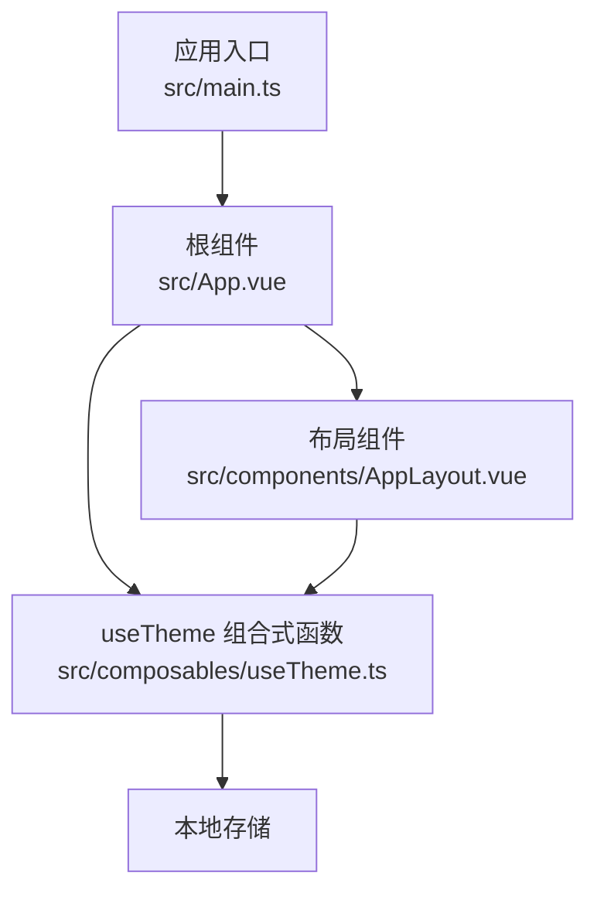
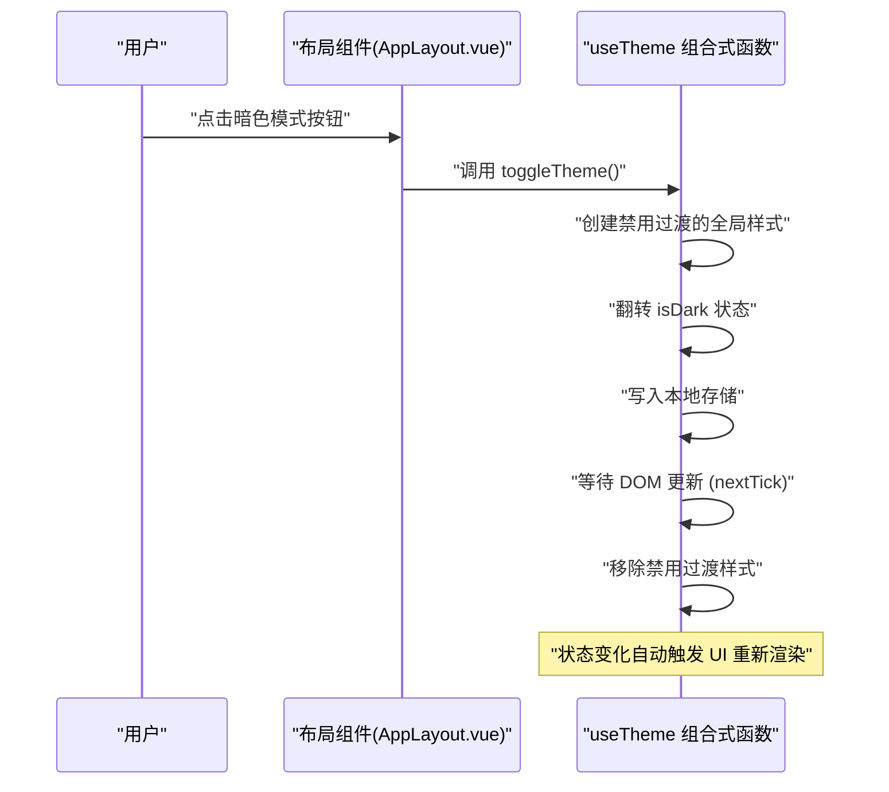
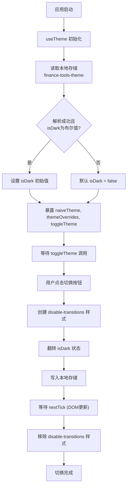
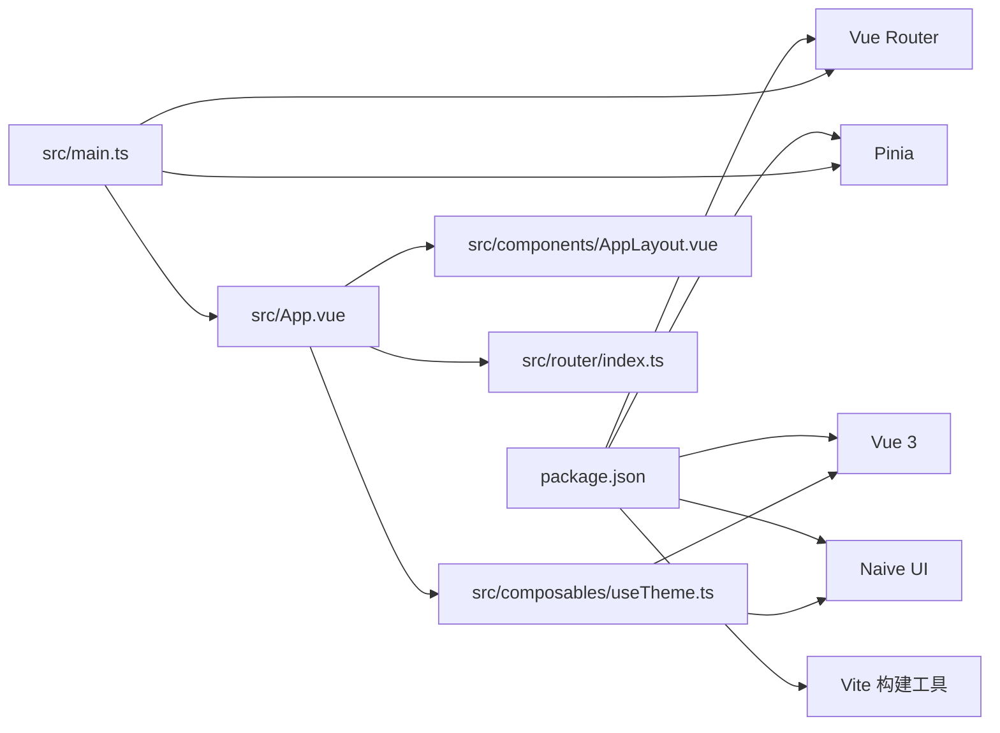

# 暗色模式持久化

<cite>
**本文引用的文件**
- [README.md](file://README.md)
- [package.json](file://package.json)
- [index.html](file://index.html)
- [vite.config.ts](file://vite.config.ts)
- [src/main.ts](file://src/main.ts)
- [src/App.vue](file://src/App.vue)
- [src/components/AppLayout.vue](file://src/components/AppLayout.vue)
- [src/composables/useTheme.ts](file://src/composables/useTheme.ts)
- [src/router/index.ts](file://src/router/index.ts)
- [src/views/Home.vue](file://src/views/Home.vue)
- [src/views/HomePage.vue](file://src/views/HomePage.vue)
</cite>

## 更新摘要
**已更新内容**
- 更新了项目结构、核心组件、架构总览、详细组件分析等章节，以反映使用 `useTheme` 组合式函数重构后的主题管理逻辑
- 新增了关于主题切换时避免闪烁的优化机制说明
- 更新了所有相关图表以准确反映新的代码结构和流程

## 目录
1. [简介](#简介)
2. [项目结构](#项目结构)
3. [核心组件](#核心组件)
4. [架构总览](#架构总览)
5. [详细组件分析](#详细组件分析)
6. [依赖关系分析](#依赖关系分析)
7. [性能考虑](#性能考虑)
8. [故障排查指南](#故障排查指南)
9. [结论](#结论)

## 简介
本文档聚焦于“暗色模式持久化”的实现与使用说明。系统通过新增 `useTheme` 组合式函数（composable）来集中封装主题状态管理、切换逻辑与持久化功能。该函数维护一个全局共享的响应式主题状态，将其与 Naive UI 主题系统集成，并通过浏览器本地存储实现状态持久化。布局组件提供切换入口，用户每次切换都会触发 `useTheme` 中的切换逻辑，确保主题状态的一致性和持久性。重构后优化了切换体验，通过临时禁用过渡动画避免了视觉闪烁问题。

## 项目结构
围绕暗色模式持久化的关键文件与职责已重构如下：
- 应用入口与挂载：负责创建应用实例、注册路由与状态管理插件，并将根组件挂载到 DOM。
- 根组件：引入 `useTheme` 组合式函数，获取主题配置并注入到 Naive UI 配置提供器中。
- 布局组件：提供暗色模式切换按钮，调用 `useTheme` 提供的 `toggleTheme` 方法进行主题切换。
- `useTheme` 组合式函数：集中管理主题状态、切换逻辑、持久化及主题覆盖配置。
- 路由配置：定义页面路由，承载内容视图，与主题切换无直接耦合但共享同一根组件上下文。
- 视图页面：包含业务功能页面，主题切换对其无侵入影响。

**图表来源**
- [src/main.ts](file://src/main.ts#L1-L12)
- [src/App.vue](file://src/App.vue#L1-L44)
- [src/components/AppLayout.vue](file://src/components/AppLayout.vue#L1-L333)
- [src/composables/useTheme.ts](file://src/composables/useTheme.ts#L1-L87)

## 核心组件
- `useTheme` 组合式函数（useTheme.ts）
  - 定义全局共享的 `isDark` 响应式状态，初始值从本地存储读取。
  - 提供 `naiveTheme` 计算属性，根据 `isDark` 状态返回对应的 Naive UI 深色主题或空值。
  - 提供 `themeOverrides` 计算属性，定义全局主题覆盖样式，包括主色系和禁用过渡动画的配置。
  - 提供 `toggleTheme` 方法，实现主题切换的核心逻辑，包括临时禁用动画、状态切换和持久化。
  - 监听 `isDark` 状态变化，自动将其序列化后写入本地存储。
- 根组件（App.vue）
  - 通过 `useTheme` 函数获取 `naiveTheme` 和 `themeOverrides`。
  - 使用 Naive UI 的 `n-config-provider` 将主题配置注入到整个应用。
- 布局组件（AppLayout.vue）
  - 通过 `useTheme` 函数获取 `isDark` 状态和 `toggleTheme` 方法。
  - 在 UI 中显示当前主题状态（通过 MoonOutline/SunnyOutline 图标）。
  - 点击按钮时调用 `toggleTheme` 方法触发主题切换。

**Section sources**
- [src/composables/useTheme.ts](file://src/composables/useTheme.ts#L1-L87)
- [src/App.vue](file://src/App.vue#L1-L44)
- [src/components/AppLayout.vue](file://src/components/AppLayout.vue#L1-L333)

## 架构总览
下图展示了重构后暗色模式切换的端到端流程：用户点击按钮 -> 布局组件调用 `toggleTheme` -> `useTheme` 函数处理切换逻辑（禁用动画、更新状态、持久化）-> 状态变化触发 UI 重新渲染 -> 移除禁用动画样式。

**图表来源**
- [src/composables/useTheme.ts](file://src/composables/useTheme.ts#L48-L67)
- [src/components/AppLayout.vue](file://src/components/AppLayout.vue#L59-L67)

## 详细组件分析

### useTheme 组合式函数：主题状态与持久化核心
- 初始化策略
  - 在浏览器环境下尝试从本地存储读取主题状态，键名为 `finance-tools-theme`，解析 JSON 数据获取 `isDark` 布尔值。
- 主题配置
  - 通过 `naiveTheme` 计算属性，根据 `isDark` 状态决定是否应用 Naive UI 的 `darkTheme`。
  - 通过 `themeOverrides` 计算属性，统一定义主色系、交互色，并关键性地将所有贝塞尔曲线缓动函数设置为线性（`cubic-bezier(0, 0, 1, 1)`），从源头减少动画差异。
- 持久化策略
  - 使用 `watch` 监听 `isDark` 的变化，将包含 `isDark` 字段的对象序列化后写入本地存储。
- 切换逻辑与防闪烁
  - `toggleTheme` 方法是核心，它首先动态创建一个 ID 为 `disable-transitions` 的 `<style>` 标签，强制禁用页面上所有元素的过渡和动画。
  - 然后更新 `isDark` 状态。
  - 使用 `nextTick` 确保 Vue 完成 DOM 更新后，通过 `setTimeout` 在下一个宏任务中移除禁用样式的 `<style>` 标签，从而实现无缝切换。

**图表来源**
- [src/composables/useTheme.ts](file://src/composables/useTheme.ts#L7-L87)

**Section sources**
- [src/composables/useTheme.ts](file://src/composables/useTheme.ts#L7-L87)

### 布局组件：暗色模式切换入口
- 主题状态与切换
  - 通过 `useTheme` 函数直接获取 `isDark` 状态和 `toggleTheme` 方法，无需再通过 props 和事件进行父子组件通信。
  - 当用户点击按钮时，直接调用 `toggleTheme` 方法。
- UI 行为
  - 按钮图标根据 `isDark` 状态动态切换，显示 MoonOutline（浅色）或 SunnyOutline（深色）。
  - 悬停提示文本根据当前模式显示“浅色模式”或“深色模式”。

**Section sources**
- [src/components/AppLayout.vue](file://src/components/AppLayout.vue#L133-L134)
- [src/components/AppLayout.vue](file://src/components/AppLayout.vue#L53-L70)

### 路由与视图：主题对业务页面的影响
- 路由配置
  - 定义首页与发票重命名两个页面，均在同根组件上下文中渲染。
- 视图页面
  - 首页视图展示工具卡片，发票重命名视图提供文件上传与表格展示。
  - 主题切换对这些页面无侵入性，仅影响 Naive UI 组件的外观。

**Section sources**
- [src/router/index.ts](file://src/router/index.ts#L1-L33)
- [src/views/HomePage.vue](file://src/views/HomePage.vue#L1-L60)
- [src/views/Home.vue](file://src/views/Home.vue#L1-L60)

## 依赖关系分析
- 运行时依赖
  - Vue 3、Naive UI、Vue Router、Pinia 等用于构建界面与状态管理。
- 构建与开发
  - Vite 作为打包与开发服务器，提供热更新与模块解析能力。
- 入口与挂载
  - 应用入口创建应用实例，注册路由与 Pinia 插件，最终挂载到 DOM。
- 主题逻辑依赖
  - `useTheme` 组合式函数依赖于 Vue 的 `ref`、`computed`、`watch` 和 `nextTick`，以及 Naive UI 的 `darkTheme` 和 `GlobalThemeOverrides` 类型。

**图表来源**
- [package.json](file://package.json#L1-L27)
- [src/main.ts](file://src/main.ts#L1-L12)
- [src/App.vue](file://src/App.vue#L1-L20)
- [src/composables/useTheme.ts](file://src/composables/useTheme.ts#L1-L10)

## 性能考虑
- 本地存储写入频率控制
  - 通过监听 `isDark` 的变化进行写入，避免了不必要的频繁 IO 操作。
- 渲染与主题注入
  - 主题状态和配置在 `useTheme` 中集中管理，根组件只需简单注入，子组件通过 Naive UI 上下文自动获得一致的主题。
- 切换性能优化
  - 通过临时禁用所有过渡动画，极大减少了主题切换时因不同组件动画时长不一导致的闪烁和不同步问题，提升了视觉流畅度。
- 资源加载
  - `useTheme` 作为一个独立的组合式函数，可以被按需引入，符合模块化设计原则。

## 故障排查指南
- 无法读取本地存储
  - 现象：刷新后主题未保持。
  - 排查：检查浏览器隐私模式或禁用本地存储的情况；确认本地存储中键名为 `finance-tools-theme` 的条目是否存在且格式正确。
  - 参考位置：`useTheme` 函数的 `getInitialDark` 函数。
- 切换无效或闪烁
  - 现象：点击按钮后主题未立即生效或短暂闪烁。
  - 排查：确认 `disable-transitions` 样式是否被成功添加和移除；检查 `nextTick` 是否正常工作；确认 `useTheme` 的 `isDark` 状态是否被正确更新。
- 主题覆盖未生效
  - 现象：颜色未按预期变化。
  - 排查：确认 `n-config-provider` 已正确注入 `themeOverrides`；检查是否有其他 CSS 样式覆盖了主题样式。

**Section sources**
- [src/composables/useTheme.ts](file://src/composables/useTheme.ts#L7-L16)
- [src/composables/useTheme.ts](file://src/composables/useTheme.ts#L48-L67)

## 结论
本项目通过重构，采用“组合式函数集中管理 + 布局组件触发 + 本地存储持久化”的现代化方案实现暗色模式持久化。新方案具备以下优点：
- **逻辑解耦**：将主题逻辑从根组件和布局组件中抽离，封装在独立的 `useTheme` 函数中，提高了代码的可维护性和复用性。
- **体验优化**：通过动态添加/移除全局禁用动画样式，有效解决了主题切换时的视觉闪烁问题，提供了更流畅的用户体验。
- **配置统一**：在 `useTheme` 中统一管理主题覆盖配置，便于全局样式调整。

建议后续可扩展的方向包括：
- 支持系统主题跟随与自动切换。
- 提供更丰富的主题预设（如暗黑、浅色、护眼模式）。
- 在多标签页场景下通过 `BroadcastChannel` 保持主题状态一致性。