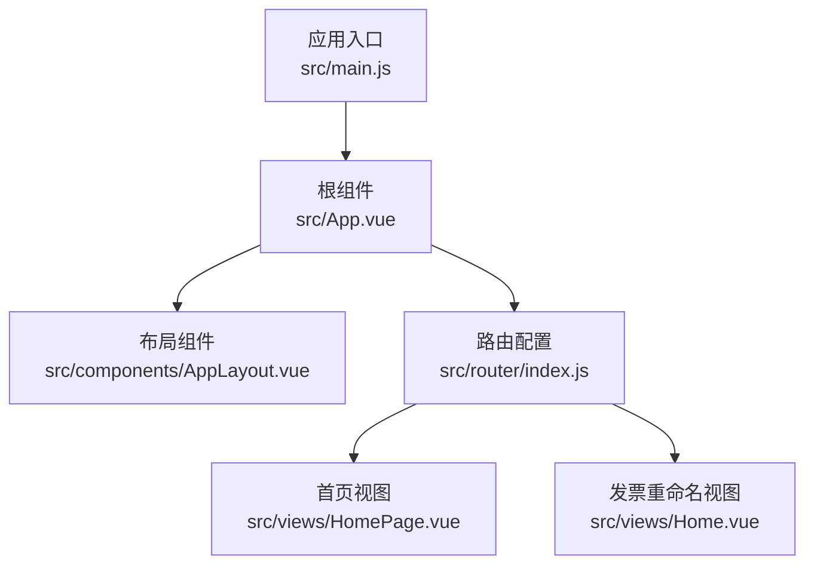
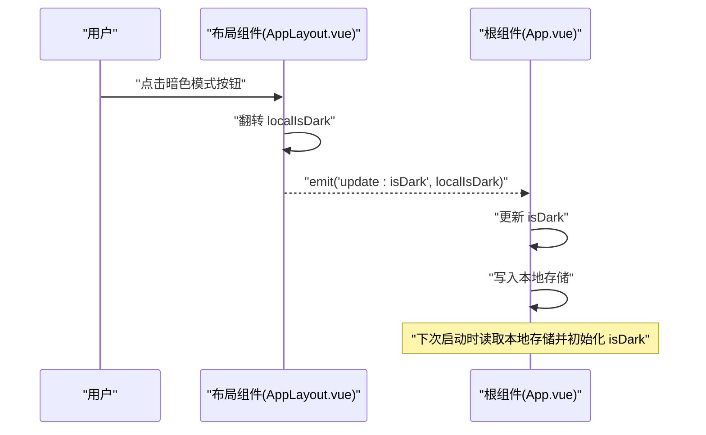
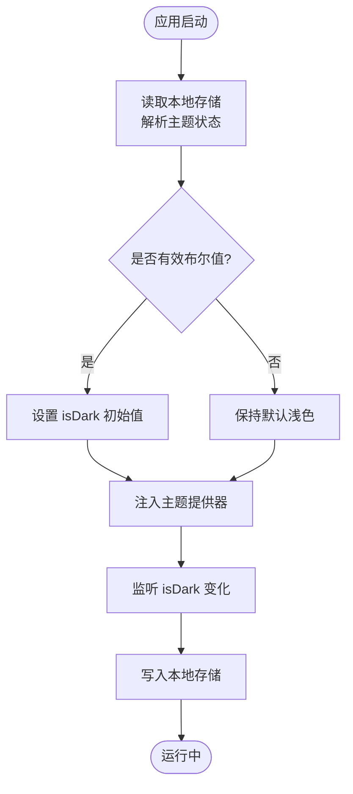
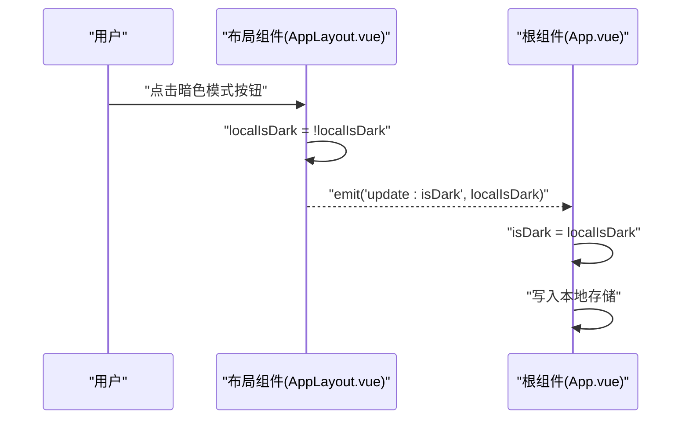
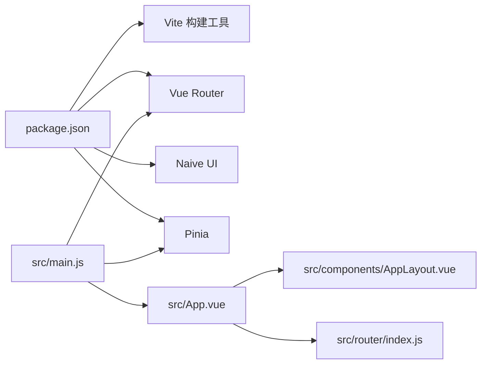

# 暗色模式持久化

<cite>
**本文引用的文件**
- [README.md](file://README.md)
- [package.json](file://package.json)
- [index.html](file://index.html)
- [vite.config.js](file://vite.config.js)
- [src/main.js](file://src/main.js)
- [src/App.vue](file://src/App.vue)
- [src/components/AppLayout.vue](file://src/components/AppLayout.vue)
- [src/router/index.js](file://src/router/index.js)
- [src/views/Home.vue](file://src/views/Home.vue)
- [src/views/HomePage.vue](file://src/views/HomePage.vue)
</cite>

## 目录
1. [简介](#简介)
2. [项目结构](#项目结构)
3. [核心组件](#核心组件)
4. [架构总览](#架构总览)
5. [详细组件分析](#详细组件分析)
6. [依赖关系分析](#依赖关系分析)
7. [性能考虑](#性能考虑)
8. [故障排查指南](#故障排查指南)
9. [结论](#结论)

## 简介
本文件聚焦于“暗色模式持久化”的实现与使用说明。系统通过在应用根组件中维护一个布尔型状态表示当前主题是否为深色，并将该状态写入浏览器本地存储；同时在应用布局组件中提供切换入口，用户每次切换都会触发状态更新与持久化。该机制确保用户在刷新或重新打开页面后仍能保持上次选择的主题风格。

## 项目结构
围绕暗色模式持久化的关键文件与职责如下：
- 应用入口与挂载：负责创建应用实例、注册路由与状态管理插件，并将根组件挂载到 DOM。
- 根组件：集中管理主题状态、Naive UI 主题注入以及与布局组件的双向通信。
- 布局组件：提供暗色模式切换按钮，接收来自根组件的主题状态，并向根组件回传变更事件。
- 路由配置：定义页面路由，承载内容视图，与主题切换无直接耦合但共享同一根组件上下文。
- 视图页面：包含业务功能页面，主题切换对其无侵入影响。

```mermaid
graph TB
A["应用入口<br/>src/main.js"] --> B["根组件<br/>src/App.vue"]
B --> C["布局组件<br/>src/components/AppLayout.vue"]
B --> D["路由配置<br/>src/router/index.js"]
D --> E["首页视图<br/>src/views/HomePage.vue"]
D --> F["发票重命名视图<br/>src/views/Home.vue"]
```

图表来源
- [src/main.js](file://src/main.js#L1-L12)
- [src/App.vue](file://src/App.vue#L1-L71)
- [src/components/AppLayout.vue](file://src/components/AppLayout.vue#L1-L120)
- [src/router/index.js](file://src/router/index.js#L1-L33)
- [src/views/HomePage.vue](file://src/views/HomePage.vue#L1-L60)
- [src/views/Home.vue](file://src/views/Home.vue#L1-L60)

章节来源
- [src/main.js](file://src/main.js#L1-L12)
- [src/App.vue](file://src/App.vue#L1-L71)
- [src/components/AppLayout.vue](file://src/components/AppLayout.vue#L1-L120)
- [src/router/index.js](file://src/router/index.js#L1-L33)

## 核心组件
- 根组件（App.vue）
  - 维护 isDark 响应式状态，初始值从本地存储读取。
  - 使用 Naive UI 的主题提供器注入主题与覆盖样式。
  - 监听 isDark 变化，将最新状态写回本地存储。
  - 接收布局组件发出的主题变更事件并同步更新。
- 布局组件（AppLayout.vue）
  - 接收 isDark 属性并内部维护 localIsDark。
  - 提供暗色模式切换按钮，点击时翻转 localIsDark 并向上抛出 update:isDark 事件。
  - 将 isDark 与 localIsDark 同步，保证外部状态变化可驱动本地 UI 切换。

章节来源
- [src/App.vue](file://src/App.vue#L1-L71)
- [src/components/AppLayout.vue](file://src/components/AppLayout.vue#L120-L260)

## 架构总览
下图展示了暗色模式切换的端到端流程：用户点击按钮 -> 布局组件更新本地状态 -> 通过事件通知根组件 -> 根组件写入本地存储 -> 下次启动时读取并应用。

```mermaid
sequenceDiagram
participant U as "用户"
participant L as "布局组件(AppLayout.vue)"
participant R as "根组件(App.vue)"
U->>L : "点击暗色模式按钮"
L->>L : "翻转 localIsDark"
L-->>R : "emit('update : isDark', localIsDark)"
R->>R : "更新 isDark"
R->>R : "写入本地存储"
Note over R : "下次启动时读取本地存储并初始化 isDark"
```

图表来源
- [src/components/AppLayout.vue](file://src/components/AppLayout.vue#L244-L258)
- [src/App.vue](file://src/App.vue#L26-L71)

## 详细组件分析

### 根组件：主题状态与持久化
- 初始化策略
  - 在浏览器环境下尝试从本地存储读取主题状态，若存在且类型正确则作为初始值。
- 主题注入
  - 通过 Naive UI 的主题提供器根据 isDark 决定是否应用深色主题。
  - 同时设置主题覆盖样式，统一主色系与交互色。
- 持久化策略
  - 监听 isDark 的变化，将对象序列化后写入本地存储，键名固定。
  - 写入时机为响应式状态变更，避免重复 IO。

```mermaid
flowchart TD
Start(["应用启动"]) --> Read["读取本地存储<br/>解析主题状态"]
Read --> Init{"是否有效布尔值?"}
Init --> |是| SetState["设置 isDark 初始值"]
Init --> |否| Default["保持默认浅色"]
SetState --> Inject["注入主题提供器"]
Default --> Inject
Inject --> Watch["监听 isDark 变化"]
Watch --> Persist["写入本地存储"]
Persist --> End(["运行中"])
```

图表来源
- [src/App.vue](file://src/App.vue#L26-L71)

章节来源
- [src/App.vue](file://src/App.vue#L26-L71)

### 布局组件：暗色模式切换入口
- 属性与事件
  - 接收 isDark 属性，内部维护 localIsDark 并与之保持一致。
  - 当用户点击按钮时翻转 localIsDark，并通过 update:isDark 事件通知父组件。
- UI 行为
  - 按钮图标随当前主题动态切换，提示文本根据当前模式显示“深色模式/浅色模式”。

```mermaid
sequenceDiagram
participant U as "用户"
participant L as "布局组件(AppLayout.vue)"
participant R as "根组件(App.vue)"
U->>L : "点击暗色模式按钮"
L->>L : "localIsDark = !localIsDark"
L-->>R : "emit('update : isDark', localIsDark)"
R->>R : "isDark = localIsDark"
R->>R : "写入本地存储"
```

图表来源
- [src/components/AppLayout.vue](file://src/components/AppLayout.vue#L244-L258)
- [src/App.vue](file://src/App.vue#L67-L71)

章节来源
- [src/components/AppLayout.vue](file://src/components/AppLayout.vue#L244-L258)

### 路由与视图：主题对业务页面的影响
- 路由配置
  - 定义首页与发票重命名两个页面，均在同根组件上下文中渲染。
- 视图页面
  - 首页视图展示工具卡片，发票重命名视图提供文件上传与表格展示。
  - 主题切换对这些页面无侵入性，仅影响 Naive UI 组件的外观。

章节来源
- [src/router/index.js](file://src/router/index.js#L1-L33)
- [src/views/HomePage.vue](file://src/views/HomePage.vue#L1-L60)
- [src/views/Home.vue](file://src/views/Home.vue#L1-L60)

## 依赖关系分析
- 运行时依赖
  - Vue 3、Naive UI、Vue Router、Pinia 等用于构建界面与状态管理。
- 构建与开发
  - Vite 作为打包与开发服务器，提供热更新与模块解析能力。
- 入口与挂载
  - 应用入口创建应用实例，注册路由与 Pinia 插件，最终挂载到 DOM。

```mermaid
graph LR
P["package.json"] --> V["Vite 构建工具"]
P --> R["Vue Router"]
P --> UI["Naive UI"]
P --> S["Pinia"]
M["src/main.js"] --> R
M --> S
M --> A["src/App.vue"]
A --> L["src/components/AppLayout.vue"]
A --> RT["src/router/index.js"]
```

图表来源
- [package.json](file://package.json#L1-L27)
- [src/main.js](file://src/main.js#L1-L12)
- [src/App.vue](file://src/App.vue#L1-L20)
- [src/components/AppLayout.vue](file://src/components/AppLayout.vue#L1-L20)
- [src/router/index.js](file://src/router/index.js#L1-L10)

章节来源
- [package.json](file://package.json#L1-L27)
- [src/main.js](file://src/main.js#L1-L12)

## 性能考虑
- 本地存储写入频率控制
  - 通过监听 isDark 的变化进行写入，避免频繁抖动导致的多次 IO。
- 渲染与主题注入
  - 主题注入在根组件完成，子组件无需感知即可获得一致的主题上下文。
- 资源加载
  - 依赖库由包管理器统一管理，构建阶段按需打包，减少冗余资源。

## 故障排查指南
- 无法读取本地存储
  - 现象：刷新后主题未保持。
  - 排查：检查浏览器隐私模式或禁用本地存储的情况；确认键名与存储格式一致。
  - 参考位置：根组件初始化与写入逻辑。
- 切换无效或闪烁
  - 现象：点击按钮后主题未立即生效或短暂闪烁。
  - 排查：确认布局组件事件是否正确传递至根组件；检查根组件是否及时更新并写入本地存储。
- 主题覆盖未生效
  - 现象：颜色未按预期变化。
  - 排查：确认主题提供器已正确注入；检查主题覆盖样式是否被其他样式覆盖。

章节来源
- [src/App.vue](file://src/App.vue#L26-L71)
- [src/components/AppLayout.vue](file://src/components/AppLayout.vue#L244-L258)

## 结论
本项目采用“根组件集中管理 + 布局组件触发 + 本地存储持久化”的轻量方案实现暗色模式持久化。该方案具备以下优点：
- 实现简单，耦合度低，易于维护。
- 用户体验良好，刷新即刻恢复上次主题。
- 对业务页面透明，无需额外适配。

建议后续可扩展的方向包括：
- 支持系统主题跟随与自动切换。
- 提供更丰富的主题覆盖选项与预设。
- 在多标签页场景下保持主题状态一致性。