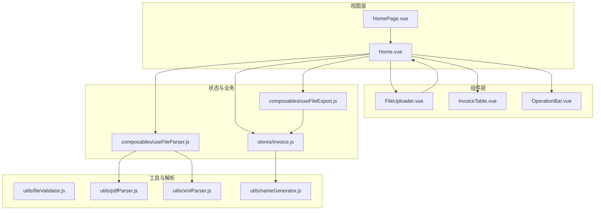
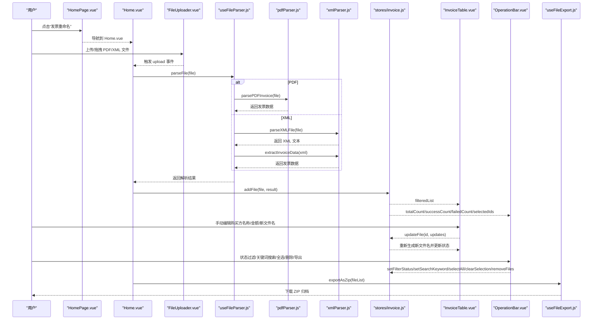
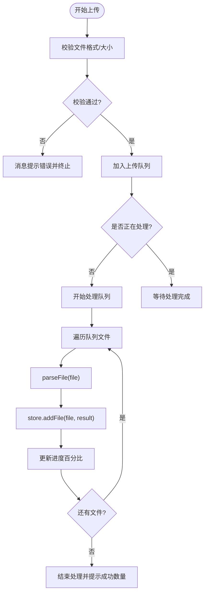
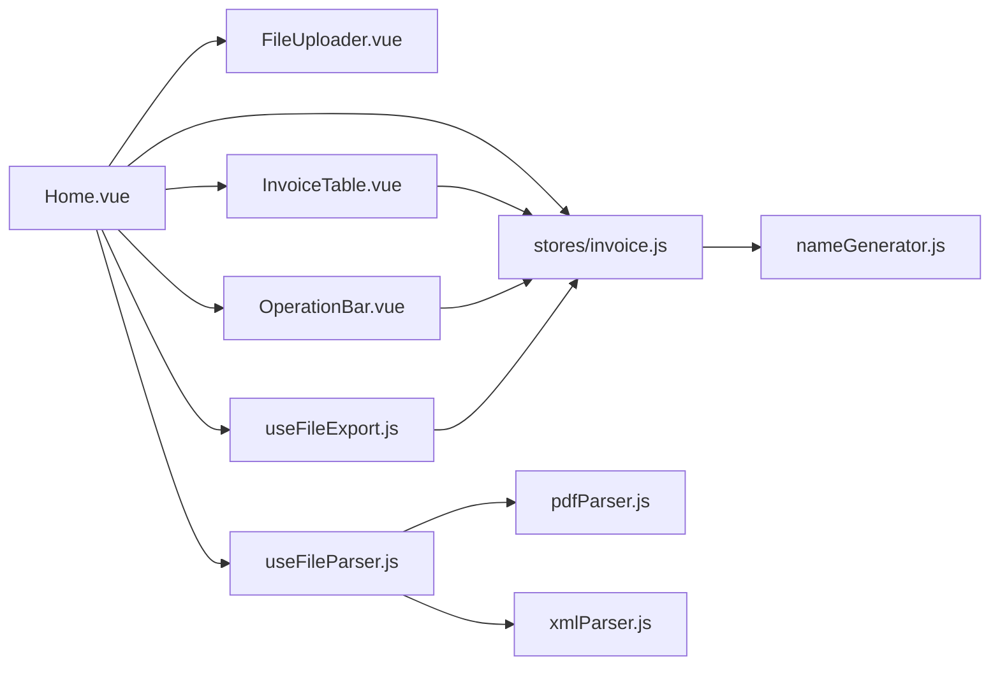

# 核心功能

<cite>
**本文引用的文件**
- [Home.vue](file://src/views/Home.vue)
- [HomePage.vue](file://src/views/HomePage.vue)
- [FileUploader.vue](file://src/components/FileUploader.vue)
- [InvoiceTable.vue](file://src/components/InvoiceTable.vue)
- [OperationBar.vue](file://src/components/OperationBar.vue)
- [invoice.js](file://src/stores/invoice.js)
- [useFileParser.js](file://src/composables/useFileParser.js)
- [useFileExport.js](file://src/composables/useFileExport.js)
- [fileValidator.js](file://src/utils/fileValidator.js)
- [pdfParser.js](file://src/utils/pdfParser.js)
- [xmlParser.js](file://src/utils/xmlParser.js)
- [nameGenerator.js](file://src/utils/nameGenerator.js)
- [README.md](file://README.md)
</cite>

## 目录
1. [简介](#简介)
2. [项目结构](#项目结构)
3. [核心组件](#核心组件)
4. [架构总览](#架构总览)
5. [详细组件分析](#详细组件分析)
6. [依赖关系分析](#依赖关系分析)
7. [性能与并发特性](#性能与并发特性)
8. [故障排查指南](#故障排查指南)
9. [结论](#结论)
10. [附录](#附录)

## 简介
本文件围绕 FinanceTools 的“发票重命名”核心功能，系统性梳理从用户上传文件到最终批量导出的完整工作流。该功能通过组件化架构实现：用户通过 FileUploader.vue 上传 PDF/XML 文件；Home.vue 视图负责协调上传、解析、展示与导出；InvoiceTable.vue 展示解析结果并支持手动编辑；OperationBar.vue 提供状态过滤、关键词搜索、全选/删除、批量导出等操作；底层通过 Pinia 状态管理 store 统一维护数据与交互状态；解析与导出能力分别由 useFileParser.js 与 useFileExport.js 组合式函数提供；文件校验、PDF/XML 解析、命名规则生成等能力由 utils 下工具模块承担。

## 项目结构
- 视图层
  - Home.vue：主界面，承载上传、进度、表格、操作栏与导出流程
  - HomePage.vue：首页入口卡片，引导进入发票重命名工具
- 组件层
  - FileUploader.vue：文件上传与拖拽区域
  - InvoiceTable.vue：发票数据表格，支持手动编辑与删除
  - OperationBar.vue：状态过滤、搜索、全选/删除、导出按钮
- 状态与业务层
  - stores/invoice.js：Pinia store，统一管理文件列表、筛选、选中、处理状态等
  - composables/useFileParser.js：文件解析组合式函数，支持 PDF/XML 解析与批量进度
  - composables/useFileExport.js：导出 ZIP 组合式函数
- 工具与解析层
  - utils/fileValidator.js：文件格式与大小校验
  - utils/pdfParser.js：PDF 文本抽取与发票字段提取、验证
  - utils/xmlParser.js：XML 解析与发票字段提取、验证
  - utils/nameGenerator.js：文件名生成与冲突处理

图表来源
- [Home.vue](file://src/views/Home.vue#L1-L236)
- [HomePage.vue](file://src/views/HomePage.vue#L1-L100)
- [FileUploader.vue](file://src/components/FileUploader.vue#L1-L50)
- [InvoiceTable.vue](file://src/components/InvoiceTable.vue#L1-L162)
- [OperationBar.vue](file://src/components/OperationBar.vue#L1-L119)
- [invoice.js](file://src/stores/invoice.js#L1-L204)
- [useFileParser.js](file://src/composables/useFileParser.js#L1-L102)
- [useFileExport.js](file://src/composables/useFileExport.js#L1-L80)
- [fileValidator.js](file://src/utils/fileValidator.js#L1-L90)
- [pdfParser.js](file://src/utils/pdfParser.js#L1-L227)
- [xmlParser.js](file://src/utils/xmlParser.js#L1-L118)
- [nameGenerator.js](file://src/utils/nameGenerator.js#L1-L225)

章节来源
- [README.md](file://README.md#L1-L38)

## 核心组件
- FileUploader.vue：提供多文件、目录拖拽上传，限定 PDF/XML，最大 10MB、最多 100 个；自定义请求回调仅触发本地处理，不真正上传至服务端。
- Home.vue：协调上传队列、调用解析器、更新 store、弹窗进度、处理删除与导出；与 OperationBar.vue、InvoiceTable.vue 通过双向绑定与事件通信协作。
- InvoiceTable.vue：展示原始文件名、发票类型、购买方名称、金额、新文件名、状态、失败原因等；支持单元格内输入编辑与删除操作；提供分页与横向滚动。
- OperationBar.vue：提供状态过滤（全部/成功/失败）、关键词搜索、全选/清空、删除选中、导出成功文件等；与 store 的筛选与计数联动。
- stores/invoice.js：集中管理文件列表、过滤状态、搜索关键字、选中 ID、处理状态；提供增删改、全选/清空、计算成功/失败/总数等方法。
- useFileParser.js：按文件后缀区分 PDF/XML 解析路径，调用对应解析器与验证器，返回统一结构；支持批量解析与进度上报。
- useFileExport.js：将成功状态的文件打包为 ZIP 并下载，生成带时间戳的归档文件名。
- utils/fileValidator.js：校验格式、大小、数量上限。
- utils/pdfParser.js：PDF 文本抽取、发票字段提取、验证。
- utils/xmlParser.js：XML 文本解析、发票字段提取、验证。
- utils/nameGenerator.js：按规则生成新文件名，包含字段格式化与冲突处理。

章节来源
- [FileUploader.vue](file://src/components/FileUploader.vue#L1-L50)
- [Home.vue](file://src/views/Home.vue#L1-L236)
- [InvoiceTable.vue](file://src/components/InvoiceTable.vue#L1-L162)
- [OperationBar.vue](file://src/components/OperationBar.vue#L1-L119)
- [invoice.js](file://src/stores/invoice.js#L1-L204)
- [useFileParser.js](file://src/composables/useFileParser.js#L1-L102)
- [useFileExport.js](file://src/composables/useFileExport.js#L1-L80)
- [fileValidator.js](file://src/utils/fileValidator.js#L1-L90)
- [pdfParser.js](file://src/utils/pdfParser.js#L1-L227)
- [xmlParser.js](file://src/utils/xmlParser.js#L1-L118)
- [nameGenerator.js](file://src/utils/nameGenerator.js#L1-L225)

## 架构总览
整体采用“视图协调 + 组件解耦 + 组合式函数 + 工具模块”的分层设计：
- 视图层负责用户交互与流程编排（Home.vue）
- 组件层负责展示与交互（FileUploader.vue、InvoiceTable.vue、OperationBar.vue）
- 状态层统一管理数据与计算（stores/invoice.js）
- 组合式函数封装可复用能力（useFileParser.js、useFileExport.js）
- 工具模块提供解析与生成能力（pdfParser.js、xmlParser.js、nameGenerator.js、fileValidator.js）

图表来源
- [HomePage.vue](file://src/views/HomePage.vue#L1-L100)
- [Home.vue](file://src/views/Home.vue#L1-L236)
- [FileUploader.vue](file://src/components/FileUploader.vue#L1-L50)
- [useFileParser.js](file://src/composables/useFileParser.js#L1-L102)
- [pdfParser.js](file://src/utils/pdfParser.js#L1-L227)
- [xmlParser.js](file://src/utils/xmlParser.js#L1-L118)
- [invoice.js](file://src/stores/invoice.js#L1-L204)
- [InvoiceTable.vue](file://src/components/InvoiceTable.vue#L1-L162)
- [OperationBar.vue](file://src/components/OperationBar.vue#L1-L119)
- [useFileExport.js](file://src/composables/useFileExport.js#L1-L80)

## 详细组件分析

### FileUploader.vue（文件上传）
- 功能要点
  - 多文件与目录拖拽上传
  - 限定 .pdf/.xml，禁用文件列表展示
  - 自定义请求回调仅触发本地处理，不上传至服务器
- 交互方式
  - 通过 emit('upload', file) 将文件传递给父组件 Home.vue
- 与 Home.vue 的协作
  - Home.vue 接收 upload 事件后进行校验与入队处理

章节来源
- [FileUploader.vue](file://src/components/FileUploader.vue#L1-L50)
- [Home.vue](file://src/views/Home.vue#L100-L155)

### Home.vue（视图协调器）
- 文件上传与队列处理
  - 校验文件格式与大小
  - 将文件加入队列，串行处理并逐个解析
  - 显示处理进度模态框，完成后提示成功数量
- 解析与存储
  - 调用 useFileParser.parseFile(file)
  - 将结果通过 store.addFile(file, result) 写入状态
- 手动编辑与删除
  - 监听 InvoiceTable 的 edit/delete 事件，调用 store.updateFile/removeFile
  - 删除前弹出二次确认对话框
- 批量操作
  - OperationBar.vue 通过事件驱动 select-all/clear-selection/delete-selected/export
  - Home.vue 对应处理 store.selectAll/clearSelection/removeFiles/handleExport
- 导出
  - 调用 useFileExport.exportAsZip，成功后提示导出文件数量与名称

图表来源
- [Home.vue](file://src/views/Home.vue#L100-L155)
- [useFileParser.js](file://src/composables/useFileParser.js#L1-L102)
- [invoice.js](file://src/stores/invoice.js#L54-L99)

章节来源
- [Home.vue](file://src/views/Home.vue#L1-L236)

### InvoiceTable.vue（发票数据表格）
- 表格列与行为
  - 序号、原文件名、发票类型、购买方名称（可编辑输入）、金额（可编辑输入）、新文件名（可编辑输入）、状态标签、失败原因、删除按钮
  - 支持多选与分页（每页 20 条，支持切换页大小）
- 交互方式
  - 通过 emit('edit', id, updates) 通知父组件更新
  - 通过 emit('delete', id) 通知父组件删除
  - 通过 emit('update:selectedIds', keys) 同步选中项

章节来源
- [InvoiceTable.vue](file://src/components/InvoiceTable.vue#L1-L162)
- [Home.vue](file://src/views/Home.vue#L157-L215)

### OperationBar.vue（操作栏）
- 功能要点
  - 状态过滤：全部/成功/失败
  - 关键词搜索：支持原文件名、新文件名、购买方名称
  - 全选/清空/删除选中
  - 导出成功文件（禁用条件：成功计数为 0；加载中 isExporting）
- 与 store 的联动
  - v-model:filter-status 与 v-model:search-keyword 实现双向绑定
  - 通过事件向父组件传递 select-all/clear-selection/delete-selected/export

章节来源
- [OperationBar.vue](file://src/components/OperationBar.vue#L1-L119)
- [Home.vue](file://src/views/Home.vue#L10-L33)
- [invoice.js](file://src/stores/invoice.js#L19-L51)

### stores/invoice.js（状态管理）
- 数据与计算
  - fileList：存储每条发票记录（含原始文件、原文件名、发票类型、购买方名称、金额、新文件名、状态、错误信息）
  - filterStatus、searchKeyword、selectedIds、isProcessing
  - filteredList：按状态与关键词过滤后的列表
  - successCount、failedCount、totalCount
- 方法
  - addFile：根据解析结果生成新文件名或失败原因，写入列表
  - updateFile：支持手动编辑购买方名称/金额，自动重新生成新文件名并更新状态
  - removeFile/removeFiles：删除单个或多个
  - selectAll/clearSelection：全选与清空
  - setFilterStatus/setSearchKeyword：更新筛选条件
- 与 UI 的配合
  - Home.vue 通过 v-model 与事件驱动 store 的状态变更
  - InvoiceTable.vue 通过 selectedIds 与 edit/delete 事件与 store 交互

章节来源
- [invoice.js](file://src/stores/invoice.js#L1-L204)
- [Home.vue](file://src/views/Home.vue#L10-L33)
- [InvoiceTable.vue](file://src/components/InvoiceTable.vue#L1-L162)
- [OperationBar.vue](file://src/components/OperationBar.vue#L1-L119)

### useFileParser.js（文件解析）
- 能力概览
  - parseFile：根据文件后缀区分 PDF 或 XML 解析路径
  - parseFiles：批量解析，支持 10 个为一批的并发处理，并提供进度回调
- PDF 解析链路
  - parsePDFInvoice -> extractTextFromPDF -> extractInvoiceDataFromText -> validatePDFInvoiceData
- XML 解析链路
  - parseXMLFile -> parseXMLText -> extractInvoiceData -> validateInvoiceData
- 返回结构
  - success、data、errors、type，用于上层判断与展示

章节来源
- [useFileParser.js](file://src/composables/useFileParser.js#L1-L102)
- [pdfParser.js](file://src/utils/pdfParser.js#L1-L227)
- [xmlParser.js](file://src/utils/xmlParser.js#L1-L118)

### useFileExport.js（批量导出）
- 能力概览
  - exportAsZip：将成功状态的文件打包为 ZIP 并下载，生成带时间戳的归档文件名
  - isExporting：导出过程中的加载状态
- 导出策略
  - 默认仅导出状态为“成功”的文件；失败文件不会被包含在导出包中

章节来源
- [useFileExport.js](file://src/composables/useFileExport.js#L1-L80)
- [Home.vue](file://src/views/Home.vue#L200-L215)
- [invoice.js](file://src/stores/invoice.js#L19-L51)

### utils/fileValidator.js（文件校验）
- 校验内容
  - 支持格式：PDF/XML（含多种 MIME）
  - 文件大小：≤ 10MB
  - 数量上限：≤ 100 个
- 返回结构
  - valid 与 errors 数组，便于 UI 提示

章节来源
- [fileValidator.js](file://src/utils/fileValidator.js#L1-L90)
- [Home.vue](file://src/views/Home.vue#L100-L115)

### utils/pdfParser.js（PDF 解析）
- 文本抽取
  - 使用 pdfjs-dist 读取 PDF，逐页提取文本并拼接
- 发票字段提取
  - 通过正则匹配发票类型、发票号码、开票日期、购买方/销售方名称、价税合计等
  - 提供备用方案与调试输出（开发模式）
- 验证
  - 至少需购买方名称与金额通过验证

章节来源
- [pdfParser.js](file://src/utils/pdfParser.js#L1-L227)

### utils/xmlParser.js（XML 解析）
- XML 解析
  - 使用 fast-xml-parser 解析 XML 文本
- 发票字段提取
  - 从 XML 中提取发票类型、发票号码、购买方/销售方名称、价税合计、开票日期等
  - 支持多字段别名映射
- 验证
  - 至少需发票类型、购买方名称、价税合计通过验证

章节来源
- [xmlParser.js](file://src/utils/xmlParser.js#L1-L118)

### utils/nameGenerator.js（文件名生成）
- 规则体系
  - 当前启用规则：purchaser_amount（购方名称_金额），支持扩展
  - 字段格式化：去除非法字符、长度限制、金额保留两位小数、日期标准化等
- 冲突处理
  - 生成文件名时检测重复，自动追加序号避免覆盖
- 与 store 的集成
  - 在 addFile 与 updateFile 时调用，确保新文件名与状态同步

章节来源
- [nameGenerator.js](file://src/utils/nameGenerator.js#L1-L225)
- [invoice.js](file://src/stores/invoice.js#L54-L124)

## 依赖关系分析
- 组件依赖
  - Home.vue 依赖 FileUploader.vue、OperationBar.vue、InvoiceTable.vue、stores/invoice.js、useFileParser.js、useFileExport.js
  - InvoiceTable.vue 依赖 stores/invoice.js 的 selectedIds 与 filteredList
  - OperationBar.vue 依赖 stores/invoice.js 的 filterStatus、searchKeyword、计数与 selectedIds
- 工具依赖
  - useFileParser.js 依赖 pdfParser.js 与 xmlParser.js
  - stores/invoice.js 依赖 nameGenerator.js
  - Home.vue 依赖 fileValidator.js 与 useFileExport.js
- 外部库
  - pdfjs-dist、JSZip、file-saver、fast-xml-parser 等

图表来源
- [Home.vue](file://src/views/Home.vue#L1-L236)
- [FileUploader.vue](file://src/components/FileUploader.vue#L1-L50)
- [InvoiceTable.vue](file://src/components/InvoiceTable.vue#L1-L162)
- [OperationBar.vue](file://src/components/OperationBar.vue#L1-L119)
- [invoice.js](file://src/stores/invoice.js#L1-L204)
- [useFileParser.js](file://src/composables/useFileParser.js#L1-L102)
- [useFileExport.js](file://src/composables/useFileExport.js#L1-L80)
- [pdfParser.js](file://src/utils/pdfParser.js#L1-L227)
- [xmlParser.js](file://src/utils/xmlParser.js#L1-L118)
- [nameGenerator.js](file://src/utils/nameGenerator.js#L1-L225)

## 性能与并发特性
- 并发解析
  - useFileParser.parseFiles 以 10 个为一批进行 Promise.all 并发处理，显著缩短大批量文件解析耗时
- 进度反馈
  - Home.vue 通过 parseProgress 百分比与进度条实时反馈处理进度
- 分页与渲染
  - InvoiceTable.vue 使用分页与横向滚动，避免大数据量下的表格渲染压力
- 导出优化
  - useFileExport.js 仅导出状态为“成功”的文件，减少无效 IO

章节来源
- [useFileParser.js](file://src/composables/useFileParser.js#L64-L93)
- [Home.vue](file://src/views/Home.vue#L120-L155)
- [InvoiceTable.vue](file://src/components/InvoiceTable.vue#L152-L156)
- [useFileExport.js](file://src/composables/useFileExport.js#L14-L59)

## 故障排查指南
- 上传失败
  - 检查文件格式是否为 PDF/XML，大小是否超过 10MB，数量是否超过 100 个
  - 若解析异常，查看控制台错误与失败原因列
- 解析失败
  - PDF：确认发票文本中包含必要的字段（如购买方名称、金额），或尝试更换发票样式
  - XML：确认 XML 结构包含发票字段或字段别名映射
- 导出失败
  - 确认至少存在一个“成功”状态的文件；若无成功项，导出会提示无文件可导出
- 手动编辑无效
  - 确认购买方名称与金额字段非空，否则会触发失败状态并显示错误信息
- 删除确认
  - 删除单个或批量删除均会弹出二次确认对话框，请谨慎操作

章节来源
- [fileValidator.js](file://src/utils/fileValidator.js#L1-L90)
- [pdfParser.js](file://src/utils/pdfParser.js#L200-L227)
- [xmlParser.js](file://src/utils/xmlParser.js#L95-L118)
- [useFileExport.js](file://src/composables/useFileExport.js#L14-L59)
- [invoice.js](file://src/stores/invoice.js#L101-L124)
- [Home.vue](file://src/views/Home.vue#L164-L198)

## 结论
FinanceTools 的发票重命名功能通过清晰的组件化与分层架构实现了从上传、解析、展示到导出的完整闭环。Home.vue 作为协调者串联各模块，stores/invoice.js 提供统一的状态与计算，useFileParser.js 与 useFileExport.js 抽象出解析与导出能力，utils 下的解析与生成模块保证了对 PDF/XML 的稳健处理与可扩展的命名规则。该设计既满足了开发者对可维护性的需求，也为用户提供了直观、高效的操作体验。

## 附录
- 快速操作步骤
  1) 在 HomePage.vue 点击“发票重命名”进入 Home.vue
  2) 在 FileUploader.vue 区域点击或拖拽上传 PDF/XML 文件
  3) 查看 InvoiceTable.vue 中的解析结果与状态
  4) 使用 OperationBar.vue 进行状态过滤、关键词搜索、全选/删除
  5) 手动编辑购买方名称/金额以生成新的文件名
  6) 点击“导出成功的文件”生成 ZIP 并下载

章节来源
- [HomePage.vue](file://src/views/HomePage.vue#L1-L100)
- [Home.vue](file://src/views/Home.vue#L1-L236)
- [InvoiceTable.vue](file://src/components/InvoiceTable.vue#L1-L162)
- [OperationBar.vue](file://src/components/OperationBar.vue#L1-L119)