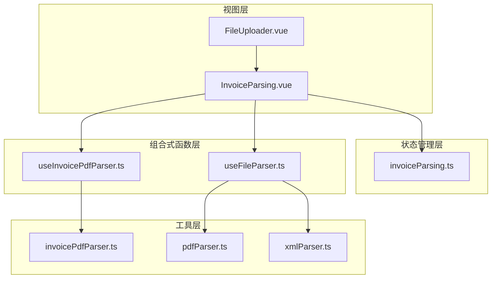
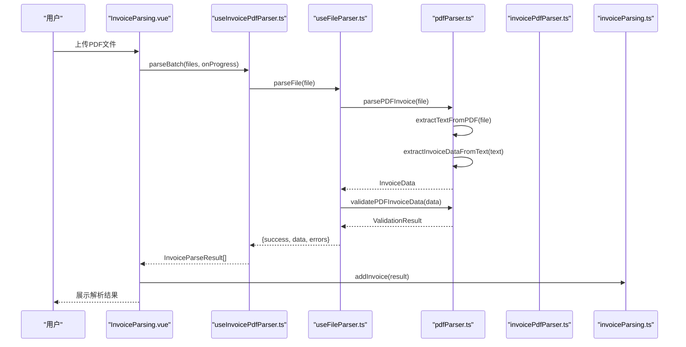
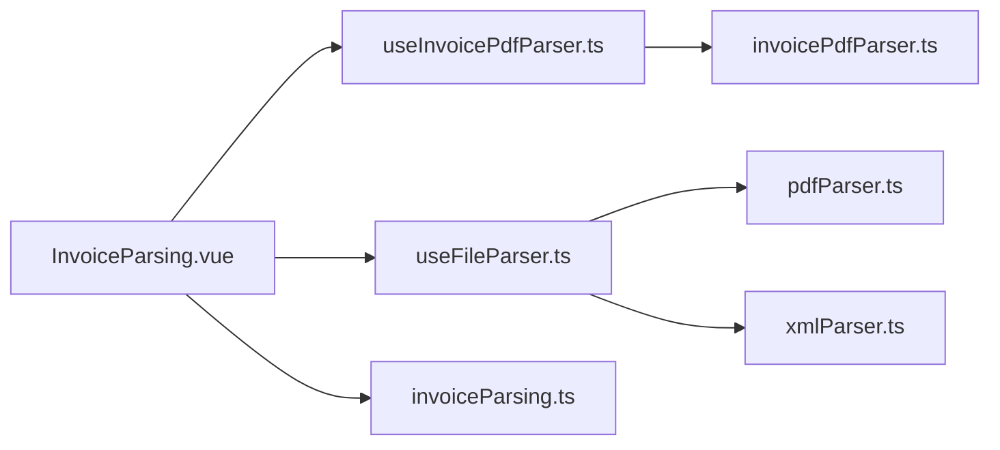

# PDF解析工具

<cite>
**本文引用的文件**
- [pdfParser.ts](file://src/utils/pdfParser.ts)
- [invoicePdfParser.ts](file://src/utils/invoicePdfParser.ts)
- [useInvoicePdfParser.ts](file://src/composables/useInvoicePdfParser.ts)
- [useFileParser.ts](file://src/composables/useFileParser.ts)
- [invoiceParsing.ts](file://src/stores/invoiceParsing.ts)
- [InvoiceParsing.vue](file://src/views/InvoiceParsing.vue)
- [FileUploader.vue](file://src/components/FileUploader.vue)
- [xmlParser.ts](file://src/utils/xmlParser.ts)
</cite>

## 目录
1. [简介](#简介)
2. [项目结构](#项目结构)
3. [核心组件](#核心组件)
4. [架构总览](#架构总览)
5. [详细组件分析](#详细组件分析)
6. [依赖关系分析](#依赖关系分析)
7. [性能考虑](#性能考虑)
8. [故障排查指南](#故障排查指南)
9. [结论](#结论)
10. [附录](#附录)

## 简介
本文件系统性地文档化了pdfParser模块及其相关解析能力，重点说明其基于pdfjs-dist库实现PDF文本提取的技术细节，并围绕发票解析流程提供完整调用链路、类型定义、异常处理策略与性能优化建议。文档同时涵盖与发票重命名、发票解析功能的实际调用场景，帮助开发者快速理解并正确使用该模块。

## 项目结构
本项目采用“工具层(utils) + 组合式函数(composables) + 视图组件(components/views) + 状态管理(stores)”的分层组织方式：
- 工具层：提供底层PDF解析、XML解析、文件读取等基础能力
- 组合式函数：封装业务流程（如发票PDF解析、文件解析、批量处理）
- 视图组件：负责用户交互与展示（上传、表格、导出等）
- 状态管理：集中管理解析结果、筛选、搜索、选中状态等

图表来源
- [InvoiceParsing.vue](file://src/views/InvoiceParsing.vue#L1-L328)
- [useInvoicePdfParser.ts](file://src/composables/useInvoicePdfParser.ts#L1-L173)
- [useFileParser.ts](file://src/composables/useFileParser.ts#L1-L109)
- [pdfParser.ts](file://src/utils/pdfParser.ts#L1-L243)
- [invoicePdfParser.ts](file://src/utils/invoicePdfParser.ts#L1-L349)
- [xmlParser.ts](file://src/utils/xmlParser.ts#L1-L141)
- [invoiceParsing.ts](file://src/stores/invoiceParsing.ts#L1-L241)

章节来源
- [InvoiceParsing.vue](file://src/views/InvoiceParsing.vue#L1-L328)
- [useInvoicePdfParser.ts](file://src/composables/useInvoicePdfParser.ts#L1-L173)
- [useFileParser.ts](file://src/composables/useFileParser.ts#L1-L109)
- [pdfParser.ts](file://src/utils/pdfParser.ts#L1-L243)
- [invoicePdfParser.ts](file://src/utils/invoicePdfParser.ts#L1-L349)
- [xmlParser.ts](file://src/utils/xmlParser.ts#L1-L141)
- [invoiceParsing.ts](file://src/stores/invoiceParsing.ts#L1-L241)

## 核心组件
- pdfParser.ts：提供基于pdfjs-dist的PDF文本提取、发票字段提取与验证能力，面向通用发票字段（发票类型、发票代码、购买方名称、金额、开票日期等）
- invoicePdfParser.ts：提供更丰富的发票字段提取（发票号码、发票类型、不含税金额、税额、价税合计、多税率），并包含快速解析策略与严格验证
- useInvoicePdfParser.ts：封装单文件/批量解析流程，提供进度反馈与状态管理
- useFileParser.ts：统一文件解析入口，支持PDF与XML两类文件的解析与验证
- invoiceParsing.ts：解析结果的状态管理，包含筛选、搜索、选中、导出等能力
- InvoiceParsing.vue：发票解析页面，集成上传、批量解析、结果展示与导出
- FileUploader.vue：文件上传组件，支持拖拽与多文件选择

章节来源
- [pdfParser.ts](file://src/utils/pdfParser.ts#L13-L243)
- [invoicePdfParser.ts](file://src/utils/invoicePdfParser.ts#L76-L349)
- [useInvoicePdfParser.ts](file://src/composables/useInvoicePdfParser.ts#L19-L173)
- [useFileParser.ts](file://src/composables/useFileParser.ts#L1-L109)
- [invoiceParsing.ts](file://src/stores/invoiceParsing.ts#L17-L60)
- [InvoiceParsing.vue](file://src/views/InvoiceParsing.vue#L1-L328)
- [FileUploader.vue](file://src/components/FileUploader.vue#L1-L50)

## 架构总览
PDF解析工具的整体调用链路如下：
- 用户上传PDF文件
- 组合式函数进行文件验证与批量处理
- 工具层使用pdfjs-dist加载PDF并逐页提取文本
- 正则表达式从文本中提取发票关键字段
- 验证函数对关键字段进行业务规则校验
- 结果写入状态管理并展示在页面

图表来源
- [InvoiceParsing.vue](file://src/views/InvoiceParsing.vue#L188-L232)
- [useInvoicePdfParser.ts](file://src/composables/useInvoicePdfParser.ts#L96-L153)
- [useFileParser.ts](file://src/composables/useFileParser.ts#L22-L66)
- [pdfParser.ts](file://src/utils/pdfParser.ts#L184-L192)
- [invoicePdfParser.ts](file://src/utils/invoicePdfParser.ts#L97-L129)

## 详细组件分析

### 组件A：pdfParser.ts（通用发票解析）
- 功能概述
  - 基于pdfjs-dist加载PDF并逐页提取文本
  - 使用FileReader将File转为ArrayBuffer后交由PDF.js解析
  - 通过正则表达式提取发票关键字段（发票类型、发票代码、购买方名称、金额、开票日期）
  - 提供validatePDFInvoiceData进行业务规则校验（仅校验购买方名称与金额）

- 关键实现要点
  - 配置PDF.js worker路径，确保在浏览器端异步解析
  - extractTextFromPDF：读取文件 -> 加载PDF -> 逐页getTextContent -> 拼接全文
  - extractInvoiceDataFromText：主方案与备用方案并存，提升鲁棒性
  - validatePDFInvoiceData：仅校验必填字段，避免过度约束

- 类型定义
  - InvoiceData：包含发票类型、发票代码、购买方名称、销售方名称、金额、开票日期
  - ValidationResult：包含valid、errors与可选data

- 异常处理
  - 在各步骤捕获错误并抛出带明确上下文的错误信息，便于前端展示与定位问题

章节来源
- [pdfParser.ts](file://src/utils/pdfParser.ts#L4-L8)
- [pdfParser.ts](file://src/utils/pdfParser.ts#L31-L65)
- [pdfParser.ts](file://src/utils/pdfParser.ts#L70-L179)
- [pdfParser.ts](file://src/utils/pdfParser.ts#L184-L192)
- [pdfParser.ts](file://src/utils/pdfParser.ts#L197-L211)
- [pdfParser.ts](file://src/utils/pdfParser.ts#L216-L242)

### 组件B：invoicePdfParser.ts（丰富字段解析）
- 功能概述
  - 提供更全面的发票字段提取（发票号码、发票类型、不含税金额、税额、价税合计、多税率）
  - 采用“快速解析 + 完整解析”的策略：先解析前N页，若未命中关键字段再解析剩余页面
  - 严格的字段验证与多正则模式匹配，提升准确性

- 关键实现要点
  - 快速解析策略：MAX_PAGES_QUICK_PARSE控制前几页解析范围
  - 字段提取函数：分别提取发票号码、发票类型、金额、税额、价税合计、多税率
  - 验证规则：覆盖格式、数值范围、金额与税额的逻辑一致性

- 类型定义
  - InvoiceFieldsResult：包含发票号码、发票类型、不含税金额、税额、价税合计、多税率
  - ValidationResult：包含valid与errors

- 异常处理
  - 捕获解析过程中的异常并抛出带上下文的错误信息

章节来源
- [invoicePdfParser.ts](file://src/utils/invoicePdfParser.ts#L13-L16)
- [invoicePdfParser.ts](file://src/utils/invoicePdfParser.ts#L97-L129)
- [invoicePdfParser.ts](file://src/utils/invoicePdfParser.ts#L138-L152)
- [invoicePdfParser.ts](file://src/utils/invoicePdfParser.ts#L159-L207)
- [invoicePdfParser.ts](file://src/utils/invoicePdfParser.ts#L224-L234)
- [invoicePdfParser.ts](file://src/utils/invoicePdfParser.ts#L294-L334)

### 组件C：useInvoicePdfParser.ts（批量解析与进度反馈）
- 功能概述
  - 单文件解析：文件格式与大小校验 -> 文本提取 -> 字段提取 -> 数据验证 -> 构建结果
  - 批量解析：按批次并发解析，提供进度回调与当前文件显示
  - 状态管理：isProcessing、progress、currentFile

- 关键实现要点
  - 批次大小：BATCH_SIZE=10，平衡并发与内存占用
  - 进度计算：基于已处理文件数/总文件数
  - 错误处理：捕获异常并返回失败结果，包含错误信息

- 类型定义
  - ParserState：解析状态接口
  - ProgressCallback：进度回调函数类型
  - InvoiceParseResult：解析结果接口（来自状态管理）

章节来源
- [useInvoicePdfParser.ts](file://src/composables/useInvoicePdfParser.ts#L19-L24)
- [useInvoicePdfParser.ts](file://src/composables/useInvoicePdfParser.ts#L37-L91)
- [useInvoicePdfParser.ts](file://src/composables/useInvoicePdfParser.ts#L96-L153)

### 组件D：useFileParser.ts（统一文件解析入口）
- 功能概述
  - 根据文件扩展名选择解析策略：PDF或XML
  - PDF：parsePDFInvoice -> validatePDFInvoiceData
  - XML：parseXMLFile -> extractInvoiceData -> validateInvoiceData
  - 支持批量解析与进度反馈

- 关键实现要点
  - 文件类型识别：.pdf 或 .xml
  - 统一返回结构：success、data、errors、type
  - 错误兜底：未知格式返回错误信息

章节来源
- [useFileParser.ts](file://src/composables/useFileParser.ts#L22-L66)
- [useFileParser.ts](file://src/composables/useFileParser.ts#L71-L100)

### 组件E：InvoiceParsing.vue（发票解析页面）
- 功能概述
  - 文件上传：支持PDF格式，单文件≤10MB
  - 批量解析：调用useInvoicePdfParser的parseBatch，展示进度与当前文件
  - 结果展示：表格展示解析结果，支持筛选、搜索、全选、删除、导出
  - 导出：支持Excel与JSON两种格式

- 关键实现要点
  - 上传校验：格式与大小校验
  - 进度回调：实时更新parseProgress与currentFile
  - 结果写入：将解析结果添加到状态管理

章节来源
- [InvoiceParsing.vue](file://src/views/InvoiceParsing.vue#L188-L232)
- [InvoiceParsing.vue](file://src/views/InvoiceParsing.vue#L156-L176)

### 组件F：状态管理（invoiceParsing.ts）
- 功能概述
  - 管理解析结果列表、筛选状态、搜索关键词、选中ID集合
  - 计算属性：过滤后的列表、成功/失败/总数统计、最大税率列数
  - 方法：增删改查、全选/清空、设置筛选与搜索

- 关键类型
  - TaxRate：包含税率值、金额、序号
  - InvoiceParseResult：包含发票关键字段、状态、错误信息、解析时间等

章节来源
- [invoiceParsing.ts](file://src/stores/invoiceParsing.ts#L10-L31)
- [invoiceParsing.ts](file://src/stores/invoiceParsing.ts#L62-L240)

## 依赖关系分析
- 组件耦合
  - InvoiceParsing.vue依赖useInvoicePdfParser与状态管理
  - useInvoicePdfParser依赖invoicePdfParser.ts（丰富字段解析）
  - useFileParser依赖pdfParser.ts与xmlParser.ts（统一入口）
- 外部依赖
  - pdfjs-dist：PDF加载与文本提取
  - fast-xml-parser：XML解析
  - naive-ui：UI组件库
- 循环依赖
  - 无循环依赖，模块职责清晰

图表来源
- [InvoiceParsing.vue](file://src/views/InvoiceParsing.vue#L142-L151)
- [useInvoicePdfParser.ts](file://src/composables/useInvoicePdfParser.ts#L6-L11)
- [useFileParser.ts](file://src/composables/useFileParser.ts#L5-L6)
- [pdfParser.ts](file://src/utils/pdfParser.ts#L4-L5)
- [invoicePdfParser.ts](file://src/utils/invoicePdfParser.ts#L5-L6)
- [xmlParser.ts](file://src/utils/xmlParser.ts#L4)

## 性能考虑
- Web Worker异步处理
  - PDF.js通过workerSrc配置worker，避免阻塞主线程
  - 建议在大型PDF解析时保持worker启用，确保UI流畅
- 快速解析策略
  - invoicePdfParser.ts采用“前N页快速解析 + 命中不足再解析剩余页”的策略，减少不必要的全量解析
- 批量处理与并发
  - useInvoicePdfParser.ts按批次并发解析，批次大小建议根据设备性能调整
- 内存与CPU
  - 大型PDF的文本拼接与正则匹配可能消耗较多内存/CPU，建议：
    - 控制单文件大小（当前限制为10MB）
    - 适当降低MAX_PAGES_QUICK_PARSE以减少解析页数
    - 对超大文件提供分片或提示用户拆分

[本节为通用性能指导，无需特定文件来源]

## 故障排查指南
- 常见错误与定位
  - PDF文本提取失败：检查文件是否为有效PDF、文件大小是否超限、worker是否正确加载
  - 发票字段提取失败：检查发票模板是否符合预期，正则表达式是否覆盖常见变体
  - 验证失败：检查必填字段是否缺失或格式不正确
- 日志与调试
  - 开发环境下会输出详细日志，便于定位问题
  - 建议在生产环境保留必要日志，但避免泄露敏感信息
- 错误传播机制
  - 工具层捕获异常并抛出带上下文的错误信息
  - 组合式函数层捕获并返回标准化结果（包含错误信息）
  - 页面层统一展示错误消息并提示用户

章节来源
- [pdfParser.ts](file://src/utils/pdfParser.ts#L61-L64)
- [pdfParser.ts](file://src/utils/pdfParser.ts#L175-L178)
- [invoicePdfParser.ts](file://src/utils/invoicePdfParser.ts#L125-L128)
- [invoicePdfParser.ts](file://src/utils/invoicePdfParser.ts#L148-L151)
- [useInvoicePdfParser.ts](file://src/composables/useInvoicePdfParser.ts#L77-L90)

## 结论
pdfParser模块通过pdfjs-dist实现了可靠的PDF文本提取，并结合正则表达式与备用方案提升了发票字段提取的鲁棒性。配合useInvoicePdfParser与useFileParser，项目提供了从上传到解析、验证、展示与导出的完整闭环。通过合理使用Web Worker与快速解析策略，可在保证准确性的前提下获得良好的用户体验。

[本节为总结性内容，无需特定文件来源]

## 附录

### API使用示例（基于实际调用场景）
- 单文件解析（PDF）
  - 调用链：InvoiceParsing.vue -> useInvoicePdfParser.parseInvoice -> pdfParser.parsePDFInvoice -> pdfParser.extractTextFromPDF -> pdfParser.extractInvoiceDataFromText -> pdfParser.validatePDFInvoiceData
  - 示例路径：[InvoiceParsing.vue](file://src/views/InvoiceParsing.vue#L208-L232)，[useInvoicePdfParser.ts](file://src/composables/useInvoicePdfParser.ts#L37-L91)，[pdfParser.ts](file://src/utils/pdfParser.ts#L184-L192)
- 批量解析（PDF）
  - 调用链：InvoiceParsing.vue -> useInvoicePdfParser.parseBatch -> useInvoicePdfParser.parseInvoice（并发）-> pdfParser.parsePDFInvoice
  - 示例路径：[InvoiceParsing.vue](file://src/views/InvoiceParsing.vue#L208-L232)，[useInvoicePdfParser.ts](file://src/composables/useInvoicePdfParser.ts#L96-L153)
- 统一文件解析入口（PDF/XML）
  - 调用链：useFileParser.parseFile -> pdfParser.parsePDFInvoice 或 xmlParser.parseXMLFile -> xmlParser.extractInvoiceData
  - 示例路径：[useFileParser.ts](file://src/composables/useFileParser.ts#L22-L66)，[xmlParser.ts](file://src/utils/xmlParser.ts#L42-L85)

### 类型定义摘要
- InvoiceData（通用发票数据）
  - 字段：invoiceType、invoiceCode、purchaserName、sellerName、totalAmount、issueDate
  - 来源：[pdfParser.ts](file://src/utils/pdfParser.ts#L13-L20)
- ValidationResult（通用验证结果）
  - 字段：valid、errors、data?
  - 来源：[pdfParser.ts](file://src/utils/pdfParser.ts#L22-L26)
- InvoiceFieldsResult（丰富字段发票数据）
  - 字段：invoiceNumber、invoiceType、amount、taxAmount、totalAmount、taxRates
  - 来源：[invoicePdfParser.ts](file://src/utils/invoicePdfParser.ts#L76-L83)
- ValidationResult（丰富字段验证结果）
  - 字段：valid、errors
  - 来源：[invoicePdfParser.ts](file://src/utils/invoicePdfParser.ts#L85-L88)
- TaxRate（税率）
  - 字段：rate、amount、index
  - 来源：[invoiceParsing.ts](file://src/stores/invoiceParsing.ts#L10-L15)
- InvoiceParseResult（解析结果）
  - 字段：id、fileName、invoiceNumber、invoiceType、amount、taxAmount、totalAmount、taxRates、status、errorMessage、parseTime、originalFile
  - 来源：[invoiceParsing.ts](file://src/stores/invoiceParsing.ts#L17-L31)

### 错误处理策略
- 工具层：捕获异常并抛出带上下文的错误信息，便于上层统一处理
- 组合式函数层：捕获异常并返回标准化结果（包含错误信息与状态）
- 页面层：统一展示错误消息，提供重试与提示

章节来源
- [pdfParser.ts](file://src/utils/pdfParser.ts#L61-L64)
- [pdfParser.ts](file://src/utils/pdfParser.ts#L175-L178)
- [invoicePdfParser.ts](file://src/utils/invoicePdfParser.ts#L125-L128)
- [invoicePdfParser.ts](file://src/utils/invoicePdfParser.ts#L148-L151)
- [useInvoicePdfParser.ts](file://src/composables/useInvoicePdfParser.ts#L77-L90)