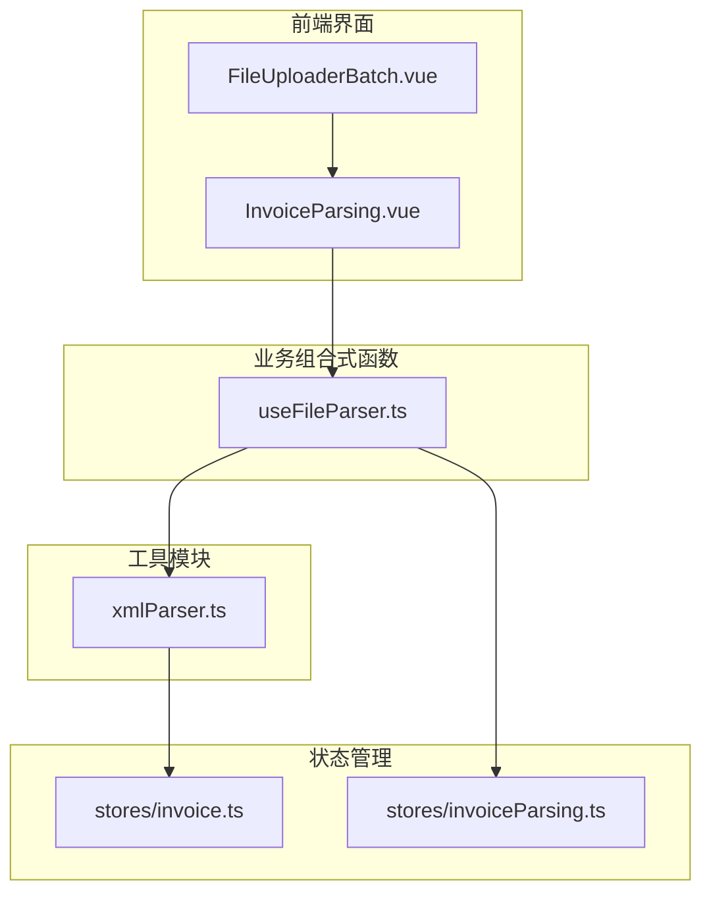
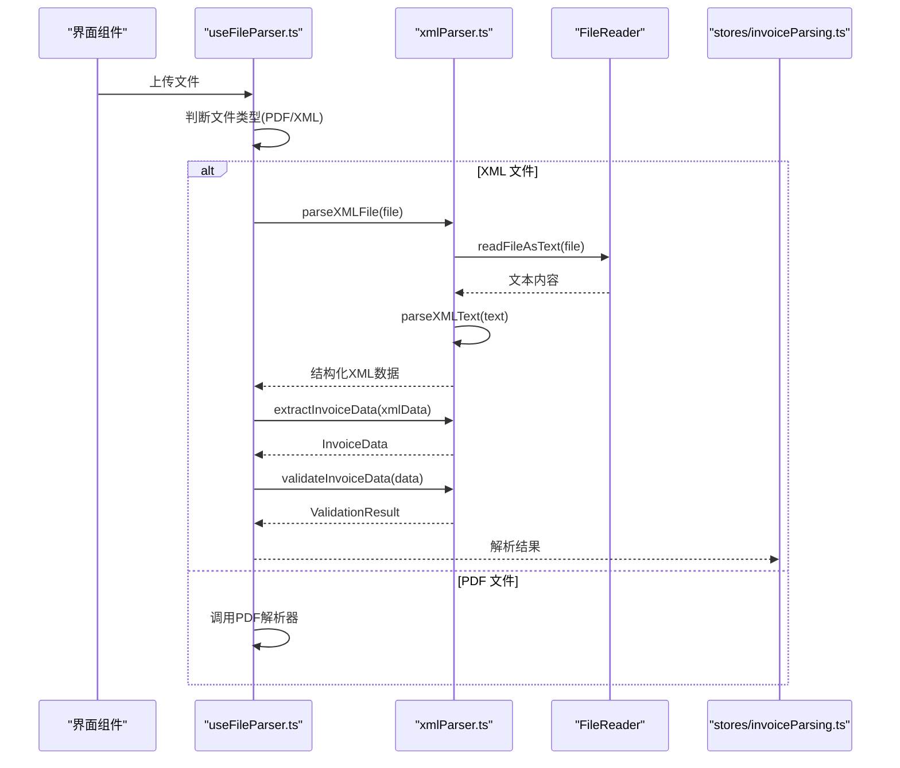
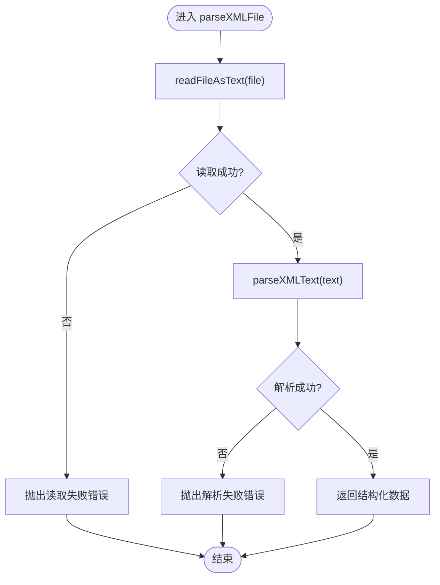
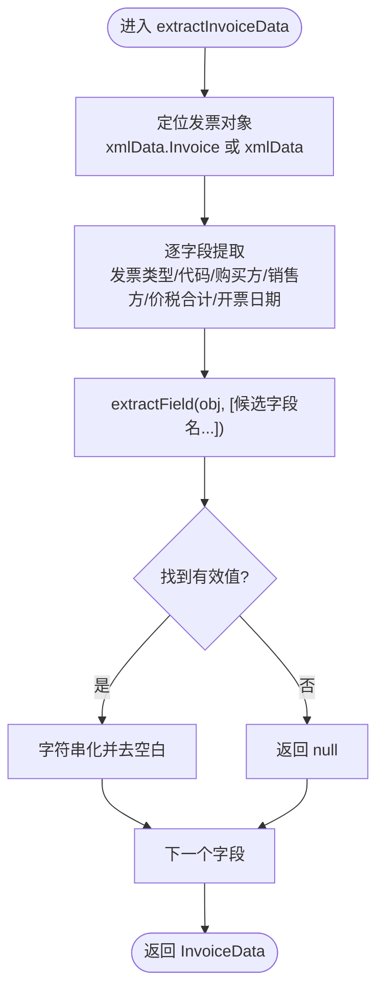
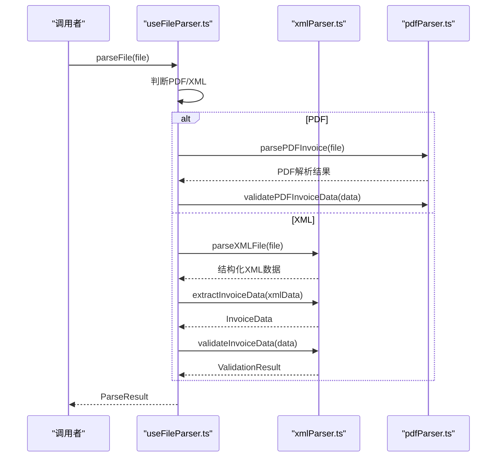
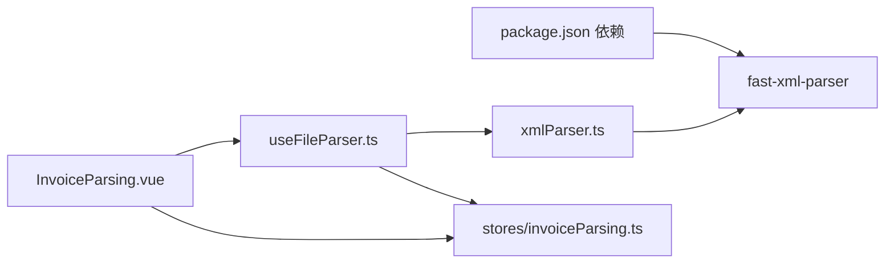

# XML解析工具

<cite>
**本文档引用的文件**
- [xmlParser.ts](file://src/utils/xmlParser.ts)
- [useFileParser.ts](file://src/composables/useFileParser.ts)
- [invoice.ts](file://src/stores/invoice.ts)
- [invoiceParsing.ts](file://src/stores/invoiceParsing.ts)
- [FileUploader.vue](file://src/components/FileUploader.vue)
- [FileUploaderBatch.vue](file://src/components/FileUploaderBatch.vue)
- [InvoiceParsing.vue](file://src/views/InvoiceParsing.vue)
- [package.json](file://package.json)
- [README.md](file://README.md)
</cite>

## 目录
1. [简介](#简介)
2. [项目结构](#项目结构)
3. [核心组件](#核心组件)
4. [架构总览](#架构总览)
5. [详细组件分析](#详细组件分析)
6. [依赖关系分析](#依赖关系分析)
7. [性能考量](#性能考量)
8. [故障排查指南](#故障排查指南)
9. [结论](#结论)
10. [附录](#附录)

## 简介
本文件系统性文档化了基于 fast-xml-parser 的 XML 解析工具模块，重点阐述其在发票 XML 数据解析中的工作机制与容错设计。内容涵盖：
- parseXMLFile 如何将 File 对象转换为文本并通过 XMLParser 进行结构化解析
- parserOptions 配置项（如忽略属性、文本节点命名等）的作用与影响
- extractInvoiceData 通过 extractField 辅助函数尝试多种字段名的容错提取策略
- validateInvoiceData 对发票类型、购买方名称、价税合计三类必填字段的验证逻辑
- parseXMLText 与 readFileAsText 的底层实现细节
- 实际 XML 发票结构示例下的数据提取流程
- XML 结构兼容性问题与未来扩展方向（如支持不同版本的发票 XML schema）
- 完整类型定义与错误处理机制说明

## 项目结构
该工具位于 src/utils/xmlParser.ts，配合 composables/useFileParser.ts 在业务层统一调度，Pinia stores/invoice.ts 与 stores/invoiceParsing.ts 用于状态管理与结果展示。前端界面由 components/FileUploader.vue、components/FileUploaderBatch.vue 与 views/InvoiceParsing.vue 提供交互入口。

图表来源
- [FileUploaderBatch.vue](file://src/components/FileUploaderBatch.vue#L1-L79)
- [InvoiceParsing.vue](file://src/views/InvoiceParsing.vue#L1-L328)
- [useFileParser.ts](file://src/composables/useFileParser.ts#L1-L109)
- [xmlParser.ts](file://src/utils/xmlParser.ts#L1-L141)
- [invoice.ts](file://src/stores/invoice.ts#L1-L256)
- [invoiceParsing.ts](file://src/stores/invoiceParsing.ts#L1-L241)

章节来源
- [README.md](file://README.md#L1-L41)
- [package.json](file://package.json#L1-L33)

## 核心组件
- XML 解析器配置与类型定义：ParserOptions、InvoiceData、ValidationResult
- 文件解析流程：parseXMLFile、parseXMLText、readFileAsText
- 数据提取与验证：extractInvoiceData、extractField、validateInvoiceData

章节来源
- [xmlParser.ts](file://src/utils/xmlParser.ts#L6-L27)
- [xmlParser.ts](file://src/utils/xmlParser.ts#L29-L37)
- [xmlParser.ts](file://src/utils/xmlParser.ts#L42-L62)
- [xmlParser.ts](file://src/utils/xmlParser.ts#L67-L85)
- [xmlParser.ts](file://src/utils/xmlParser.ts#L90-L97)
- [xmlParser.ts](file://src/utils/xmlParser.ts#L102-L116)
- [xmlParser.ts](file://src/utils/xmlParser.ts#L121-L140)

## 架构总览
XML 解析工具在应用中的调用链路如下：用户上传 XML/PDF 文件 → 组合式函数识别文件类型 → 调用对应解析器 → 提取发票数据 → 验证必填字段 → 写入状态管理 → 展示结果。

图表来源
- [useFileParser.ts](file://src/composables/useFileParser.ts#L22-L66)
- [xmlParser.ts](file://src/utils/xmlParser.ts#L42-L62)
- [xmlParser.ts](file://src/utils/xmlParser.ts#L102-L116)
- [invoiceParsing.ts](file://src/stores/invoiceParsing.ts#L122-L139)

## 详细组件分析

### 解析器配置与类型定义
- ParserOptions：控制 fast-xml-parser 的行为，包括是否忽略属性、属性名前缀、文本节点名、是否忽略声明、是否解析属性值以及是否去除空白字符。
- InvoiceData：标准化后的发票数据结构，包含发票类型、发票代码、购买方名称、销售方名称、价税合计、开票日期等字段。
- ValidationResult：验证结果，包含布尔标志与错误消息数组。

章节来源
- [xmlParser.ts](file://src/utils/xmlParser.ts#L6-L27)
- [xmlParser.ts](file://src/utils/xmlParser.ts#L29-L37)

### parseXMLFile：文件到结构化数据的转换
- 功能：异步读取 File 对象为文本，再交由 parseXMLText 进行结构化解析。
- 错误处理：捕获读取与解析异常，抛出带明确错误信息的异常，便于上层统一处理。

图表来源
- [xmlParser.ts](file://src/utils/xmlParser.ts#L42-L49)
- [xmlParser.ts](file://src/utils/xmlParser.ts#L102-L116)
- [xmlParser.ts](file://src/utils/xmlParser.ts#L54-L62)

章节来源
- [xmlParser.ts](file://src/utils/xmlParser.ts#L42-L49)
- [xmlParser.ts](file://src/utils/xmlParser.ts#L102-L116)
- [xmlParser.ts](file://src/utils/xmlParser.ts#L54-L62)

### parseXMLText：基于 fast-xml-parser 的结构化解析
- 功能：创建 XMLParser 实例并解析传入的 XML 文本，返回结构化对象。
- 配置：使用 parserOptions 控制解析行为，确保输出符合预期的数据结构。

章节来源
- [xmlParser.ts](file://src/utils/xmlParser.ts#L54-L62)
- [xmlParser.ts](file://src/utils/xmlParser.ts#L29-L37)

### readFileAsText：底层文件读取工具
- 功能：基于 FileReader 异步读取 File 对象为文本，封装 onload/onerror 回调。
- 错误处理：onerror 触发时拒绝 Promise，携带“文件读取失败”错误信息。

章节来源
- [xmlParser.ts](file://src/utils/xmlParser.ts#L102-L116)

### extractInvoiceData：发票信息提取与容错设计
- 功能：从结构化 XML 数据中提取发票关键字段，支持两种常见根节点布局（直接根节点或包含 Invoice 子节点）。
- 容错策略：通过 extractField 尝试多种字段名（如 InvoiceType/Type/InvoiceName），提升对不同 XML 版本的兼容性；对缺失字段返回 null 并在后续验证阶段统一处理。

图表来源
- [xmlParser.ts](file://src/utils/xmlParser.ts#L67-L85)
- [xmlParser.ts](file://src/utils/xmlParser.ts#L90-L97)

章节来源
- [xmlParser.ts](file://src/utils/xmlParser.ts#L67-L85)
- [xmlParser.ts](file://src/utils/xmlParser.ts#L90-L97)

### extractField：多候选字段名提取辅助函数
- 功能：遍历候选字段名，返回首个非空且非 null 的值，统一字符串化并去除首尾空白。
- 设计意义：应对不同发票 XML schema 中字段命名差异，提高解析鲁棒性。

章节来源
- [xmlParser.ts](file://src/utils/xmlParser.ts#L90-L97)

### validateInvoiceData：必填字段验证
- 功能：校验发票类型、购买方名称、价税合计三项必填字段是否为空。
- 输出：返回布尔标志与错误消息数组，便于前端展示与统计。

章节来源
- [xmlParser.ts](file://src/utils/xmlParser.ts#L121-L140)

### useFileParser：文件解析组合式函数
- 功能：统一处理 PDF/XML 文件解析，按文件后缀判断类型，调用对应解析器，组装 ParseResult 返回给上层。
- 批量解析：支持分批并发处理，维护进度与状态。

图表来源
- [useFileParser.ts](file://src/composables/useFileParser.ts#L22-L66)
- [xmlParser.ts](file://src/utils/xmlParser.ts#L42-L85)

章节来源
- [useFileParser.ts](file://src/composables/useFileParser.ts#L15-L109)

### 状态管理与界面集成
- stores/invoice.ts：管理发票文件列表、状态筛选、搜索、批量操作等，负责将解析结果写入状态并生成新文件名。
- stores/invoiceParsing.ts：面向发票解析结果的专用状态管理，支持多税率展示、筛选与导出。
- views/InvoiceParsing.vue 与 components/FileUploader.vue、FileUploaderBatch.vue：提供上传与展示能力，调用 useFileParser 完成解析流程。

章节来源
- [invoice.ts](file://src/stores/invoice.ts#L106-L151)
- [invoiceParsing.ts](file://src/stores/invoiceParsing.ts#L122-L139)
- [InvoiceParsing.vue](file://src/views/InvoiceParsing.vue#L188-L232)
- [FileUploader.vue](file://src/components/FileUploader.vue#L33-L38)
- [FileUploaderBatch.vue](file://src/components/FileUploaderBatch.vue#L49-L67)

## 依赖关系分析
- 外部依赖：fast-xml-parser 用于 XML 解析；Naive UI、Vue 3、Pinia 等用于界面与状态管理。
- 内部耦合：xmlParser.ts 仅依赖 fast-xml-parser；useFileParser.ts 统一调度 XML/PDF 解析；stores 仅消费解析结果。

图表来源
- [package.json](file://package.json#L12-L23)
- [xmlParser.ts](file://src/utils/xmlParser.ts#L4)
- [useFileParser.ts](file://src/composables/useFileParser.ts#L5)
- [invoiceParsing.ts](file://src/stores/invoiceParsing.ts#L1-L241)

章节来源
- [package.json](file://package.json#L12-L23)

## 性能考量
- 并发与批处理：useFileParser.ts 采用分批并发处理（每批 10 个文件），减少长时间阻塞，提升吞吐。
- I/O 优化：readFileAsText 使用浏览器原生 FileReader 异步读取，避免主线程阻塞。
- 解析配置：parserOptions 中启用 trimValues 与 ignoreDeclaration，有助于减小数据体积与提升稳定性。
- 建议：对于超大 XML 文件，可考虑流式解析或分块读取策略；对频繁解析场景可引入缓存机制（如基于文件哈希）。

## 故障排查指南
- 文件读取失败：检查 FileReader 的 onerror 分支，确认文件大小与类型限制；确保浏览器支持 FileReader API。
- XML 解析失败：核对 XML 文本编码与格式；检查 parserOptions 配置是否合理；必要时开启更宽松的解析选项。
- 字段提取失败：确认 XML 结构中是否存在候选字段名；若字段名变更，需在 extractField 的候选列表中补充。
- 验证失败：检查必填字段是否为空；若存在空格或特殊字符，确保 trimValues 生效。
- 界面无响应：确认批量解析进度回调是否正常触发；检查 isProcessing 状态与 UI 绑定。

章节来源
- [xmlParser.ts](file://src/utils/xmlParser.ts#L46-L48)
- [xmlParser.ts](file://src/utils/xmlParser.ts#L59-L61)
- [xmlParser.ts](file://src/utils/xmlParser.ts#L90-L97)
- [xmlParser.ts](file://src/utils/xmlParser.ts#L121-L140)
- [useFileParser.ts](file://src/composables/useFileParser.ts#L71-L100)

## 结论
该 XML 解析工具通过 fast-xml-parser 提供稳定高效的结构化解析能力，结合多候选字段提取与严格验证机制，实现了对不同发票 XML 结构的良好兼容性。配合组合式函数与状态管理，形成从上传到展示的一体化流程。建议在未来扩展中增加对多版本发票 XML schema 的适配与更完善的错误诊断能力。

## 附录

### 实际 XML 发票结构示例（概念性说明）
以下为常见发票 XML 结构示意，帮助理解字段映射关系（仅为概念说明，不对应具体代码）：
- 根节点可能为发票对象或包含 Invoice 子节点
- 常见字段：发票类型、发票代码、购买方名称、销售方名称、价税合计、开票日期
- 字段命名可能存在差异（如 Type/InvoiceType、InvoiceName/Name 等）

### 数据提取流程示例（概念性说明）
- 输入：结构化 XML 对象
- 步骤：定位发票对象 → 尝试多种字段名 → 字符串化并去空白 → 返回标准化 InvoiceData
- 输出：包含发票类型、发票代码、购买方名称、销售方名称、价税合计、开票日期的对象

### 未来扩展点
- 多版本 schema 支持：针对不同版本的发票 XML schema 定义不同的字段映射表
- 更细粒度的错误分类：区分字段缺失、格式错误、编码问题等
- 流式解析与增量处理：支持超大文件的分块解析
- 缓存与重用：对已解析文件的结果进行缓存，减少重复解析成本
- Schema 校验：在解析后进行结构校验，提前发现 schema 不一致问题