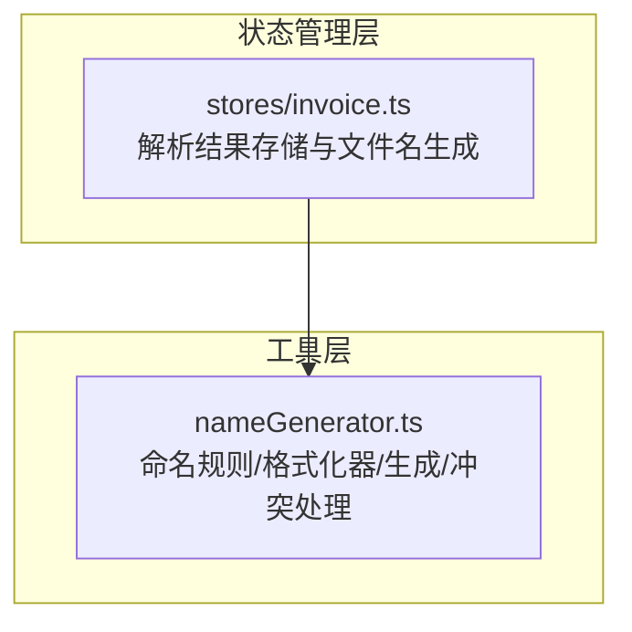
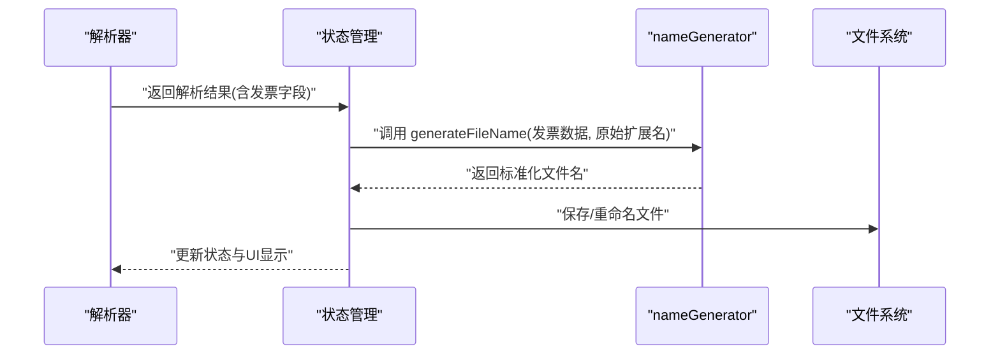
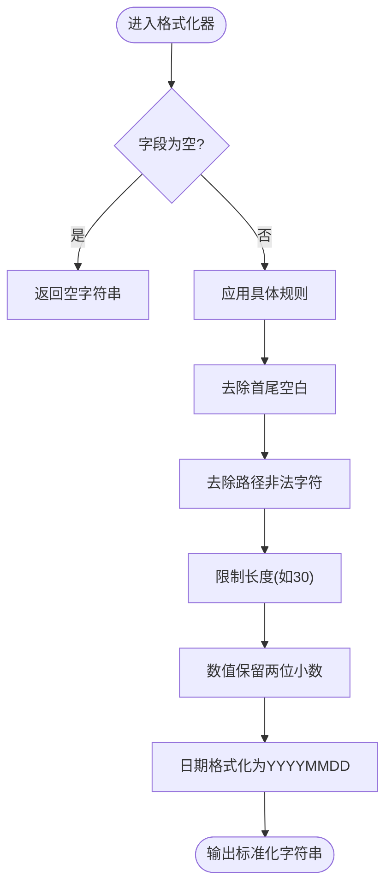
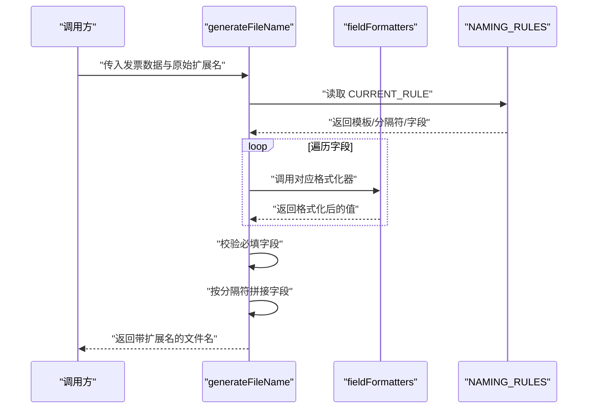
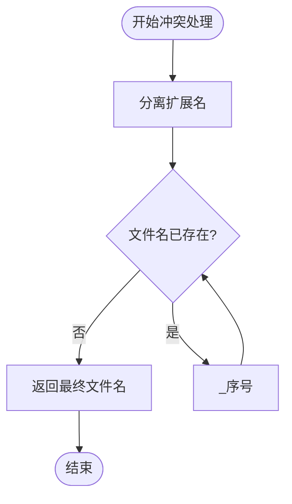
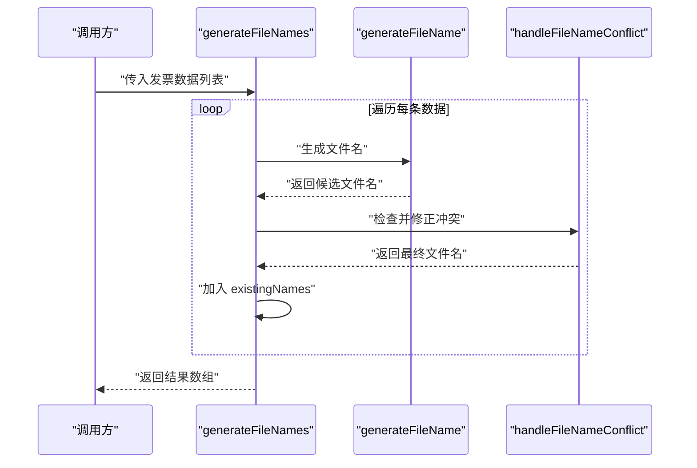
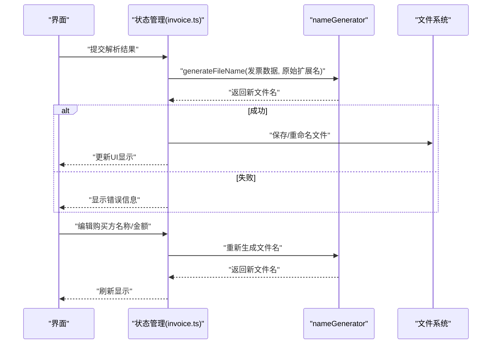
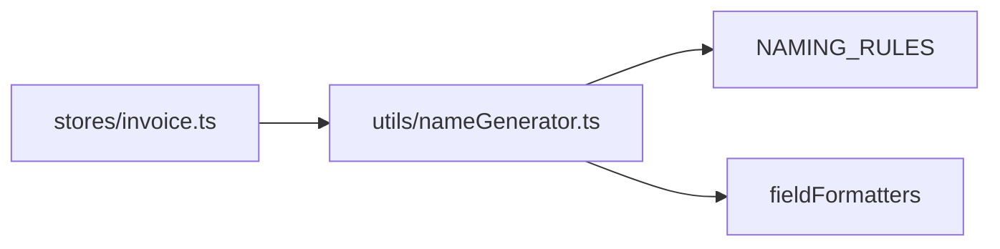

# 文件名生成器

<cite>
**本文引用的文件**
- [nameGenerator.ts](file://src/utils/nameGenerator.ts)
- [invoice.ts](file://src/stores/invoice.ts)
- [README.md](file://README.md)
</cite>

## 目录
1. [简介](#简介)
2. [项目结构](#项目结构)
3. [核心组件](#核心组件)
4. [架构总览](#架构总览)
5. [详细组件分析](#详细组件分析)
6. [依赖关系分析](#依赖关系分析)
7. [性能考量](#性能考量)
8. [故障排查指南](#故障排查指南)
9. [结论](#结论)
10. [附录](#附录)

## 简介
本文件面向“发票重命名”功能，系统性地文档化 nameGenerator 工具模块。该模块基于预定义的命名规则，对发票解析后的关键字段进行格式化与拼接，生成标准化的文件名；同时提供冲突处理与批量生成能力，并通过规则管理 API 支持灵活切换与扩展。本文将深入解析：
- 四种命名规则的模板、分隔符与字段组成
- 字段格式化器的策略与实现细节
- generateFileName 的调用流程与错误处理
- 冲突处理算法与批量去重逻辑
- 规则管理 API 的用途与最佳实践
- 结合实际调用流程的完整示例

## 项目结构
nameGenerator 位于工具层，主要被状态管理层复用，用于在发票解析成功后生成新文件名。核心文件与职责如下：
- src/utils/nameGenerator.ts：定义命名规则、字段格式化器、文件名生成与冲突处理逻辑
- src/stores/invoice.ts：在解析成功后调用 generateFileName 生成新文件名，并在用户编辑字段时重新生成

图表来源
- [nameGenerator.ts](file://src/utils/nameGenerator.ts#L1-L250)
- [invoice.ts](file://src/stores/invoice.ts#L1-L256)

章节来源
- [README.md](file://README.md#L1-L41)
- [nameGenerator.ts](file://src/utils/nameGenerator.ts#L1-L250)
- [invoice.ts](file://src/stores/invoice.ts#L1-L256)

## 核心组件
- 命名规则定义（NAMING_RULES）：包含四条规则，分别定义模板、分隔符与字段集合
- 字段格式化器（fieldFormatters）：针对不同字段执行清洗、转换与规范化
- 生成函数（generateFileName）：按当前规则格式化字段并拼接为最终文件名
- 冲突处理（handleFileNameConflict）：当同一批次中出现重复文件名时追加序号后缀
- 批量生成（generateFileNames）：对一组发票数据批量生成文件名并处理冲突
- 规则管理 API：切换当前规则、查询当前规则、列出可用规则

章节来源
- [nameGenerator.ts](file://src/utils/nameGenerator.ts#L34-L60)
- [nameGenerator.ts](file://src/utils/nameGenerator.ts#L65-L138)
- [nameGenerator.ts](file://src/utils/nameGenerator.ts#L143-L170)
- [nameGenerator.ts](file://src/utils/nameGenerator.ts#L175-L191)
- [nameGenerator.ts](file://src/utils/nameGenerator.ts#L196-L225)
- [nameGenerator.ts](file://src/utils/nameGenerator.ts#L230-L249)

## 架构总览
下图展示了从解析成功到生成文件名的整体流程，以及 nameGenerator 在其中的位置与职责边界。

图表来源
- [invoice.ts](file://src/stores/invoice.ts#L106-L151)
- [nameGenerator.ts](file://src/utils/nameGenerator.ts#L143-L170)

## 详细组件分析

### 命名规则与字段组成
nameGenerator 定义了四条命名规则，均以“模板字符串 + 分隔符 + 字段数组”的形式组织，当前启用规则由全局变量 CURRENT_RULE 控制。四条规则如下：
- purchaser_amount：模板为“{purchaserName}_{totalAmount}”，分隔符为“_”，字段为 [purchaserName, totalAmount]
- invoice_purchaser_amount：模板为“{invoiceType}_{purchaserName}_{totalAmount}”，分隔符为“_”，字段为 [invoiceType, purchaserName, totalAmount]
- purchaser_date_amount：模板为“{purchaserName}_{issueDate}_{totalAmount}”，分隔符为“_”，字段为 [purchaserName, issueDate, totalAmount]
- invoice_code_purchaser：模板为“{invoiceCode}_{purchaserName}”，分隔符为“_”，字段为 [invoiceCode, purchaserName]

这些规则通过 NAMING_RULES 统一管理，便于扩展与维护。

章节来源
- [nameGenerator.ts](file://src/utils/nameGenerator.ts#L34-L60)

### 字段格式化器策略
字段格式化器负责将原始发票字段转换为适合文件名的标准化形式，确保跨平台兼容与可读性。各格式化器要点如下：
- purchaserName：去除路径非法字符（如斜杠、冒号、问号等），限制最大长度（例如30字符），并去除首尾空白
- invoiceType：去除“电子发票”字样与括号，保留纯文本
- totalAmount：将字符串转为数值，保留两位小数
- issueDate：支持“YYYY年M月D日”与常见分隔符（年/月/日、横杠等），统一转换为“YYYYMMDD”
- invoiceCode：去除首尾空白
- sellerName：复用 purchaserName 的格式化策略

图表来源
- [nameGenerator.ts](file://src/utils/nameGenerator.ts#L65-L138)

章节来源
- [nameGenerator.ts](file://src/utils/nameGenerator.ts#L65-L138)

### generateFileName 生成流程
该函数按以下步骤工作：
1. 读取当前规则（CURRENT_RULE）并校验是否存在
2. 遍历规则字段，调用对应格式化器进行清洗与转换
3. 校验必填字段是否为空，若为空则抛出错误
4. 按字段顺序拼接，使用规则分隔符连接
5. 附加原始文件扩展名，得到最终文件名

图表来源
- [nameGenerator.ts](file://src/utils/nameGenerator.ts#L143-L170)

章节来源
- [nameGenerator.ts](file://src/utils/nameGenerator.ts#L143-L170)

### 冲突处理算法（handleFileNameConflict）
当同一组发票中出现重复文件名时，采用“追加序号后缀”的策略：
- 提取文件名与扩展名
- 若已存在，则在文件名后追加“_序号”，直到不冲突为止

图表来源
- [nameGenerator.ts](file://src/utils/nameGenerator.ts#L175-L191)

章节来源
- [nameGenerator.ts](file://src/utils/nameGenerator.ts#L175-L191)

### 批量生成与去重（generateFileNames）
批量生成流程在单个文件名生成的基础上增加了冲突去重：
- 逐条生成文件名
- 使用 handleFileNameConflict 保证不重复
- 维护 existingNames 列表，确保后续条目不会与已生成的文件名冲突
- 对异常进行捕获并返回错误信息，不影响其他条目的处理

图表来源
- [nameGenerator.ts](file://src/utils/nameGenerator.ts#L196-L225)

章节来源
- [nameGenerator.ts](file://src/utils/nameGenerator.ts#L196-L225)

### 规则管理 API
- setCurrentRule(ruleName)：切换当前规则，若规则不存在则抛出错误
- getCurrentRule()：返回当前规则名称
- getAvailableRules()：返回所有可用规则名称列表

这些 API 为开发者提供了灵活的规则切换与扩展能力，便于在不同业务场景下快速适配命名策略。

章节来源
- [nameGenerator.ts](file://src/utils/nameGenerator.ts#L230-L249)

### 实际调用流程示例（发票重命名）
以下流程展示了从解析成功到生成文件名的端到端过程，结合状态管理 store 的集成点：
- 解析成功后，状态管理 store 调用 generateFileName，传入发票字段与原始扩展名
- 生成成功则更新状态与 UI 显示；失败则记录错误信息
- 用户在 UI 中修改购买方名称或金额时，store 会重新生成文件名

图表来源
- [invoice.ts](file://src/stores/invoice.ts#L106-L151)
- [invoice.ts](file://src/stores/invoice.ts#L159-L176)
- [nameGenerator.ts](file://src/utils/nameGenerator.ts#L143-L170)

章节来源
- [invoice.ts](file://src/stores/invoice.ts#L106-L151)
- [invoice.ts](file://src/stores/invoice.ts#L159-L176)
- [nameGenerator.ts](file://src/utils/nameGenerator.ts#L143-L170)

## 依赖关系分析
- 低耦合：nameGenerator 仅依赖内部定义的规则与格式化器，不直接依赖 UI 或外部系统
- 单向依赖：状态管理 store 依赖 nameGenerator，但 nameGenerator 不依赖 store
- 可扩展性：通过 NAMING_RULES 与 fieldFormatters 的键值映射，新增规则与格式化器无需改动核心逻辑

图表来源
- [invoice.ts](file://src/stores/invoice.ts#L6)
- [nameGenerator.ts](file://src/utils/nameGenerator.ts#L34-L138)

章节来源
- [invoice.ts](file://src/stores/invoice.ts#L6)
- [nameGenerator.ts](file://src/utils/nameGenerator.ts#L34-L138)

## 性能考量
- 字段格式化器均为纯函数，时间复杂度近似 O(n)，n 为字段长度
- generateFileName 遍历字段数量 m，整体复杂度 O(m·n)
- 批量生成时 handleFileNameConflict 在最坏情况下可能需要多次迭代，建议控制输入规模或引入更高效的冲突检测结构（如哈希集合）以降低查找成本
- 建议在 UI 层对批量操作进行节流与进度反馈，避免阻塞主线程

## 故障排查指南
- 规则不存在：setCurrentRule 会抛出错误，检查规则名称是否拼写正确
- 字段缺失或为空：generateFileName 会在必填字段为空时抛出错误，检查发票解析结果是否完整
- 冲突过多导致生成缓慢：批量生成时 handleFileNameConflict 可能多次重试，建议减少重复字段或调整规则
- 特殊字符导致文件名异常：确保格式化器正常运行，必要时在 UI 层对输入进行预校验

章节来源
- [nameGenerator.ts](file://src/utils/nameGenerator.ts#L146-L148)
- [nameGenerator.ts](file://src/utils/nameGenerator.ts#L158-L162)
- [nameGenerator.ts](file://src/utils/nameGenerator.ts#L230-L235)

## 结论
nameGenerator 通过“规则 + 格式化器 + 生成器 + 冲突处理”的模块化设计，实现了稳定、可扩展且易维护的发票文件名生成能力。它与状态管理层解耦，便于在不同业务场景下灵活切换规则与扩展字段格式化策略。建议在实际使用中遵循“最小必要字段”“明确分隔符”“统一日期格式”等最佳实践，以获得更一致的文件名体验。

## 附录
- 最佳实践
  - 规则设计：优先选择稳定、可读性强的字段组合，避免过长或易变字段
  - 格式化策略：统一日期、金额、名称的格式，减少歧义
  - 批量处理：对大量文件进行分批处理，配合进度反馈与错误聚合
  - 规则扩展：新增规则时，同步完善对应格式化器与字段校验逻辑