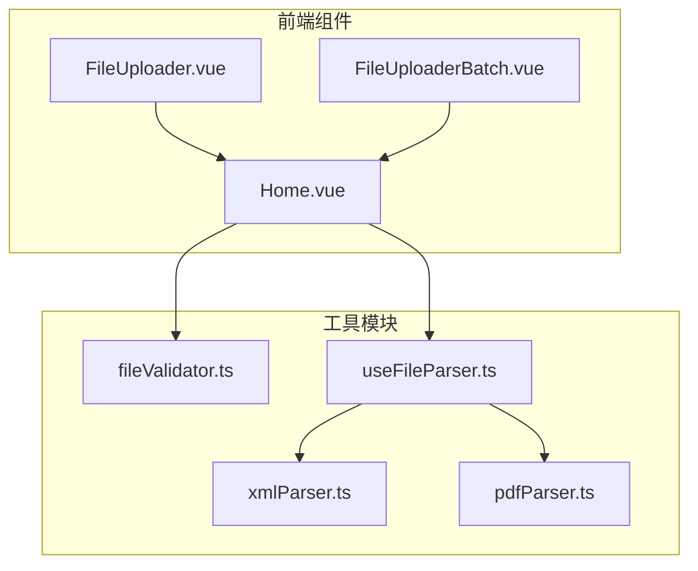
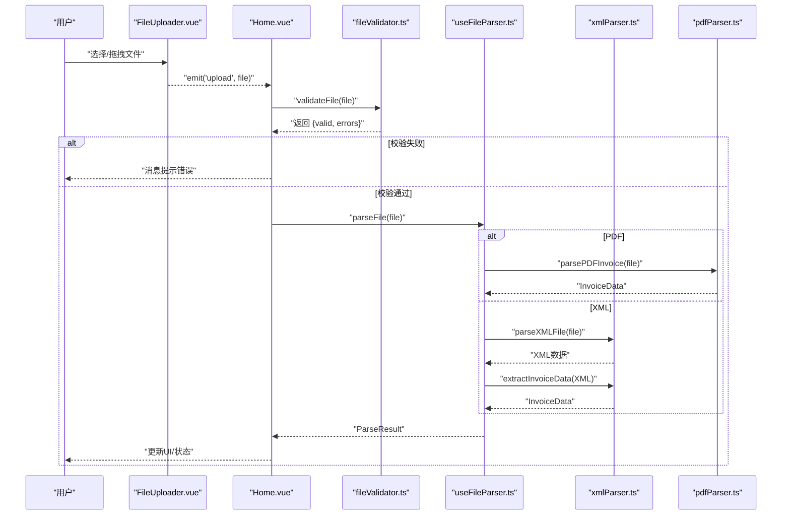
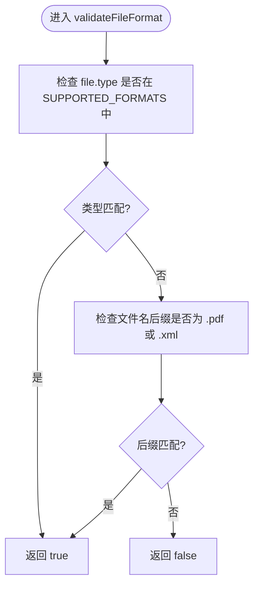
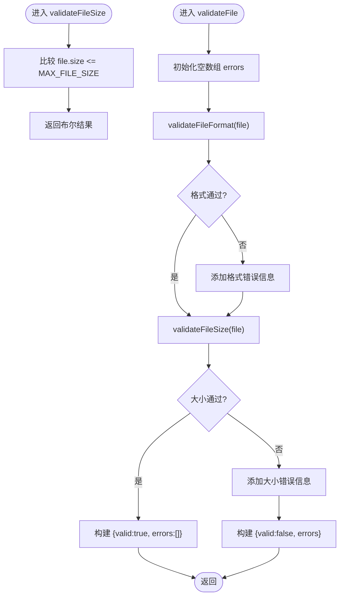
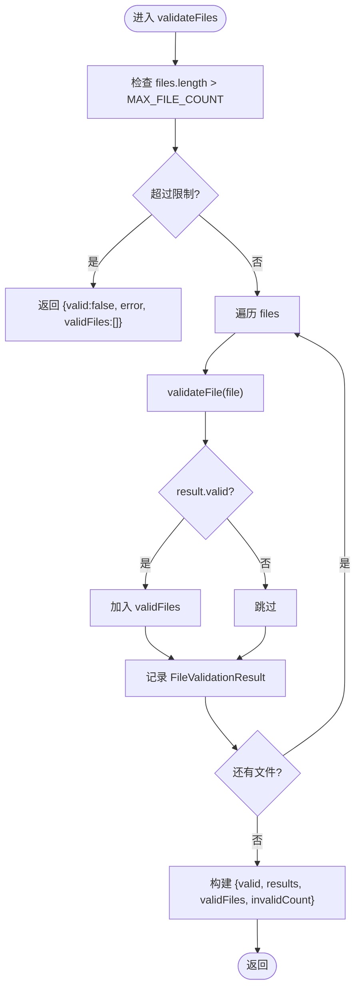
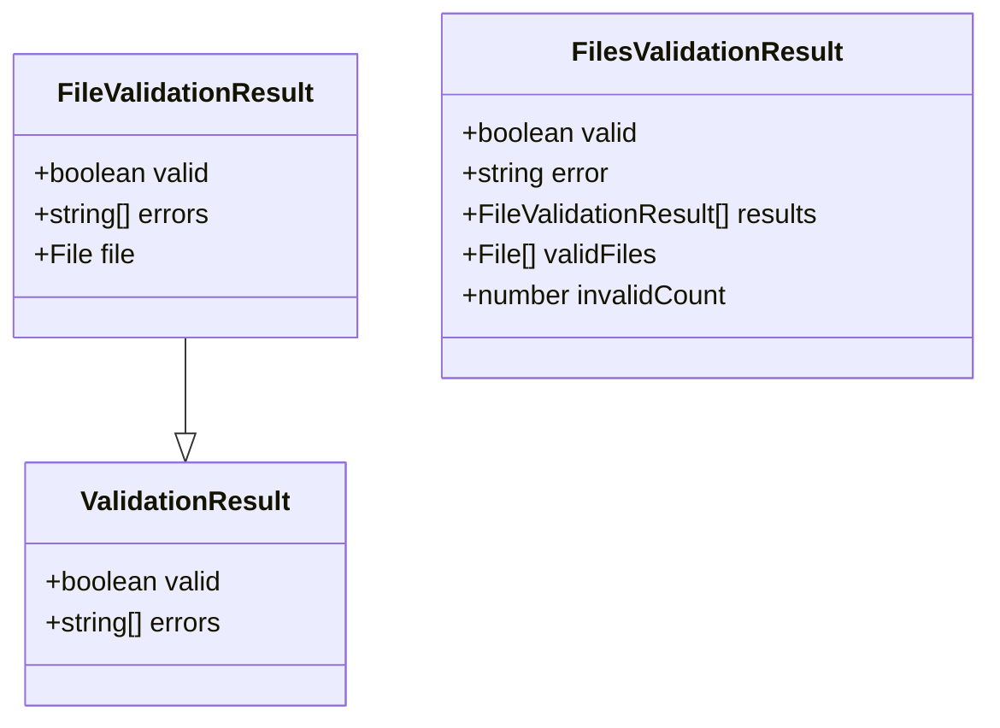
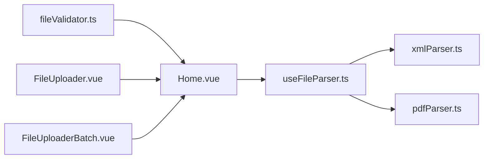

# 文件验证器

<cite>
**本文引用的文件**
- [src/utils/fileValidator.ts](file://src/utils/fileValidator.ts)
- [src/components/FileUploader.vue](file://src/components/FileUploader.vue)
- [src/components/FileUploaderBatch.vue](file://src/components/FileUploaderBatch.vue)
- [src/views/Home.vue](file://src/views/Home.vue)
- [src/composables/useFileParser.ts](file://src/composables/useFileParser.ts)
- [src/utils/xmlParser.ts](file://src/utils/xmlParser.ts)
- [src/utils/pdfParser.ts](file://src/utils/pdfParser.ts)
- [README.md](file://README.md)
</cite>

## 目录
1. [简介](#简介)
2. [项目结构](#项目结构)
3. [核心组件](#核心组件)
4. [架构总览](#架构总览)
5. [详细组件分析](#详细组件分析)
6. [依赖关系分析](#依赖关系分析)
7. [性能考量](#性能考量)
8. [故障排查指南](#故障排查指南)
9. [结论](#结论)
10. [附录](#附录)

## 简介
本文件系统性地文档化了 fileValidator 工具模块，重点说明其对上传发票文件的完整性与合规性校验机制。内容涵盖：
- SUPPORTED_FORMATS 支持的 MIME 类型（application/pdf、text/xml 等）与文件扩展名（.pdf、.xml）双重验证逻辑
- MAX_FILE_SIZE（10MB）与 MAX_FILE_COUNT（100 个）常量的业务依据
- validateFileFormat、validateFileSize 单文件验证函数的实现细节
- validateFile 如何聚合格式与大小验证结果，validateFiles 批量验证函数如何处理大量文件并返回详细验证结果（包括 validFiles、invalidCount 等）
- ValidationResult、FileValidationResult、FilesValidationResult 等类型定义的结构与用途
- 结合文件上传组件的实际调用场景，展示验证失败提示的生成逻辑
- 未来扩展点建议（支持更多文件格式或动态调整大小限制）

## 项目结构
该模块位于 src/utils/fileValidator.ts，围绕发票上传与解析流程提供前置校验能力。前端上传组件通过事件驱动将文件传递给视图层，视图层调用验证器进行校验，再进入解析与存储流程。



图表来源
- [src/components/FileUploader.vue](file://src/components/FileUploader.vue#L1-L50)
- [src/components/FileUploaderBatch.vue](file://src/components/FileUploaderBatch.vue#L1-L79)
- [src/views/Home.vue](file://src/views/Home.vue#L1-L247)
- [src/utils/fileValidator.ts](file://src/utils/fileValidator.ts#L1-L107)
- [src/composables/useFileParser.ts](file://src/composables/useFileParser.ts#L1-L109)
- [src/utils/xmlParser.ts](file://src/utils/xmlParser.ts#L1-L141)
- [src/utils/pdfParser.ts](file://src/utils/pdfParser.ts#L1-L243)

章节来源
- [README.md](file://README.md#L1-L41)

## 核心组件
- fileValidator.ts：提供文件格式与大小的双层校验，以及批量校验能力；定义 ValidationResult、FileValidationResult、FilesValidationResult 等类型。
- FileUploader.vue 与 FileUploaderBatch.vue：负责文件选择与拖拽上传，设置 accept 与 max 属性，配合前端 UI 提示用户可接受的文件类型与数量限制。
- Home.vue：接收上传事件，调用 validateFile 进行单文件校验，若失败则通过消息组件提示错误；随后进入解析与存储流程。
- useFileParser.ts：封装文件解析逻辑，按文件类型分派到 PDF 或 XML 解析器，并进行数据验证。
- xmlParser.ts 与 pdfParser.ts：分别实现 XML 与 PDF 发票数据的解析与验证。

章节来源
- [src/utils/fileValidator.ts](file://src/utils/fileValidator.ts#L1-L107)
- [src/components/FileUploader.vue](file://src/components/FileUploader.vue#L1-L50)
- [src/components/FileUploaderBatch.vue](file://src/components/FileUploaderBatch.vue#L1-L79)
- [src/views/Home.vue](file://src/views/Home.vue#L1-L247)
- [src/composables/useFileParser.ts](file://src/composables/useFileParser.ts#L1-L109)
- [src/utils/xmlParser.ts](file://src/utils/xmlParser.ts#L1-L141)
- [src/utils/pdfParser.ts](file://src/utils/pdfParser.ts#L1-L243)

## 架构总览
文件上传与验证的整体流程如下：
- 用户通过 FileUploader/FileUploaderBatch 选择或拖拽文件
- 视图层 Home.vue 接收文件后，先调用 validateFile 进行格式与大小校验
- 若校验通过，进入 useFileParser.ts 的解析流程，按类型调用 xmlParser.ts 或 pdfParser.ts
- 解析完成后，将结果存入状态管理并更新 UI



图表来源
- [src/components/FileUploader.vue](file://src/components/FileUploader.vue#L1-L50)
- [src/views/Home.vue](file://src/views/Home.vue#L97-L155)
- [src/utils/fileValidator.ts](file://src/utils/fileValidator.ts#L57-L72)
- [src/composables/useFileParser.ts](file://src/composables/useFileParser.ts#L22-L66)
- [src/utils/xmlParser.ts](file://src/utils/xmlParser.ts#L42-L85)
- [src/utils/pdfParser.ts](file://src/utils/pdfParser.ts#L184-L192)

## 详细组件分析

### 支持的文件格式与双重验证逻辑
- 支持的 MIME 类型：application/pdf、text/xml、application/xml
- 文件扩展名：.pdf、.xml
- 双重验证策略：
  - 优先检查 file.type 是否属于 SUPPORTED_FORMATS 中的值
  - 若 MIME 不匹配，则回退检查文件名后缀是否为 .pdf 或 .xml
  - 返回布尔值表示是否通过格式校验



图表来源
- [src/utils/fileValidator.ts](file://src/utils/fileValidator.ts#L38-L45)

章节来源
- [src/utils/fileValidator.ts](file://src/utils/fileValidator.ts#L6-L10)
- [src/utils/fileValidator.ts](file://src/utils/fileValidator.ts#L38-L45)

### 文件大小限制与数量限制
- MAX_FILE_SIZE：10MB（字节），用于限制单个文件大小
- MAX_FILE_COUNT：100 个，用于限制单次上传文件数量
- 业务依据：
  - 10MB 适合作为浏览器端快速处理与网络传输的折中上限，兼顾解析性能与稳定性
  - 100 个文件作为单次批量处理的上限，避免一次性处理过多文件导致内存压力与 UI 卡顿

章节来源
- [src/utils/fileValidator.ts](file://src/utils/fileValidator.ts#L13-L16)

### 单文件验证函数实现细节
- validateFileSize：比较 file.size 与 MAX_FILE_SIZE
- validateFile：聚合 validateFileFormat 与 validateFileSize 的结果，构建包含 errors 数组的 ValidationResult 对象



图表来源
- [src/utils/fileValidator.ts](file://src/utils/fileValidator.ts#L50-L52)
- [src/utils/fileValidator.ts](file://src/utils/fileValidator.ts#L57-L72)

章节来源
- [src/utils/fileValidator.ts](file://src/utils/fileValidator.ts#L50-L52)
- [src/utils/fileValidator.ts](file://src/utils/fileValidator.ts#L57-L72)

### 批量验证函数与结果聚合
- validateFiles：
  - 先检查文件数量是否超过 MAX_FILE_COUNT，超限直接返回错误
  - 遍历每个文件，调用 validateFile 并记录 FileValidationResult
  - 统计有效文件 validFiles 与无效数量 invalidCount
  - 返回包含 valid、results、validFiles、invalidCount 的 FilesValidationResult



图表来源
- [src/utils/fileValidator.ts](file://src/utils/fileValidator.ts#L77-L106)

章节来源
- [src/utils/fileValidator.ts](file://src/utils/fileValidator.ts#L77-L106)

### 类型定义与用途
- ValidationResult：基础校验结果，包含 valid 与 errors
- FileValidationResult：在 ValidationResult 基础上附加 file 字段，便于逐文件追踪
- FilesValidationResult：批量校验结果，包含 valid、可选 error、results、validFiles、可选 invalidCount



图表来源
- [src/utils/fileValidator.ts](file://src/utils/fileValidator.ts#L18-L33)

章节来源
- [src/utils/fileValidator.ts](file://src/utils/fileValidator.ts#L18-L33)

### 与上传组件的集成与验证失败提示
- FileUploader.vue 与 FileUploaderBatch.vue：
  - 设置 accept="'.pdf,.xml'" 与 :max="100"，从 UI 层面限制可接受的文件类型与数量
  - 通过自定义请求回调收集文件并触发上传事件
- Home.vue：
  - 在 handleFileUpload 中调用 validateFile，若 errors 非空，使用消息组件提示错误
  - 成功后进入解析流程并更新状态

```mermaid
sequenceDiagram
participant FU as "FileUploader.vue"
participant HOME as "Home.vue"
participant FV as "fileValidator.ts"
FU-->>HOME : "emit('upload', file)"
HOME->>FV : "validateFile(file)"
FV-->>HOME : "{valid, errors}"
alt 失败
HOME-->>HOME : "message.error(errors.join('; '))"
else 成功
HOME-->>HOME : "继续解析与处理"
end
```

图表来源
- [src/components/FileUploader.vue](file://src/components/FileUploader.vue#L33-L42)
- [src/views/Home.vue](file://src/views/Home.vue#L100-L106)
- [src/utils/fileValidator.ts](file://src/utils/fileValidator.ts#L57-L72)

章节来源
- [src/components/FileUploader.vue](file://src/components/FileUploader.vue#L5-L6)
- [src/components/FileUploaderBatch.vue](file://src/components/FileUploaderBatch.vue#L38-L42)
- [src/views/Home.vue](file://src/views/Home.vue#L100-L106)

### 解析与验证的后续流程
- useFileParser.ts：
  - 根据文件扩展名判断类型，分别调用 pdfParser.ts 或 xmlParser.ts
  - 对解析结果进行进一步验证（如必填字段校验）
- xmlParser.ts 与 pdfParser.ts：
  - 实现具体的发票数据提取与验证逻辑

章节来源
- [src/composables/useFileParser.ts](file://src/composables/useFileParser.ts#L22-L66)
- [src/utils/xmlParser.ts](file://src/utils/xmlParser.ts#L67-L85)
- [src/utils/pdfParser.ts](file://src/utils/pdfParser.ts#L70-L179)

## 依赖关系分析
- fileValidator.ts 与其他模块的耦合度低，仅依赖浏览器原生 File API
- Home.vue 依赖 fileValidator.ts 的单文件校验能力
- useFileParser.ts 依赖 xmlParser.ts 与 pdfParser.ts，但与 fileValidator.ts 无直接依赖
- 组件层通过事件与 props 控制上传行为，形成清晰的职责分离



图表来源
- [src/utils/fileValidator.ts](file://src/utils/fileValidator.ts#L1-L107)
- [src/views/Home.vue](file://src/views/Home.vue#L82-L91)
- [src/composables/useFileParser.ts](file://src/composables/useFileParser.ts#L1-L109)
- [src/utils/xmlParser.ts](file://src/utils/xmlParser.ts#L1-L141)
- [src/utils/pdfParser.ts](file://src/utils/pdfParser.ts#L1-L243)

## 性能考量
- 单文件校验为 O(1)，validateFileFormat 与 validateFileSize 均为常数时间复杂度
- validateFiles 遍历文件列表，整体复杂度 O(n)，其中 n 为文件数量
- 建议：
  - 在大量文件上传时，考虑分批处理与并发控制，避免 UI 卡顿
  - 对于超大文件，可在前端进行二次确认或提示，减少不必要的解析开销

## 故障排查指南
- 常见问题与定位
  - 格式不支持：检查 file.type 与文件扩展名是否符合 SUPPORTED_FORMATS 与 .pdf/.xml
  - 大小超限：确认单文件大小不超过 MAX_FILE_SIZE（10MB）
  - 数量超限：确认单次上传文件数量不超过 MAX_FILE_COUNT（100 个）
  - 组件层面：确认 FileUploader/FileUploaderBatch 的 accept 与 max 属性正确设置
- 建议的日志与提示
  - 在 Home.vue 中将 errors.join('; ') 作为错误提示，帮助用户快速定位问题
  - 在解析阶段（useFileParser.ts）对异常进行捕获并返回明确的错误信息

章节来源
- [src/utils/fileValidator.ts](file://src/utils/fileValidator.ts#L60-L66)
- [src/views/Home.vue](file://src/views/Home.vue#L104)

## 结论
fileValidator 模块通过“MIME 类型 + 扩展名”的双重校验与严格的大小/数量限制，确保上传发票文件的合规性与系统稳定性。结合前端上传组件与解析流程，实现了从用户交互到数据处理的完整闭环。未来可考虑扩展更多文件格式与动态阈值配置，以适应更复杂的业务场景。

## 附录

### 常量与类型速查
- 常量
  - SUPPORTED_FORMATS：application/pdf、text/xml、application/xml
  - MAX_FILE_SIZE：10MB
  - MAX_FILE_COUNT：100 个
- 类型
  - ValidationResult：{ valid, errors }
  - FileValidationResult：{ valid, errors, file }
  - FilesValidationResult：{ valid, error?, results?, validFiles, invalidCount? }

章节来源
- [src/utils/fileValidator.ts](file://src/utils/fileValidator.ts#L6-L16)
- [src/utils/fileValidator.ts](file://src/utils/fileValidator.ts#L18-L33)