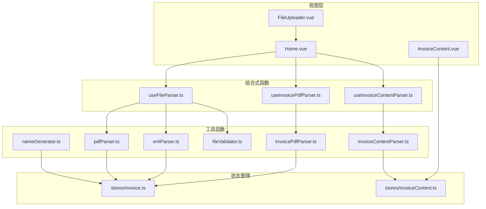
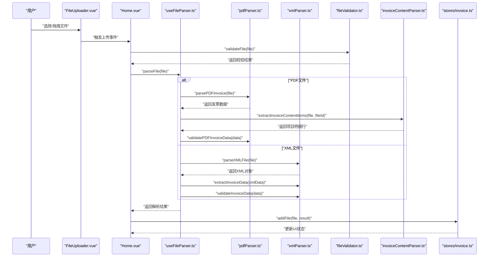
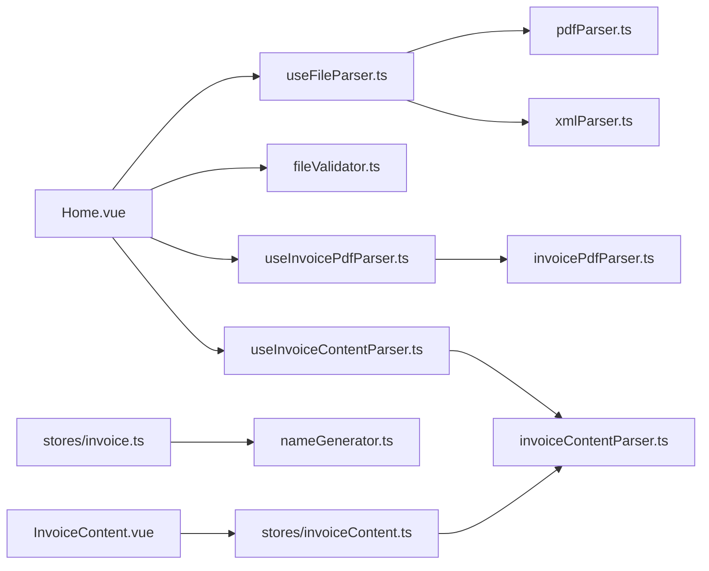

# 核心工具函数

<cite>
**本文引用的文件**
- [pdfParser.ts](file://src/utils/pdfParser.ts)
- [xmlParser.ts](file://src/utils/xmlParser.ts)
- [nameGenerator.ts](file://src/utils/nameGenerator.ts)
- [fileValidator.ts](file://src/utils/fileValidator.ts)
- [invoicePdfParser.ts](file://src/utils/invoicePdfParser.ts)
- [invoiceContentParser.ts](file://src/utils/invoiceContentParser.ts)
- [useFileParser.ts](file://src/composables/useFileParser.ts)
- [useInvoicePdfParser.ts](file://src/composables/useInvoicePdfParser.ts)
- [useInvoiceContentParser.ts](file://src/composables/useInvoiceContentParser.ts)
- [invoice.ts](file://src/stores/invoice.ts)
- [invoiceContent.ts](file://src/stores/invoiceContent.ts)
- [invoice.ts](file://src/stores/invoice.ts)
- [invoiceContent.ts](file://src/stores/invoiceContent.ts)
- [InvoiceContent.vue](file://src/views/InvoiceContent.vue)
- [InvoiceContentTable.vue](file://src/components/Invoice/InvoiceContentTable.vue)
- [FileUploader.vue](file://src/components/FileUploader.vue)
- [Home.vue](file://src/views/Home.vue)
- [package.json](file://package.json)
</cite>

## 更新摘要
**变更内容**
- 新增 invoiceContentParser 工具函数的详细说明
- 增强数字提取算法和格式验证机制的文档
- 添加复杂的数值字段分配策略说明
- 更新架构图以反映新的解析流程

## 目录
1. [简介](#简介)
2. [项目结构](#项目结构)
3. [核心组件](#核心组件)
4. [架构总览](#架构总览)
5. [详细组件分析](#详细组件分析)
6. [依赖关系分析](#依赖关系分析)
7. [性能考量](#性能考量)
8. [故障排查指南](#故障排查指南)
9. [结论](#结论)
10. [附录](#附录)

## 简介
本文件系统性地文档化了发票处理流程中的五大核心工具函数及其配套能力：
- pdfParser：基于 pdfjs-dist 的 PDF 文本提取与发票字段解析
- xmlParser：基于 fast-xml-parser 的 XML 结构解析与发票信息抽取
- nameGenerator：依据业务规则生成标准化文件名，并处理命名冲突
- fileValidator：校验上传文件的类型与完整性
- invoiceContentParser：基于坐标的发票内容（项目明细行）解析与数字提取

文档覆盖 API 签名、参数说明、返回值类型、异常处理机制，并结合实际调用场景给出使用示例，同时讨论性能瓶颈与优化方案（如 Web Worker 异步处理），为二次开发提供深入的技术参考。

## 项目结构
该应用采用前端单页应用架构，核心工具函数位于 src/utils 下，配合组合式函数（composables）与 Pinia 状态管理（stores）共同构成完整的发票处理流水线。上传组件负责接收用户文件，随后由解析组合式函数协调工具函数完成解析与验证，并将结果存入状态管理中供界面展示。

**图表来源**
- [Home.vue](file://src/views/Home.vue#L66-L216)
- [FileUploader.vue](file://src/components/FileUploader.vue#L1-L50)
- [InvoiceContent.vue](file://src/views/InvoiceContent.vue#L1-L120)
- [useFileParser.ts](file://src/composables/useFileParser.ts#L15-L108)
- [useInvoicePdfParser.ts](file://src/composables/useInvoicePdfParser.ts#L29-L172)
- [useInvoiceContentParser.ts](file://src/composables/useInvoiceContentParser.ts#L19-L178)
- [pdfParser.ts](file://src/utils/pdfParser.ts#L31-L242)
- [xmlParser.ts](file://src/utils/xmlParser.ts#L42-L140)
- [nameGenerator.ts](file://src/utils/nameGenerator.ts#L143-L250)
- [fileValidator.ts](file://src/utils/fileValidator.ts#L38-L106)
- [invoicePdfParser.ts](file://src/utils/invoicePdfParser.ts#L97-L348)
- [invoiceContentParser.ts](file://src/utils/invoiceContentParser.ts#L1-L1791)
- [invoice.ts](file://src/stores/invoice.ts#L63-L255)
- [invoiceContent.ts](file://src/stores/invoiceContent.ts#L62-L240)

**章节来源**
- [Home.vue](file://src/views/Home.vue#L1-L247)
- [FileUploader.vue](file://src/components/FileUploader.vue#L1-L50)
- [InvoiceContent.vue](file://src/views/InvoiceContent.vue#L1-L120)
- [useFileParser.ts](file://src/composables/useFileParser.ts#L1-L109)
- [useInvoicePdfParser.ts](file://src/composables/useInvoicePdfParser.ts#L1-L173)
- [useInvoiceContentParser.ts](file://src/composables/useInvoiceContentParser.ts#L1-L178)
- [pdfParser.ts](file://src/utils/pdfParser.ts#L1-L243)
- [xmlParser.ts](file://src/utils/xmlParser.ts#L1-L141)
- [nameGenerator.ts](file://src/utils/nameGenerator.ts#L1-L250)
- [fileValidator.ts](file://src/utils/fileValidator.ts#L1-L107)
- [invoicePdfParser.ts](file://src/utils/invoicePdfParser.ts#L1-L349)
- [invoiceContentParser.ts](file://src/utils/invoiceContentParser.ts#L1-L1791)
- [invoice.ts](file://src/stores/invoice.ts#L1-L256)
- [invoiceContent.ts](file://src/stores/invoiceContent.ts#L1-L241)

## 核心组件
本节概述五大工具函数的功能定位与职责边界：
- pdfParser：面向通用发票文本解析，提供 PDF 文本提取、发票字段抽取与数据验证
- xmlParser：面向结构化 XML 发票数据解析，提供 XML 文本解析与发票字段抽取
- nameGenerator：面向文件命名标准化，提供命名规则、字段格式化与冲突处理
- fileValidator：面向上传文件的前置校验，提供格式、大小与数量限制
- invoiceContentParser：面向发票内容（项目明细行）解析，提供基于坐标的表格识别与数字提取

**章节来源**
- [pdfParser.ts](file://src/utils/pdfParser.ts#L28-L242)
- [xmlParser.ts](file://src/utils/xmlParser.ts#L39-L140)
- [nameGenerator.ts](file://src/utils/nameGenerator.ts#L62-L250)
- [fileValidator.ts](file://src/utils/fileValidator.ts#L35-L106)
- [invoiceContentParser.ts](file://src/utils/invoiceContentParser.ts#L1-L1791)

## 架构总览
以下序列图展示了从用户上传到解析入库的关键流程，涵盖文件验证、解析、验证与存储等步骤。

**图表来源**
- [Home.vue](file://src/views/Home.vue#L97-L155)
- [useFileParser.ts](file://src/composables/useFileParser.ts#L22-L66)
- [pdfParser.ts](file://src/utils/pdfParser.ts#L184-L192)
- [xmlParser.ts](file://src/utils/xmlParser.ts#L42-L85)
- [fileValidator.ts](file://src/utils/fileValidator.ts#L57-L72)
- [invoiceContentParser.ts](file://src/utils/invoiceContentParser.ts#L90-L167)
- [invoice.ts](file://src/stores/invoice.ts#L106-L151)

## 详细组件分析

### pdfParser 工具函数
pdfParser 是发票处理流程中最核心的 PDF 文本与字段解析工具，提供以下能力：
- PDF 文本提取：读取 File 对象为 ArrayBuffer，使用 pdfjs-dist 加载 PDF 并遍历页面提取文本
- 发票字段抽取：基于正则表达式从文本中提取发票类型、发票号码、开票日期、购买方/销售方名称、价税合计等关键字段
- 数据验证：对抽取结果进行基本字段完整性校验
- 异常处理：统一捕获并抛出带明确错误信息的异常

API 签名与说明
- extractTextFromPDF(file: File): Promise<string>
  - 功能：从 PDF 文件中提取全部文本
  - 参数：file - File 对象
  - 返回：Promise<string> - 完整文本内容
  - 异常：当 PDF 加载或文本提取失败时抛出错误
- extractInvoiceDataFromText(text: string): InvoiceData
  - 功能：从完整文本中抽取发票关键字段
  - 参数：text - 完整文本字符串
  - 返回：InvoiceData - 包含发票类型、发票号码、购买方/销售方名称、价税合计、开票日期等
  - 异常：当字段抽取过程中出现异常时抛出错误
- parsePDFInvoice(file: File): Promise<InvoiceData>
  - 功能：一次性完成 PDF 文本提取与发票字段抽取
  - 参数：file - File 对象
  - 返回：Promise<InvoiceData> - 抽取的发票数据
  - 异常：当任一步骤失败时抛出错误
- validatePDFInvoiceData(data: InvoiceData): ValidationResult
  - 功能：验证发票数据的基本完整性（购买方名称与金额）
  - 参数：data - InvoiceData
  - 返回：ValidationResult - { valid: boolean, errors: string[], data?: InvoiceData }
  - 异常：无显式抛出，内部收集错误信息
- readFileAsArrayBuffer(file: File): Promise<ArrayBuffer>
  - 功能：将 File 读取为 ArrayBuffer
  - 参数：file - File 对象
  - 返回：Promise<ArrayBuffer>
  - 异常：FileReader 读取失败时拒绝

数据模型
- InvoiceData 接口
  - 字段：invoiceType, invoiceCode, purchaserName, sellerName, totalAmount, issueDate
- ValidationResult 接口
  - 字段：valid, errors, data?

使用示例（路径引用）
- 在 Home.vue 中调用：[Home.vue](file://src/views/Home.vue#L134-L140)
- 在 useFileParser.ts 中封装调用：[useFileParser.ts](file://src/composables/useFileParser.ts#L27-L37)

异常处理机制
- 统一 try/catch 包裹关键步骤，捕获错误后抛出包含具体错误信息的 Error 实例
- 开发模式下会输出详细日志便于调试

复杂度与性能
- 文本提取复杂度近似 O(P×W)，其中 P 为页数，W 为每页平均单词数
- 正则匹配在文本规模较大时可能成为瓶颈，建议结合 invoicePdfParser 的快速解析策略

**章节来源**
- [pdfParser.ts](file://src/utils/pdfParser.ts#L31-L242)
- [Home.vue](file://src/views/Home.vue#L134-L140)
- [useFileParser.ts](file://src/composables/useFileParser.ts#L22-L66)

### xmlParser 工具函数
xmlParser 负责解析结构化的 XML 发票数据，提供以下能力：
- XML 文件读取与解析：将 File 读取为文本后交由 fast-xml-parser 解析为对象
- 发票字段抽取：从解析后的对象中提取发票类型、发票号码、购买方/销售方名称、价税合计、开票日期等字段
- 数据验证：对必填字段进行完整性校验
- 异常处理：统一捕获并抛出带明确错误信息的异常

API 签名与说明
- parseXMLFile(file: File): Promise<any>
  - 功能：解析 XML 文件为对象
  - 参数：file - File 对象
  - 返回：Promise<any> - 解析后的 XML 对象
  - 异常：文件读取或解析失败时抛出错误
- parseXMLText(xmlText: string): any
  - 功能：解析 XML 文本为对象
  - 参数：xmlText - XML 文本字符串
  - 返回：any - 解析后的对象
  - 异常：解析失败时抛出错误
- extractInvoiceData(xmlData: any): InvoiceData
  - 功能：从 XML 对象中抽取发票关键字段
  - 参数：xmlData - 解析后的 XML 对象
  - 返回：InvoiceData - 抽取的发票数据
  - 异常：字段抽取异常时抛出错误
- validateInvoiceData(data: InvoiceData): ValidationResult
  - 功能：验证发票数据的完整性（发票类型、购买方名称、价税合计）
  - 参数：data - InvoiceData
  - 返回：ValidationResult - { valid: boolean, errors: string[] }
  - 异常：无显式抛出
- readFileAsText(file: File): Promise<string>
  - 功能：将 File 读取为文本
  - 参数：file - File 对象
  - 返回：Promise<string>
  - 异常：FileReader 读取失败时拒绝

使用示例（路径引用）
- 在 useFileParser.ts 中封装调用：[useFileParser.ts](file://src/composables/useFileParser.ts#L38-L49)

异常处理机制
- 统一 try/catch 包裹关键步骤，捕获错误后抛出包含具体错误信息的 Error 实例

复杂度与性能
- 解析复杂度取决于 XML 结构与大小，fast-xml-parser 通常具有较高性能
- 建议在大规模 XML 处理时关注内存占用与解析超时

**章节来源**
- [xmlParser.ts](file://src/utils/xmlParser.ts#L42-L140)
- [useFileParser.ts](file://src/composables/useFileParser.ts#L38-L49)

### nameGenerator 工具函数
nameGenerator 提供标准化文件名生成与冲突处理能力，满足不同业务场景的命名需求：
- 命名规则：支持多种模板（如"购方名称_金额"、"发票类型_购方名称_金额"等），可通过 setCurrentRule 切换
- 字段格式化：对购方名称、发票类型、金额、开票日期、发票号码、销售方名称等字段进行格式化处理
- 冲突处理：检测现有文件名集合，自动追加序号避免重复
- 批量生成：支持批量输入发票数据，统一生成并处理冲突

API 签名与说明
- generateFileName(invoiceData: InvoiceData, originalExtension: string): string
  - 功能：根据当前命名规则生成文件名
  - 参数：invoiceData - 发票数据；originalExtension - 原始扩展名
  - 返回：string - 生成的文件名
  - 异常：规则不存在或字段缺失时抛出错误
- handleFileNameConflict(fileName: string, existingNames: string[]): string
  - 功能：处理文件名冲突，追加序号
  - 参数：fileName - 待检查的文件名；existingNames - 现有文件名集合
  - 返回：string - 最终文件名
  - 异常：无显式抛出
- generateFileNames(invoiceDataList: InvoiceData[]): GenerateResult[]
  - 功能：批量生成文件名并处理冲突
  - 参数：invoiceDataList - 发票数据数组
  - 返回：GenerateResult[] - 每项包含 success、fileName 或 error
  - 异常：无显式抛出
- setCurrentRule(ruleName: string): void
  - 功能：切换当前命名规则
  - 参数：ruleName - 规则名称
  - 返回：void
  - 异常：规则不存在时抛出错误
- getCurrentRule(): string
  - 功能：获取当前规则名称
  - 参数：无
  - 返回：string
  - 异常：无
- getAvailableRules(): string[]
  - 功能：获取所有可用规则名称
  - 参数：无
  - 返回：string[]
  - 异常：无

数据模型
- NamingRule 接口：template, separator, fields
- InvoiceData 接口：扩展 originalFileName 字段
- GenerateResult 接口：success, fileName?, error?, originalFileName

使用示例（路径引用）
- 在 stores/invoice.ts 中调用：[invoice.ts](file://src/stores/invoice.ts#L118-L128)

异常处理机制
- 规则切换与生成阶段捕获并抛出错误，便于上层处理
- 冲突处理内部循环追加序号，保证最终生成唯一文件名

复杂度与性能
- 格式化与冲突处理均为线性复杂度，适合大批量处理
- 建议在生成前对字段进行预处理，减少后续格式化成本

**章节来源**
- [nameGenerator.ts](file://src/utils/nameGenerator.ts#L143-L250)
- [invoice.ts](file://src/stores/invoice.ts#L118-L128)

### fileValidator 工具函数
fileValidator 提供上传文件的前置校验，确保后续解析流程的稳定性：
- 支持格式：PDF 与 XML（包括 text/xml 与 application/xml）
- 大小限制：单文件最大 10MB
- 数量限制：单次最多 100 个文件
- 单文件校验：validateFile(file) 返回 { valid, errors }
- 批量校验：validateFiles(files) 返回 { valid, results, validFiles, invalidCount }

API 签名与说明
- SUPPORTED_FORMATS: 常量对象，包含 PDF、XML 及其替代 MIME 类型
- MAX_FILE_SIZE: 常量，10MB
- MAX_FILE_COUNT: 常量，100
- validateFileFormat(file: File): boolean
  - 功能：校验文件类型是否受支持
  - 参数：file - File 对象
  - 返回：boolean
  - 异常：无
- validateFileSize(file: File): boolean
  - 功能：校验文件大小是否在限制内
  - 参数：file - File 对象
  - 返回：boolean
  - 异常：无
- validateFile(file: File): ValidationResult
  - 功能：综合校验文件格式与大小
  - 参数：file - File 对象
  - 返回：ValidationResult - { valid, errors }
  - 异常：无
- validateFiles(files: File[]): FilesValidationResult
  - 功能：批量校验文件
  - 参数：files - File 数组
  - 返回：FilesValidationResult - { valid, results, validFiles, invalidCount }
  - 异常：无

使用示例（路径引用）
- 在 Home.vue 中调用：[Home.vue](file://src/views/Home.vue#L100-L106)

异常处理机制
- 返回 ValidationResult/FilesValidationResult，由调用方决定错误处理策略
- 批量校验时记录无效文件数量，便于统计与提示

复杂度与性能
- 单文件校验为 O(1)，批量校验为 O(n)
- 建议在上传前进行校验，避免无效文件进入解析流程

**章节来源**
- [fileValidator.ts](file://src/utils/fileValidator.ts#L38-L106)
- [Home.vue](file://src/views/Home.vue#L100-L106)

### invoicePdfParser 工具函数（高级版）
invoicePdfParser 提供更精细的发票字段提取与验证能力，适用于更复杂的发票格式：
- 快速解析策略：先解析前若干页，若未命中关键字段再继续解析剩余页面
- 多模式匹配：针对发票号码、金额、税额、价税合计、税率等字段设计多组正则模式
- 税率提取：支持多税率识别与有效性校验
- 数据验证：对发票号码、金额、税额、价税合计、税率范围进行严格校验

API 签名与说明
- extractTextFromPDF(file: File): Promise<string>
  - 功能：提取 PDF 文本，采用快速解析策略
  - 参数：file - File 对象
  - 返回：Promise<string>
  - 异常：解析失败时抛出错误
- extractInvoiceFields(text: string): InvoiceFieldsResult
  - 功能：从文本中提取发票字段
  - 参数：text - 文本字符串
  - 返回：InvoiceFieldsResult - 包含发票号码、类型、金额、税额、价税合计、税率等
  - 异常：提取失败时抛出错误
- extractInvoiceNumber(text: string): string | undefined
- extractInvoiceType(text: string): string | undefined
- extractAmount(text: string): string | undefined
- extractTaxAmount(text: string): string | undefined
- extractTotalAmount(text: string): string | undefined
- extractMultipleTaxRates(text: string): TaxRate[]
- validateInvoiceData(data: InvoiceFieldsResult): ValidationResult
  - 功能：验证发票字段的合理性与完整性
  - 参数：data - InvoiceFieldsResult
  - 返回：ValidationResult
  - 异常：无
- readFileAsArrayBuffer(file: File): Promise<ArrayBuffer>
  - 功能：读取文件为 ArrayBuffer
  - 参数：file - File 对象
  - 返回：Promise<ArrayBuffer>
  - 异常：读取失败时拒绝

使用示例（路径引用）
- 在 useInvoicePdfParser.ts 中调用：[useInvoicePdfParser.ts](file://src/composables/useInvoicePdfParser.ts#L37-L91)

异常处理机制
- 统一 try/catch 包裹关键步骤，捕获错误后抛出包含具体错误信息的 Error 实例
- 生产环境仅保留必要日志，避免泄露敏感信息

复杂度与性能
- 快速解析策略可显著降低小发票解析时间
- 多正则匹配在大文本中可能成为瓶颈，建议结合缓存与分页策略

**章节来源**
- [invoicePdfParser.ts](file://src/utils/invoicePdfParser.ts#L97-L348)
- [useInvoicePdfParser.ts](file://src/composables/useInvoicePdfParser.ts#L37-L91)

### invoiceContentParser 工具函数（新增）
invoiceContentParser 是发票内容（项目明细行）解析的核心工具，提供基于坐标的表格识别与数字提取能力：

#### 核心架构与工作流程
工具采用 ETL 流水线架构，分为四个层次：
- **提取层（Extraction）**：复用 invoicePdfParser 的文本提取能力
- **表格识别层（Table Detection）**：识别表格区域和列映射
- **行提取层（Row Extraction）**：提取项目明细行
- **校验层（Validation）**：格式校验与数据验证

#### 数字提取算法与格式验证机制
**复杂数字提取算法**
- **连接数值拆分**：智能识别并拆分连接的金额和税额，如 "9.080.82" → ["9.08", "0.82"]
- **多税率识别**：支持多种税率格式（13%、9%、6%、3%、1%、0%）的识别与验证
- **智能拆分策略**：通过枚举所有可能的拆分组合，基于数学关系和业务规则选择最优解
- **格式验证**：严格的数字格式验证，排除无效格式（如 "55."、"0055"、"00.5"）

**启发式数值分配策略**
- **基于数值特征的智能分配**：根据数值大小、小数位数等特征判断字段类型
- **标准顺序分配**：按发票标准顺序（数量 → 单价 → 金额 → 税额）进行分配
- **动态容差调整**：根据检测到的列数量自适应调整匹配容差
- **位置优先级**：优先使用坐标匹配，其次使用启发式分配

**格式验证机制**
- **数字格式验证**：`isValidNumberFormat()` 函数验证数字字符串的有效性
- **数学关系验证**：验证数量 × 单价 ≈ 金额，税额 ≈ 金额 × 税率
- **业务规则验证**：基于发票业务逻辑的合理性检查
- **容差控制**：使用动态容差控制，避免浮点数精度问题

API 签名与说明
- extractInvoiceContentItems(file: File, fileId: string): Promise<InvoiceContentItem[]>
  - 功能：从PDF文件中提取发票内容项目行
  - 参数：file - PDF文件；fileId - 文件唯一标识
  - 返回：Promise<InvoiceContentItem[]> - 项目行数组
  - 异常：解析失败时抛出错误
- extractTextWithCoordinates(file: File): Promise<ReconstructedPage[]>
  - 功能：提取带坐标的文本流
  - 参数：file - File 对象
  - 返回：Promise<ReconstructedPage[]> - 重组后的页面数据
  - 异常：PDF 加载失败时抛出错误
- detectTableRegions(pages: ReconstructedPage[]): (TableRegion | null)[]
  - 功能：检测所有页面的表格区域
  - 参数：pages - 重组后的页面数据
  - 返回：(TableRegion | null)[] - 表格区域数组
  - 异常：无显式抛出
- extractRawContentRows(page: ReconstructedPage, region: TableRegion): RawContentRow[]
  - 功能：从页面中提取原始内容行
  - 参数：page - 页面数据；region - 表格区域
  - 返回：RawContentRow[] - 原始内容行数组
  - 异常：无显式抛出
- parseContentRow(row: RawContentRow, columnMapping: ColumnMapping, pageWidth: number, meta: ParseMeta): InvoiceContentItem
  - 功能：解析单行内容为项目对象
  - 参数：row - 原始内容行；columnMapping - 列映射；pageWidth - 页面宽度；meta - 元数据
  - 返回：InvoiceContentItem - 解析后的项目对象
  - 异常：解析失败时抛出错误

使用示例（路径引用）
- 在 useInvoiceContentParser.ts 中调用：[useInvoiceContentParser.ts](file://src/composables/useInvoiceContentParser.ts#L69)
- 在 InvoiceContent.vue 中展示：[InvoiceContent.vue](file://src/views/InvoiceContent.vue#L60-L120)

异常处理机制
- 统一 try/catch 包裹关键步骤，捕获错误后抛出包含具体错误信息的 Error 实例
- 开发模式下输出详细的调试日志
- 生产环境仅保留必要的错误信息

复杂度与性能
- **整体复杂度**：O(N log N + M)，其中 N 为文本项数量，M 为项目行数量
- **表格识别**：基于坐标分析和列映射，避免复杂的表格结构识别
- **数字提取**：通过正则表达式和数学验证，确保准确性
- **性能优化**：使用自适应容差和启发式分配，平衡准确性和性能

**章节来源**
- [invoiceContentParser.ts](file://src/utils/invoiceContentParser.ts#L1-L1791)
- [useInvoiceContentParser.ts](file://src/composables/useInvoiceContentParser.ts#L19-L178)
- [InvoiceContent.vue](file://src/views/InvoiceContent.vue#L1-L120)

## 依赖关系分析
- 组件依赖
  - Home.vue 依赖 useFileParser.ts 与 fileValidator.ts，负责上传校验与解析调度
  - FileUploader.vue 作为上传入口，触发 Home.vue 的处理逻辑
  - InvoiceContent.vue 依赖 useInvoiceContentParser.ts 与 stores/invoiceContent.ts，负责内容展示
- 组合式函数依赖
  - useFileParser.ts 依赖 pdfParser.ts、xmlParser.ts 与 fileValidator.ts
  - useInvoicePdfParser.ts 依赖 invoicePdfParser.ts 与 stores/invoice.ts
  - useInvoiceContentParser.ts 依赖 invoiceContentParser.ts 与 stores/invoiceContent.ts
- 工具函数依赖
  - pdfParser.ts 依赖 pdfjs-dist 与 pdfjs-dist 的 worker 资源
  - xmlParser.ts 依赖 fast-xml-parser
  - invoiceContentParser.ts 依赖 pdfjs-dist 和复杂的坐标分析算法
  - nameGenerator.ts 为纯逻辑工具，无外部依赖
  - fileValidator.ts 为纯逻辑工具，无外部依赖
- 状态管理依赖
  - stores/invoice.ts 依赖 nameGenerator.ts 生成文件名
  - stores/invoiceContent.ts 保存 invoiceContentParser 的解析结果

**图表来源**
- [Home.vue](file://src/views/Home.vue#L80-L91)
- [InvoiceContent.vue](file://src/views/InvoiceContent.vue#L1-L120)
- [useFileParser.ts](file://src/composables/useFileParser.ts#L5-L6)
- [useInvoicePdfParser.ts](file://src/composables/useInvoicePdfParser.ts#L6-L11)
- [useInvoiceContentParser.ts](file://src/composables/useInvoiceContentParser.ts#L5-L7)
- [pdfParser.ts](file://src/utils/pdfParser.ts#L4-L8)
- [xmlParser.ts](file://src/utils/xmlParser.ts#L4)
- [invoicePdfParser.ts](file://src/utils/invoicePdfParser.ts#L5-L6)
- [invoiceContentParser.ts](file://src/utils/invoiceContentParser.ts#L11-L13)
- [invoice.ts](file://src/stores/invoice.ts#L6)
- [invoiceContent.ts](file://src/stores/invoiceContent.ts#L1-L5)

**章节来源**
- [package.json](file://package.json#L12-L22)
- [Home.vue](file://src/views/Home.vue#L80-L91)
- [InvoiceContent.vue](file://src/views/InvoiceContent.vue#L1-L120)
- [useFileParser.ts](file://src/composables/useFileParser.ts#L5-L6)
- [useInvoicePdfParser.ts](file://src/composables/useInvoicePdfParser.ts#L6-L11)
- [useInvoiceContentParser.ts](file://src/composables/useInvoiceContentParser.ts#L6-L7)
- [pdfParser.ts](file://src/utils/pdfParser.ts#L4-L8)
- [xmlParser.ts](file://src/utils/xmlParser.ts#L4)
- [invoicePdfParser.ts](file://src/utils/invoicePdfParser.ts#L5-L6)
- [invoiceContentParser.ts](file://src/utils/invoiceContentParser.ts#L11-L13)
- [invoice.ts](file://src/stores/invoice.ts#L6)
- [invoiceContent.ts](file://src/stores/invoiceContent.ts#L1-L5)

## 性能考量
- PDF 解析耗时
  - 大型 PDF 的文本提取与正则匹配可能成为性能瓶颈
  - invoicePdfParser 采用"快速解析"策略（先解析前若干页），在大多数情况下可显著提升响应速度
  - invoiceContentParser 通过坐标分析和启发式算法，避免复杂的表格结构识别
- 并发与批处理
  - useFileParser.ts 与 useInvoicePdfParser.ts 均采用分批并发处理（批次大小为 10），平衡吞吐与资源占用
  - useInvoiceContentParser.ts 采用 10 个文件的批处理大小，适合内容解析的高复杂度需求
- 异步与用户体验
  - 通过进度反馈与 Modal 展示，提升用户感知性能
  - 开发模式下提供详细的性能指标和调试信息
- 优化建议
  - Web Worker 异步处理：将 PDF 文本提取与 XML 解析放入 Web Worker，避免阻塞主线程
  - 预取与缓存：对常用发票模板的正则与字段映射进行缓存
  - 分页与流式处理：对超大文件采用分页或流式处理策略
  - 压缩与去重：在生成文件名前对字段进行规范化与去重处理
  - 数字提取优化：使用更高效的正则表达式和数学验证算法

## 故障排查指南
- PDF 解析失败
  - 检查 PDF 是否加密或损坏
  - 确认 pdfjs-dist 的 worker 资源加载正常
  - 查看控制台错误日志，定位具体失败步骤
- XML 解析失败
  - 检查 XML 文档编码与声明
  - 确认 fast-xml-parser 的配置是否符合预期
- 文件名生成异常
  - 检查命名规则是否存在
  - 确认必填字段是否为空
- 文件校验失败
  - 检查文件类型与大小是否超出限制
  - 确认文件数量是否超过上限
- 内容解析失败（新增）
  - 检查发票格式是否符合标准
  - 确认表格区域识别是否正确
  - 查看数字提取和格式验证的日志输出
  - 验证坐标分析和列映射的准确性

**章节来源**
- [pdfParser.ts](file://src/utils/pdfParser.ts#L61-L64)
- [xmlParser.ts](file://src/utils/xmlParser.ts#L59-L61)
- [nameGenerator.ts](file://src/utils/nameGenerator.ts#L146-L148)
- [fileValidator.ts](file://src/utils/fileValidator.ts#L60-L66)
- [invoiceContentParser.ts](file://src/utils/invoiceContentParser.ts#L163-L166)

## 结论
五大核心工具函数构成了发票处理流程的基础设施：pdfParser 与 xmlParser 提供稳定的解析能力，invoiceContentParser 提供精确的项目明细行解析，nameGenerator 确保文件命名的规范性与唯一性，fileValidator 保障上传质量。通过组合式函数与状态管理的协同，系统实现了从上传到解析再到存储的完整闭环。建议在生产环境中引入 Web Worker 与缓存策略，进一步提升性能与用户体验。

## 附录
- 术语表
  - PDF：便携式文档格式
  - XML：可扩展标记语言
  - 正则表达式：用于匹配文本模式的规则
  - Web Worker：在后台线程执行脚本的机制
  - ETL：提取（Extract）、转换（Transform）、加载（Load）的缩写
- 相关文件
  - 组件与视图：FileUploader.vue、Home.vue、InvoiceContent.vue
  - 组合式函数：useFileParser.ts、useInvoicePdfParser.ts、useInvoiceContentParser.ts
  - 状态管理：stores/invoice.ts、stores/invoiceContent.ts
  - 依赖：package.json