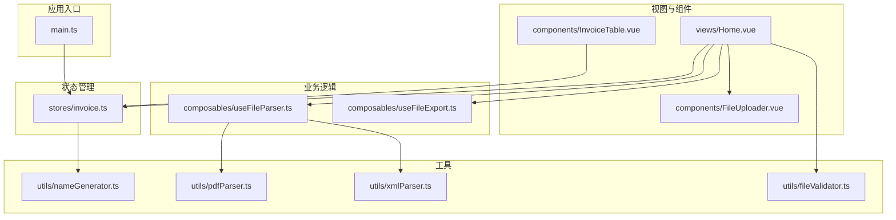
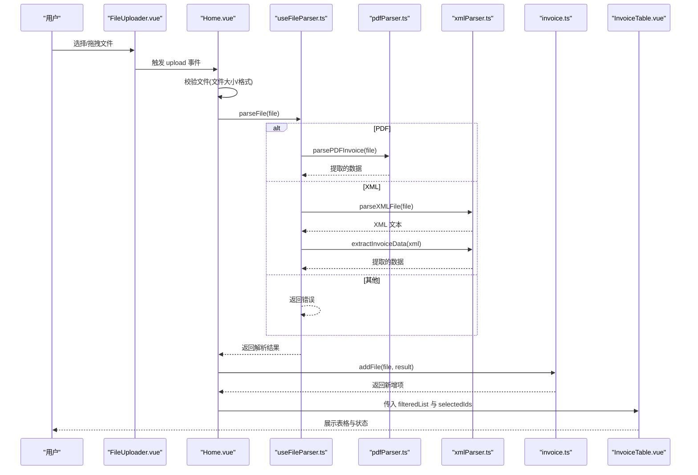
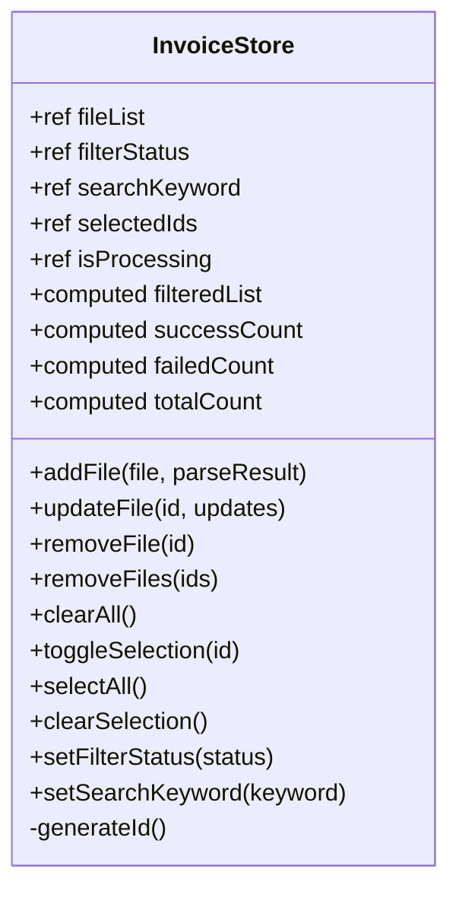
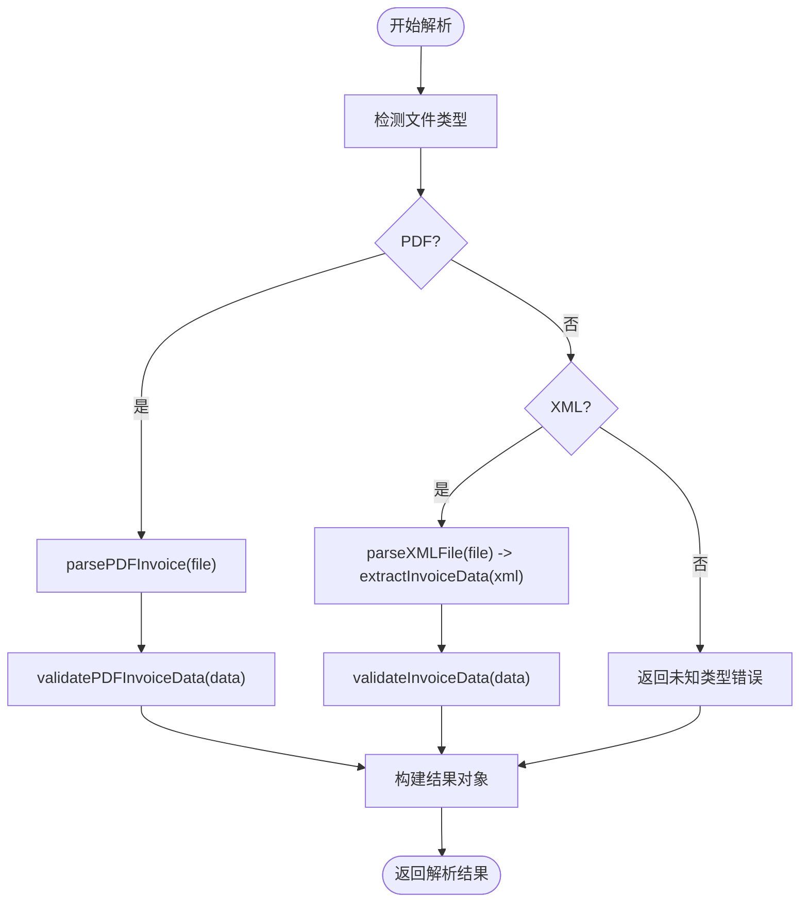
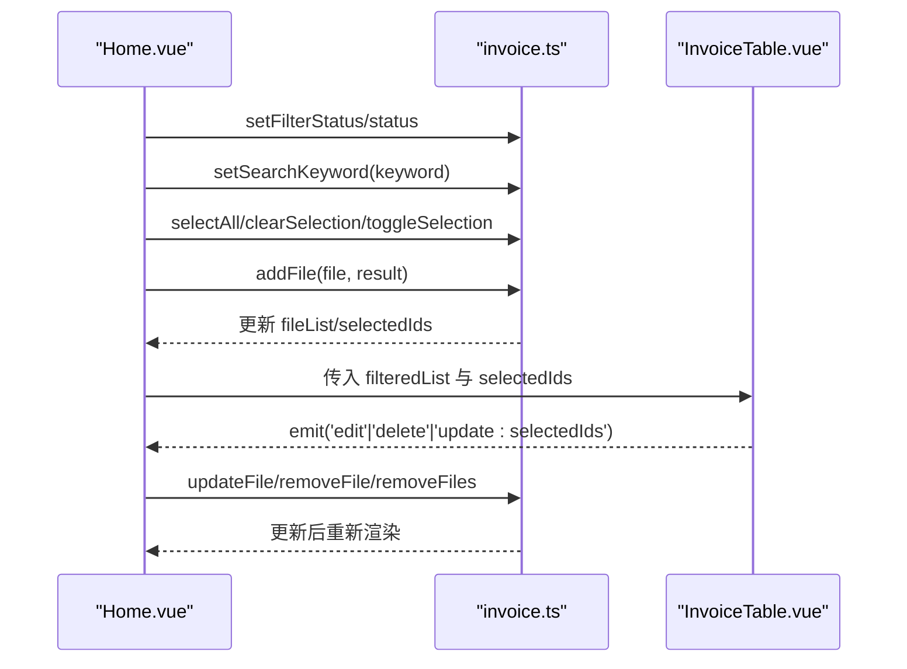
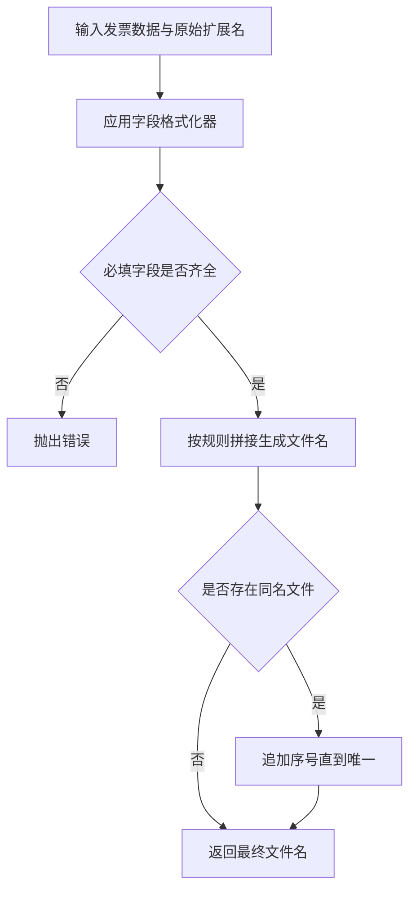
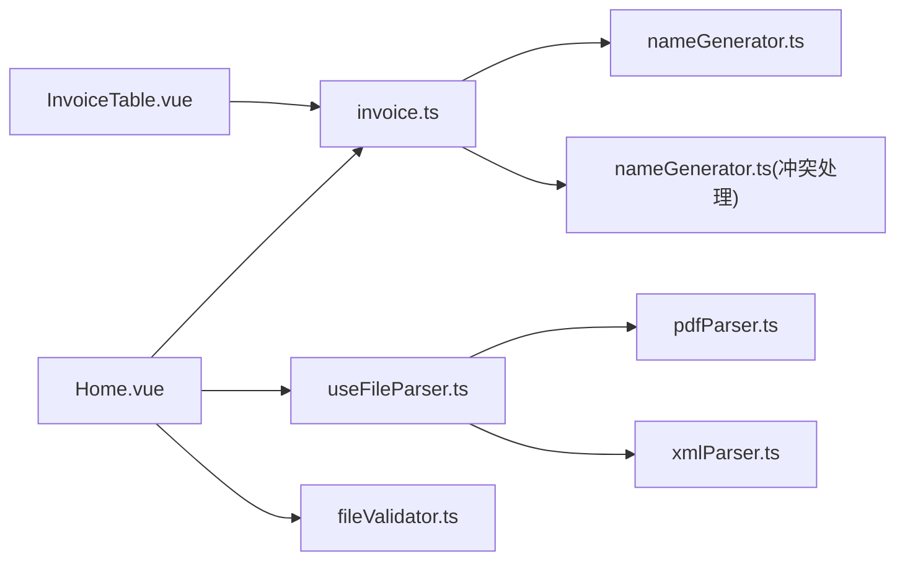

# 状态管理

<cite>
**本文引用的文件**
- [src/stores/invoice.ts](file://src/stores/invoice.ts)
- [src/composables/useFileParser.ts](file://src/composables/useFileParser.ts)
- [src/views/Home.vue](file://src/views/Home.vue)
- [src/components/InvoiceTable.vue](file://src/components/InvoiceTable.vue)
- [src/utils/nameGenerator.ts](file://src/utils/nameGenerator.ts)
- [src/utils/pdfParser.ts](file://src/utils/pdfParser.ts)
- [src/utils/xmlParser.ts](file://src/utils/xmlParser.ts)
- [src/utils/fileValidator.ts](file://src/utils/fileValidator.ts)
- [src/composables/useFileExport.ts](file://src/composables/useFileExport.ts)
- [src/components/FileUploader.vue](file://src/components/FileUploader.vue)
- [src/main.ts](file://src/main.ts)
</cite>

## 更新摘要
**变更内容**
- 将发票状态管理从 JavaScript 迁移至 TypeScript，定义了完整的接口和类型
- 更新了文档中所有相关文件的扩展名从 `.js` 到 `.ts`
- 详细说明了 `InvoiceItem`、`ParseResult` 和 `InvoiceStore` 接口的类型定义
- 更新了架构总览和详细组件分析中的代码示例以反映 TypeScript 类型

## 目录
1. [简介](#简介)
2. [项目结构](#项目结构)
3. [核心组件](#核心组件)
4. [架构总览](#架构总览)
5. [详细组件分析](#详细组件分析)
6. [依赖关系分析](#依赖关系分析)
7. [性能考量](#性能考量)
8. [故障排查指南](#故障排查指南)
9. [结论](#结论)

## 简介
本文件围绕 Pinia 状态管理中的发票 Store 设计进行深入说明，重点聚焦于 src/stores/invoice.ts 中的发票状态管理模块。该 Store 作为应用的“单一数据源”，集中管理所有发票文件的状态与行为，包括文件列表、筛选与搜索、选择状态、处理状态以及计算属性（如成功/失败计数）。同时，文档阐述 Store 的数据模型字段、核心方法（添加、更新、删除、清空、选择控制、过滤设置）如何与 useFileParser.ts 解析流程以及 UI 组件（如 InvoiceTable.vue）协同工作，形成完整且响应式的数据生命周期。

## 项目结构
本项目采用“按功能分层”的组织方式：
- stores：集中存放状态管理模块（本篇重点：发票 Store）
- composables：封装可复用的业务逻辑（如文件解析、导出）
- utils：提供底层工具（如 PDF/XML 解析、文件名生成、文件校验）
- views/components：视图与组件层，负责展示与交互
- main.ts：应用入口，注册 Pinia

图表来源
- [src/main.ts](file://src/main.ts#L1-L12)
- [src/stores/invoice.ts](file://src/stores/invoice.ts#L1-L256)
- [src/composables/useFileParser.ts](file://src/composables/useFileParser.ts#L1-L109)
- [src/composables/useFileExport.ts](file://src/composables/useFileExport.ts#L1-L80)
- [src/utils/nameGenerator.ts](file://src/utils/nameGenerator.ts#L1-L250)
- [src/utils/pdfParser.ts](file://src/utils/pdfParser.ts#L1-L227)
- [src/utils/xmlParser.ts](file://src/utils/xmlParser.ts#L1-L118)
- [src/utils/fileValidator.ts](file://src/utils/fileValidator.ts#L1-L90)
- [src/views/Home.vue](file://src/views/Home.vue#L1-L236)
- [src/components/InvoiceTable.vue](file://src/components/InvoiceTable.vue#L1-L174)
- [src/components/FileUploader.vue](file://src/components/FileUploader.vue#L1-L50)

章节来源
- [src/main.ts](file://src/main.ts#L1-L12)

## 核心组件
本节聚焦发票 Store 的职责与能力：
- 单一数据源：集中管理发票文件列表、筛选状态、搜索关键字、选中项、处理状态等
- 计算属性：基于原始数据派生出筛选后的列表、成功/失败/总数等统计
- 核心方法：添加文件、更新信息、删除单个/批量、清空、切换选中、全选、清空选中、设置过滤状态与搜索词
- 数据模型：每条记录包含 id、originalFile、originalFileName、invoiceType、purchaserName、totalAmount、newFileName、status、errorMessage 等字段

章节来源
- [src/stores/invoice.ts](file://src/stores/invoice.ts#L1-L256)

## 架构总览
下面的序列图展示了从用户上传到 Store 更新再到 UI 响应的整体流程。

图表来源
- [src/components/FileUploader.vue](file://src/components/FileUploader.vue#L1-L50)
- [src/views/Home.vue](file://src/views/Home.vue#L1-L236)
- [src/composables/useFileParser.ts](file://src/composables/useFileParser.ts#L1-L109)
- [src/utils/pdfParser.ts](file://src/utils/pdfParser.ts#L1-L227)
- [src/utils/xmlParser.ts](file://src/utils/xmlParser.ts#L1-L118)
- [src/stores/invoice.ts](file://src/stores/invoice.ts#L1-L256)
- [src/components/InvoiceTable.vue](file://src/components/InvoiceTable.vue#L1-L174)

## 详细组件分析

### 发票 Store（src/stores/invoice.ts）
- 状态
  - fileList：发票文件记录数组
  - filterStatus：筛选状态（all/pending/success/failed）
  - searchKeyword：搜索关键词
  - selectedIds：选中项 id 列表
  - isProcessing：整体处理状态（用于 UI 进度提示）
- 计算属性
  - filteredList：按状态与关键词过滤后的列表
  - successCount/failedCount/totalCount：基于状态统计
- 核心方法
  - addFile(file, parseResult)：根据解析结果生成新文件名并写入状态；若解析失败则记录错误信息
  - updateFile(id, updates)：更新指定记录；当更新购买方名称或金额时，自动重新生成新文件名并修正状态
  - removeFile(id)/removeFiles(ids)：删除单个或批量；同步从选中列表移除
  - clearAll()：清空列表与选中项
  - toggleSelection(id)/selectAll()/clearSelection()：选中控制
  - setFilterStatus(status)/setSearchKeyword(keyword)：设置筛选与搜索
  - generateId()：生成唯一 id

图表来源
- [src/stores/invoice.ts](file://src/stores/invoice.ts#L1-L256)

章节来源
- [src/stores/invoice.ts](file://src/stores/invoice.ts#L1-L256)

### 数据模型与字段语义
在 TypeScript 迁移后，发票 Store 定义了完整的接口来确保类型安全：

- **InvoiceItem 接口**：定义了发票记录的数据模型
  - id：记录唯一标识 (string)
  - originalFile：原始文件对象 (File)
  - originalFileName：原始文件名 (string)
  - invoiceType：发票类型（由解析结果提供）(string)
  - purchaserName：购买方名称（用于生成新文件名与编辑）(string)
  - totalAmount：价税合计（用于生成新文件名与编辑）(string)
  - newFileName：生成的新文件名（由 nameGenerator 生成）(string)
  - status：处理状态（pending/success/failed）('pending' | 'success' | 'failed')
  - errorMessage：失败原因（当解析或生成文件名失败时记录）(string)

- **ParseResult 接口**：定义了解析结果的结构
  - success：解析是否成功 (boolean)
  - data：解析出的发票数据 (InvoiceData | null)
  - errors：错误信息数组 (string[])

- **InvoiceStore 接口**：定义了 Store 的完整类型
  - 状态：使用 Ref<T> 明确声明响应式引用类型
  - 计算属性：使用 ComputedRef<T> 明确声明计算属性类型
  - 方法：所有方法都有明确的参数和返回值类型

章节来源
- [src/stores/invoice.ts](file://src/stores/invoice.ts#L1-L256)
- [src/utils/nameGenerator.ts](file://src/utils/nameGenerator.ts#L1-L250)

### 解析流程与 Store 的集成（useFileParser.ts）
- 解析策略：根据文件后缀判断 PDF 或 XML，分别调用对应解析器
- 并发与批处理：按批次并发解析，实时更新进度
- 结果结构：包含 success、data、errors、type 字段，供 Store 决策
- Store 接入点：Home.vue 在解析完成后调用 store.addFile(file, result)

图表来源
- [src/composables/useFileParser.ts](file://src/composables/useFileParser.ts#L1-L109)
- [src/utils/pdfParser.ts](file://src/utils/pdfParser.ts#L1-L227)
- [src/utils/xmlParser.ts](file://src/utils/xmlParser.ts#L1-L118)

章节来源
- [src/composables/useFileParser.ts](file://src/composables/useFileParser.ts#L1-L109)
- [src/utils/pdfParser.ts](file://src/utils/pdfParser.ts#L1-L227)
- [src/utils/xmlParser.ts](file://src/utils/xmlParser.ts#L1-L118)

### UI 组件与 Store 的协作
- Home.vue
  - 作为容器组件，持有 store 实例，负责上传队列处理、进度展示、批量操作（全选、删除选中、导出）
  - 将 store 的 filteredList 与 selectedIds 传递给 InvoiceTable
  - 调用 store.updateFile、store.removeFile、store.removeFiles、store.selectAll、store.clearSelection 等
- InvoiceTable.vue
  - 展示列：序号、原文件名、发票类型、购买方名称、金额、新文件名、状态、失败原因、操作（删除）
  - 支持行内编辑（购买方名称、金额、新文件名），通过 emit('edit', id, updates) 回传给父组件
  - 支持多选与分页

图表来源
- [src/views/Home.vue](file://src/views/Home.vue#L1-L236)
- [src/stores/invoice.ts](file://src/stores/invoice.ts#L1-L256)
- [src/components/InvoiceTable.vue](file://src/components/InvoiceTable.vue#L1-L174)

章节来源
- [src/views/Home.vue](file://src/views/Home.vue#L1-L236)
- [src/components/InvoiceTable.vue](file://src/components/InvoiceTable.vue#L1-L174)

### 文件名生成与冲突处理（nameGenerator.ts）
- 命名规则：当前启用规则为“购买方名称_金额”，可扩展更多规则
- 字段格式化：对购买方名称、发票类型、金额、日期、发票号码等字段进行清洗与格式化
- 冲突处理：当生成的文件名与现有文件名重复时，自动追加序号
- 与 Store 的关系：在 addFile 与 updateFile 中调用生成逻辑，并将结果写入 newFileName

图表来源
- [src/utils/nameGenerator.ts](file://src/utils/nameGenerator.ts#L1-L250)
- [src/stores/invoice.ts](file://src/stores/invoice.ts#L1-L256)

章节来源
- [src/utils/nameGenerator.ts](file://src/utils/nameGenerator.ts#L1-L250)
- [src/stores/invoice.ts](file://src/stores/invoice.ts#L1-L256)

### 导出流程（useFileExport.ts）
- 过滤策略：默认仅导出状态为 success 的记录；也可导出全部
- ZIP 生成：使用 JSZip 将文件内容写入压缩包并下载
- 返回结果：包含成功标志、文件数量、文件名等

章节来源
- [src/composables/useFileExport.ts](file://src/composables/useFileExport.ts#L1-L80)
- [src/views/Home.vue](file://src/views/Home.vue#L1-L236)

## 依赖关系分析
- Store 对工具的依赖
  - nameGenerator：生成文件名与冲突处理
  - fileValidator：上传前校验（在 Home.vue 中使用）
- Store 对解析器的间接依赖
  - 通过 Home.vue 的解析流程注入解析结果，再由 Store 写入状态
- UI 对 Store 的依赖
  - Home.vue 读取/写入 Store 的状态与计算属性
  - InvoiceTable.vue 读取 Store 的 filteredList 与 selectedIds，并通过事件回传修改指令

图表来源
- [src/stores/invoice.ts](file://src/stores/invoice.ts#L1-L256)
- [src/utils/nameGenerator.ts](file://src/utils/nameGenerator.ts#L1-L250)
- [src/composables/useFileParser.ts](file://src/composables/useFileParser.ts#L1-L109)
- [src/utils/pdfParser.ts](file://src/utils/pdfParser.ts#L1-L227)
- [src/utils/xmlParser.ts](file://src/utils/xmlParser.ts#L1-L118)
- [src/utils/fileValidator.ts](file://src/utils/fileValidator.ts#L1-L90)
- [src/views/Home.vue](file://src/views/Home.vue#L1-L236)
- [src/components/InvoiceTable.vue](file://src/components/InvoiceTable.vue#L1-L174)

章节来源
- [src/stores/invoice.ts](file://src/stores/invoice.ts#L1-L256)
- [src/composables/useFileParser.ts](file://src/composables/useFileParser.ts#L1-L109)
- [src/utils/nameGenerator.ts](file://src/utils/nameGenerator.ts#L1-L250)
- [src/utils/pdfParser.ts](file://src/utils/pdfParser.ts#L1-L227)
- [src/utils/xmlParser.ts](file://src/utils/xmlParser.ts#L1-L118)
- [src/utils/fileValidator.ts](file://src/utils/fileValidator.ts#L1-L90)
- [src/views/Home.vue](file://src/views/Home.vue#L1-L236)
- [src/components/InvoiceTable.vue](file://src/components/InvoiceTable.vue#L1-L174)

## 性能考量
- 并发解析：useFileParser.ts 使用 Promise.all 并行处理批次，提高吞吐量
- 批处理策略：每批 10 个文件，避免一次性占用过多资源
- 计算属性缓存：filteredList 基于响应式 ref，按需计算，减少不必要的重排
- UI 分页：InvoiceTable.vue 使用分页，降低单次渲染压力
- 文件名生成：nameGenerator.ts 在生成前进行字段格式化与冲突检查，避免后续重试成本

[本节为通用建议，无需列出具体文件来源]

## 故障排查指南
- 解析失败
  - 现象：状态为 failed，errorMessage 显示错误信息
  - 排查：查看解析器返回的 errors；确认文件格式与大小是否符合要求
  - 关联文件：useFileParser.ts、pdfParser.ts、xmlParser.ts
- 文件名生成失败
  - 现象：状态为 failed，errorMessage 显示字段缺失或格式化异常
  - 排查：检查必填字段（如购买方名称、金额）是否为空；确认命名规则是否正确
  - 关联文件：nameGenerator.ts、invoice.ts
- 无法导出
  - 现象：导出报错或无文件可导出
  - 排查：确认是否有状态为 success 的记录；检查 ZIP 生成与下载逻辑
  - 关联文件：useFileExport.ts、Home.vue
- UI 不响应
  - 现象：编辑无效、删除不生效、筛选不更新
  - 排查：确认事件链路（edit/delete/update:selectedIds）是否正确传递；检查 store 的 selectedIds 与 filteredList 是否更新
  - 关联文件：InvoiceTable.vue、Home.vue、invoice.ts

章节来源
- [src/composables/useFileParser.ts](file://src/composables/useFileParser.ts#L1-L109)
- [src/utils/pdfParser.ts](file://src/utils/pdfParser.ts#L1-L227)
- [src/utils/xmlParser.ts](file://src/utils/xmlParser.ts#L1-L118)
- [src/utils/nameGenerator.ts](file://src/utils/nameGenerator.ts#L1-L250)
- [src/stores/invoice.ts](file://src/stores/invoice.ts#L1-L256)
- [src/composables/useFileExport.ts](file://src/composables/useFileExport.ts#L1-L80)
- [src/views/Home.vue](file://src/views/Home.vue#L1-L236)
- [src/components/InvoiceTable.vue](file://src/components/InvoiceTable.vue#L1-L174)

## 结论
该发票 Store 通过集中化的状态管理，将文件解析、文件名生成、UI 展示与用户交互有机串联，形成了清晰、可维护的数据流。其计算属性与核心方法覆盖了常见的业务场景（筛选、搜索、批量操作、导出），并与解析器、工具函数、UI 组件形成松耦合协作。开发者在扩展新功能时，应遵循“Store 仅承载状态与行为，解析与展示分离”的原则，确保状态流清晰、易于测试与演进。