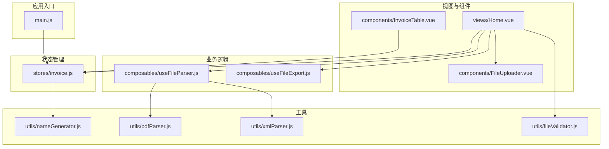
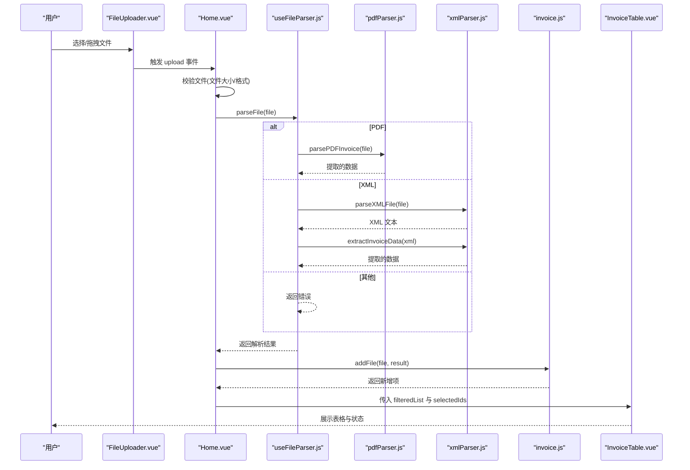
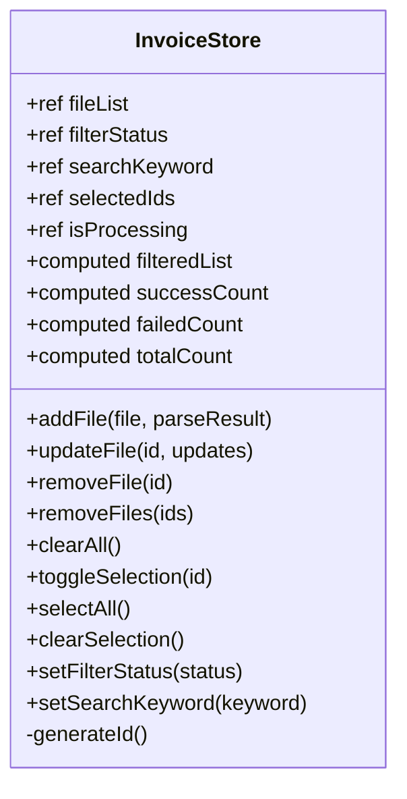
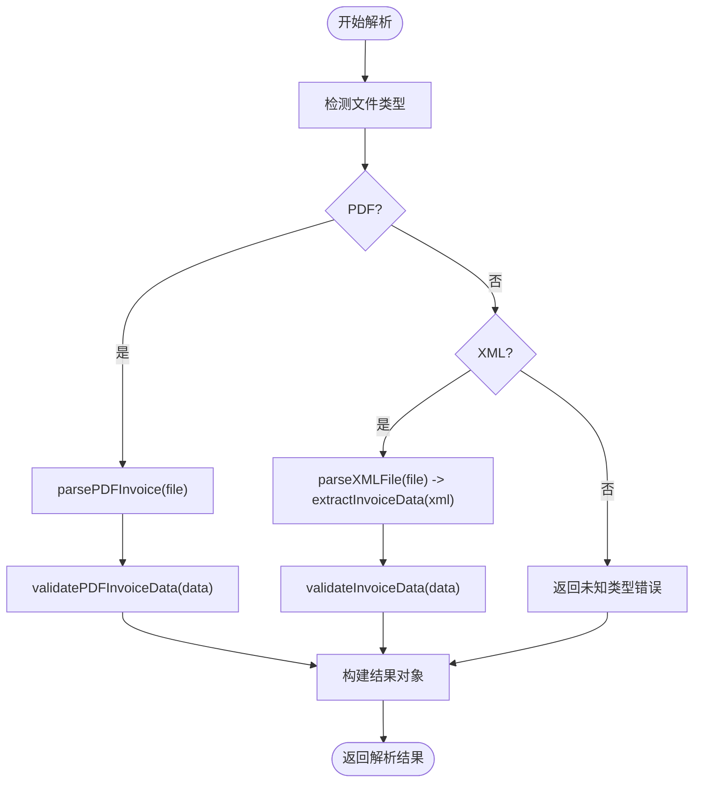
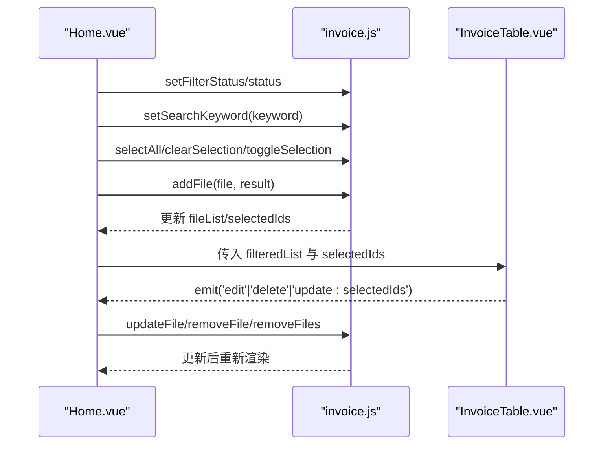
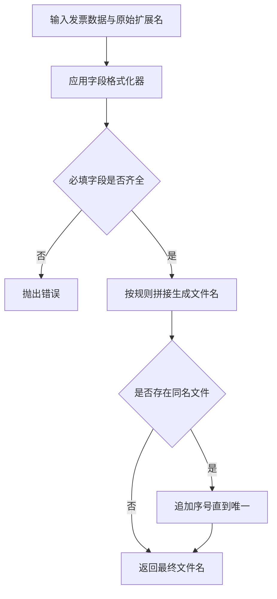
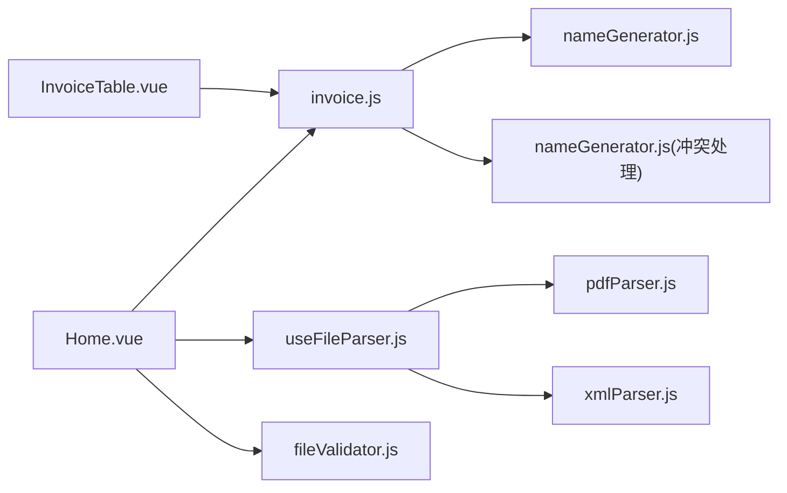

# 状态管理

<cite>
**本文引用的文件**
- [src/stores/invoice.js](file://src/stores/invoice.js)
- [src/composables/useFileParser.js](file://src/composables/useFileParser.js)
- [src/views/Home.vue](file://src/views/Home.vue)
- [src/components/InvoiceTable.vue](file://src/components/InvoiceTable.vue)
- [src/utils/nameGenerator.js](file://src/utils/nameGenerator.js)
- [src/utils/pdfParser.js](file://src/utils/pdfParser.js)
- [src/utils/xmlParser.js](file://src/utils/xmlParser.js)
- [src/utils/fileValidator.js](file://src/utils/fileValidator.js)
- [src/composables/useFileExport.js](file://src/composables/useFileExport.js)
- [src/components/FileUploader.vue](file://src/components/FileUploader.vue)
- [src/main.js](file://src/main.js)
</cite>

## 目录
1. [简介](#简介)
2. [项目结构](#项目结构)
3. [核心组件](#核心组件)
4. [架构总览](#架构总览)
5. [详细组件分析](#详细组件分析)
6. [依赖关系分析](#依赖关系分析)
7. [性能考量](#性能考量)
8. [故障排查指南](#故障排查指南)
9. [结论](#结论)

## 简介
本文件围绕 Pinia 状态管理中的发票 Store 设计进行深入说明，重点聚焦于 src/stores/invoice.js 中的发票状态管理模块。该 Store 作为应用的“单一数据源”，集中管理所有发票文件的状态与行为，包括文件列表、筛选与搜索、选择状态、处理状态以及计算属性（如成功/失败计数）。同时，文档阐述 Store 的数据模型字段、核心方法（添加、更新、删除、清空、选择控制、过滤设置）如何与 useFileParser.js 解析流程以及 UI 组件（如 InvoiceTable.vue）协同工作，形成完整且响应式的数据生命周期。

## 项目结构
本项目采用“按功能分层”的组织方式：
- stores：集中存放状态管理模块（本篇重点：发票 Store）
- composables：封装可复用的业务逻辑（如文件解析、导出）
- utils：提供底层工具（如 PDF/XML 解析、文件名生成、文件校验）
- views/components：视图与组件层，负责展示与交互
- main.js：应用入口，注册 Pinia

```mermaid
graph TB
subgraph "应用入口"
M["main.js"]
end
subgraph "状态管理"
S["stores/invoice.js"]
end
subgraph "业务逻辑"
P["composables/useFileParser.js"]
E["composables/useFileExport.js"]
end
subgraph "工具"
NG["utils/nameGenerator.js"]
PDF["utils/pdfParser.js"]
XML["utils/xmlParser.js"]
VF["utils/fileValidator.js"]
end
subgraph "视图与组件"
V["views/Home.vue"]
T["components/InvoiceTable.vue"]
U["components/FileUploader.vue"]
end
M --> S
V --> S
V --> P
V --> E
T --> S
P --> PDF
P --> XML
S --> NG
V --> VF
V --> U
```

图表来源
- [src/main.js](file://src/main.js#L1-L10)
- [src/stores/invoice.js](file://src/stores/invoice.js#L1-L204)
- [src/composables/useFileParser.js](file://src/composables/useFileParser.js#L1-L102)
- [src/composables/useFileExport.js](file://src/composables/useFileExport.js#L1-L80)
- [src/utils/nameGenerator.js](file://src/utils/nameGenerator.js#L1-L225)
- [src/utils/pdfParser.js](file://src/utils/pdfParser.js#L1-L227)
- [src/utils/xmlParser.js](file://src/utils/xmlParser.js#L1-L118)
- [src/utils/fileValidator.js](file://src/utils/fileValidator.js#L1-L90)
- [src/views/Home.vue](file://src/views/Home.vue#L1-L236)
- [src/components/InvoiceTable.vue](file://src/components/InvoiceTable.vue#L1-L162)
- [src/components/FileUploader.vue](file://src/components/FileUploader.vue#L1-L50)

章节来源
- [src/main.js](file://src/main.js#L1-L10)

## 核心组件
本节聚焦发票 Store 的职责与能力：
- 单一数据源：集中管理发票文件列表、筛选状态、搜索关键字、选中项、处理状态等
- 计算属性：基于原始数据派生出筛选后的列表、成功/失败/总数等统计
- 核心方法：添加文件、更新信息、删除单个/批量、清空、切换选中、全选、清空选中、设置过滤状态与搜索词
- 数据模型：每条记录包含 id、originalFile、originalFileName、invoiceType、purchaserName、totalAmount、newFileName、status、errorMessage 等字段

章节来源
- [src/stores/invoice.js](file://src/stores/invoice.js#L1-L204)

## 架构总览
下面的序列图展示了从用户上传到 Store 更新再到 UI 响应的整体流程。

```mermaid
sequenceDiagram
participant User as "用户"
participant Uploader as "FileUploader.vue"
participant View as "Home.vue"
participant Parser as "useFileParser.js"
participant PDFU as "pdfParser.js"
participant XMLU as "xmlParser.js"
participant Store as "invoice.js"
participant Table as "InvoiceTable.vue"
User->>Uploader : 选择/拖拽文件
Uploader->>View : 触发 upload 事件
View->>View : 校验文件(文件大小/格式)
View->>Parser : parseFile(file)
alt PDF
Parser->>PDFU : parsePDFInvoice(file)
PDFU-->>Parser : 提取的数据
else XML
Parser->>XMLU : parseXMLFile(file)
XMLU-->>Parser : XML 文本
Parser->>XMLU : extractInvoiceData(xml)
XMLU-->>Parser : 提取的数据
else 其他
Parser-->>Parser : 返回错误
end
Parser-->>View : 返回解析结果
View->>Store : addFile(file, result)
Store-->>View : 返回新增项
View->>Table : 传入 filteredList 与 selectedIds
Table-->>User : 展示表格与状态
```

图表来源
- [src/components/FileUploader.vue](file://src/components/FileUploader.vue#L1-L50)
- [src/views/Home.vue](file://src/views/Home.vue#L1-L236)
- [src/composables/useFileParser.js](file://src/composables/useFileParser.js#L1-L102)
- [src/utils/pdfParser.js](file://src/utils/pdfParser.js#L1-L227)
- [src/utils/xmlParser.js](file://src/utils/xmlParser.js#L1-L118)
- [src/stores/invoice.js](file://src/stores/invoice.js#L1-L204)
- [src/components/InvoiceTable.vue](file://src/components/InvoiceTable.vue#L1-L162)

## 详细组件分析

### 发票 Store（src/stores/invoice.js）
- 状态
  - fileList：发票文件记录数组
  - filterStatus：筛选状态（all/pending/success/failed）
  - searchKeyword：搜索关键词
  - selectedIds：选中项 id 列表
  - isProcessing：整体处理状态（用于 UI 进度提示）
- 计算属性
  - filteredList：按状态与关键词过滤后的列表
  - successCount/failedCount/totalCount：基于状态统计
- 核心方法
  - addFile(file, parseResult)：根据解析结果生成新文件名并写入状态；若解析失败则记录错误信息
  - updateFile(id, updates)：更新指定记录；当更新购买方名称或金额时，自动重新生成新文件名并修正状态
  - removeFile(id)/removeFiles(ids)：删除单个或批量；同步从选中列表移除
  - clearAll()：清空列表与选中项
  - toggleSelection(id)/selectAll()/clearSelection()：选中控制
  - setFilterStatus(status)/setSearchKeyword(keyword)：设置筛选与搜索
  - generateId()：生成唯一 id

```mermaid
classDiagram
class InvoiceStore {
+ref fileList
+ref filterStatus
+ref searchKeyword
+ref selectedIds
+ref isProcessing
+computed filteredList
+computed successCount
+computed failedCount
+computed totalCount
+addFile(file, parseResult)
+updateFile(id, updates)
+removeFile(id)
+removeFiles(ids)
+clearAll()
+toggleSelection(id)
+selectAll()
+clearSelection()
+setFilterStatus(status)
+setSearchKeyword(keyword)
-generateId()
}
```

图表来源
- [src/stores/invoice.js](file://src/stores/invoice.js#L1-L204)

章节来源
- [src/stores/invoice.js](file://src/stores/invoice.js#L1-L204)

### 数据模型与字段语义
- id：记录唯一标识
- originalFile：原始文件对象
- originalFileName：原始文件名
- invoiceType：发票类型（由解析结果提供）
- purchaserName：购买方名称（用于生成新文件名与编辑）
- totalAmount：价税合计（用于生成新文件名与编辑）
- newFileName：生成的新文件名（由 nameGenerator 生成）
- status：处理状态（pending/success/failed）
- errorMessage：失败原因（当解析或生成文件名失败时记录）

章节来源
- [src/stores/invoice.js](file://src/stores/invoice.js#L1-L204)
- [src/utils/nameGenerator.js](file://src/utils/nameGenerator.js#L1-L225)

### 解析流程与 Store 的集成（useFileParser.js）
- 解析策略：根据文件后缀判断 PDF 或 XML，分别调用对应解析器
- 并发与批处理：按批次并发解析，实时更新进度
- 结果结构：包含 success、data、errors、type 字段，供 Store 决策
- Store 接入点：Home.vue 在解析完成后调用 store.addFile(file, result)

```mermaid
flowchart TD
Start(["开始解析"]) --> Detect["检测文件类型"]
Detect --> IsPDF{"PDF?"}
IsPDF --> |是| ParsePDF["parsePDFInvoice(file)"]
IsPDF --> |否| IsXML{"XML?"}
IsXML --> |是| ParseXML["parseXMLFile(file) -> extractInvoiceData(xml)"]
IsXML --> |否| Unknown["返回未知类型错误"]
ParsePDF --> ValidatePDF["validatePDFInvoiceData(data)"]
ParseXML --> ValidateXML["validateInvoiceData(data)"]
ValidatePDF --> BuildResult["构建结果对象"]
ValidateXML --> BuildResult
Unknown --> BuildResult
BuildResult --> End(["返回解析结果"])
```

图表来源
- [src/composables/useFileParser.js](file://src/composables/useFileParser.js#L1-L102)
- [src/utils/pdfParser.js](file://src/utils/pdfParser.js#L1-L227)
- [src/utils/xmlParser.js](file://src/utils/xmlParser.js#L1-L118)

章节来源
- [src/composables/useFileParser.js](file://src/composables/useFileParser.js#L1-L102)
- [src/utils/pdfParser.js](file://src/utils/pdfParser.js#L1-L227)
- [src/utils/xmlParser.js](file://src/utils/xmlParser.js#L1-L118)

### UI 组件与 Store 的协作
- Home.vue
  - 作为容器组件，持有 store 实例，负责上传队列处理、进度展示、批量操作（全选、删除选中、导出）
  - 将 store 的 filteredList 与 selectedIds 传递给 InvoiceTable
  - 调用 store.updateFile、store.removeFile、store.removeFiles、store.selectAll、store.clearSelection 等
- InvoiceTable.vue
  - 展示列：序号、原文件名、发票类型、购买方名称、金额、新文件名、状态、失败原因、操作（删除）
  - 支持行内编辑（购买方名称、金额、新文件名），通过 emit('edit', id, updates) 回传给父组件
  - 支持多选与分页

```mermaid
sequenceDiagram
participant View as "Home.vue"
participant Store as "invoice.js"
participant Table as "InvoiceTable.vue"
View->>Store : setFilterStatus/status
View->>Store : setSearchKeyword(keyword)
View->>Store : selectAll/clearSelection/toggleSelection
View->>Store : addFile(file, result)
Store-->>View : 更新 fileList/selectedIds
View->>Table : 传入 filteredList 与 selectedIds
Table-->>View : emit('edit'|'delete'|'update : selectedIds')
View->>Store : updateFile/removeFile/removeFiles
Store-->>View : 更新后重新渲染
```

图表来源
- [src/views/Home.vue](file://src/views/Home.vue#L1-L236)
- [src/stores/invoice.js](file://src/stores/invoice.js#L1-L204)
- [src/components/InvoiceTable.vue](file://src/components/InvoiceTable.vue#L1-L162)

章节来源
- [src/views/Home.vue](file://src/views/Home.vue#L1-L236)
- [src/components/InvoiceTable.vue](file://src/components/InvoiceTable.vue#L1-L162)

### 文件名生成与冲突处理（nameGenerator.js）
- 命名规则：当前启用规则为“购买方名称_金额”，可扩展更多规则
- 字段格式化：对购买方名称、发票类型、金额、日期、发票号码等字段进行清洗与格式化
- 冲突处理：当生成的文件名与现有文件名重复时，自动追加序号
- 与 Store 的关系：在 addFile 与 updateFile 中调用生成逻辑，并将结果写入 newFileName

```mermaid
flowchart TD
A["输入发票数据与原始扩展名"] --> B["应用字段格式化器"]
B --> C{"必填字段是否齐全"}
C --> |否| E["抛出错误"]
C --> |是| D["按规则拼接生成文件名"]
D --> F{"是否存在同名文件"}
F --> |是| G["追加序号直到唯一"]
F --> |否| H["返回最终文件名"]
G --> H
```

图表来源
- [src/utils/nameGenerator.js](file://src/utils/nameGenerator.js#L1-L225)
- [src/stores/invoice.js](file://src/stores/invoice.js#L1-L204)

章节来源
- [src/utils/nameGenerator.js](file://src/utils/nameGenerator.js#L1-L225)
- [src/stores/invoice.js](file://src/stores/invoice.js#L1-L204)

### 导出流程（useFileExport.js）
- 过滤策略：默认仅导出状态为 success 的记录；也可导出全部
- ZIP 生成：使用 JSZip 将文件内容写入压缩包并下载
- 返回结果：包含成功标志、文件数量、文件名等

章节来源
- [src/composables/useFileExport.js](file://src/composables/useFileExport.js#L1-L80)
- [src/views/Home.vue](file://src/views/Home.vue#L1-L236)

## 依赖关系分析
- Store 对工具的依赖
  - nameGenerator：生成文件名与冲突处理
  - fileValidator：上传前校验（在 Home.vue 中使用）
- Store 对解析器的间接依赖
  - 通过 Home.vue 的解析流程注入解析结果，再由 Store 写入状态
- UI 对 Store 的依赖
  - Home.vue 读取/写入 Store 的状态与计算属性
  - InvoiceTable.vue 读取 Store 的 filteredList 与 selectedIds，并通过事件回传修改指令

```mermaid
graph LR
Store["invoice.js"] --> NG["nameGenerator.js"]
Store --> NG2["nameGenerator.js(冲突处理)"]
View["Home.vue"] --> Store
View --> Parser["useFileParser.js"]
Parser --> PDF["pdfParser.js"]
Parser --> XML["xmlParser.js"]
View --> VF["fileValidator.js"]
Table["InvoiceTable.vue"] --> Store
```

图表来源
- [src/stores/invoice.js](file://src/stores/invoice.js#L1-L204)
- [src/utils/nameGenerator.js](file://src/utils/nameGenerator.js#L1-L225)
- [src/composables/useFileParser.js](file://src/composables/useFileParser.js#L1-L102)
- [src/utils/pdfParser.js](file://src/utils/pdfParser.js#L1-L227)
- [src/utils/xmlParser.js](file://src/utils/xmlParser.js#L1-L118)
- [src/utils/fileValidator.js](file://src/utils/fileValidator.js#L1-L90)
- [src/views/Home.vue](file://src/views/Home.vue#L1-L236)
- [src/components/InvoiceTable.vue](file://src/components/InvoiceTable.vue#L1-L162)

章节来源
- [src/stores/invoice.js](file://src/stores/invoice.js#L1-L204)
- [src/composables/useFileParser.js](file://src/composables/useFileParser.js#L1-L102)
- [src/utils/nameGenerator.js](file://src/utils/nameGenerator.js#L1-L225)
- [src/utils/pdfParser.js](file://src/utils/pdfParser.js#L1-L227)
- [src/utils/xmlParser.js](file://src/utils/xmlParser.js#L1-L118)
- [src/utils/fileValidator.js](file://src/utils/fileValidator.js#L1-L90)
- [src/views/Home.vue](file://src/views/Home.vue#L1-L236)
- [src/components/InvoiceTable.vue](file://src/components/InvoiceTable.vue#L1-L162)

## 性能考量
- 并发解析：useFileParser.js 使用 Promise.all 并行处理批次，提高吞吐量
- 批处理策略：每批 10 个文件，避免一次性占用过多资源
- 计算属性缓存：filteredList 基于响应式 ref，按需计算，减少不必要的重排
- UI 分页：InvoiceTable.vue 使用分页，降低单次渲染压力
- 文件名生成：nameGenerator.js 在生成前进行字段格式化与冲突检查，避免后续重试成本

[本节为通用建议，无需列出具体文件来源]

## 故障排查指南
- 解析失败
  - 现象：状态为 failed，errorMessage 显示错误信息
  - 排查：查看解析器返回的 errors；确认文件格式与大小是否符合要求
  - 关联文件：useFileParser.js、pdfParser.js、xmlParser.js
- 文件名生成失败
  - 现象：状态为 failed，errorMessage 显示字段缺失或格式化异常
  - 排查：检查必填字段（如购买方名称、金额）是否为空；确认命名规则是否正确
  - 关联文件：nameGenerator.js、invoice.js
- 无法导出
  - 现象：导出报错或无文件可导出
  - 排查：确认是否有状态为 success 的记录；检查 ZIP 生成与下载逻辑
  - 关联文件：useFileExport.js、Home.vue
- UI 不响应
  - 现象：编辑无效、删除不生效、筛选不更新
  - 排查：确认事件链路（edit/delete/update:selectedIds）是否正确传递；检查 store 的 selectedIds 与 filteredList 是否更新
  - 关联文件：InvoiceTable.vue、Home.vue、invoice.js

章节来源
- [src/composables/useFileParser.js](file://src/composables/useFileParser.js#L1-L102)
- [src/utils/pdfParser.js](file://src/utils/pdfParser.js#L1-L227)
- [src/utils/xmlParser.js](file://src/utils/xmlParser.js#L1-L118)
- [src/utils/nameGenerator.js](file://src/utils/nameGenerator.js#L1-L225)
- [src/stores/invoice.js](file://src/stores/invoice.js#L1-L204)
- [src/composables/useFileExport.js](file://src/composables/useFileExport.js#L1-L80)
- [src/views/Home.vue](file://src/views/Home.vue#L1-L236)
- [src/components/InvoiceTable.vue](file://src/components/InvoiceTable.vue#L1-L162)

## 结论
该发票 Store 通过集中化的状态管理，将文件解析、文件名生成、UI 展示与用户交互有机串联，形成了清晰、可维护的数据流。其计算属性与核心方法覆盖了常见的业务场景（筛选、搜索、批量操作、导出），并与解析器、工具函数、UI 组件形成松耦合协作。开发者在扩展新功能时，应遵循“Store 仅承载状态与行为，解析与展示分离”的原则，确保状态流清晰、易于测试与演进。