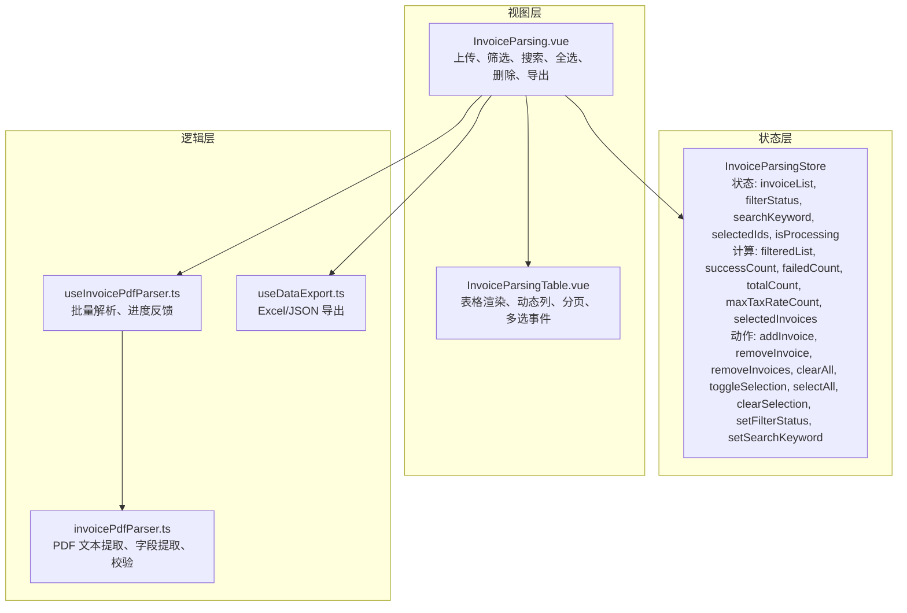
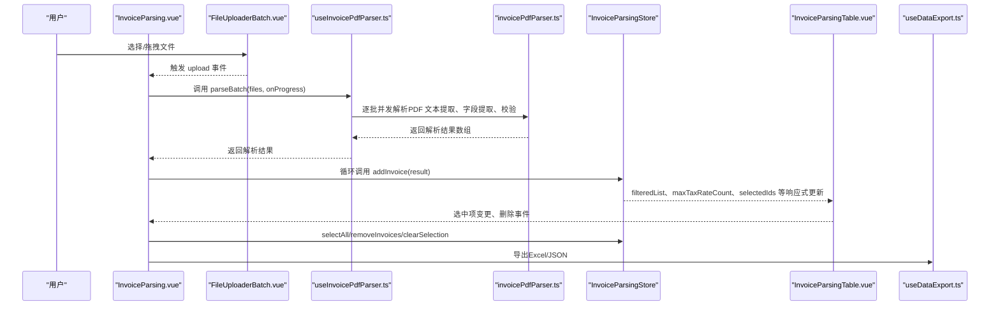
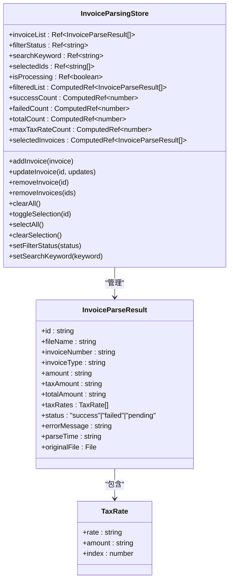
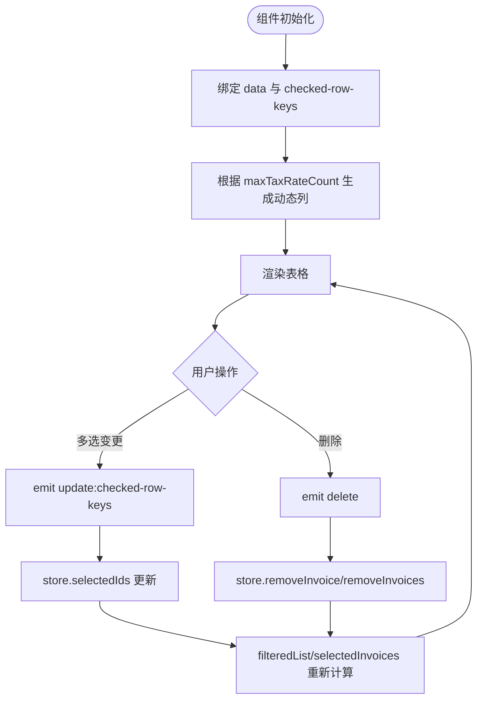
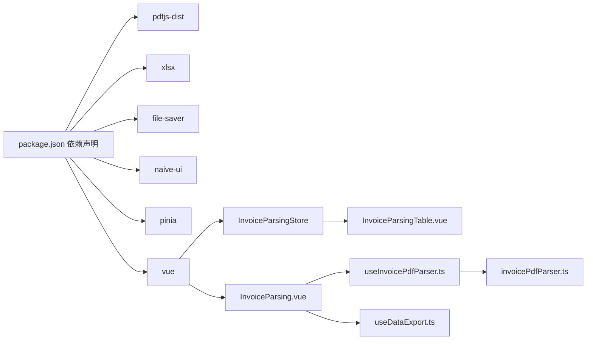

# 发票解析状态管理

<cite>
**本文引用的文件**
- [src/stores/invoiceParsing.ts](file://src/stores/invoiceParsing.ts)
- [src/components/InvoiceParsingTable.vue](file://src/components/InvoiceParsingTable.vue)
- [src/views/InvoiceParsing.vue](file://src/views/InvoiceParsing.vue)
- [src/composables/useInvoicePdfParser.ts](file://src/composables/useInvoicePdfParser.ts)
- [src/utils/invoicePdfParser.ts](file://src/utils/invoicePdfParser.ts)
- [src/composables/useDataExport.ts](file://src/composables/useDataExport.ts)
- [src/components/FileUploaderBatch.vue](file://src/components/FileUploaderBatch.vue)
- [package.json](file://package.json)
</cite>

## 目录
1. [简介](#简介)
2. [项目结构](#项目结构)
3. [核心组件](#核心组件)
4. [架构总览](#架构总览)
5. [详细组件分析](#详细组件分析)
6. [依赖关系分析](#依赖关系分析)
7. [性能考量](#性能考量)
8. [故障排查指南](#故障排查指南)
9. [结论](#结论)
10. [附录](#附录)

## 简介
本文件围绕发票解析状态管理进行系统化分析，重点聚焦于 Store 的设计与实现，包括：
- 状态字段（invoiceList、isProcessing、selectedIds 等）
- 计算属性（filteredList、successCount、failedCount、totalCount、maxTaxRateCount、selectedInvoices）
- 动作方法（addInvoice、removeInvoices、selectAll 等）
- 在批量发票解析、结果存储、筛选搜索、多选操作中的作用
- 处理大量发票数据时的性能考量（计算属性缓存机制）
- 与 InvoiceParsingTable 组件的数据绑定与交互逻辑
- 在组合式函数中调用 Store 的实践示例
- 调试技巧、状态同步问题的解决方案以及扩展建议（新增过滤维度）

## 项目结构
该项目采用 Vue 3 + Pinia 的前端架构，核心模块如下：
- stores：集中管理应用状态（本文件重点分析 invoiceParsing.ts）
- components：UI 组件（如 InvoiceParsingTable、FileUploaderBatch 等）
- views：页面视图（InvoiceParsing.vue）
- composables：可复用逻辑（useInvoicePdfParser、useDataExport 等）
- utils：工具函数（发票 PDF 解析逻辑）

图表来源
- [src/stores/invoiceParsing.ts](file://src/stores/invoiceParsing.ts#L62-L240)
- [src/views/InvoiceParsing.vue](file://src/views/InvoiceParsing.vue#L122-L303)
- [src/components/InvoiceParsingTable.vue](file://src/components/InvoiceParsingTable.vue#L14-L157)
- [src/composables/useInvoicePdfParser.ts](file://src/composables/useInvoicePdfParser.ts#L29-L173)
- [src/utils/invoicePdfParser.ts](file://src/utils/invoicePdfParser.ts#L97-L152)
- [src/composables/useDataExport.ts](file://src/composables/useDataExport.ts#L39-L209)

章节来源
- [src/stores/invoiceParsing.ts](file://src/stores/invoiceParsing.ts#L1-L241)
- [src/views/InvoiceParsing.vue](file://src/views/InvoiceParsing.vue#L1-L328)
- [src/components/InvoiceParsingTable.vue](file://src/components/InvoiceParsingTable.vue#L1-L157)
- [src/composables/useInvoicePdfParser.ts](file://src/composables/useInvoicePdfParser.ts#L1-L173)
- [src/utils/invoicePdfParser.ts](file://src/utils/invoicePdfParser.ts#L1-L349)
- [src/composables/useDataExport.ts](file://src/composables/useDataExport.ts#L1-L308)
- [src/components/FileUploaderBatch.vue](file://src/components/FileUploaderBatch.vue#L1-L79)
- [package.json](file://package.json#L1-L33)

## 核心组件
本节对 InvoiceParsingStore 的核心要素进行深入剖析。

- 状态字段
  - invoiceList：存储所有发票解析结果的数组，元素为 InvoiceParseResult 类型
  - filterStatus：当前筛选状态（all/success/failed），用于控制 filteredList 的过滤范围
  - searchKeyword：搜索关键词，支持文件名、发票号、金额等字段模糊匹配
  - selectedIds：当前选中的发票 ID 数组，用于多选操作
  - isProcessing：解析过程中的加载状态，用于禁用上传按钮、显示进度等

- 计算属性
  - filteredList：综合 filterStatus 与 searchKeyword 的结果集，用于表格渲染
  - successCount/failedCount/totalCount：统计成功、失败、总数，用于标签页计数
  - maxTaxRateCount：根据所有发票的最大税率数量动态生成表格列数
  - selectedInvoices：基于 selectedIds 与 invoiceList 的交集，用于导出选中项

- 动作方法
  - addInvoice：向 invoiceList 追加一条解析结果
  - updateInvoice：按 ID 更新解析结果的部分字段
  - removeInvoice/removeInvoices：删除单条或多条记录，并同步清理选中列表
  - clearAll：清空所有记录与选中项
  - toggleSelection/selectAll/clearSelection：多选操作
  - setFilterStatus/setSearchKeyword：更新筛选与搜索条件

章节来源
- [src/stores/invoiceParsing.ts](file://src/stores/invoiceParsing.ts#L33-L60)
- [src/stores/invoiceParsing.ts](file://src/stores/invoiceParsing.ts#L62-L240)

## 架构总览
下图展示了从用户上传到解析、展示与导出的端到端流程，以及各模块之间的依赖关系。

图表来源
- [src/views/InvoiceParsing.vue](file://src/views/InvoiceParsing.vue#L188-L232)
- [src/components/FileUploaderBatch.vue](file://src/components/FileUploaderBatch.vue#L49-L67)
- [src/composables/useInvoicePdfParser.ts](file://src/composables/useInvoicePdfParser.ts#L96-L153)
- [src/utils/invoicePdfParser.ts](file://src/utils/invoicePdfParser.ts#L97-L152)
- [src/stores/invoiceParsing.ts](file://src/stores/invoiceParsing.ts#L122-L164)
- [src/components/InvoiceParsingTable.vue](file://src/components/InvoiceParsingTable.vue#L153-L155)
- [src/composables/useDataExport.ts](file://src/composables/useDataExport.ts#L191-L201)

## 详细组件分析

### InvoiceParsingStore 设计与实现
- 数据结构
  - TaxRate：包含 rate、amount（可选）、index（用于动态列序号）
  - InvoiceParseResult：包含 id、fileName、invoiceNumber、invoiceType、amount、taxAmount、totalAmount、taxRates、status、errorMessage、parseTime、originalFile（可选）

- 计算属性实现要点
  - filteredList：先按 filterStatus 过滤，再按 searchKeyword 进行多字段模糊匹配
  - maxTaxRateCount：遍历 invoiceList，取 taxRates 最大长度作为动态列数
  - selectedInvoices：基于 selectedIds 与 invoiceList 的交集，便于导出选中项

- 动作方法实现要点
  - addInvoice：追加新记录
  - updateInvoice：按 ID 查找并合并更新
  - removeInvoice/removeInvoices：删除记录并同步清理 selectedIds
  - selectAll：基于 filteredList 的 ID 列表设置选中项
  - clearAll：清空列表与选中项

图表来源
- [src/stores/invoiceParsing.ts](file://src/stores/invoiceParsing.ts#L11-L31)
- [src/stores/invoiceParsing.ts](file://src/stores/invoiceParsing.ts#L33-L60)
- [src/stores/invoiceParsing.ts](file://src/stores/invoiceParsing.ts#L62-L240)

章节来源
- [src/stores/invoiceParsing.ts](file://src/stores/invoiceParsing.ts#L11-L31)
- [src/stores/invoiceParsing.ts](file://src/stores/invoiceParsing.ts#L62-L240)

### InvoiceParsingTable 组件的数据绑定与交互
- 数据绑定
  - :data="store.filteredList"：表格数据来自 store 的 filteredList
  - :checked-row-keys="store.selectedIds"：多选框绑定选中 ID 列表
  - :max-tax-rate-count="store.maxTaxRateCount"：动态列数量由 store 的 maxTaxRateCount 决定
  - :loading="store.isProcessing"：加载状态影响表格加载态

- 交互逻辑
  - @update:checked-row-keys="handleSelectedIdsUpdate"：接收子组件的选中项变更，写回 store.selectedIds
  - @delete="handleDelete"：接收删除事件，调用 store.removeInvoice 或批量删除

- 动态列生成
  - baseColumns：固定列（序号、文件名、发票号码、发票类型、金额、税额、价税合计）
  - dynamicTaxRateColumns：根据 maxTaxRateCount 动态生成“税率N”列
  - trailingColumns：状态、失败原因、操作列

图表来源
- [src/components/InvoiceParsingTable.vue](file://src/components/InvoiceParsingTable.vue#L1-L157)
- [src/stores/invoiceParsing.ts](file://src/stores/invoiceParsing.ts#L117-L119)

章节来源
- [src/components/InvoiceParsingTable.vue](file://src/components/InvoiceParsingTable.vue#L14-L157)
- [src/stores/invoiceParsing.ts](file://src/stores/invoiceParsing.ts#L117-L119)

### 在组合式函数中调用 Store 的实践示例
- 在页面中使用
  - const store = useInvoiceParsingStore()
  - 通过 v-model 绑定 store.filterStatus、store.searchKeyword
  - 通过事件绑定 store.selectAll、store.clearSelection、store.removeInvoices
  - 通过 store.selectedInvoices 获取选中项进行导出

- 在解析流程中使用
  - const { parseBatch } = useInvoicePdfParser()
  - await parseBatch(files, onProgress)
  - results.forEach(result => store.addInvoice(result))

- 在导出流程中使用
  - const { exportData } = useDataExport()
  - exportData(store.selectedInvoices, format, '发票解析结果')

章节来源
- [src/views/InvoiceParsing.vue](file://src/views/InvoiceParsing.vue#L142-L151)
- [src/views/InvoiceParsing.vue](file://src/views/InvoiceParsing.vue#L188-L232)
- [src/views/InvoiceParsing.vue](file://src/views/InvoiceParsing.vue#L273-L302)
- [src/composables/useInvoicePdfParser.ts](file://src/composables/useInvoicePdfParser.ts#L96-L153)
- [src/composables/useDataExport.ts](file://src/composables/useDataExport.ts#L191-L201)

## 依赖关系分析
- 外部依赖
  - pdfjs-dist：用于 PDF 文本提取
  - xlsx：用于 Excel 导出
  - file-saver：用于文件保存
  - naive-ui：用于 UI 组件（表格、按钮、输入框等）
  - pinia：用于状态管理
  - vue：框架基础

- 内部依赖
  - InvoiceParsingStore 依赖于 InvoiceParseResult/TaxRate 接口
  - InvoiceParsing.vue 依赖于 Store、useInvoicePdfParser、useDataExport
  - InvoiceParsingTable.vue 依赖于 Store 的 filteredList、maxTaxRateCount、selectedIds
  - useInvoicePdfParser 依赖于 utils/invoicePdfParser
  - useDataExport 依赖于 Store 的数据结构进行格式化

图表来源
- [package.json](file://package.json#L12-L22)
- [src/stores/invoiceParsing.ts](file://src/stores/invoiceParsing.ts#L4-L5)
- [src/views/InvoiceParsing.vue](file://src/views/InvoiceParsing.vue#L140-L151)
- [src/composables/useInvoicePdfParser.ts](file://src/composables/useInvoicePdfParser.ts#L5-L11)
- [src/utils/invoicePdfParser.ts](file://src/utils/invoicePdfParser.ts#L5-L7)
- [src/composables/useDataExport.ts](file://src/composables/useDataExport.ts#L6-L8)

章节来源
- [package.json](file://package.json#L12-L22)
- [src/stores/invoiceParsing.ts](file://src/stores/invoiceParsing.ts#L4-L5)
- [src/views/InvoiceParsing.vue](file://src/views/InvoiceParsing.vue#L140-L151)
- [src/composables/useInvoicePdfParser.ts](file://src/composables/useInvoicePdfParser.ts#L5-L11)
- [src/utils/invoicePdfParser.ts](file://src/utils/invoicePdfParser.ts#L5-L7)
- [src/composables/useDataExport.ts](file://src/composables/useDataExport.ts#L6-L8)

## 性能考量
- 计算属性缓存机制
  - filteredList、successCount、failedCount、totalCount、maxTaxRateCount、selectedInvoices 均为 computed，基于响应式依赖自动缓存，避免重复计算
  - 在大量发票数据场景下，filteredList 的过滤与搜索逻辑会随着数据量线性增长；建议：
    - 控制搜索关键词长度，减少不必要的模糊匹配
    - 限制一次性渲染的数据量（例如分页或虚拟滚动）
    - 对高频操作（如搜索）增加防抖策略

- 批量解析与并发控制
  - useInvoicePdfParser 中采用“批次大小”与“批次内并发”的策略，既保证吞吐又避免内存峰值过高
  - 建议：
    - 根据设备性能调整批次大小（BATCH_SIZE）
    - 在解析过程中及时释放原始文件引用（originalFile），降低内存占用

- 表格渲染优化
  - 动态列数量由 maxTaxRateCount 决定，避免固定列过多导致渲染压力
  - 使用分页组件（PaginationProps）控制每页条数，提升交互流畅度

- 导出性能
  - Excel 导出时预先计算最大税率数量，避免运行时重复扫描
  - JSON 导出时移除不可序列化字段，减少序列化开销

章节来源
- [src/stores/invoiceParsing.ts](file://src/stores/invoiceParsing.ts#L71-L91)
- [src/stores/invoiceParsing.ts](file://src/stores/invoiceParsing.ts#L105-L114)
- [src/composables/useInvoicePdfParser.ts](file://src/composables/useInvoicePdfParser.ts#L13-L14)
- [src/composables/useInvoicePdfParser.ts](file://src/composables/useInvoicePdfParser.ts#L116-L137)
- [src/composables/useDataExport.ts](file://src/composables/useDataExport.ts#L62-L66)
- [src/components/InvoiceParsingTable.vue](file://src/components/InvoiceParsingTable.vue#L139-L151)

## 故障排查指南
- 状态未同步
  - 现象：表格多选后，页面计数或导出项不一致
  - 排查：确认组件是否通过 emit('update:selectedIds', keys) 将选中项写回 store.selectedIds
  - 解决：确保 handleSelectedIdsUpdate 将 keys 转为字符串数组并赋值给 store.selectedIds

- 删除后仍显示选中
  - 现象：删除记录后 selectedIds 中仍有对应 ID
  - 排查：检查 removeInvoice 是否同步从 selectedIds 中移除
  - 解决：在 removeInvoice 内部执行 selectedIds.splice 移除对应 ID

- 进度显示异常
  - 现象：解析进度不更新或进度条卡住
  - 排查：确认 parseBatch 中的 onProgress 回调是否被调用，以及 store.isProcessing 是否被正确重置
  - 解决：在 finally 块中重置 isProcessing、progress、currentFile

- 导出失败
  - 现象：导出报错或无文件下载
  - 排查：确认导出数据非空，且字段可序列化；检查 MIME 类型与文件名
  - 解决：在导出前校验数据长度，捕获错误并提示用户

- 调试技巧
  - 开启开发环境日志：store 中的 isDev 条件日志输出，便于追踪状态变更
  - 使用浏览器开发者工具的 Vue DevTools 观察 store 的响应式更新
  - 在 parseBatch 中打印批次进度，定位耗时环节

章节来源
- [src/stores/invoiceParsing.ts](file://src/stores/invoiceParsing.ts#L141-L156)
- [src/views/InvoiceParsing.vue](file://src/views/InvoiceParsing.vue#L181-L183)
- [src/views/InvoiceParsing.vue](file://src/views/InvoiceParsing.vue#L205-L231)
- [src/composables/useDataExport.ts](file://src/composables/useDataExport.ts#L118-L127)
- [src/composables/useInvoicePdfParser.ts](file://src/composables/useInvoicePdfParser.ts#L144-L153)

## 结论
InvoiceParsingStore 通过清晰的状态划分、高效的计算属性缓存与完善的动作方法，实现了对发票解析全流程的统一管理。配合 InvoiceParsingTable 的动态列与分页能力，以及 useInvoicePdfParser 的批量化解析与 useDataExport 的多种导出格式，形成了完整的发票解析与展示体系。在处理大量发票数据时，建议结合分页、防抖、批次并发与内存释放等策略，持续优化性能与用户体验。

## 附录
- 扩展建议
  - 新增过滤维度：可在 store 中增加更多筛选字段（如发票类型、日期范围），并在 filteredList 中叠加过滤逻辑
  - 增强搜索能力：支持正则表达式或更复杂的字段组合搜索
  - 导出增强：支持自定义列导出、增量导出、后台任务导出等
  - 性能监控：在开发环境下记录关键操作耗时，辅助定位性能瓶颈