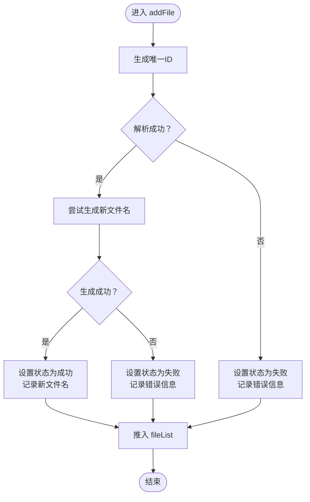

# 发票重命名状态管理

<cite>
**本文引用的文件**
- [src/stores/invoice.ts](file://src/stores/invoice.ts)
- [src/views/Home.vue](file://src/views/Home.vue)
- [src/components/FileUploader.vue](file://src/components/FileUploader.vue)
- [src/components/InvoiceTable.vue](file://src/components/InvoiceTable.vue)
- [src/components/OperationBar.vue](file://src/components/OperationBar.vue)
- [src/composables/useFileParser.ts](file://src/composables/useFileParser.ts)
- [src/composables/useInvoicePdfParser.ts](file://src/composables/useInvoicePdfParser.ts)
- [src/utils/invoicePdfParser.ts](file://src/utils/invoicePdfParser.ts)
- [src/utils/nameGenerator.ts](file://src/utils/nameGenerator.ts)
- [src/utils/fileValidator.ts](file://src/utils/fileValidator.ts)
- [package.json](file://package.json)
</cite>

## 目录
1. [简介](#简介)
2. [项目结构](#项目结构)
3. [核心组件](#核心组件)
4. [架构总览](#架构总览)
5. [详细组件分析](#详细组件分析)
6. [依赖关系分析](#依赖关系分析)
7. [性能考虑](#性能考虑)
8. [故障排查指南](#故障排查指南)
9. [结论](#结论)
10. [附录](#附录)

## 简介
本文件深入解析发票重命名状态管理模块，重点围绕 src/stores/invoice.ts 中定义的 useInvoiceStore 状态管理模块，系统阐述其 state 结构（fileList、filterStatus、searchKeyword、selectedIds、isProcessing）、getters 计算属性（filteredList、successCount、failedCount、totalCount）以及 actions 方法（addFile、updateFile、removeFile、removeFiles、clearAll、toggleSelection、selectAll、clearSelection、setFilterStatus、setSearchKeyword）的实现逻辑。同时说明该 store 如何管理发票文件的上传、解析、重命名状态与用户交互数据，并阐述其与 FileUploader、InvoiceTable、OperationBar 等组件的交互方式。最后提供在 Vue 组件中使用 useInvoiceStore 的具体示例路径、错误处理机制、性能优化策略以及常见问题排查指南。

## 项目结构
该项目采用基于功能域的组织方式，核心状态管理位于 stores 目录，业务逻辑通过 composables 抽象，UI 组件位于 components 目录，工具类位于 utils 目录，页面视图位于 views 目录。整体结构清晰，职责分离明确。

图表来源
- [src/views/Home.vue](file://src/views/Home.vue#L1-L247)
- [src/stores/invoice.ts](file://src/stores/invoice.ts#L1-L256)
- [src/components/FileUploader.vue](file://src/components/FileUploader.vue#L1-L50)
- [src/components/InvoiceTable.vue](file://src/components/InvoiceTable.vue#L1-L182)
- [src/components/OperationBar.vue](file://src/components/OperationBar.vue#L1-L119)
- [src/composables/useFileParser.ts](file://src/composables/useFileParser.ts#L1-L109)
- [src/composables/useInvoicePdfParser.ts](file://src/composables/useInvoicePdfParser.ts#L1-L173)
- [src/utils/invoicePdfParser.ts](file://src/utils/invoicePdfParser.ts#L1-L349)
- [src/utils/nameGenerator.ts](file://src/utils/nameGenerator.ts#L1-L250)
- [src/utils/fileValidator.ts](file://src/utils/fileValidator.ts#L1-L107)

章节来源
- [src/views/Home.vue](file://src/views/Home.vue#L1-L247)
- [src/stores/invoice.ts](file://src/stores/invoice.ts#L1-L256)

## 核心组件
本节聚焦 useInvoiceStore 的状态、计算属性与方法，解释其在发票文件处理流程中的作用。

- 状态（state）
  - fileList: Ref<InvoiceItem[]>，存储每个发票文件的条目，包含原始文件、原始文件名、解析得到的发票类型、购买方名称、价税合计、新文件名、状态（pending/success/failed）与错误信息。
  - filterStatus: Ref<string>，用于过滤显示的文件状态，默认“all”。
  - searchKeyword: Ref<string>，用于按关键词搜索（原文件名、新文件名、购买方名称）。
  - selectedIds: Ref<string[]>，当前选中的文件 ID 列表。
  - isProcessing: Ref<boolean>，表示是否处于处理中（用于控制 UI 进度与交互）。

- 计算属性（getters）
  - filteredList: ComputedRef<InvoiceItem[]>，根据 filterStatus 与 searchKeyword 过滤 fileList。
  - successCount: ComputedRef<number>，统计状态为“成功”的文件数量。
  - failedCount: ComputedRef<number>，统计状态为“失败”的文件数量。
  - totalCount: ComputedRef<number>，统计文件总数。

- 方法（actions）
  - addFile(file, parseResult): 将解析结果转换为 InvoiceItem，生成新文件名（成功时），设置状态与错误信息，并推入 fileList。
  - updateFile(id, updates): 更新指定条目的字段；若更新购买方名称或价税合计，则重新生成新文件名并更新状态。
  - removeFile(id)/removeFiles(ids): 移除单个或多个文件，并同步从选中列表中移除。
  - clearAll(): 清空 fileList 与 selectedIds。
  - toggleSelection(id)/selectAll()/clearSelection(): 切换选中、全选、清空选中。
  - setFilterStatus(status)/setSearchKeyword(keyword): 设置过滤状态与搜索关键词。

章节来源
- [src/stores/invoice.ts](file://src/stores/invoice.ts#L36-L61)
- [src/stores/invoice.ts](file://src/stores/invoice.ts#L63-L255)

## 架构总览
下图展示从用户上传到状态更新再到 UI 展示的完整流程，体现各模块间的协作关系。

图表来源
- [src/views/Home.vue](file://src/views/Home.vue#L100-L155)
- [src/components/FileUploader.vue](file://src/components/FileUploader.vue#L33-L42)
- [src/composables/useFileParser.ts](file://src/composables/useFileParser.ts#L22-L66)
- [src/stores/invoice.ts](file://src/stores/invoice.ts#L106-L151)
- [src/utils/nameGenerator.ts](file://src/utils/nameGenerator.ts#L143-L170)

## 详细组件分析

### useInvoiceStore 状态管理模块
- 数据模型
  - InvoiceItem：包含 id、originalFile、originalFileName、invoiceType、purchaserName、totalAmount、newFileName、status、errorMessage。
  - ParseResult：包含 success、data、errors，用于描述解析结果。
- 关键流程
  - addFile：根据解析结果决定状态与错误信息；成功时调用 nameGenerator 生成新文件名；最终推入 fileList。
  - updateFile：当购买方名称或价税合计被修改时，重新生成新文件名并更新状态与错误信息。
  - 过滤与搜索：filteredList 同时支持按状态与关键词过滤，提升用户体验。
  - 选择与批量操作：通过 selectedIds 实现多选、全选、清空与批量删除。

图表来源
- [src/stores/invoice.ts](file://src/stores/invoice.ts#L106-L151)
- [src/utils/nameGenerator.ts](file://src/utils/nameGenerator.ts#L143-L170)

章节来源
- [src/stores/invoice.ts](file://src/stores/invoice.ts#L106-L151)
- [src/stores/invoice.ts](file://src/stores/invoice.ts#L153-L176)

### 与 FileUploader 的交互
- FileUploader 作为上传入口，负责接收文件并触发自定义上传逻辑（实际不上传至服务器，仅触发处理流程）。
- Home.vue 监听 FileUploader 的上传事件，进行文件校验与处理队列管理，随后调用 useInvoiceStore.addFile 将解析结果写入状态。

章节来源
- [src/components/FileUploader.vue](file://src/components/FileUploader.vue#L33-L42)
- [src/views/Home.vue](file://src/views/Home.vue#L100-L155)

### 与 InvoiceTable 的交互
- InvoiceTable 接收 store.filteredList 作为数据源，支持购买方名称、金额、新文件名的编辑，以及删除操作。
- 通过事件向父组件 Home.vue 传递编辑与删除指令，Home.vue 再调用 store.updateFile 与 store.removeFile 完成状态更新。

章节来源
- [src/components/InvoiceTable.vue](file://src/components/InvoiceTable.vue#L30-L39)
- [src/views/Home.vue](file://src/views/Home.vue#L160-L178)

### 与 OperationBar 的交互
- OperationBar 通过 v-model 与 store 的 filterStatus、searchKeyword 双向绑定，实现状态与关键词的实时过滤。
- 提供全选、清空选择、删除选中、导出等功能按钮，均由 Home.vue 调用 store 的相应方法实现。

章节来源
- [src/components/OperationBar.vue](file://src/components/OperationBar.vue#L100-L117)
- [src/views/Home.vue](file://src/views/Home.vue#L11-L23)

### 与解析与命名工具的交互
- useFileParser.ts：根据文件类型（PDF/XML）调用对应解析器，返回统一的 ParseResult，供 store.addFile 使用。
- useInvoicePdfParser.ts 与 invoicePdfParser.ts：提供 PDF 专用解析能力，包含分批并发处理与进度反馈。
- nameGenerator.ts：根据发票数据生成新文件名，支持字段格式化与冲突处理。

章节来源
- [src/composables/useFileParser.ts](file://src/composables/useFileParser.ts#L22-L66)
- [src/composables/useInvoicePdfParser.ts](file://src/composables/useInvoicePdfParser.ts#L96-L153)
- [src/utils/invoicePdfParser.ts](file://src/utils/invoicePdfParser.ts#L97-L129)
- [src/utils/nameGenerator.ts](file://src/utils/nameGenerator.ts#L143-L170)

## 依赖关系分析
- 外部依赖
  - vue、pinia：提供响应式与状态管理基础。
  - naive-ui：提供 UI 组件库（上传、表格、按钮、输入框等）。
  - pdfjs-dist：PDF 文本提取与解析。
  - fast-xml-parser：XML 解析。
- 内部依赖
  - store 依赖 utils 中的 nameGenerator、fileValidator。
  - Home.vue 依赖 store、composables、utils 与 UI 组件。
  - components 之间通过 props 与 emits 进行松耦合通信。

图表来源
- [package.json](file://package.json#L12-L22)
- [src/stores/invoice.ts](file://src/stores/invoice.ts#L1-L10)
- [src/views/Home.vue](file://src/views/Home.vue#L79-L91)

章节来源
- [package.json](file://package.json#L12-L22)

## 性能考虑
- 响应式数据的合理使用
  - 使用 computed 对过滤与统计进行懒计算，避免每次渲染都重复计算。
  - 将 fileList 作为 Ref 暴露给组件，组件内部通过 props 与 emits 与 store 解耦，减少不必要的重渲染。
- 批量处理与并发控制
  - useFileParser.ts 与 useInvoicePdfParser.ts 采用分批（batch）并发处理，降低内存峰值与 CPU 压力。
- 进度反馈
  - 在 Home.vue 中通过 isProcessing 与进度条展示处理状态，改善用户体验。
- 文件名校验与冲突处理
  - nameGenerator.ts 提供字段格式化与冲突处理，避免无效文件名导致后续处理失败。

章节来源
- [src/stores/invoice.ts](file://src/stores/invoice.ts#L72-L103)
- [src/composables/useFileParser.ts](file://src/composables/useFileParser.ts#L71-L100)
- [src/composables/useInvoicePdfParser.ts](file://src/composables/useInvoicePdfParser.ts#L96-L153)
- [src/utils/nameGenerator.ts](file://src/utils/nameGenerator.ts#L175-L225)

## 故障排查指南
- 状态未更新
  - 检查 Home.vue 是否正确调用 store.addFile、store.updateFile、store.removeFile 等方法。
  - 确认组件与 store 的双向绑定（如 v-model:selected-ids）是否正确传递。
- 文件处理卡顿
  - 检查是否启用了分批并发处理（useFileParser.ts 与 useInvoicePdfParser.ts）。
  - 确认 PDF 文本提取是否超时或解析异常，查看控制台错误日志。
- 文件名生成失败
  - 检查发票数据字段是否完整（购买方名称、价税合计等），确保满足 nameGenerator 的必填条件。
  - 查看错误信息（errorMessage）定位具体原因。
- 过滤与搜索无效
  - 确认 filterStatus 与 searchKeyword 的值是否正确传入 store。
  - 检查 filteredList 的实现逻辑是否符合预期。

章节来源
- [src/views/Home.vue](file://src/views/Home.vue#L160-L178)
- [src/stores/invoice.ts](file://src/stores/invoice.ts#L106-L151)
- [src/utils/nameGenerator.ts](file://src/utils/nameGenerator.ts#L158-L162)

## 结论
useInvoiceStore 通过清晰的状态结构、计算属性与动作方法，实现了发票文件上传、解析、重命名与展示的完整闭环。结合 FileUploader、InvoiceTable、OperationBar 等组件与解析、命名工具的协同，形成了高内聚、低耦合的前端状态管理方案。通过合理的响应式设计与批处理策略，保证了良好的性能与用户体验。

## 附录

### 在 Vue 组件中使用 useInvoiceStore 的示例路径
- 在页面中引入并使用 store
  - 引入路径参考：[src/views/Home.vue](file://src/views/Home.vue#L79-L85)
  - 使用 store 的示例路径：
    - 读取状态：[src/views/Home.vue](file://src/views/Home.vue#L10-L33)
    - 调用方法：[src/views/Home.vue](file://src/views/Home.vue#L160-L178)
- 在组件中使用 store 的示例路径
  - 表格组件使用 filteredList：[src/components/InvoiceTable.vue](file://src/components/InvoiceTable.vue#L30-L33)
  - 操作栏组件使用 v-model 绑定 filterStatus 与 searchKeyword：[src/components/OperationBar.vue](file://src/components/OperationBar.vue#L100-L117)

### 错误处理机制
- 解析失败时，store 将状态标记为失败并记录错误信息，便于 UI 展示与用户理解。
- 文件名校验失败时，抛出异常并记录到 errorMessage，确保后续处理不会产生无效文件名。
- 控制台日志（开发环境）用于定位问题，便于调试与优化。

章节来源
- [src/stores/invoice.ts](file://src/stores/invoice.ts#L118-L133)
- [src/utils/nameGenerator.ts](file://src/utils/nameGenerator.ts#L147-L162)