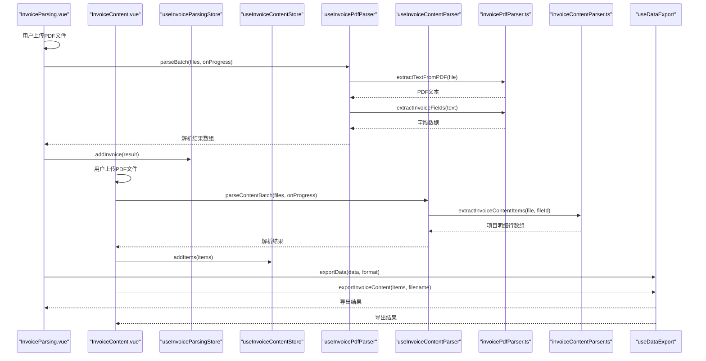
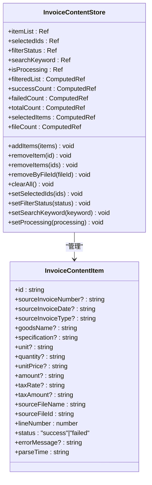
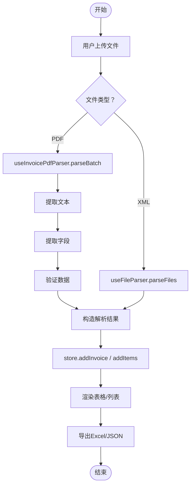
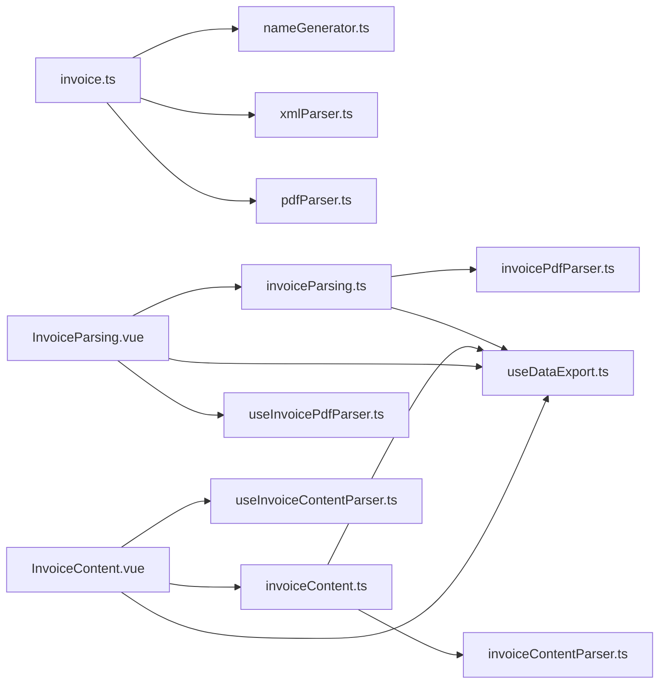

# 状态管理设计

<cite>
**本文引用的文件**
- [src/stores/invoice.ts](file://src/stores/invoice.ts)
- [src/stores/invoiceContent.ts](file://src/stores/invoiceContent.ts)
- [src/stores/invoiceParsing.ts](file://src/stores/invoiceParsing.ts)
- [src/main.ts](file://src/main.ts)
- [src/composables/useFileParser.ts](file://src/composables/useFileParser.ts)
- [src/composables/useInvoicePdfParser.ts](file://src/composables/useInvoicePdfParser.ts)
- [src/composables/useInvoiceContentParser.ts](file://src/composables/useInvoiceContentParser.ts)
- [src/utils/xmlParser.ts](file://src/utils/xmlParser.ts)
- [src/utils/pdfParser.ts](file://src/utils/pdfParser.ts)
- [src/utils/invoicePdfParser.ts](file://src/utils/invoicePdfParser.ts)
- [src/utils/invoiceContentParser.ts](file://src/utils/invoiceContentParser.ts)
- [src/views/InvoiceContent.vue](file://src/views/InvoiceContent.vue)
- [src/views/InvoiceParsing.vue](file://src/views/InvoiceParsing.vue)
- [src/views/HomePage.vue](file://src/views/HomePage.vue)
- [src/components/Invoice/InvoiceContentTable.vue](file://src/components/Invoice/InvoiceContentTable.vue)
- [src/components/Invoice/InvoiceParsingTable.vue](file://src/components/Invoice/InvoiceParsingTable.vue)
- [src/composables/useDataExport.ts](file://src/composables/useDataExport.ts)
- [package.json](file://package.json)
</cite>

## 目录
1. [简介](#简介)
2. [项目结构](#项目结构)
3. [核心组件](#核心组件)
4. [架构总览](#架构总览)
5. [详细组件分析](#详细组件分析)
6. [依赖关系分析](#依赖关系分析)
7. [性能考量](#性能考量)
8. [故障排查指南](#故障排查指南)
9. [结论](#结论)
10. [附录](#附录)

## 简介
本项目采用 Pinia 实现前端状态管理，围绕"发票重命名"、"发票解析"和"发票内容解析"三大功能域分别构建了三个独立的 store：invoice、invoiceParsing 和 invoiceContent。三者职责清晰、边界明确，既保证了模块化与可维护性，又便于扩展与测试。本文将深入解析这三个 store 的设计理念、数据结构、计算属性与动作封装，并给出在组件中的使用方式、持久化策略建议、调试技巧与最佳实践。

## 项目结构
项目采用基于功能域的组织方式：
- stores：存放 Pinia store 定义
- composables：存放可复用的业务逻辑组合式函数
- utils：存放解析与工具类函数
- views/components：视图层与可复用组件
- main.ts：应用入口，注册 Pinia

```mermaid
graph TB
subgraph "应用入口"
MAIN["main.ts<br/>创建并挂载 Pinia"]
end
subgraph "状态管理"
INV_STORE["invoice.ts<br/>发票重命名状态"]
INV_PARSE_STORE["invoiceParsing.ts<br/>发票解析状态"]
INV_CONTENT_STORE["invoiceContent.ts<br/>发票内容解析状态"]
end
subgraph "业务逻辑"
FILE_PARSER["useFileParser.ts<br/>通用文件解析"]
PDF_PARSER["useInvoicePdfParser.ts<br/>PDF发票解析"]
CONTENT_PARSER["useInvoiceContentParser.ts<br/>发票内容解析"]
END
subgraph "工具与解析"
XML_UTIL["xmlParser.ts"]
PDF_UTIL["pdfParser.ts"]
INVOICE_PDF_UTIL["invoicePdfParser.ts"]
INVOICE_CONTENT_UTIL["invoiceContentParser.ts"]
end
subgraph "视图与组件"
HOME["HomePage.vue"]
PARSING_PAGE["InvoiceParsing.vue"]
CONTENT_PAGE["InvoiceContent.vue"]
TABLE1["InvoiceParsingTable.vue"]
TABLE2["InvoiceContentTable.vue"]
EXPORT["useDataExport.ts"]
end
MAIN --> INV_STORE
MAIN --> INV_PARSE_STORE
MAIN --> INV_CONTENT_STORE
PARSING_PAGE --> INV_PARSE_STORE
PARSING_PAGE --> PDF_PARSER
PARSING_PAGE --> EXPORT
CONTENT_PAGE --> INV_CONTENT_STORE
CONTENT_PAGE --> CONTENT_PARSER
CONTENT_PAGE --> EXPORT
PDF_PARSER --> INVOICE_PDF_UTIL
PDF_PARSER --> INV_PARSE_STORE
CONTENT_PARSER --> INVOICE_CONTENT_UTIL
CONTENT_PARSER --> INV_CONTENT_STORE
FILE_PARSER --> XML_UTIL
FILE_PARSER --> PDF_UTIL
TABLE1 --> INV_PARSE_STORE
TABLE2 --> INV_CONTENT_STORE
```

**图表来源**
- [src/main.ts](file://src/main.ts#L1-L12)
- [src/stores/invoice.ts](file://src/stores/invoice.ts#L1-L256)
- [src/stores/invoiceContent.ts](file://src/stores/invoiceContent.ts#L1-L189)
- [src/stores/invoiceParsing.ts](file://src/stores/invoiceParsing.ts#L1-L241)
- [src/composables/useFileParser.ts](file://src/composables/useFileParser.ts#L1-L109)
- [src/composables/useInvoicePdfParser.ts](file://src/composables/useInvoicePdfParser.ts#L1-L173)
- [src/composables/useInvoiceContentParser.ts](file://src/composables/useInvoiceContentParser.ts#L1-L178)
- [src/utils/xmlParser.ts](file://src/utils/xmlParser.ts#L1-L141)
- [src/utils/pdfParser.ts](file://src/utils/pdfParser.ts#L1-L243)
- [src/utils/invoicePdfParser.ts](file://src/utils/invoicePdfParser.ts#L1-L349)
- [src/utils/invoiceContentParser.ts](file://src/utils/invoiceContentParser.ts#L1-L800)
- [src/views/InvoiceContent.vue](file://src/views/InvoiceContent.vue#L1-L311)
- [src/views/InvoiceParsing.vue](file://src/views/InvoiceParsing.vue#L1-L328)
- [src/views/HomePage.vue](file://src/views/HomePage.vue#L1-L124)
- [src/components/Invoice/InvoiceContentTable.vue](file://src/components/Invoice/InvoiceContentTable.vue#L1-L321)
- [src/components/Invoice/InvoiceParsingTable.vue](file://src/components/Invoice/InvoiceParsingTable.vue#L1-L157)
- [src/composables/useDataExport.ts](file://src/composables/useDataExport.ts#L1-L417)

**章节来源**
- [src/main.ts](file://src/main.ts#L1-L12)
- [src/stores/invoice.ts](file://src/stores/invoice.ts#L1-L256)
- [src/stores/invoiceContent.ts](file://src/stores/invoiceContent.ts#L1-L189)
- [src/stores/invoiceParsing.ts](file://src/stores/invoiceParsing.ts#L1-L241)

## 核心组件
本节聚焦于三个核心 store 的设计与实现要点。

- invoice store（发票重命名）
  - 职责：管理文件上传、重命名、筛选与选择等行为；负责将解析结果映射为可展示的发票条目。
  - 关键状态：文件列表、过滤状态、搜索关键词、选中 ID 列表、处理中标志。
  - 计算属性：过滤后列表、成功/失败/总数统计。
  - 动作：添加文件、更新文件、删除文件、清空、切换/全选、设置过滤与搜索。

- invoiceParsing store（发票解析）
  - 职责：管理 PDF 发票解析结果的增删改查、筛选与选择、导出等。
  - 关键状态：解析结果列表、过滤状态、搜索关键词、选中 ID 列表、处理中标志。
  - 计算属性：过滤后列表、成功/失败/总数统计、最大税率数量、选中发票集合。
  - 动作：添加/更新/删除解析记录、清空、切换/全选、设置过滤与搜索。

- invoiceContent store（发票内容解析）
  - 职责：管理发票项目明细行的增删改查、筛选与选择、导出等。
  - 关键状态：项目行列表、选中 ID 列表、过滤状态、搜索关键词、处理中标志。
  - 计算属性：过滤后列表、成功/失败/总数统计、选中项目集合、文件数量。
  - 动作：批量添加项目行、删除单个/多个/按文件删除、清空、设置选中、过滤、搜索、处理状态。

**章节来源**
- [src/stores/invoice.ts](file://src/stores/invoice.ts#L36-L61)
- [src/stores/invoice.ts](file://src/stores/invoice.ts#L63-L255)
- [src/stores/invoiceParsing.ts](file://src/stores/invoiceParsing.ts#L33-L60)
- [src/stores/invoiceParsing.ts](file://src/stores/invoiceParsing.ts#L62-L240)
- [src/stores/invoiceContent.ts](file://src/stores/invoiceContent.ts#L9-L28)
- [src/stores/invoiceContent.ts](file://src/stores/invoiceContent.ts#L33-L77)
- [src/stores/invoiceContent.ts](file://src/stores/invoiceContent.ts#L83-L131)

## 架构总览
下面的时序图展示了"发票解析页面"和"发票内容解析页面"如何通过组合式函数与 store 协同工作，完成批量解析、状态更新与导出流程。



**图表来源**
- [src/views/InvoiceParsing.vue](file://src/views/InvoiceParsing.vue#L188-L232)
- [src/views/InvoiceContent.vue](file://src/views/InvoiceContent.vue#L162-L206)
- [src/composables/useInvoicePdfParser.ts](file://src/composables/useInvoicePdfParser.ts#L96-L153)
- [src/composables/useInvoiceContentParser.ts](file://src/composables/useInvoiceContentParser.ts#L106-L168)
- [src/utils/invoicePdfParser.ts](file://src/utils/invoicePdfParser.ts#L97-L152)
- [src/utils/invoiceContentParser.ts](file://src/utils/invoiceContentParser.ts#L90-L167)
- [src/composables/useDataExport.ts](file://src/composables/useDataExport.ts#L303-L399)

## 详细组件分析

### invoice store 设计与实现
- 状态结构
  - fileList：文件条目数组，包含原始文件、原文件名、新文件名、发票类型、购买方名称、价税合计、状态与错误信息。
  - filterStatus：筛选状态（全部/成功/失败）。
  - searchKeyword：搜索关键词。
  - selectedIds：选中条目的 ID 列表。
  - isProcessing：是否处于处理中。
- 计算逻辑
  - filteredList：先按状态过滤，再按关键词搜索（原文件名、新文件名、购买方名称）。
  - successCount/failedCount/totalCount：基于 fileList 的统计。
- 动作封装
  - addFile：根据解析结果生成新文件名，更新状态与错误信息，并推入列表。
  - updateFile：当购买方名称或价税合计变化时，重新生成新文件名并更新状态。
  - removeFile/removeFiles/clearAll：删除单个/多个/全部并同步选中列表。
  - toggleSelection/selectAll/clearSelection：选择相关操作。
  - setFilterStatus/setSearchKeyword：更新筛选与搜索条件。
- 设计理念
  - 将"文件条目"与"解析结果"解耦：store 仅保存最终可展示的条目，避免直接持有原始文件对象。
  - 通过计算属性统一处理筛选与统计，降低视图层复杂度。
  - 在 updateFile 中自动重命名，减少外部调用方的样板代码。


**图表来源**
- [src/stores/invoice.ts](file://src/stores/invoice.ts#L24-L61)
- [src/stores/invoice.ts](file://src/stores/invoice.ts#L63-L255)

**章节来源**
- [src/stores/invoice.ts](file://src/stores/invoice.ts#L36-L61)
- [src/stores/invoice.ts](file://src/stores/invoice.ts#L63-L255)

### invoiceParsing store 设计与实现
- 状态结构
  - invoiceList：解析结果数组，包含文件名、发票号、类型、金额、税额、价税合计、税率列表、状态、错误信息、解析时间等。
  - filterStatus/searchKeyword/selectedIds/isProcessing：与 invoice store 类似的筛选与选择机制。
- 计算逻辑
  - filteredList：按状态与关键词过滤。
  - successCount/failedCount/totalCount：统计。
  - maxTaxRateCount：动态计算最大税率数量，用于表格列数自适应。
  - selectedInvoices：基于选中 ID 的结果集。
- 动作封装
  - addInvoice/updateInvoice/removeInvoice/removeInvoices/clearAll：标准 CRUD。
  - toggleSelection/selectAll/clearSelection：选择相关。
  - setFilterStatus/setSearchKeyword：筛选与搜索。
- 设计理念
  - 与视图层紧密配合：maxTaxRateCount 使表格列数随数据动态变化，提升可读性。
  - 保持 store 的纯粹性：只存储可序列化的数据，避免持有原始文件对象。


**图表来源**
- [src/stores/invoiceParsing.ts](file://src/stores/invoiceParsing.ts#L33-L60)
- [src/stores/invoiceParsing.ts](file://src/stores/invoiceParsing.ts#L62-L240)

**章节来源**
- [src/stores/invoiceParsing.ts](file://src/stores/invoiceParsing.ts#L33-L60)
- [src/stores/invoiceParsing.ts](file://src/stores/invoiceParsing.ts#L62-L240)

### invoiceContent store 设计与实现
- 状态结构
  - itemList：项目明细行数组，包含来源发票信息、商品信息、数量价格、税率税额、文件元数据等。
  - selectedIds：选中项目的 ID 列表。
  - filterStatus：筛选状态（全部/成功/失败）。
  - searchKeyword：搜索关键词。
  - isProcessing：是否处于处理中。
- 计算逻辑
  - filteredList：按状态和关键词过滤，支持文件名、发票号、商品名称、规格型号搜索。
  - successCount/failedCount/totalCount：统计。
  - selectedItems：基于选中 ID 的项目集合。
  - fileCount：按文件 ID 去重后的文件数量统计。
- 动作封装
  - addItems：批量添加项目行。
  - removeItem/removeItems/removeByFileId：删除单个/多个/按文件删除。
  - clearAll：清空所有数据并重置筛选状态。
  - setSelectedIds/setFilterStatus/setSearchKeyword/setProcessing：状态管理。
- 设计理念
  - 专注于项目明细行的精细化管理：每个项目行都是独立的数据单元，包含完整的商品信息。
  - 支持按文件维度的操作：可以按文件 ID 批量删除相关项目行。
  - 提供丰富的搜索能力：支持多字段搜索，提升数据检索效率。



**图表来源**
- [src/stores/invoiceContent.ts](file://src/stores/invoiceContent.ts#L14-L28)
- [src/stores/invoiceContent.ts](file://src/stores/invoiceContent.ts#L33-L77)
- [src/stores/invoiceContent.ts](file://src/stores/invoiceContent.ts#L83-L131)

**章节来源**
- [src/stores/invoiceContent.ts](file://src/stores/invoiceContent.ts#L9-L28)
- [src/stores/invoiceContent.ts](file://src/stores/invoiceContent.ts#L33-L77)
- [src/stores/invoiceContent.ts](file://src/stores/invoiceContent.ts#L83-L131)

### 解析流程与数据流
- PDF 发票解析
  - 通过 useInvoicePdfParser 的 parseBatch 批量解析，内部按批次并发处理，实时更新进度与当前文件名。
  - 解析步骤：提取文本 -> 提取字段 -> 验证数据 -> 构造解析结果 -> 写入 invoiceParsing store。
- 发票内容解析
  - 通过 useInvoiceContentParser 的 parseContentBatch 批量解析，内部按批次并发处理，实时更新进度与当前文件名。
  - 解析步骤：提取文本 -> 识别表格 -> 提取项目行 -> 构造明细数据 -> 写入 invoiceContent store。
- XML 发票解析
  - 通过 useFileParser 的 parseFiles 批量解析，支持 PDF 与 XML，内部按批次并发，提供进度回调。
- 导出流程
  - 通过 useDataExport 的 exportData/exportInvoiceContent 统一导出，支持 Excel 与 JSON，自动适配动态列数。



**图表来源**
- [src/views/InvoiceParsing.vue](file://src/views/InvoiceParsing.vue#L188-L232)
- [src/views/InvoiceContent.vue](file://src/views/InvoiceContent.vue#L162-L206)
- [src/composables/useInvoicePdfParser.ts](file://src/composables/useInvoicePdfParser.ts#L96-L153)
- [src/composables/useInvoiceContentParser.ts](file://src/composables/useInvoiceContentParser.ts#L106-L168)
- [src/composables/useFileParser.ts](file://src/composables/useFileParser.ts#L71-L100)
- [src/composables/useDataExport.ts](file://src/composables/useDataExport.ts#L303-L399)

**章节来源**
- [src/views/InvoiceParsing.vue](file://src/views/InvoiceParsing.vue#L188-L232)
- [src/views/InvoiceContent.vue](file://src/views/InvoiceContent.vue#L162-L206)
- [src/composables/useInvoicePdfParser.ts](file://src/composables/useInvoicePdfParser.ts#L96-L153)
- [src/composables/useInvoiceContentParser.ts](file://src/composables/useInvoiceContentParser.ts#L106-L168)
- [src/composables/useFileParser.ts](file://src/composables/useFileParser.ts#L71-L100)
- [src/composables/useDataExport.ts](file://src/composables/useDataExport.ts#L303-L399)

### 组件中的使用方式
- 初始化
  - 在 main.ts 中创建并挂载 Pinia，随后在任意组件中通过 defineStore 返回的组合式函数获取 store 实例。
- 在页面中使用
  - InvoiceParsing.vue：通过 useInvoiceParsingStore 获取解析 store，结合 useInvoicePdfParser 执行解析，再将结果写入 store。
  - InvoiceContent.vue：通过 useInvoiceContentStore 获取内容解析 store，结合 useInvoiceContentParser 执行解析，再将结果写入 store。
  - HomePage.vue：作为入口页面，引导用户进入不同工具页。
  - InvoiceParsingTable.vue / InvoiceContentTable.vue：接收对应 store 的 filteredList 与 selectedIds，动态渲染列数与操作按钮。

**章节来源**
- [src/main.ts](file://src/main.ts#L6-L11)
- [src/views/InvoiceParsing.vue](file://src/views/InvoiceParsing.vue#L142-L151)
- [src/views/InvoiceContent.vue](file://src/views/InvoiceContent.vue#L130-L132)
- [src/views/HomePage.vue](file://src/views/HomePage.vue#L80-L89)
- [src/components/Invoice/InvoiceParsingTable.vue](file://src/components/Invoice/InvoiceParsingTable.vue#L22-L32)
- [src/components/Invoice/InvoiceContentTable.vue](file://src/components/Invoice/InvoiceContentTable.vue#L23-L32)

### 状态持久化策略
- 当前实现未引入持久化插件或本地存储。若需持久化，建议：
  - 使用 Pinia 插件（如 @pinia/nuxt 或社区持久化方案）对关键状态进行持久化。
  - 仅持久化轻量状态（如筛选条件、选中项），避免持久化大型文件对象。
  - 在应用启动时从持久化存储恢复状态，但注意与实时解析结果的隔离。

**章节来源**
- [src/stores/invoice.ts](file://src/stores/invoice.ts#L63-L255)
- [src/stores/invoiceParsing.ts](file://src/stores/invoiceParsing.ts#L62-L240)
- [src/stores/invoiceContent.ts](file://src/stores/invoiceContent.ts#L16-L28)

### 调试技巧
- 开发环境日志
  - 所有 store 与解析工具均在开发模式下输出详细日志，便于定位问题。
- 进度与当前文件
  - useInvoicePdfParser 和 useInvoiceContentParser 提供进度与当前文件名，可在 UI 中直观显示解析状态。
- 控制台与断点
  - 在解析链路的关键节点设置断点，检查字段提取与验证结果。
- 性能观测
  - 使用浏览器性能面板观察解析耗时，识别瓶颈（如 PDF 页面过多导致文本提取耗时）。

**章节来源**
- [src/stores/invoice.ts](file://src/stores/invoice.ts#L106-L151)
- [src/stores/invoiceParsing.ts](file://src/stores/invoiceParsing.ts#L122-L128)
- [src/stores/invoiceContent.ts](file://src/stores/invoiceContent.ts#L17-L27)
- [src/composables/useInvoicePdfParser.ts](file://src/composables/useInvoicePdfParser.ts#L100-L153)
- [src/composables/useInvoiceContentParser.ts](file://src/composables/useInvoiceContentParser.ts#L106-L168)
- [src/utils/pdfParser.ts](file://src/utils/pdfParser.ts#L31-L65)
- [src/utils/invoicePdfParser.ts](file://src/utils/invoicePdfParser.ts#L97-L152)
- [src/utils/invoiceContentParser.ts](file://src/utils/invoiceContentParser.ts#L90-L167)

## 依赖关系分析
- store 之间的耦合
  - invoice、invoiceParsing 与 invoiceContent 是三个独立的 store，彼此无直接依赖，职责清晰。
- store 与解析工具
  - invoiceParsing.store 依赖 invoicePdfParser 工具链（提取文本、提取字段、验证数据）。
  - invoiceContent.store 依赖 invoiceContentParser 工具链（提取文本、识别表格、提取项目行）。
  - invoice.store 依赖通用解析工具（XML/PDF），并通过文件名生成器生成新文件名。
- 视图层与 store
  - 页面通过 store 的计算属性与动作驱动 UI，组件通过 props 与事件与 store 解耦。



**图表来源**
- [src/stores/invoice.ts](file://src/stores/invoice.ts#L1-L256)
- [src/stores/invoiceParsing.ts](file://src/stores/invoiceParsing.ts#L1-L241)
- [src/stores/invoiceContent.ts](file://src/stores/invoiceContent.ts#L1-L189)
- [src/composables/useInvoicePdfParser.ts](file://src/composables/useInvoicePdfParser.ts#L1-L173)
- [src/composables/useInvoiceContentParser.ts](file://src/composables/useInvoiceContentParser.ts#L1-L178)
- [src/utils/invoicePdfParser.ts](file://src/utils/invoicePdfParser.ts#L1-L349)
- [src/utils/invoiceContentParser.ts](file://src/utils/invoiceContentParser.ts#L1-L800)
- [src/composables/useDataExport.ts](file://src/composables/useDataExport.ts#L1-L417)
- [src/views/InvoiceParsing.vue](file://src/views/InvoiceParsing.vue#L1-L328)
- [src/views/InvoiceContent.vue](file://src/views/InvoiceContent.vue#L1-L311)

**章节来源**
- [src/stores/invoice.ts](file://src/stores/invoice.ts#L1-L256)
- [src/stores/invoiceParsing.ts](file://src/stores/invoiceParsing.ts#L1-L241)
- [src/stores/invoiceContent.ts](file://src/stores/invoiceContent.ts#L1-L189)
- [src/composables/useInvoicePdfParser.ts](file://src/composables/useInvoicePdfParser.ts#L1-L173)
- [src/composables/useInvoiceContentParser.ts](file://src/composables/useInvoiceContentParser.ts#L1-L178)
- [src/utils/invoicePdfParser.ts](file://src/utils/invoicePdfParser.ts#L1-L349)
- [src/utils/invoiceContentParser.ts](file://src/utils/invoiceContentParser.ts#L1-L800)
- [src/composables/useDataExport.ts](file://src/composables/useDataExport.ts#L1-L417)
- [src/views/InvoiceParsing.vue](file://src/views/InvoiceParsing.vue#L1-L328)
- [src/views/InvoiceContent.vue](file://src/views/InvoiceContent.vue#L1-L311)

## 性能考量
- 批处理与并发
  - PDF 解析采用分批并发（批次大小固定），既能提升吞吐又能控制内存占用。
  - 发票内容解析同样采用分批处理，避免长时间阻塞 UI。
- 动态列渲染
  - 通过 maxTaxRateCount 动态计算列数，避免固定列导致的渲染浪费。
- 日志与调试
  - 开发模式下输出详细日志，生产模式下关闭冗余日志，减少性能开销。
- 文件大小限制
  - PDF 解析对文件大小进行限制，防止超大文件导致内存与解析时间飙升。

**章节来源**
- [src/composables/useInvoicePdfParser.ts](file://src/composables/useInvoicePdfParser.ts#L13-L14)
- [src/composables/useInvoicePdfParser.ts](file://src/composables/useInvoicePdfParser.ts#L116-L137)
- [src/composables/useInvoiceContentParser.ts](file://src/composables/useInvoiceContentParser.ts#L13-L14)
- [src/components/Invoice/InvoiceParsingTable.vue](file://src/components/Invoice/InvoiceParsingTable.vue#L82-L98)
- [src/utils/pdfParser.ts](file://src/utils/pdfParser.ts#L47-L49)

## 敔障排查指南
- 常见问题
  - 文件格式不支持：确保上传 PDF 或 XML，且大小符合要求。
  - 解析失败：查看失败原因字段，结合日志定位字段提取或验证阶段的问题。
  - 导出异常：检查导出数据是否为空，确认 Excel/JSON 依赖是否正确安装。
- 排查步骤
  - 打开控制台，观察 store 与解析工具的日志输出。
  - 在解析链路的关键节点设置断点，检查中间结果。
  - 使用进度条与当前文件名确认解析是否卡住。
- 修复建议
  - 对于字段提取失败，调整正则表达式或增加容错策略。
  - 对于验证失败，补充必填字段校验或放宽阈值。

**章节来源**
- [src/views/InvoiceParsing.vue](file://src/views/InvoiceParsing.vue#L194-L203)
- [src/views/InvoiceContent.vue](file://src/views/InvoiceContent.vue#L196-L205)
- [src/stores/invoiceParsing.ts](file://src/stores/invoiceParsing.ts#L141-L156)
- [src/stores/invoiceContent.ts](file://src/stores/invoiceContent.ts#L126-L131)
- [src/composables/useDataExport.ts](file://src/composables/useDataExport.ts#L316-L318)

## 结论
本项目通过将"发票重命名"、"发票解析"和"发票内容解析"拆分为三个独立的 store，实现了清晰的职责边界与良好的模块化设计。三个 store 分别面向不同的业务场景：前者关注文件条目的生命周期与命名策略，后者专注解析结果的展示与导出，第三个专注于项目明细行的精细化管理。配合组合式函数与工具链，系统在性能、可维护性与用户体验方面均表现良好。建议后续引入状态持久化与更完善的错误恢复机制，进一步增强系统的健壮性。

## 附录
- 最佳实践建议
  - 避免直接修改 store 的响应式状态，统一通过动作进行变更。
  - 合理划分 store 边界，避免跨域混用状态。
  - 对外暴露只读计算属性，内部实现细节封装在动作中。
  - 在组件中仅依赖 store 的计算属性与动作，减少重复逻辑。
  - 对于大型文件解析，务必设置合理的并发与超时策略。
- 依赖清单
  - Vue 3、Pinia、Naive UI、pdfjs-dist、xlsx、fast-xml-parser、file-saver 等。

**章节来源**
- [package.json](file://package.json#L12-L22)