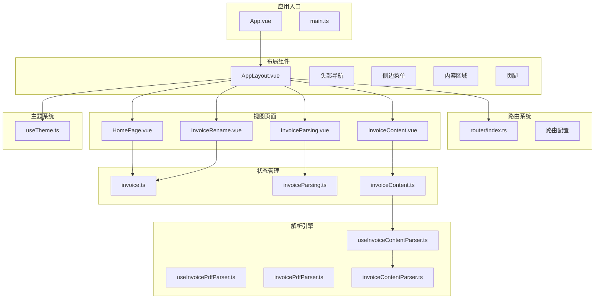
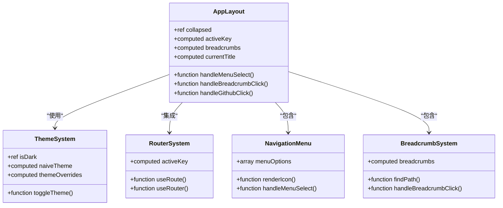
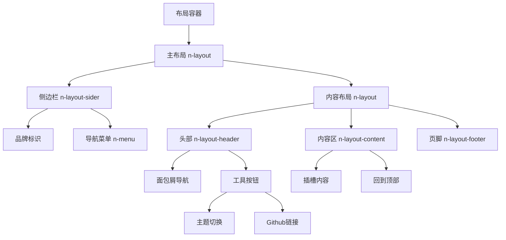
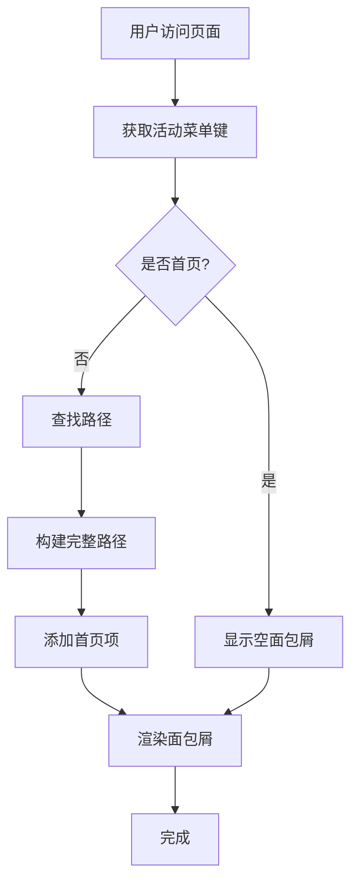
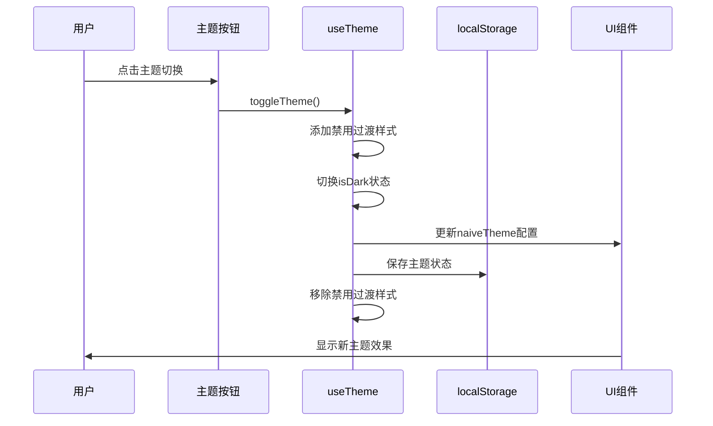
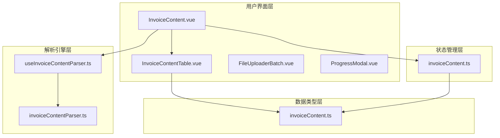
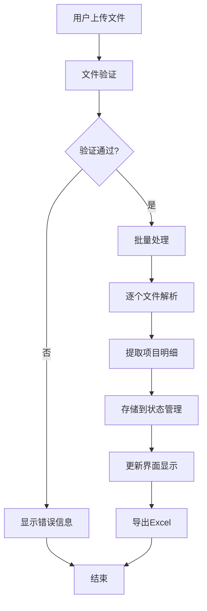
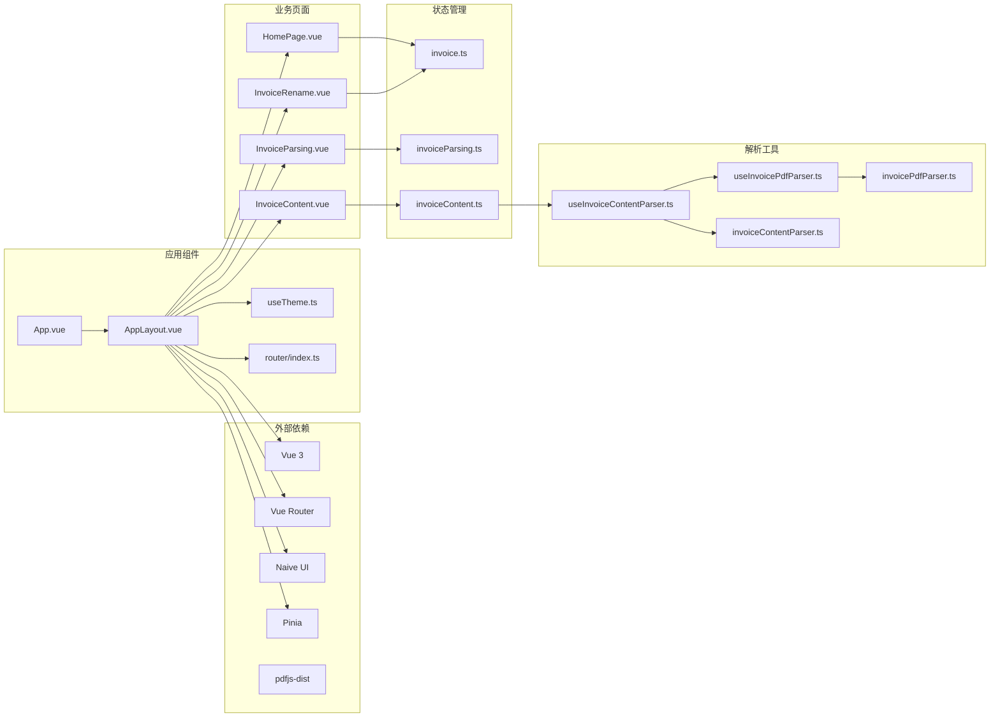
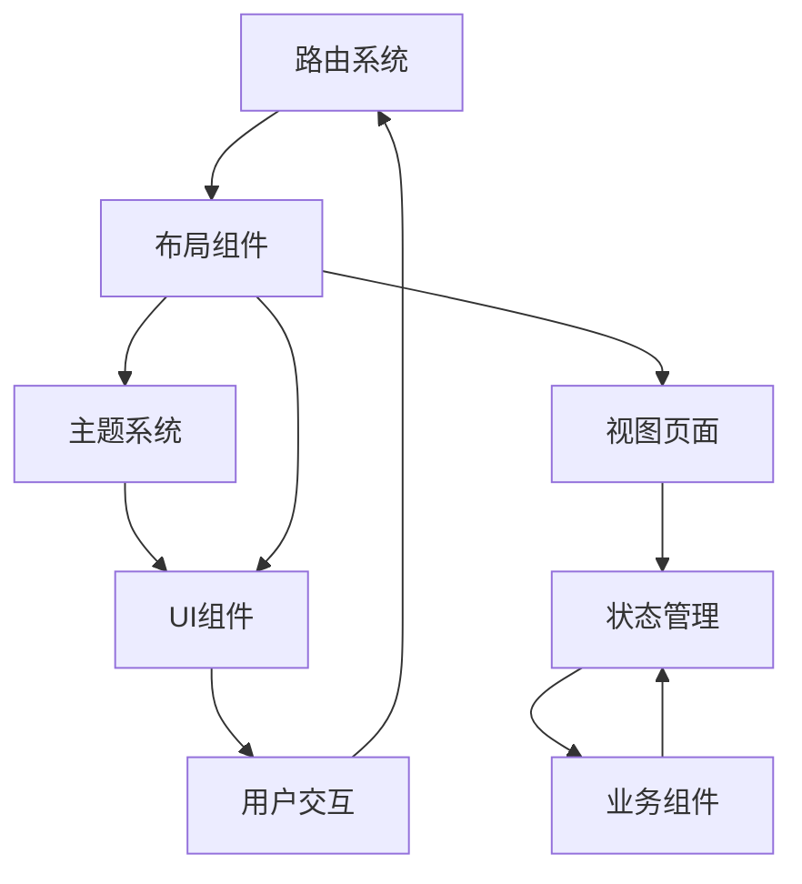

# AppLayout 根布局组件

<cite>
**本文档引用的文件**
- [AppLayout.vue](file://src/components/Common/AppLayout.vue)
- [index.ts](file://src/router/index.ts)
- [useTheme.ts](file://src/composables/useTheme.ts)
- [App.vue](file://src/App.vue)
- [HomePage.vue](file://src/views/HomePage.vue)
- [InvoiceContent.vue](file://src/views/InvoiceContent.vue)
- [InvoiceRename.vue](file://src/views/InvoiceRename.vue)
- [InvoiceParsing.vue](file://src/views/InvoiceParsing.vue)
- [InvoiceContentTable.vue](file://src/components/Invoice/InvoiceContentTable.vue)
- [invoiceContent.ts](file://src/stores/invoiceContent.ts)
- [useInvoiceContentParser.ts](file://src/composables/useInvoiceContentParser.ts)
- [invoiceContentParser.ts](file://src/utils/invoiceContentParser.ts)
- [invoiceContent.ts](file://src/types/invoiceContent.ts)
</cite>

## 更新摘要
**变更内容**
- 新增发票内容解析功能的布局适配说明
- 更新导航菜单系统，包含新的发票内容解析页面
- 增加发票内容解析页面的技术架构分析
- 完善状态管理和数据流分析
- 更新组件依赖关系图

## 目录
1. [简介](#简介)
2. [项目结构](#项目结构)
3. [核心组件](#核心组件)
4. [架构概览](#架构概览)
5. [详细组件分析](#详细组件分析)
6. [发票内容解析功能](#发票内容解析功能)
7. [依赖关系分析](#依赖关系分析)
8. [性能考虑](#性能考虑)
9. [故障排除指南](#故障排除指南)
10. [结论](#结论)

## 简介

AppLayout 是本财务工具箱应用的根布局组件，作为应用的整体框架容器，负责协调页面导航、主题切换、响应式布局等功能。该组件基于 Vue 3 和 Naive UI 构建，集成了 Vue Router 实现页面导航结构，通过插槽机制容纳不同页面内容，为用户提供一致的用户体验。

**更新** 新增了发票内容解析功能的完整布局适配，包括新的导航菜单项和页面集成。

## 项目结构

财务工具箱采用模块化架构设计，主要包含以下核心模块：

**图表来源**
- [App.vue](file://src/App.vue#L1-L44)
- [AppLayout.vue](file://src/components/Common/AppLayout.vue#L1-L355)
- [index.ts](file://src/router/index.ts#L1-L47)

**章节来源**
- [App.vue](file://src/App.vue#L1-L44)
- [AppLayout.vue](file://src/components/Common/AppLayout.vue#L1-L355)
- [index.ts](file://src/router/index.ts#L1-L47)

## 核心组件

AppLayout 组件是整个应用的根容器，具有以下核心特性：

### 响应式布局架构

组件采用三栏式布局设计：
- **左侧侧边栏**：包含品牌标识和导航菜单
- **中间内容区**：主内容展示区域
- **顶部导航栏**：面包屑导航和工具按钮
- **底部页脚**：版权信息

### 导航系统集成

通过 Vue Router 实现页面导航：
- 动态菜单生成和激活状态管理
- 面包屑导航自动生成
- 路由跳转和页面标题同步

### 主题切换功能

集成 useTheme 组合式函数实现：
- 深色/浅色模式切换
- 主题状态持久化存储
- Naive UI 主题配置

**章节来源**
- [AppLayout.vue](file://src/components/Common/AppLayout.vue#L106-L250)
- [useTheme.ts](file://src/composables/useTheme.ts#L21-L86)

## 架构概览

AppLayout 的整体架构体现了清晰的关注点分离：

**图表来源**
- [AppLayout.vue](file://src/components/Common/AppLayout.vue#L106-L250)
- [useTheme.ts](file://src/composables/useTheme.ts#L21-L86)

## 详细组件分析

### 布局结构设计

AppLayout 采用 Naive UI 的布局组件体系：

**图表来源**
- [AppLayout.vue](file://src/components/Common/AppLayout.vue#L1-L104)

### 导航菜单系统

菜单系统采用层级结构设计：

| 菜单项 | 键值 | 路径 | 页面 |
|--------|------|------|------|
| 首页 | home | `/` | HomePage |
| 发票工具 | invoice-tools | - | 分组菜单 |
| 📝 发票重命名 | invoice-rename | `/invoice-rename` | InvoiceRename |
| 📊 发票解析 | invoice-parsing | `/invoice-parsing` | InvoiceParsing |
| 📊 发票内容解析 | invoice-content | `/invoice-content` | InvoiceContent |

**更新** 新增了发票内容解析功能，提供更精细的发票项目明细解析能力。

### 面包屑导航机制

面包屑系统根据当前路由动态生成：

**图表来源**
- [AppLayout.vue](file://src/components/Common/AppLayout.vue#L188-L223)

### 主题切换系统

主题切换采用组合式函数模式：

**图表来源**
- [useTheme.ts](file://src/composables/useTheme.ts#L48-L68)

**章节来源**
- [AppLayout.vue](file://src/components/Common/AppLayout.vue#L149-L223)
- [useTheme.ts](file://src/composables/useTheme.ts#L48-L86)

## 发票内容解析功能

**新增** 发票内容解析功能是AppLayout集成的新模块，专门用于解析发票中的项目明细行。

### 功能概述

发票内容解析功能提供以下核心能力：
- PDF发票文件批量上传和解析
- 项目明细行自动提取和结构化
- Excel格式导出支持
- 搜索和筛选功能
- 进度可视化反馈

### 技术架构

**图表来源**
- [InvoiceContent.vue](file://src/views/InvoiceContent.vue#L1-L311)
- [invoiceContent.ts](file://src/stores/invoiceContent.ts#L1-L189)
- [useInvoiceContentParser.ts](file://src/composables/useInvoiceContentParser.ts#L1-L178)

### 解析流程

**图表来源**
- [InvoiceContent.vue](file://src/views/InvoiceContent.vue#L162-L206)
- [useInvoiceContentParser.ts](file://src/composables/useInvoiceContentParser.ts#L106-L168)

### 数据模型

发票内容解析涉及以下核心数据类型：

| 类型 | 字段 | 描述 |
|------|------|------|
| InvoiceContentItem | id, sourceFileName, sourceFileId | 项目明细行的基本信息 |
| InvoiceContentItem | goodsName, specification, unit | 货物或服务相关信息 |
| InvoiceContentItem | quantity, unitPrice, amount | 数量和价格信息 |
| InvoiceContentItem | taxRate, taxAmount | 税收相关信息 |
| InvoiceContentParseResult | fileId, fileName, items | 单文件解析结果 |

**章节来源**
- [AppLayout.vue](file://src/components/Common/AppLayout.vue#L154-L179)
- [index.ts](file://src/router/index.ts#L27-L32)
- [InvoiceContent.vue](file://src/views/InvoiceContent.vue#L1-L311)
- [invoiceContent.ts](file://src/stores/invoiceContent.ts#L1-L189)
- [useInvoiceContentParser.ts](file://src/composables/useInvoiceContentParser.ts#L1-L178)

## 依赖关系分析

### 组件依赖图

**图表来源**
- [App.vue](file://src/App.vue#L16-L23)
- [AppLayout.vue](file://src/components/Common/AppLayout.vue#L107-L133)

### 数据流分析

应用采用单向数据流设计：

**图表来源**
- [index.ts](file://src/router/index.ts#L7-L32)
- [AppLayout.vue](file://src/components/Common/AppLayout.vue#L135-L147)

**章节来源**
- [App.vue](file://src/App.vue#L16-L23)
- [index.ts](file://src/router/index.ts#L1-L47)

## 性能考虑

### 响应式设计优化

- 使用 CSS Grid 和 Flexbox 实现自适应布局
- 移动端优先的设计策略
- 图标懒加载和按需渲染

### 主题切换性能

- 临时禁用过渡动画避免视觉闪烁
- 异步主题切换确保 DOM 更新完成
- localStorage 持久化减少初始化开销

### 导航性能

- 菜单选项预定义减少运行时计算
- 面包屑路径缓存避免重复计算
- 路由守卫优化页面切换

### 发票内容解析性能

- 批量处理机制优化大文件处理
- 进度条实时反馈提升用户体验
- 内存管理避免解析过程中的内存泄漏

**更新** 新增了发票内容解析功能的性能优化考虑。

## 故障排除指南

### 常见问题及解决方案

| 问题类型 | 症状 | 解决方案 |
|----------|------|----------|
| 菜单不显示 | 侧边栏空白 | 检查 menuOptions 配置 |
| 面包屑异常 | 导航路径错误 | 验证路由配置和 activeKey 计算 |
| 主题切换失效 | 深色模式不生效 | 检查 localStorage 权限和 useTheme 返回值 |
| 页面内容不显示 | 插槽内容缺失 | 确认 App.vue 中的 router-view 包装 |
| 发票解析失败 | 解析无结果 | 检查PDF文件格式和大小限制 |
| 数据导出错误 | Excel导出失败 | 验证数据格式和浏览器兼容性 |

### 调试建议

1. **检查路由配置**：验证路由表中各页面的路径和组件映射
2. **监控主题状态**：使用浏览器开发者工具查看 localStorage 中的主题状态
3. **调试菜单逻辑**：在 handleMenuSelect 中添加日志输出
4. **验证插槽内容**：确认子组件正确使用了插槽机制
5. **发票解析调试**：检查文件验证和解析流程的日志输出

**更新** 新增了发票内容解析功能的故障排除指导。

**章节来源**
- [AppLayout.vue](file://src/components/Common/AppLayout.vue#L229-L249)
- [useTheme.ts](file://src/composables/useTheme.ts#L71-L78)

## 结论

AppLayout 组件作为财务工具箱应用的根布局容器，成功实现了以下目标：

1. **统一的用户体验**：通过一致的导航和主题设计提供流畅的用户体验
2. **模块化的架构**：清晰的组件分离和职责划分便于维护和扩展
3. **响应式设计**：适配不同设备尺寸的布局系统
4. **可扩展性**：灵活的插槽机制和组合式函数设计支持未来功能扩展
5. **完整的发票处理生态**：从重命名、解析到内容提取的全链路支持

**更新** 新增的发票内容解析功能进一步完善了应用的功能完整性，通过精确的坐标识别和表格解析技术，为用户提供专业的发票数据分析能力。

该组件为应用提供了坚实的基础框架，通过合理的架构设计和最佳实践，确保了系统的可维护性和可扩展性。未来在新增功能模块时，可以遵循现有的设计模式，保持 UI 一致性和用户体验的连贯性。