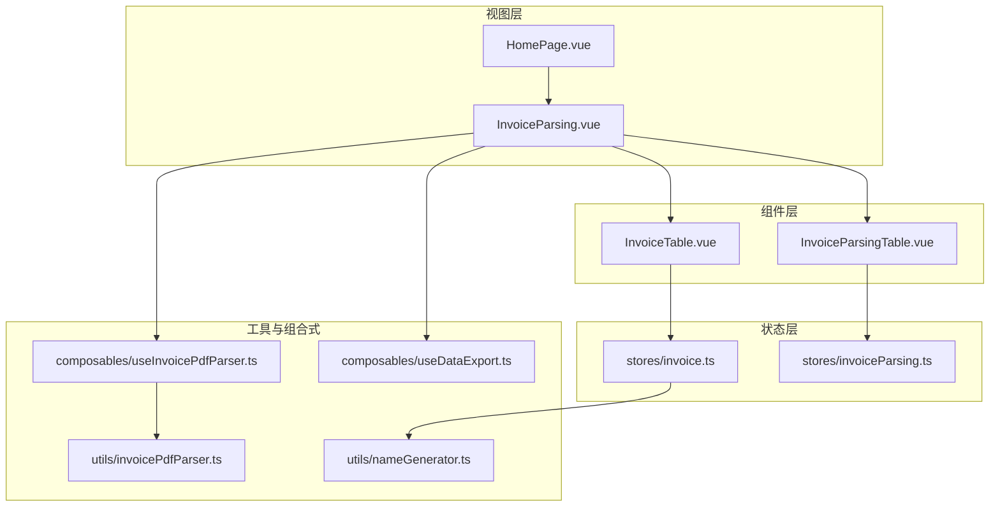
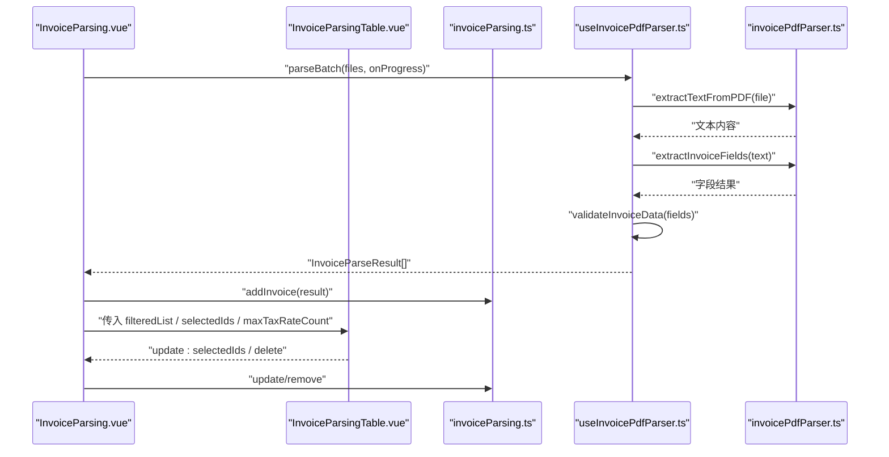
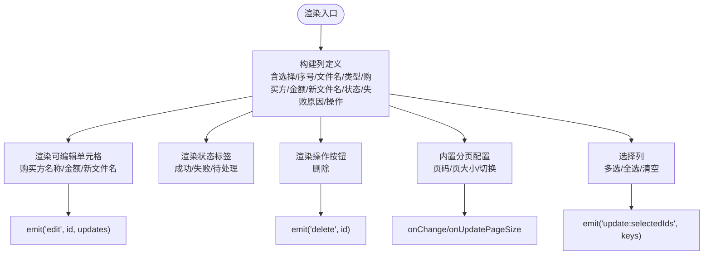
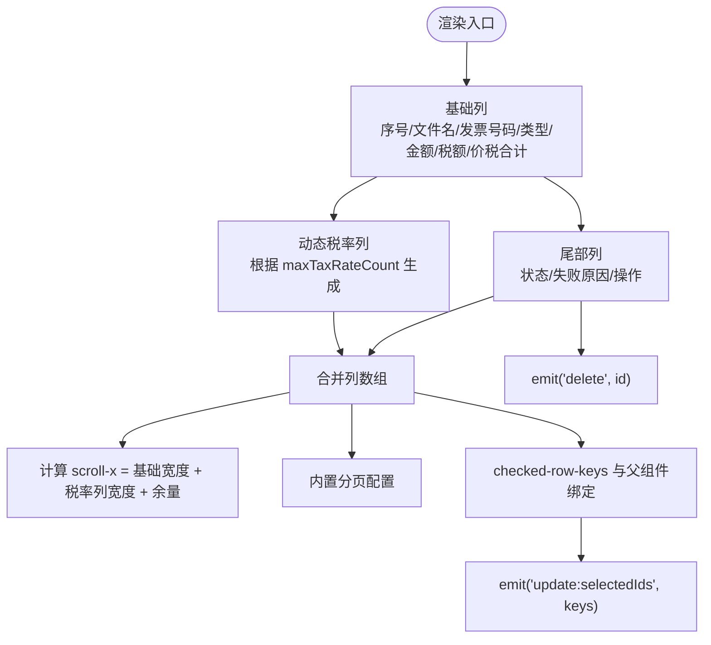
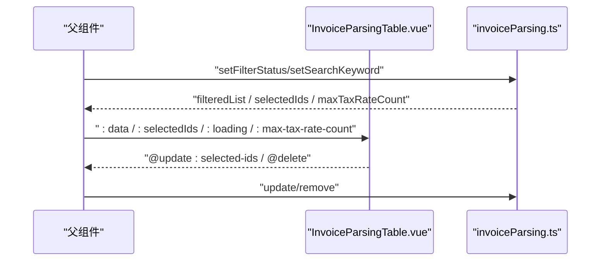
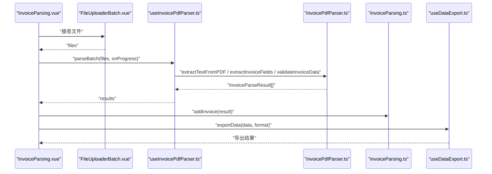
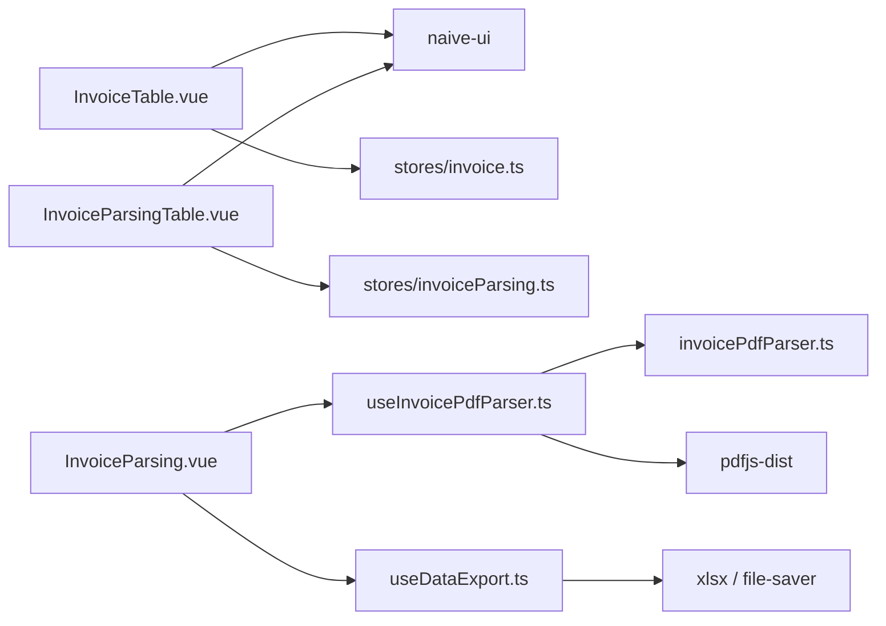

# 发票数据表格组件

<cite>
**本文引用的文件**
- [InvoiceTable.vue](file://src/components/InvoiceTable.vue)
- [InvoiceParsingTable.vue](file://src/components/InvoiceParsingTable.vue)
- [invoice.ts](file://src/stores/invoice.ts)
- [invoiceParsing.ts](file://src/stores/invoiceParsing.ts)
- [useInvoicePdfParser.ts](file://src/composables/useInvoicePdfParser.ts)
- [InvoiceParsing.vue](file://src/views/InvoiceParsing.vue)
- [HomePage.vue](file://src/views/HomePage.vue)
- [invoicePdfParser.ts](file://src/utils/invoicePdfParser.ts)
- [nameGenerator.ts](file://src/utils/nameGenerator.ts)
- [useDataExport.ts](file://src/composables/useDataExport.ts)
- [package.json](file://package.json)
</cite>

## 目录
1. [简介](#简介)
2. [项目结构](#项目结构)
3. [核心组件](#核心组件)
4. [架构总览](#架构总览)
5. [组件详细分析](#组件详细分析)
6. [依赖关系分析](#依赖关系分析)
7. [性能考量](#性能考量)
8. [故障排查指南](#故障排查指南)
9. [结论](#结论)

## 简介
本文件聚焦于两个发票数据表格组件：InvoiceTable 与 InvoiceParsingTable。前者用于“发票重命名”场景，展示原始文件名、新文件名、金额、购买方名称等字段，并支持对部分字段进行就地编辑；后者用于“发票解析”场景，展示结构化解析结果，支持动态税率列、排序与筛选。二者均基于 Naive UI 的 n-data-table 进行定制化封装，在复用表格基础能力的同时扩展了特定功能。本文将系统阐述其设计理念、技术实现、与 Pinia 状态管理的数据绑定机制，以及通过插槽与渲染函数实现的操作列自定义方式，并给出在大数据量下的性能优化建议。

## 项目结构
围绕发票数据表格组件的相关文件组织如下：
- 组件层：InvoiceTable.vue、InvoiceParsingTable.vue
- 状态层：stores/invoice.ts、stores/invoiceParsing.ts
- 视图层：views/InvoiceParsing.vue、views/HomePage.vue
- 工具与组合式：utils/invoicePdfParser.ts、utils/nameGenerator.ts、composables/useInvoicePdfParser.ts、composables/useDataExport.ts
- 依赖：package.json

图表来源
- [HomePage.vue](file://src/views/HomePage.vue#L1-L124)
- [InvoiceParsing.vue](file://src/views/InvoiceParsing.vue#L1-L328)
- [InvoiceTable.vue](file://src/components/InvoiceTable.vue#L1-L182)
- [InvoiceParsingTable.vue](file://src/components/InvoiceParsingTable.vue#L1-L157)
- [invoice.ts](file://src/stores/invoice.ts#L1-L256)
- [invoiceParsing.ts](file://src/stores/invoiceParsing.ts#L1-L241)
- [useInvoicePdfParser.ts](file://src/composables/useInvoicePdfParser.ts#L1-L173)
- [invoicePdfParser.ts](file://src/utils/invoicePdfParser.ts#L1-L349)
- [nameGenerator.ts](file://src/utils/nameGenerator.ts#L1-L250)
- [useDataExport.ts](file://src/composables/useDataExport.ts#L1-L308)

章节来源
- [package.json](file://package.json#L1-L33)

## 核心组件
- InvoiceTable：面向“发票重命名”结果展示，强调文件名预览与就地编辑能力，支持删除操作与分页。
- InvoiceParsingTable：面向“发票解析”结果展示，强调结构化字段与动态税率列，支持排序、筛选、分页与加载态。

章节来源
- [InvoiceTable.vue](file://src/components/InvoiceTable.vue#L1-L182)
- [InvoiceParsingTable.vue](file://src/components/InvoiceParsingTable.vue#L1-L157)

## 架构总览
二者均以 n-data-table 为核心，通过 props 接收数据与选中项，通过 emits 与父组件通信，结合 Pinia store 实现数据驱动与状态同步。

图表来源
- [InvoiceParsing.vue](file://src/views/InvoiceParsing.vue#L122-L302)
- [InvoiceParsingTable.vue](file://src/components/InvoiceParsingTable.vue#L1-L157)
- [invoiceParsing.ts](file://src/stores/invoiceParsing.ts#L1-L241)
- [useInvoicePdfParser.ts](file://src/composables/useInvoicePdfParser.ts#L1-L173)
- [invoicePdfParser.ts](file://src/utils/invoicePdfParser.ts#L1-L349)

## 组件详细分析

### InvoiceTable 设计与实现
- 数据模型与列定义
  - 行数据包含原始文件名、发票类型、购买方名称、金额、新文件名、状态、失败原因等字段。
  - 列采用固定宽度与省略策略，确保在有限宽度下具备良好可读性。
- 可编辑字段
  - 购买方名称、金额、新文件名通过输入控件渲染，支持就地编辑并通过事件向上通知父组件更新。
- 状态与失败原因展示
  - 状态使用标签组件展示成功/失败/待处理三态；失败原因在失败状态下高亮显示。
- 操作列
  - 固定右侧操作列，提供删除按钮，点击触发删除事件。
- 分页与选择
  - 内置分页配置，支持页码与页大小切换；通过选择列实现多选，选中键变更通过事件回传。

图表来源
- [InvoiceTable.vue](file://src/components/InvoiceTable.vue#L1-L182)

章节来源
- [InvoiceTable.vue](file://src/components/InvoiceTable.vue#L1-L182)

### InvoiceParsingTable 设计与实现
- 数据模型与列定义
  - 行数据包含文件名、发票号码、发票类型、金额、税额、价税合计等基础字段。
  - 动态税率列：根据 store 中的最大税率数量动态生成“税率1/2/...”，并在无值时显示占位。
- 状态与失败原因展示
  - 状态标签映射中文状态；失败原因在失败状态下高亮显示。
- 操作列
  - 固定右侧操作列，提供删除按钮，点击触发删除事件。
- 分页与选择
  - 内置分页配置；通过 checked-row-keys 与父组件双向绑定选中项。
- 动态列与横向滚动
  - 动态列数量由 store 的 maxTaxRateCount 计算得出；横向滚动宽度随列数线性增长，保证可浏览性。

图表来源
- [InvoiceParsingTable.vue](file://src/components/InvoiceParsingTable.vue#L1-L157)
- [invoiceParsing.ts](file://src/stores/invoiceParsing.ts#L105-L114)

章节来源
- [InvoiceParsingTable.vue](file://src/components/InvoiceParsingTable.vue#L1-L157)
- [invoiceParsing.ts](file://src/stores/invoiceParsing.ts#L1-L241)

### 与状态管理的数据绑定机制
- InvoiceTable
  - 父组件通过 props 传入 data 与 selectedIds，组件内部通过 emits 将选中项变化回传给父组件。
  - store 中的过滤与搜索逻辑在父组件中实现，组件只负责展示与交互。
- InvoiceParsingTable
  - 父组件通过 props 传入 filteredList、selectedIds、loading、maxTaxRateCount，组件内部通过 emits 将选中项变化与删除事件回传给父组件。
  - store 中的过滤与搜索逻辑在父组件中实现，组件只负责展示与交互。

图表来源
- [InvoiceParsing.vue](file://src/views/InvoiceParsing.vue#L178-L183)
- [InvoiceParsingTable.vue](file://src/components/InvoiceParsingTable.vue#L1-L157)
- [invoiceParsing.ts](file://src/stores/invoiceParsing.ts#L71-L91)

章节来源
- [InvoiceParsing.vue](file://src/views/InvoiceParsing.vue#L178-L183)
- [InvoiceParsingTable.vue](file://src/components/InvoiceParsingTable.vue#L1-L157)
- [invoiceParsing.ts](file://src/stores/invoiceParsing.ts#L1-L241)

### 插槽与渲染函数的自定义
- 渲染函数（render）
  - 二者均通过 render 函数实现复杂单元格渲染：输入控件用于就地编辑、标签用于状态展示、按钮用于操作。
- 固定列与操作列
  - 操作列通过 fixed 属性固定在右侧，确保在横向滚动时仍可操作。
- 插槽
  - 组件未使用 Naive UI 的具名插槽，而是通过 render 函数与 props 的组合实现高度定制化。

章节来源
- [InvoiceTable.vue](file://src/components/InvoiceTable.vue#L41-L162)
- [InvoiceParsingTable.vue](file://src/components/InvoiceParsingTable.vue#L34-L136)

### 与发票解析流程的集成
- 文件上传与解析
  - 视图层通过 FileUploaderBatch 接收文件，调用 useInvoicePdfParser 的 parseBatch 并在进度回调中更新 UI。
  - 解析结果经 validateInvoiceData 校验后，写入 invoiceParsing store。
- 导出功能
  - 视图层根据用户选择导出 Excel 或 JSON，使用 useDataExport 组合式函数执行导出。

图表来源
- [InvoiceParsing.vue](file://src/views/InvoiceParsing.vue#L188-L232)
- [useInvoicePdfParser.ts](file://src/composables/useInvoicePdfParser.ts#L96-L153)
- [invoicePdfParser.ts](file://src/utils/invoicePdfParser.ts#L97-L152)
- [invoiceParsing.ts](file://src/stores/invoiceParsing.ts#L122-L128)
- [useDataExport.ts](file://src/composables/useDataExport.ts#L191-L201)

章节来源
- [InvoiceParsing.vue](file://src/views/InvoiceParsing.vue#L1-L328)
- [useInvoicePdfParser.ts](file://src/composables/useInvoicePdfParser.ts#L1-L173)
- [invoicePdfParser.ts](file://src/utils/invoicePdfParser.ts#L1-L349)
- [useDataExport.ts](file://src/composables/useDataExport.ts#L1-L308)

## 依赖关系分析
- 组件依赖
  - InvoiceTable 依赖 Naive UI 的 n-data-table、n-tag、n-button、n-input。
  - InvoiceParsingTable 依赖 Naive UI 的 n-data-table、n-tag、n-button。
- 状态依赖
  - 二者均依赖各自 store 的 filteredList、selectedIds、maxTaxRateCount 等计算属性与方法。
- 工具与组合式依赖
  - 解析流程依赖 pdfjs-dist 与 invoicePdfParser 工具函数。
  - 导出功能依赖 xlsx 与 file-saver。

图表来源
- [InvoiceTable.vue](file://src/components/InvoiceTable.vue#L14-L15)
- [InvoiceParsingTable.vue](file://src/components/InvoiceParsingTable.vue#L15-L16)
- [invoice.ts](file://src/stores/invoice.ts#L1-L256)
- [invoiceParsing.ts](file://src/stores/invoiceParsing.ts#L1-L241)
- [InvoiceParsing.vue](file://src/views/InvoiceParsing.vue#L140-L151)
- [useInvoicePdfParser.ts](file://src/composables/useInvoicePdfParser.ts#L5-L11)
- [useDataExport.ts](file://src/composables/useDataExport.ts#L5-L8)
- [package.json](file://package.json#L12-L22)

章节来源
- [package.json](file://package.json#L12-L22)

## 性能考量
- 大数据量下的滚动与渲染
  - 二者均设置横向滚动宽度，避免列过多导致布局抖动。对于超大数据集，建议引入虚拟滚动（如 n-data-table 的虚拟滚动能力）以降低 DOM 节点数量，提升渲染性能。
- 分页与懒加载
  - 已内置分页配置，建议在数据量极大时结合服务端分页或前端分页配合节流/防抖，减少频繁重排。
- 渲染函数优化
  - 将 render 函数内的组件实例化逻辑保持简洁，避免在 render 中创建重型对象；必要时使用 computed 缓存中间结果。
- 导出性能
  - Excel 导出涉及大数组转表与列宽设置，建议在导出前对数据进行必要的裁剪与格式化，避免不必要的字段参与导出。
- 解析并发控制
  - 批量解析已采用分批并发策略，建议根据设备性能动态调整批次大小，避免主线程阻塞。

[本节为通用性能建议，不直接分析具体文件，故无章节来源]

## 故障排查指南
- 表格列错位或滚动异常
  - 检查横向滚动宽度计算是否与列数一致；动态列数量来自 store 的 maxTaxRateCount，需确保 store 正确更新。
- 状态与失败原因显示异常
  - 确认状态枚举与映射一致；失败原因仅在状态为失败时展示。
- 就地编辑无效
  - 确认父组件正确监听 edit 事件并调用 store 的更新方法；检查事件参数是否包含正确的字段与值。
- 删除操作未生效
  - 确认父组件监听 delete 事件并调用 store 的删除方法；检查 id 是否正确传递。
- 导出失败
  - 检查导出数据是否为空；确认导出格式与数据结构匹配；查看浏览器控制台错误信息。

章节来源
- [InvoiceTable.vue](file://src/components/InvoiceTable.vue#L76-L115)
- [InvoiceParsingTable.vue](file://src/components/InvoiceParsingTable.vue#L89-L95)
- [InvoiceParsing.vue](file://src/views/InvoiceParsing.vue#L237-L268)
- [useDataExport.ts](file://src/composables/useDataExport.ts#L118-L127)

## 结论
InvoiceTable 与 InvoiceParsingTable 在 Naive UI 的 n-data-table 基础上实现了高度定制化的数据展示：前者强调文件名预览与就地编辑，后者强调结构化字段与动态税率列。二者通过 props 与 emits 与父组件解耦，结合 Pinia store 实现数据驱动与状态同步。在大数据量场景下，建议引入虚拟滚动、分页与导出优化策略，以获得更流畅的用户体验。