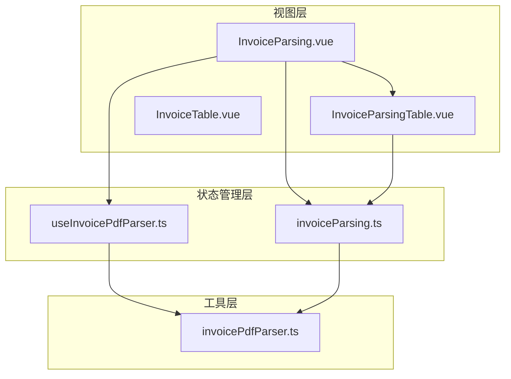
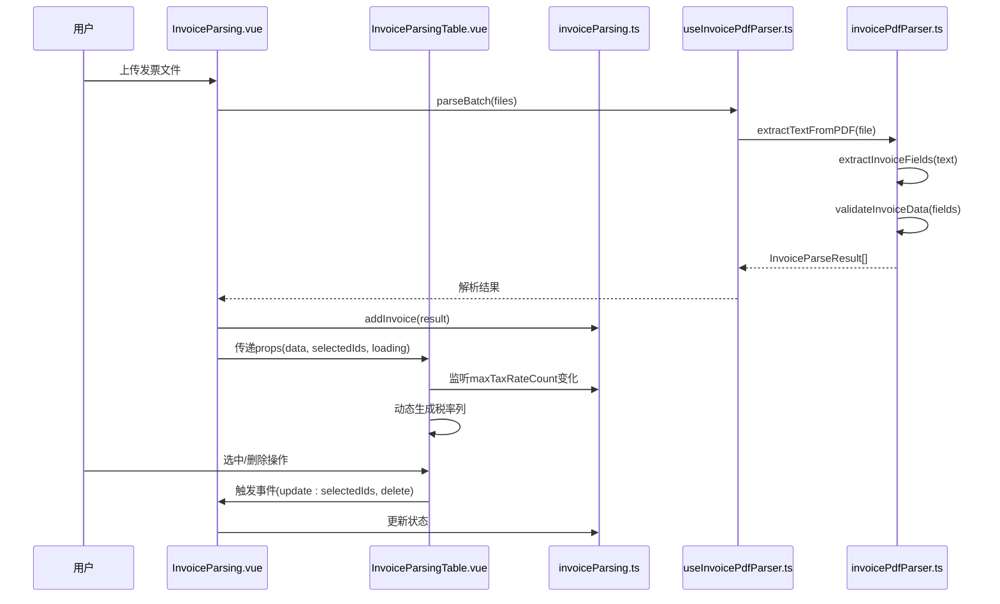
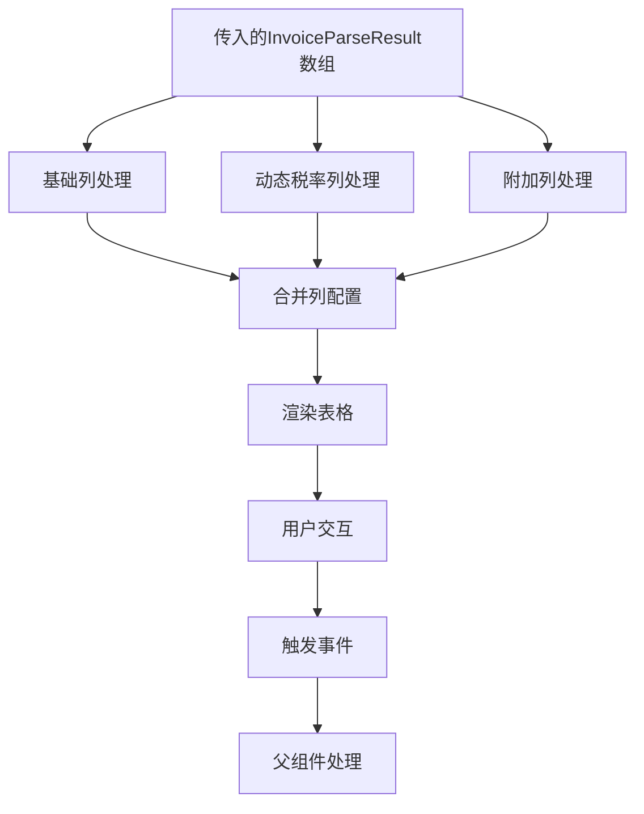
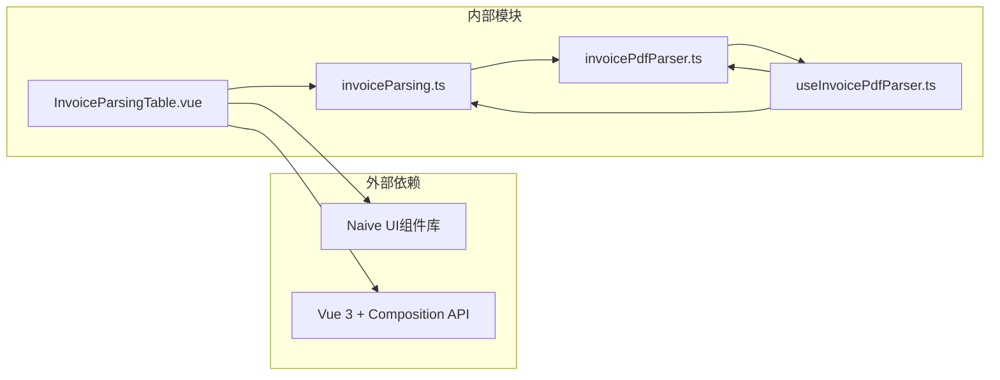

# 发票解析结果表格组件

<cite>
**本文档引用的文件**
- [InvoiceParsingTable.vue](file://src/components/Invoice/InvoiceParsingTable.vue)
- [invoiceParsing.ts](file://src/stores/invoiceParsing.ts)
- [InvoiceParsing.vue](file://src/views/InvoiceParsing.vue)
- [invoicePdfParser.ts](file://src/utils/invoicePdfParser.ts)
- [useInvoicePdfParser.ts](file://src/composables/useInvoicePdfParser.ts)
- [InvoiceTable.vue](file://src/components/Invoice/InvoiceTable.vue)
</cite>

## 更新摘要
**变更内容**
- 更新了发票类型分类逻辑，将电子普通发票统一归类为普票
- 优化了金额列在暗色模式下的可读性，使用CSS变量和等宽字体
- 现代化表格样式，移除了纵向分割线，增强了hover和选中行效果
- 更新了相关章节以反映代码变更

## 目录
1. [简介](#简介)
2. [项目结构](#项目结构)
3. [核心组件](#核心组件)
4. [架构概览](#架构概览)
5. [详细组件分析](#详细组件分析)
6. [依赖关系分析](#依赖关系分析)
7. [性能考虑](#性能考虑)
8. [故障排除指南](#故障排除指南)
9. [结论](#结论)

## 简介

InvoiceParsingTable组件是发票解析功能的核心UI组件，专门用于展示和管理发票解析结果。该组件采用Vue 3 Composition API和TypeScript实现，提供了高度动态和灵活的表格展示能力，能够适应不同发票类型的多税率需求。

该组件的主要设计理念包括：
- **动态列渲染**：根据发票的实际税率数量动态生成税率列
- **优雅的空值处理**：对缺失数据进行友好的占位显示
- **响应式状态管理**：与Pinia store深度集成，支持实时状态同步
- **异步加载支持**：提供loading状态指示，改善用户体验
- **选中行管理**：支持单选、全选和批量操作功能

## 项目结构

该项目采用模块化的前端架构，InvoiceParsingTable组件位于components目录下，与相关的store、composables和views形成完整的功能体系。



**图表来源**
- [InvoiceParsing.vue](file://src/views/InvoiceParsing.vue#L1-L328)
- [InvoiceParsingTable.vue](file://src/components/Invoice/InvoiceParsingTable.vue#L1-L286)
- [invoiceParsing.ts](file://src/stores/invoiceParsing.ts#L1-L222)

**章节来源**
- [InvoiceParsing.vue](file://src/views/InvoiceParsing.vue#L1-L328)
- [InvoiceParsingTable.vue](file://src/components/Invoice/InvoiceParsingTable.vue#L1-L286)

## 核心组件

InvoiceParsingTable组件是整个发票解析系统的核心UI组件，具有以下关键特性：

### 数据模型映射
组件直接使用InvoiceParseResult接口作为数据模型，确保了类型安全和数据一致性。该模型包含了发票解析的所有关键信息：
- 基础信息：文件名、发票号码、发票类型
- 金额信息：不含税金额、税额、价税合计
- 税率信息：支持多税率的动态数组
- 状态信息：解析状态和错误信息

### 动态列生成机制
组件最突出的特性是其动态列生成能力，特别是针对多税率发票的支持：

```mermaid
flowchart TD
Start([接收maxTaxRateCount参数]) --> CheckCount{检查税率数量}
CheckCount --> |count > 0| GenerateCols[生成动态税率列]
CheckCount --> |count = 0| SkipGen[跳过动态列]
GenerateCols --> Loop[循环生成1..n列]
Loop --> SetTitle[设置列标题"税率"+i]
SetTitle --> SetKey[设置列键"taxRate"+i]
SetKey --> SetWidth[设置列宽100px]
SetWidth --> RenderCell[设置单元格渲染器]
RenderCell --> CheckData{检查数据存在性}
CheckData --> |存在| ShowRate[显示税率值]
CheckData --> |不存在| ShowPlaceholder[显示"-"占位符]
ShowRate --> NextCol[生成下一列]
ShowPlaceholder --> NextCol
NextCol --> |i < count| Loop
NextCol --> |i = count| ReturnCols[返回列配置]
SkipGen --> ReturnCols
```

**图表来源**
- [InvoiceParsingTable.vue](file://src/components/Invoice/InvoiceParsingTable.vue#L144-L160)

### 空值优雅处理
组件实现了统一的空值处理策略，使用占位符"-"来表示缺失的数据，同时应用灰色字体样式，确保界面的一致性和可读性。

**章节来源**
- [InvoiceParsingTable.vue](file://src/components/Invoice/InvoiceParsingTable.vue#L36-L41)
- [invoiceParsing.ts](file://src/stores/invoiceParsing.ts#L17-L31)

## 架构概览

InvoiceParsingTable组件在整个发票解析系统中扮演着承上启下的关键角色，连接了数据解析层、状态管理层和用户界面层。



**图表来源**
- [InvoiceParsing.vue](file://src/views/InvoiceParsing.vue#L188-L232)
- [InvoiceParsingTable.vue](file://src/components/Invoice/InvoiceParsingTable.vue#L22-L32)
- [invoiceParsing.ts](file://src/stores/invoiceParsing.ts#L122-L128)
- [useInvoicePdfParser.ts](file://src/composables/useInvoicePdfParser.ts#L96-L153)

## 详细组件分析

### 组件结构设计

InvoiceParsingTable组件采用了模块化的列配置设计，将表格结构分为三个主要部分：

#### 基础列配置
基础列包含了发票解析中最常用的固定字段：
- **序号列**：提供行索引显示
- **文件名列**：显示原始文件名，支持省略号和工具提示
- **发票号码列**：显示发票编号，支持超长文本省略
- **发票类型列**：显示发票类型（普票/专票）
- **金额相关列**：包含不含税金额、税额、价税合计

#### 动态税率列
这是组件最具创新性的部分，通过computed属性动态生成：
- **列数量**：基于maxTaxRateCount属性动态确定
- **列标题**：格式化为"税率1"、"税率2"等
- **列键名**：格式化为"taxRate1"、"taxRate2"等
- **渲染逻辑**：检查数据存在性，不存在时显示占位符

#### 附加列配置
- **状态列**：使用NTag组件显示解析状态（成功/失败/待处理）
- **失败原因列**：显示具体的错误信息
- **操作列**：提供删除功能按钮

### 数据流处理

组件实现了完整的数据流处理机制，确保数据的准确性和一致性：



**图表来源**
- [InvoiceParsingTable.vue](file://src/components/Invoice/InvoiceParsingTable.vue#L34-L136)

### 选中行管理机制

组件实现了完整的选中行管理功能，支持多种选择模式：

#### 事件驱动的选择管理
- **选择事件监听**：通过@update:checked-row-keys事件接收选中状态
- **状态同步**：将选中状态实时同步到父组件的selectedIds数组
- **类型转换**：确保选中ID的字符串化处理

#### 与store的集成
组件与Pinia store建立了双向数据绑定：
- **单向数据流**：从store传递selectedIds到组件
- **事件回传**：组件通过事件将更新后的选中状态回传给store

### 异步加载状态支持

组件提供了完整的异步加载状态管理：
- **loading属性**：接收来自父组件的loading状态
- **视觉反馈**：Naive UI的内置loading指示器
- **用户体验**：避免用户在数据加载时进行交互操作

**章节来源**
- [InvoiceParsingTable.vue](file://src/components/Invoice/InvoiceParsingTable.vue#L1-L286)
- [invoiceParsing.ts](file://src/stores/invoiceParsing.ts#L33-L60)

### 与InvoiceParseResult数据模型的映射

组件与InvoiceParseResult数据模型建立了紧密的映射关系：

#### 字段映射策略
- **一对一映射**：直接映射到对应的列键
- **条件渲染**：根据数据存在性决定显示内容
- **格式化处理**：对金额字段添加货币符号

#### 数据验证与处理
- **空值检查**：使用逻辑运算符处理undefined/null值
- **占位符策略**：统一使用"-"字符表示缺失数据
- **样式定制**：为占位符应用特定的CSS样式

### 动态列宽度计算

组件实现了智能的列宽度自适应机制：
- **基础宽度**：固定列的总宽度为910px
- **动态扩展**：每增加一个税率列，宽度增加100px
- **右侧固定列**：额外增加400px用于操作列和其他固定列

**章节来源**
- [InvoiceParsingTable.vue](file://src/components/Invoice/InvoiceParsingTable.vue#L201-L201)

## 依赖关系分析

InvoiceParsingTable组件的依赖关系体现了清晰的关注点分离：



**图表来源**
- [InvoiceParsingTable.vue](file://src/components/Invoice/InvoiceParsingTable.vue#L15-L18)
- [invoiceParsing.ts](file://src/stores/invoiceParsing.ts#L4-L5)

### 组件耦合度分析

组件设计遵循了低耦合高内聚的原则：
- **对外依赖**：仅依赖Naive UI和Vue 3，保持简洁
- **对内聚合**：将所有表格逻辑封装在单一组件中
- **状态管理**：通过props和events与父组件通信

### 数据流依赖

组件的数据流呈现单向依赖关系：
- **数据输入**：通过props接收数据，确保不可变性
- **状态输出**：通过events向父组件传递状态变更
- **计算依赖**：通过computed属性管理派生状态

**章节来源**
- [InvoiceParsingTable.vue](file://src/components/Invoice/InvoiceParsingTable.vue#L1-L286)
- [invoiceParsing.ts](file://src/stores/invoiceParsing.ts#L1-L222)

## 性能考虑

InvoiceParsingTable组件在设计时充分考虑了性能优化：

### 渲染性能优化
- **虚拟滚动**：Naive UI的内置虚拟滚动支持大数据集
- **懒加载**：动态列仅在需要时生成
- **最小重渲染**：使用computed属性避免不必要的重新计算

### 内存管理
- **引用传递**：通过props传递对象引用，避免深拷贝开销
- **事件解绑**：组件销毁时自动清理事件监听器
- **资源释放**：及时释放不再使用的计算属性引用

### 并发处理
- **批量操作**：支持批量删除和批量选择操作
- **异步处理**：解析过程完全异步，不影响UI响应性

## 故障排除指南

### 常见问题诊断

#### 动态列未显示
**可能原因**：
- maxTaxRateCount属性为0或未正确更新
- 发票数据中taxRates字段为空
- 组件未正确接收到props更新

**解决方案**：
- 检查store中的maxTaxRateCount计算属性
- 验证发票解析结果中taxRates字段的存在性
- 确认父组件正确传递了maxTaxRateCount属性

#### 空值显示异常
**可能原因**：
- 数据模型中的字段值为null而非undefined
- 自定义渲染函数逻辑错误
- CSS样式冲突

**解决方案**：
- 在渲染函数中同时检查null和undefined
- 验证数据模型的可选字段标记
- 检查组件样式覆盖情况

#### 选中状态不同步
**可能原因**：
- 事件监听器未正确绑定
- ID类型不匹配（string vs number）
- 父组件状态更新时机问题

**解决方案**：
- 确保@update:selected-ids事件正确绑定
- 在事件处理器中进行类型转换
- 检查父组件的状态更新逻辑

**章节来源**
- [InvoiceParsingTable.vue](file://src/components/Invoice/InvoiceParsingTable.vue#L89-L94)
- [InvoiceParsing.vue](file://src/views/InvoiceParsing.vue#L181-L183)

## 结论

InvoiceParsingTable组件展现了现代前端开发的最佳实践，通过以下关键特性实现了优秀的用户体验：

### 设计优势
- **动态适应性**：能够完美适应不同发票类型的多税率需求
- **数据完整性**：通过类型安全的接口确保数据的准确性
- **用户体验**：优雅的空值处理和异步加载状态提升用户满意度
- **可维护性**：清晰的代码结构和模块化设计便于后续维护

### 技术亮点
- **响应式架构**：与Pinia store的深度集成实现了真正的响应式数据绑定
- **性能优化**：通过computed属性和虚拟滚动确保了良好的性能表现
- **扩展性**：模块化的组件设计为未来功能扩展奠定了良好基础

### 与基础表格组件的差异化
相比InvoiceTable组件，InvoiceParsingTable在以下方面实现了显著增强：
- **数据丰富性**：支持多税率、多状态的复杂发票数据
- **动态性**：能够根据数据内容自动调整列结构
- **专业性**：针对发票解析场景进行了专门优化
- **交互性**：提供了更丰富的用户交互功能

该组件为整个发票解析系统的成功实施提供了坚实的基础，是现代前端组件设计的优秀范例。