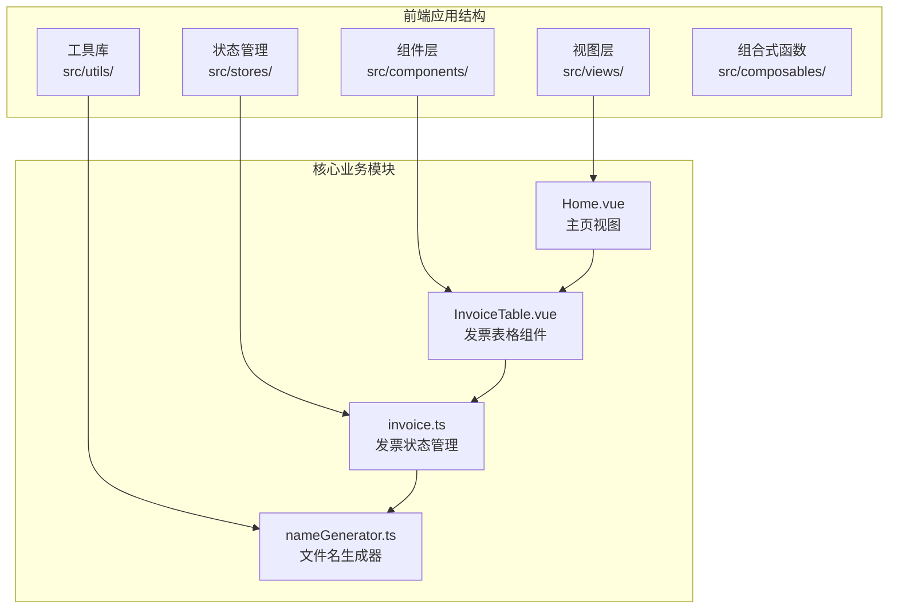
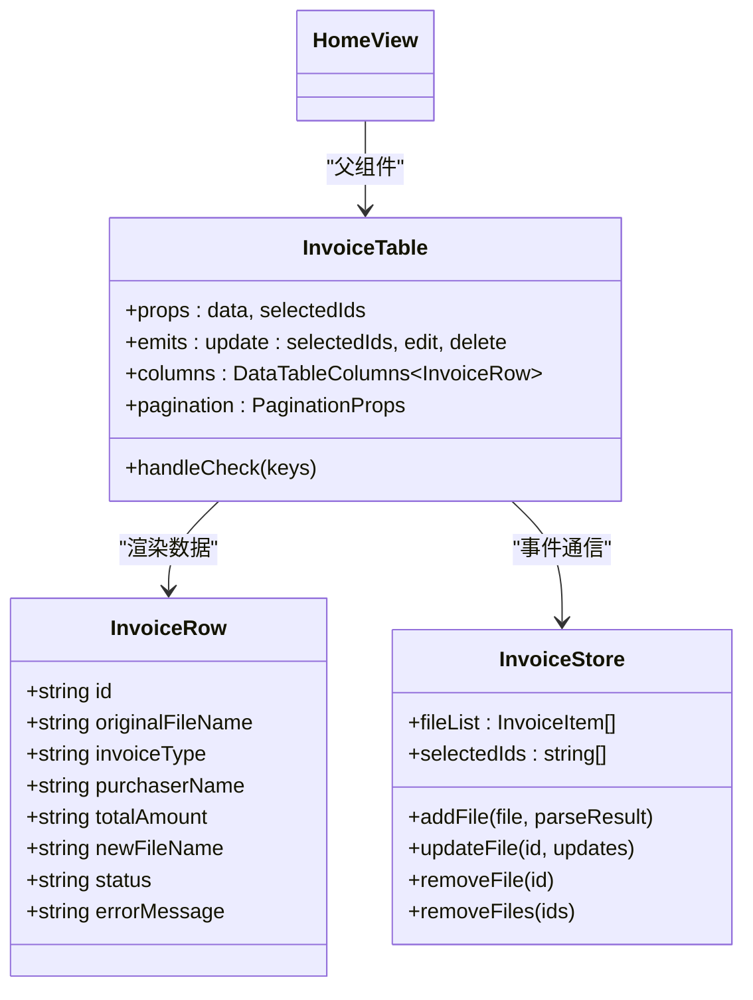
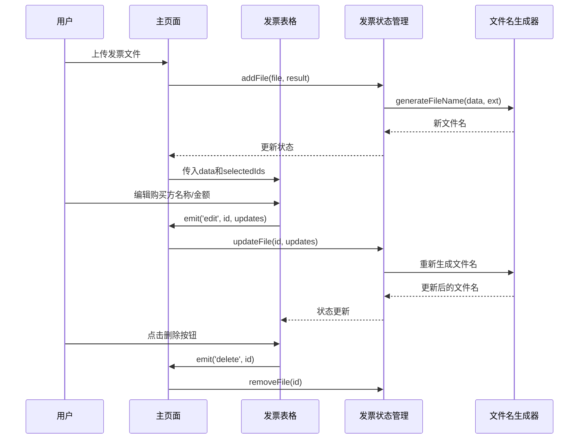
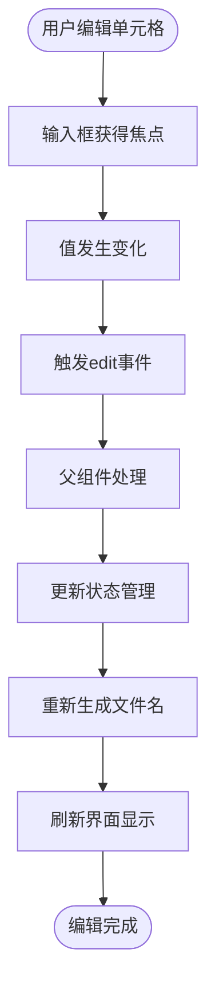
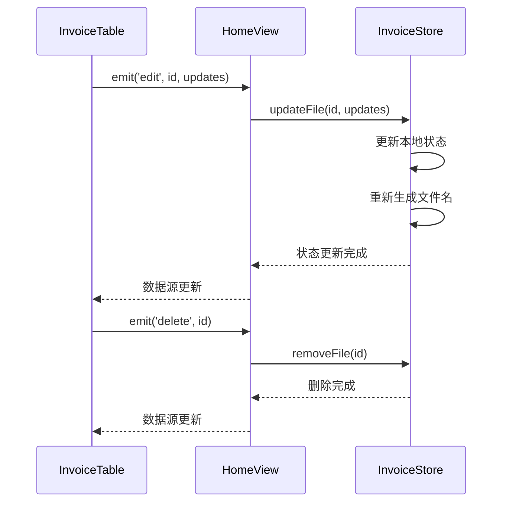
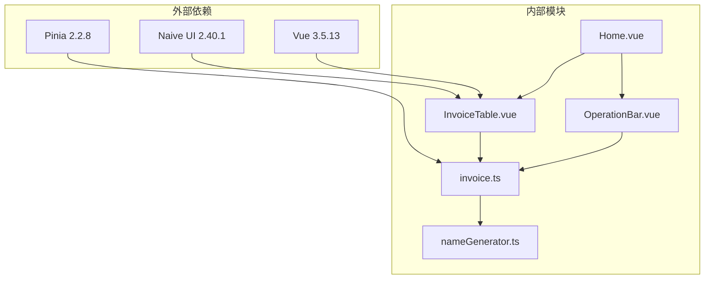
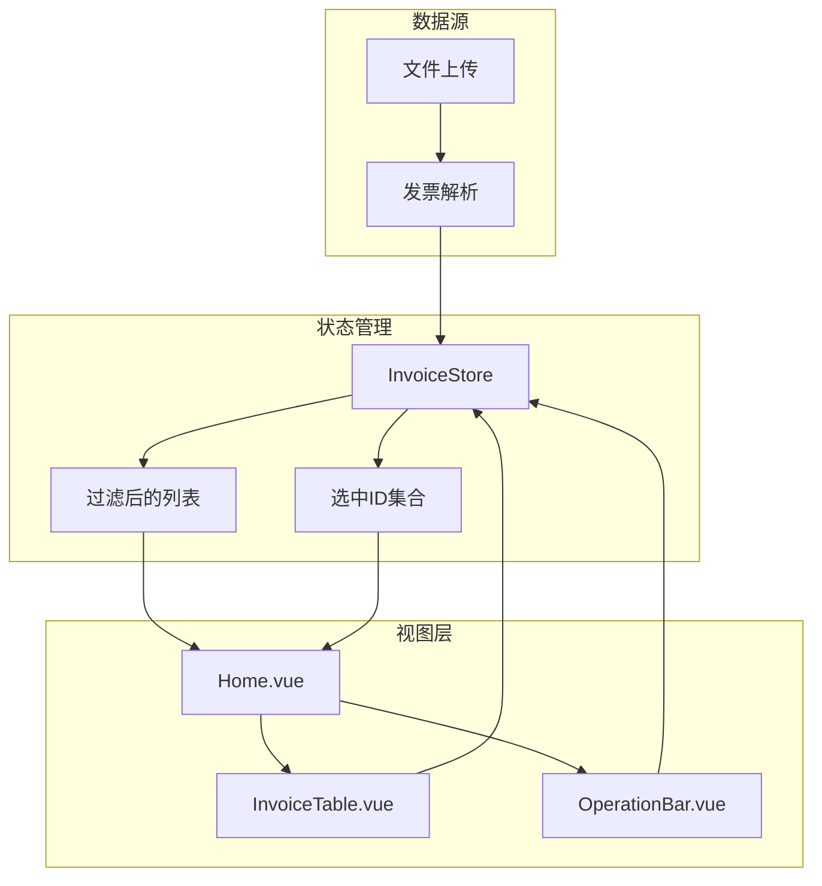
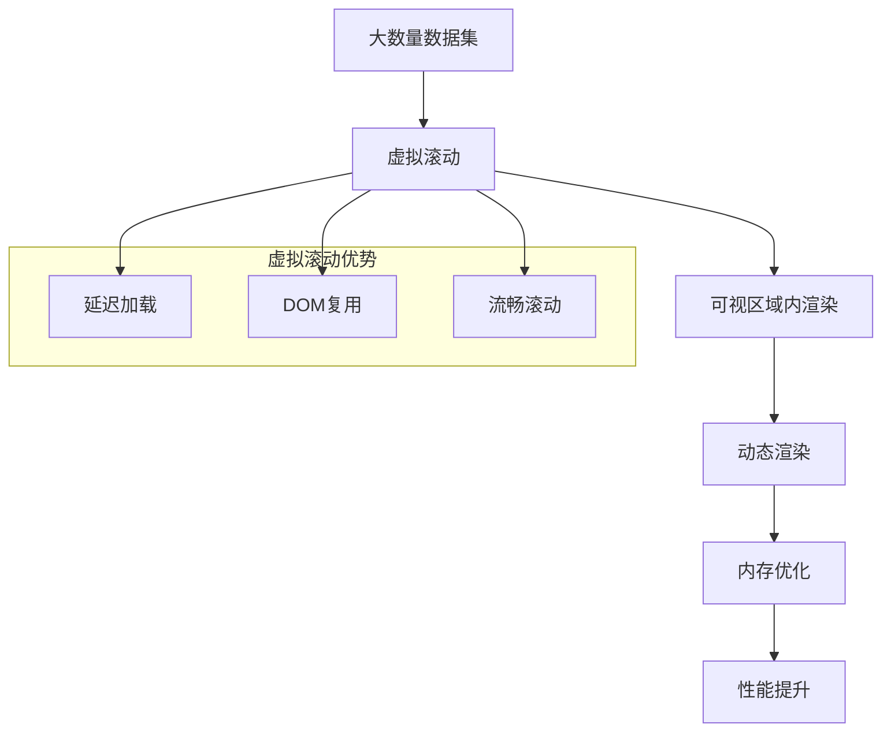

# 发票重命名表格组件

<cite>
**本文档引用的文件**
- [InvoiceTable.vue](file://src/components/Invoice/InvoiceTable.vue)
- [invoice.ts](file://src/stores/invoice.ts)
- [Home.vue](file://src/views/Home.vue)
- [nameGenerator.ts](file://src/utils/nameGenerator.ts)
- [OperationBar.vue](file://src/components/OperationBar.vue)
- [useInvoicePdfParser.ts](file://src/composables/useInvoicePdfParser.ts)
- [types/invoice.ts](file://src/types/invoice.ts)
</cite>

## 更新摘要
**变更内容**
- 更新了发票类型分类逻辑，将电子普通发票与普票合并为统一类别
- 优化了金额列在暗色模式下的可读性，使用CSS变量和等宽字体
- 现代化了表格样式，移除了纵向分割线并增强了hover和选中行效果
- 更新了相关架构图和代码示例以反映最新实现

## 目录
1. [简介](#简介)
2. [项目结构](#项目结构)
3. [核心组件](#核心组件)
4. [架构概览](#架构概览)
5. [详细组件分析](#详细组件分析)
6. [依赖关系分析](#依赖关系分析)
7. [性能考虑](#性能考虑)
8. [故障排除指南](#故障排除指南)
9. [结论](#结论)

## 简介

InvoiceTable组件是一个专门用于发票重命名功能的结果展示组件，基于Naive UI的n-data-table进行封装。该组件的核心职责是提供发票文件的可视化展示、编辑和管理功能，包括文件名预览、购买方名称编辑、金额修改、新文件名生成等功能。

组件采用响应式设计，支持大数据集的分页显示，并通过事件驱动的方式与父组件进行数据交互。它集成了状态管理和文件名生成逻辑，为发票处理流程提供了完整的前端解决方案。

## 项目结构

该项目采用Vue 3 + TypeScript + Naive UI的现代前端技术栈，主要目录结构如下：



**图表来源**
- [InvoiceTable.vue](file://src/components/InvoiceTable.vue#L1-L182)
- [invoice.ts](file://src/stores/invoice.ts#L1-L256)
- [Home.vue](file://src/views/Home.vue#L1-L247)

**章节来源**
- [InvoiceTable.vue](file://src/components/InvoiceTable.vue#L1-L182)
- [Home.vue](file://src/views/Home.vue#L1-L247)

## 核心组件

InvoiceTable组件是整个发票重命名功能的核心，具有以下关键特性：

### 组件架构设计



**图表来源**
- [InvoiceTable.vue](file://src/components/InvoiceTable.vue#L19-L39)
- [invoice.ts](file://src/stores/invoice.ts#L24-L61)

### 数据模型定义

组件使用强类型接口定义数据结构，确保类型安全性和开发体验：

- **InvoiceRow接口**：定义了发票表格的完整数据模型
- **状态枚举**：支持success、failed、pending三种状态
- **事件类型**：明确定义了组件对外暴露的事件接口

**章节来源**
- [InvoiceTable.vue](file://src/components/InvoiceTable.vue#L19-L39)
- [invoice.ts](file://src/stores/invoice.ts#L24-L34)

## 架构概览

InvoiceTable组件在整个应用架构中扮演着承上启下的关键角色，连接了用户界面与业务逻辑：



**图表来源**
- [Home.vue](file://src/views/Home.vue#L160-L178)
- [InvoiceTable.vue](file://src/components/InvoiceTable.vue#L35-L39)
- [invoice.ts](file://src/stores/invoice.ts#L153-L176)

**章节来源**
- [Home.vue](file://src/views/Home.vue#L1-L247)
- [InvoiceTable.vue](file://src/components/InvoiceTable.vue#L1-L182)

## 详细组件分析

### 列定义与渲染逻辑

InvoiceTable组件定义了完整的列配置，每个列都有特定的功能和渲染逻辑：

#### 基础信息列

| 列名 | 字段键 | 宽度 | 功能描述 |
|------|--------|------|----------|
| 序号 | index | 80px | 显示行号，基于索引计算 |
| 原文件名 | originalFileName | 200px | 显示原始文件名，支持省略号和工具提示 |
| 发票类型 | invoiceType | 120px | 显示发票类型信息 |
| 购买方名称 | purchaserName | 200px | 可编辑单元格，支持实时编辑 |
| 金额 | totalAmount | 140px | 可编辑单元格，支持实时编辑 |

#### 发票类型分类统一

根据最新的代码实现，发票类型分类已进行统一处理，将电子普通发票归类为普票：

```typescript
// 发票类型标签配置（电子普通发票也归类为普票）
const typeTagConfig: Record<string, { bg: string, color: string }> = {
  '专票': { bg: '#DBEAFE', color: '#1E40AF' },
  '普票': { bg: '#D1FAE5', color: '#065F46' }
}
```

这种分类统一简化了用户界面，避免了发票类型的过度细分，提高了用户体验的一致性。

**更新** 发票类型分类逻辑已更新，将电子普通发票与普票合并为统一类别

**章节来源**
- [InvoiceTable.vue](file://src/components/Invoice/InvoiceTable.vue#L32-L36)

#### 金额列可读性优化

金额列在暗色模式下的可读性已通过CSS变量和等宽字体得到显著优化：

```typescript
{
  title: '金额',
  key: 'totalAmount',
  width: 140,
  align: 'right',
  render: (row: InvoiceRow) => {
    return h(NInput, {
      value: row.totalAmount,
      size: 'small',
      style: 'text-align: right;',
      onUpdateValue: (value: string) => {
        emit('edit', row.id, { totalAmount: value })
      }
    }, {
      prefix: () => h('span', { 
        style: 'font-size: 0.9em; color: var(--n-text-color-disabled);' 
      }, '￥')
    })
  }
}
```

**更新** 金额列在暗色模式下的可读性已优化，使用CSS变量和等宽字体

**章节来源**
- [InvoiceTable.vue](file://src/components/Invoice/InvoiceTable.vue#L100-L117)

#### 表格样式现代化

表格样式已现代化，移除了纵向分割线并增强了hover和选中行效果：

```css
/* 表格整体样式优化 */
.invoice-rename-table {
  border: none;
}

/* 表头样式 */
.invoice-rename-table :deep(.n-data-table-th) {
  background-color: var(--n-th-color) !important;
  border-bottom: 2px solid var(--n-border-color) !important;
  padding: 1rem 0.75rem !important;
  font-size: 0.75rem !important;
  font-weight: 600 !important;
  color: var(--n-th-text-color) !important;
  text-transform: uppercase !important;
  letter-spacing: 0.05em !important;
  border-right: none !important;
}

/* 表格行样式 */
.invoice-rename-table :deep(.n-data-table-td) {
  padding: 1rem 0.75rem !important;
  border-bottom: 1px solid var(--n-border-color) !important;
  border-right: none !important;
}

/* Hover效果 - 支持深色模式 */
.invoice-rename-table :deep(.n-data-table-tr:hover .n-data-table-td) {
  background-color: var(--n-td-color-hover) !important;
  transition: background-color 0.2s;
}

/* 选中行样式 - 支持深色模式 */
.invoice-rename-table :deep(.n-data-table-tr.n-data-table-tr--selected .n-data-table-td) {
  background-color: var(--n-td-color-checked) !important;
}

/* 选中行的Hover样式 */
.invoice-rename-table :deep(.n-data-table-tr.n-data-table-tr--selected:hover .n-data-table-td) {
  background-color: var(--n-td-color-checked-hover) !important;
}
```

这些样式改进提升了表格的视觉层次感和交互体验，特别是在暗色模式下提供了更好的视觉反馈。

**更新** 表格样式已现代化，移除了纵向分割线并增强了hover和选中行效果

**章节来源**
- [InvoiceTable.vue](file://src/components/Invoice/InvoiceTable.vue#L204-L254)

#### 编辑功能实现

购买方名称、金额和新文件名列都实现了基于NInput的可编辑单元格设计：



**图表来源**
- [InvoiceTable.vue](file://src/components/InvoiceTable.vue#L76-L115)
- [Home.vue](file://src/views/Home.vue#L160-L162)

#### 状态列设计

状态列通过NTag组件动态展示处理结果，使用不同颜色标识不同的状态：

```mermaid
flowchart TD
StatusInput[接收状态值] --> CheckStatus{检查状态}
CheckStatus --> |success| SuccessTag[创建绿色标签<br/>显示"成功"]
CheckStatus --> |failed| FailedTag[创建红色标签<br/>显示"失败"]
CheckStatus --> |pending| PendingTag[创建黄色标签<br/>显示"待处理"]
SuccessTag --> Output[输出状态标签]
FailedTag --> Output
PendingTag --> Output
```

**图表来源**
- [InvoiceTable.vue](file://src/components/InvoiceTable.vue#L121-L129)

#### 操作列功能

操作列提供删除功能，使用NButton组件实现：

- **按钮样式**：红色主题，小尺寸
- **事件处理**：点击时触发delete事件
- **固定定位**：右侧固定，确保在横向滚动时可见

**章节来源**
- [InvoiceTable.vue](file://src/components/InvoiceTable.vue#L41-L162)

### 事件通信机制

组件通过Vue的事件系统与父组件进行通信，实现了完整的双向数据流：

#### 输入事件

| 事件名称 | 参数 | 触发时机 | 用途 |
|----------|------|----------|------|
| update:selectedIds | keys: RowKey[] | 选中行变化时 | 同步选中状态 |
| edit | id: string, updates: any | 编辑单元格时 | 更新发票信息 |
| delete | id: string | 点击删除按钮时 | 删除指定记录 |

#### 父组件处理流程



**图表来源**
- [InvoiceTable.vue](file://src/components/InvoiceTable.vue#L35-L39)
- [Home.vue](file://src/views/Home.vue#L160-L178)

**章节来源**
- [InvoiceTable.vue](file://src/components/InvoiceTable.vue#L30-L39)
- [Home.vue](file://src/views/Home.vue#L160-L178)

### 性能优化特性

#### 分页支持

组件内置了完整的分页功能，支持多种页面大小切换：

- **默认页面大小**：20条记录
- **可选页面大小**：20、50、100条记录
- **页面导航**：支持跳转到指定页面
- **响应式调整**：页面大小变化时重置到第1页

#### 横向滚动优化

```mermaid
flowchart LR
Container[表格容器] --> ScrollX[横向滚动设置<br/>1448px宽度]
ScrollX --> Content[表格内容]
Content --> Columns[各列内容]
subgraph "列宽分布"
Index[序号: 80px]
Original[原文件名: 200px]
Type[发票类型: 120px]
Purchaser[购买方名称: 200px]
Amount[金额: 140px]
NewName[新文件名: 250px]
Status[状态: 100px]
Error[失败原因: 200px]
Actions[操作: 100px]
end
TotalWidth[Index]+Original+Type+Purchaser+Amount+NewName+Status+Error+Actions
TotalWidth --> |1448px| ScrollX
```

**图表来源**
- [InvoiceTable.vue](file://src/components/InvoiceTable.vue#L6-L8)
- [InvoiceTable.vue](file://src/components/InvoiceTable.vue#L48-L162)

**章节来源**
- [InvoiceTable.vue](file://src/components/InvoiceTable.vue#L164-L176)

## 依赖关系分析

### 组件间依赖关系



**图表来源**
- [package.json](file://package.json#L12-L23)
- [InvoiceTable.vue](file://src/components/InvoiceTable.vue#L13-L15)
- [invoice.ts](file://src/stores/invoice.ts#L4-L5)

### 数据流依赖

组件的数据流遵循单向数据流原则，确保状态管理的清晰性：



**图表来源**
- [Home.vue](file://src/views/Home.vue#L26-L32)
- [invoice.ts](file://src/stores/invoice.ts#L72-L91)

**章节来源**
- [package.json](file://package.json#L1-L33)
- [Home.vue](file://src/views/Home.vue#L1-L247)

## 性能考虑

### 大数据集处理策略

针对大量文件场景，组件采用了以下性能优化策略：

#### 分页加载
- **默认每页20条**：平衡内存占用和用户体验
- **可选50/100条**：满足不同用户需求
- **智能重置**：切换页面大小时自动回到第1页

#### 渲染优化
- **虚拟滚动支持**：虽然当前版本未实现，但n-data-table原生支持虚拟滚动
- **按需渲染**：只渲染当前页面可见的行
- **列宽优化**：合理设置列宽避免不必要的重排

#### 内存管理
- **响应式更新**：使用Vue的响应式系统，避免手动DOM操作
- **事件委托**：通过事件冒泡减少事件监听器数量
- **状态集中**：所有状态集中在Pinia store中管理

### 虚拟滚动实现建议

对于超大数据集（>1000条记录），建议实现虚拟滚动：



**章节来源**
- [InvoiceTable.vue](file://src/components/InvoiceTable.vue#L164-L176)
- [invoice.ts](file://src/stores/invoice.ts#L65-L69)

## 故障排除指南

### 常见问题及解决方案

#### 编辑功能异常

**问题现象**：编辑单元格后无法保存更改

**可能原因**：
1. 父组件未正确处理edit事件
2. 状态管理更新失败
3. 文件名生成器抛出异常

**解决步骤**：
1. 检查父组件的handleEdit方法实现
2. 验证store.updateFile方法调用
3. 查看控制台错误信息

#### 状态显示错误

**问题现象**：状态标签颜色不正确或文字显示异常

**可能原因**：
1. 状态值不是标准枚举值
2. NTag组件参数传递错误
3. CSS样式覆盖

**解决步骤**：
1. 确认状态值为'success'、'failed'或'pending'
2. 检查NTag组件的type和text属性
3. 验证样式优先级

#### 删除功能失效

**问题现象**：点击删除按钮无反应

**可能原因**：
1. delete事件未正确绑定
2. 父组件对话框确认逻辑问题
3. 状态管理删除方法异常

**解决步骤**：
1. 检查NButton的onClick事件绑定
2. 验证父组件handleDelete方法实现
3. 确认store.removeFile方法正常执行

**章节来源**
- [InvoiceTable.vue](file://src/components/InvoiceTable.vue#L121-L129)
- [Home.vue](file://src/views/Home.vue#L167-L178)

### 调试技巧

#### 开发者工具使用
- **Vue DevTools**：监控组件状态和事件
- **浏览器控制台**：查看错误信息和日志
- **网络面板**：检查异步操作状态

#### 日志跟踪
组件在开发模式下会输出详细的调试信息：
- 文件添加过程的日志
- 文件名生成的结果
- 错误处理的详细信息

**章节来源**
- [invoice.ts](file://src/stores/invoice.ts#L111-L133)

## 结论

InvoiceTable组件作为发票重命名功能的核心组件，展现了现代前端开发的最佳实践：

### 设计优势

1. **清晰的职责分离**：组件专注于数据展示和用户交互
2. **强类型支持**：完整的TypeScript类型定义确保代码质量
3. **事件驱动架构**：通过事件实现组件间的松耦合通信
4. **性能优化考虑**：内置分页和滚动优化适应大数据场景

### 技术亮点

1. **Naive UI集成**：充分利用框架的组件生态
2. **响应式设计**：适配不同屏幕尺寸和设备
3. **状态管理**：通过Pinia实现集中式状态管理
4. **工具函数复用**：文件名生成逻辑独立封装

### 改进建议

1. **虚拟滚动实现**：为超大数据集提供更好的性能
2. **单元测试覆盖**：增加组件行为的自动化测试
3. **国际化支持**：添加多语言文本支持
4. **无障碍访问**：提升残障用户的使用体验

该组件为发票处理流程提供了稳定可靠的基础，通过合理的架构设计和性能优化，能够有效支持各种规模的企业应用场景。