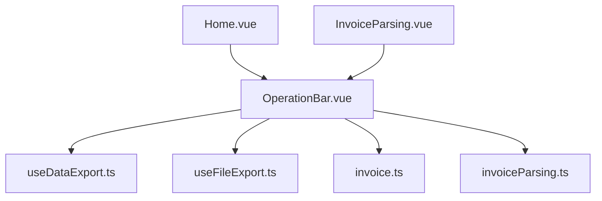
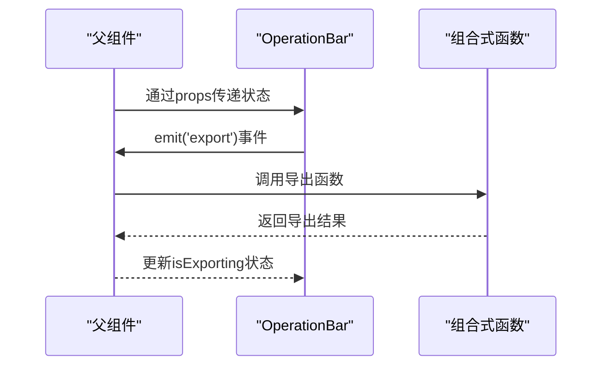
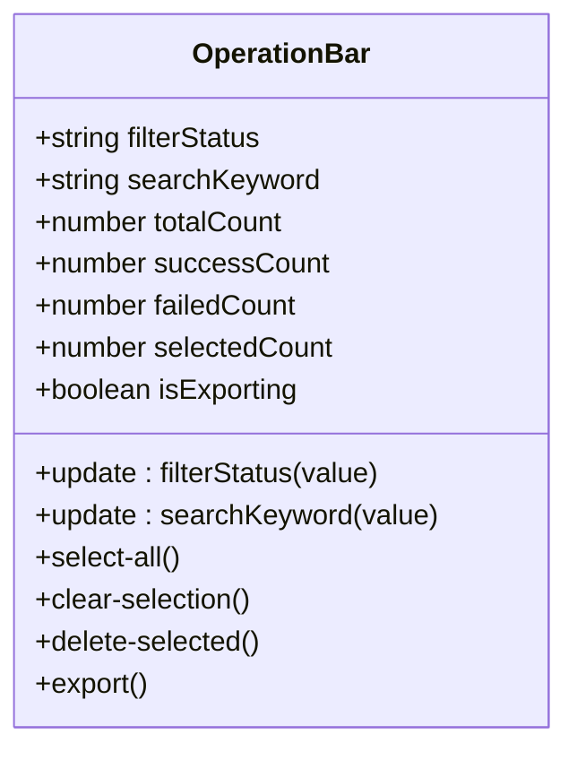
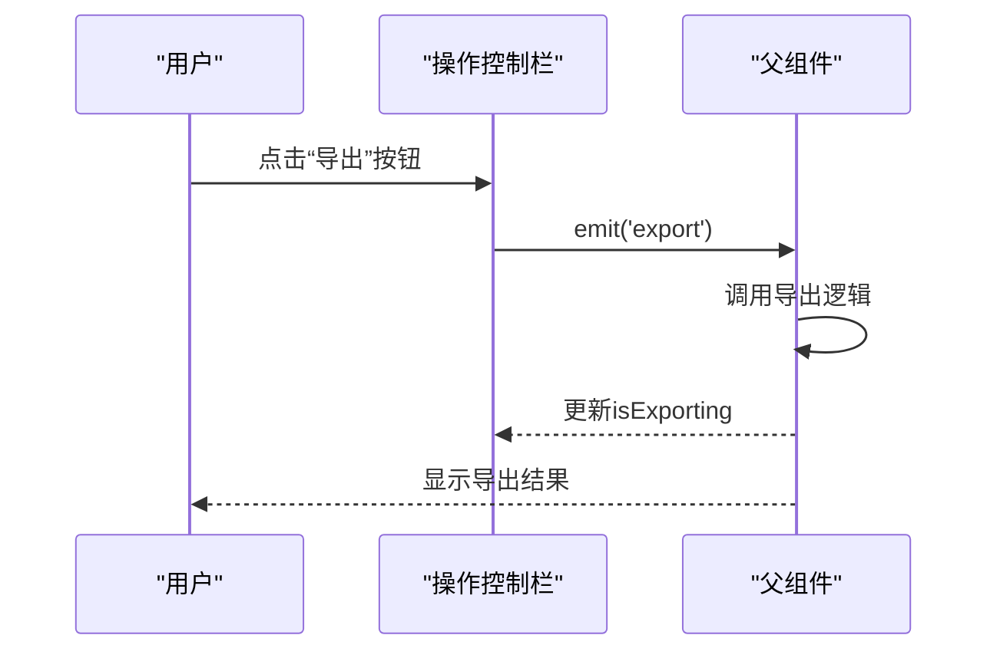
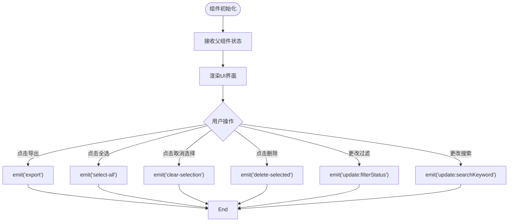
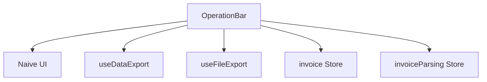

# 操作控制栏组件

<cite>
**本文档引用的文件**
- [OperationBar.vue](file://src/components/OperationBar.vue)
- [useDataExport.ts](file://src/composables/useDataExport.ts)
- [useFileExport.ts](file://src/composables/useFileExport.ts)
- [InvoiceParsing.vue](file://src/views/InvoiceParsing.vue)
- [Home.vue](file://src/views/Home.vue)
- [invoice.ts](file://src/stores/invoice.ts)
- [invoiceParsing.ts](file://src/stores/invoiceParsing.ts)
</cite>

## 目录
1. [简介](#简介)
2. [项目结构](#项目结构)
3. [核心组件](#核心组件)
4. [架构概述](#架构概述)
5. [详细组件分析](#详细组件分析)
6. [依赖分析](#依赖分析)
7. [性能考虑](#性能考虑)
8. [故障排除指南](#故障排除指南)
9. [结论](#结论)

## 简介
操作控制栏（OperationBar）组件是财务工具箱应用中的功能操作中枢，设计用于统一管理发票重命名和发票解析页面中的通用操作。该组件通过封装导出、重置、批量处理等操作按钮，实现了跨页面的复用，同时根据当前功能上下文动态调整可用操作项。通过 emit 事件机制与父级页面组件通信，触发具体业务逻辑，保持界面整洁。组件展示了在不同页面中按钮布局、禁用状态管理及提示文案的统一性设计原则。

## 项目结构
操作控制栏组件位于 `src/components/OperationBar.vue`，作为独立的 Vue 组件实现。它与多个组合式函数（composables）和状态管理模块协同工作，包括 `useDataExport.ts` 用于数据导出，`useFileExport.ts` 用于文件导出，以及 `invoice.ts` 和 `invoiceParsing.ts` 用于状态管理。该组件被 `Home.vue`（发票重命名页面）和 `InvoiceParsing.vue`（发票解析页面）两个视图组件复用，体现了其作为通用操作中枢的设计目标。

**图表来源**
- [OperationBar.vue](file://src/components/OperationBar.vue)
- [useDataExport.ts](file://src/composables/useDataExport.ts)
- [useFileExport.ts](file://src/composables/useFileExport.ts)
- [invoice.ts](file://src/stores/invoice.ts)
- [invoiceParsing.ts](file://src/stores/invoiceParsing.ts)
- [Home.vue](file://src/views/Home.vue)
- [InvoiceParsing.vue](file://src/views/InvoiceParsing.vue)

## 核心组件
操作控制栏组件封装了过滤、搜索、全选、取消选择、删除选中和导出等通用操作。它通过 props 接收来自父组件的状态信息，如总数量、成功数量、失败数量、选中数量和导出状态，并通过 emit 事件向父组件发送操作指令。组件内部使用 `n-radio-group` 实现状态过滤，`n-input` 实现关键词搜索，以及多个 `n-button` 实现各种操作按钮。所有按钮的禁用状态根据传入的 props 动态调整，确保用户只能执行有效的操作。

**组件来源**
- [OperationBar.vue](file://src/components/OperationBar.vue)

## 架构概述
操作控制栏组件采用组合式 API 设计，通过 `defineProps` 接收外部状态，`defineEmits` 定义事件接口，实现了清晰的输入输出边界。组件与父组件的通信完全基于事件驱动，父组件监听这些事件并执行相应的业务逻辑。这种设计使得操作控制栏可以轻松地在不同页面间复用，同时保持与具体业务逻辑的解耦。在发票重命名页面，导出操作调用 `useFileExport` 组合式函数将成功处理的文件打包为 ZIP 下载；在发票解析页面，导出操作调用 `useDataExport` 组合式函数将解析结果导出为 Excel 或 JSON 格式。

**图表来源**
- [OperationBar.vue](file://src/components/OperationBar.vue)
- [useDataExport.ts](file://src/composables/useDataExport.ts)
- [useFileExport.ts](file://src/composables/useFileExport.ts)

## 详细组件分析
### 操作控制栏分析
操作控制栏组件是发票重命名和发票解析页面的核心操作界面，提供了一致的用户体验。组件左侧包含状态过滤和关键词搜索功能，右侧包含批量操作按钮。所有按钮的可见性和禁用状态都根据当前数据状态动态调整，例如“删除选中”按钮仅在有选中项时可用，“导出”按钮仅在有成功记录时可用。

#### 对于对象导向组件：

**图表来源**
- [OperationBar.vue](file://src/components/OperationBar.vue#L60-L88)

#### 对于API/服务组件：

**图表来源**
- [OperationBar.vue](file://src/components/OperationBar.vue#L44-L50)
- [Home.vue](file://src/views/Home.vue#L22)
- [InvoiceParsing.vue](file://src/views/InvoiceParsing.vue#L61)

#### 对于复杂逻辑组件：

**图表来源**
- [OperationBar.vue](file://src/components/OperationBar.vue)

**组件来源**
- [OperationBar.vue](file://src/components/OperationBar.vue)

## 依赖分析
操作控制栏组件依赖于 Naive UI 组件库提供的 `NSpace`、`NRadioGroup`、`NRadioButton`、`NInput`、`NButton` 和 `NIcon` 组件来构建用户界面。它通过 props 与父组件进行数据传递，通过 emit 事件与父组件进行通信。在功能实现上，它依赖于 `useDataExport` 和 `useFileExport` 两个组合式函数来处理导出逻辑。状态管理方面，它与 `invoice` 和 `invoiceParsing` 两个 Pinia store 模块紧密协作，获取数据状态并触发状态更新。

**图表来源**
- [OperationBar.vue](file://src/components/OperationBar.vue#L57)
- [useDataExport.ts](file://src/composables/useDataExport.ts)
- [useFileExport.ts](file://src/composables/useFileExport.ts)
- [invoice.ts](file://src/stores/invoice.ts)
- [invoiceParsing.ts](file://src/stores/invoiceParsing.ts)

## 性能考虑
操作控制栏组件本身不包含复杂的计算逻辑，主要性能影响来自其与父组件的通信和状态更新。组件使用 `watch` 监听来自父组件的 `filterStatus` 和 `searchKeyword` prop 变化，确保本地状态与父组件同步。由于组件是轻量级的，且只在数据状态变化时重新渲染，因此在正常情况下性能表现良好。导出操作的性能主要取决于 `useDataExport` 和 `useFileExport` 组合式函数的实现，操作控制栏通过 `isExporting` prop 显示加载状态，提升用户体验。

## 故障排除指南
当操作控制栏组件出现问题时，首先检查父组件传递的 props 是否正确。确保 `totalCount`、`successCount`、`failedCount` 和 `selectedCount` 等数值属性准确反映了当前数据状态。如果按钮未按预期禁用，检查这些数值是否为 0。对于导出功能，检查 `isExporting` prop 是否在导出开始时设置为 true，在导出完成后设置为 false。如果事件未触发，检查父组件是否正确监听了 `update:filterStatus`、`update:searchKeyword`、`select-all`、`clear-selection`、`delete-selected` 和 `export` 事件。

**组件来源**
- [OperationBar.vue](file://src/components/OperationBar.vue)

## 结论
操作控制栏组件成功实现了作为功能操作中枢的设计目标，通过封装通用操作按钮并在不同页面间复用，提高了代码的可维护性和用户体验的一致性。组件通过清晰的 props 和 emit 接口与父组件通信，保持了良好的解耦。在发票重命名和发票解析页面中，该组件展示了统一的按钮布局、禁用状态管理和提示文案，体现了优秀的统一性设计原则。未来可以考虑将更多通用操作（如重置、批量处理）集成到该组件中，进一步提升其复用价值。