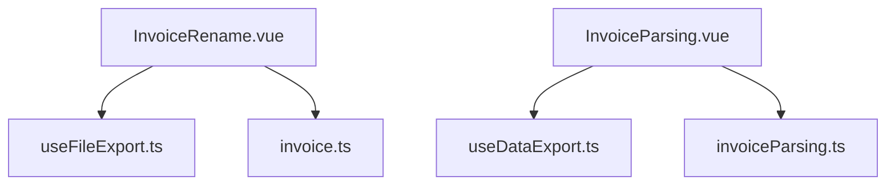
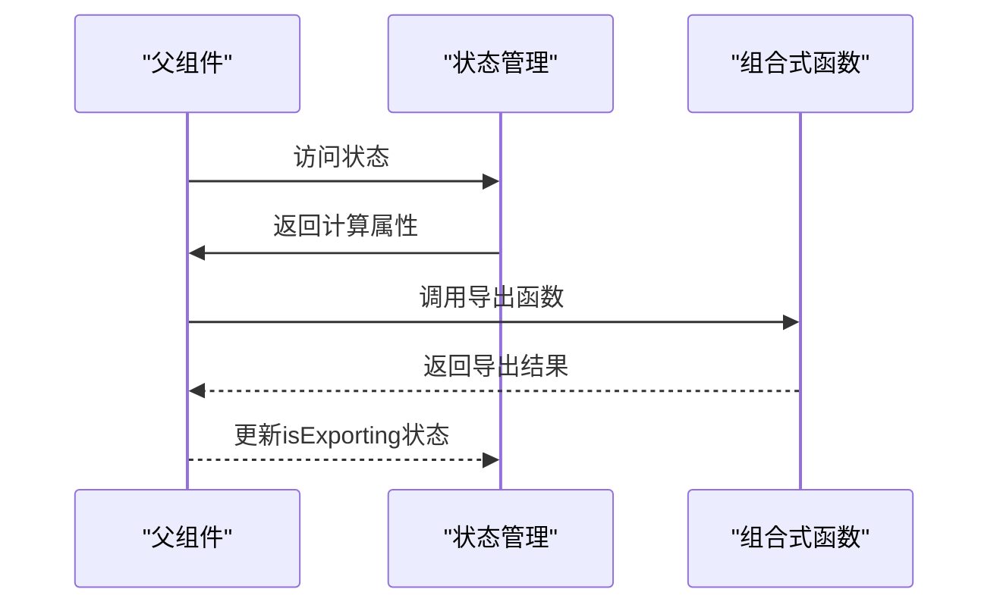
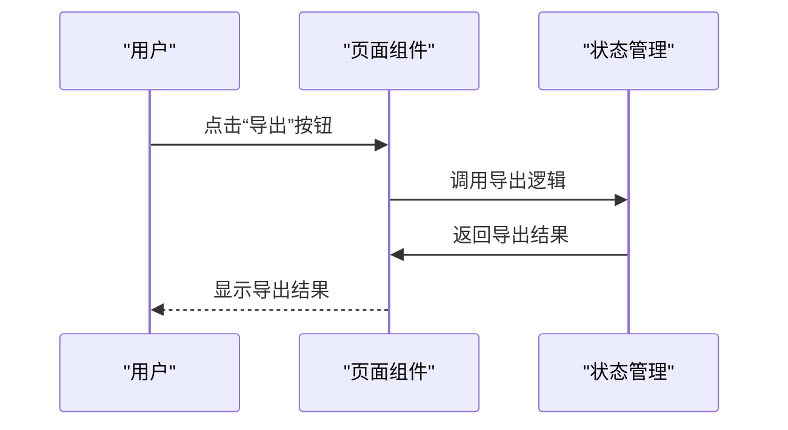
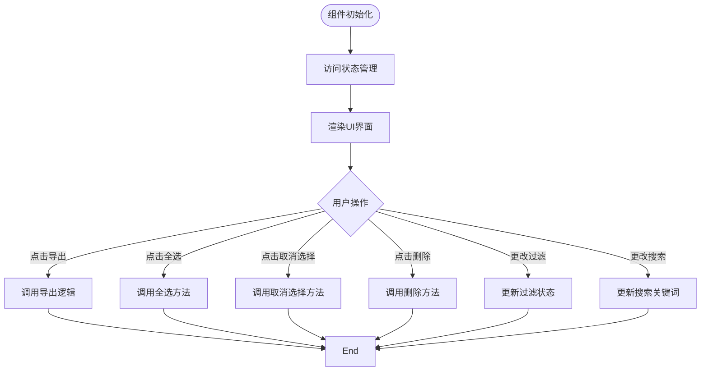
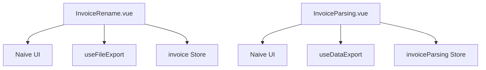

# 操作控制栏组件

<cite>
**本文档引用的文件**
- [useDataExport.ts](file://src/composables/useDataExport.ts)
- [useFileExport.ts](file://src/composables/useFileExport.ts)
- [InvoiceParsing.vue](file://src/views/InvoiceParsing.vue)
- [InvoiceRename.vue](file://src/views/InvoiceRename.vue)
- [invoice.ts](file://src/stores/invoice.ts)
- [invoiceParsing.ts](file://src/stores/invoiceParsing.ts)
</cite>

## 更新摘要
**变更内容**
- 由于操作控制栏组件已被删除，更新文档以反映其功能已整合到发票重命名和发票解析页面中
- 移除与已删除组件相关的所有过时内容
- 更新架构概述和详细组件分析部分，以描述操作功能如何在视图组件中直接实现
- 更新依赖分析以反映新的依赖关系
- 移除与已删除组件相关的故障排除指南

## 目录
1. [简介](#简介)
2. [项目结构](#项目结构)
3. [核心功能](#核心功能)
4. [架构概述](#架构概述)
5. [详细功能分析](#详细功能分析)
6. [依赖分析](#依赖分析)
7. [性能考虑](#性能考虑)
8. [结论](#结论)

## 简介
操作控制栏组件已被删除，其功能已整合到发票重命名和发票解析页面中。该组件原本作为财务工具箱应用中的功能操作中枢，用于统一管理发票重命名和发票解析页面中的通用操作。其核心功能包括封装导出、重置、批量处理等操作按钮，并根据当前功能上下文动态调整可用操作项。通过 emit 事件机制与父级页面组件通信，触发具体业务逻辑，保持界面整洁。组件展示了在不同页面中按钮布局、禁用状态管理及提示文案的统一性设计原则。

## 项目结构
操作控制栏组件 `OperationBar.vue` 已被删除。其功能已整合到 `InvoiceRename.vue` 和 `InvoiceParsing.vue` 两个视图组件中。这些组件直接使用组合式函数（composables）和状态管理模块来实现操作功能，包括 `useDataExport.ts` 用于数据导出，`useFileExport.ts` 用于文件导出，以及 `invoice.ts` 和 `invoiceParsing.ts` 用于状态管理。这种重构使得操作功能更加紧密地与具体业务逻辑结合，同时保持了代码的可维护性。

**图表来源**
- [useDataExport.ts](file://src/composables/useDataExport.ts)
- [useFileExport.ts](file://src/composables/useFileExport.ts)
- [invoice.ts](file://src/stores/invoice.ts)
- [invoiceParsing.ts](file://src/stores/invoiceParsing.ts)
- [InvoiceRename.vue](file://src/views/InvoiceRename.vue)
- [InvoiceParsing.vue](file://src/views/InvoiceParsing.vue)

## 核心功能
发票重命名和发票解析页面现在直接实现了原操作控制栏组件的核心功能。这些功能包括过滤、搜索、全选、取消选择、删除选中和导出等通用操作。视图组件通过直接访问状态管理模块（store）获取状态信息，如总数量、成功数量、失败数量、选中数量和导出状态，并通过组合式函数调用具体操作。组件内部使用 `n-radio-group` 实现状态过滤，`n-input` 实现关键词搜索，以及多个 `n-button` 实现各种操作按钮。所有按钮的禁用状态根据 store 中的状态动态调整，确保用户只能执行有效的操作。

**组件来源**
- [InvoiceRename.vue](file://src/views/InvoiceRename.vue)
- [InvoiceParsing.vue](file://src/views/InvoiceParsing.vue)

## 架构概述
发票重命名和发票解析页面采用组合式 API 设计，直接与状态管理模块和组合式函数交互，实现了清晰的输入输出边界。组件与业务逻辑的通信基于状态驱动，通过 store 的计算属性和方法来响应状态变化。这种设计使得操作功能可以轻松地在不同页面间复用，同时保持与具体业务逻辑的紧密集成。在发票重命名页面，导出操作调用 `useFileExport` 组合式函数将成功处理的文件打包为 ZIP 下载；在发票解析页面，导出操作调用 `useDataExport` 组合式函数将解析结果导出为 Excel 或 JSON 格式。

**图表来源**
- [InvoiceRename.vue](file://src/views/InvoiceRename.vue)
- [InvoiceParsing.vue](file://src/views/InvoiceParsing.vue)
- [useDataExport.ts](file://src/composables/useDataExport.ts)
- [useFileExport.ts](file://src/composables/useFileExport.ts)
- [invoice.ts](file://src/stores/invoice.ts)
- [invoiceParsing.ts](file://src/stores/invoiceParsing.ts)

## 详细功能分析
### 操作功能分析
发票重命名和发票解析页面现在直接提供了一致的用户体验，实现了原操作控制栏组件的所有功能。页面左侧包含状态过滤和关键词搜索功能，右侧包含批量操作按钮。所有按钮的可见性和禁用状态都根据当前数据状态动态调整，例如“删除选中”按钮仅在有选中项时可用，“导出”按钮仅在有成功记录时可用。

#### 对于API/服务组件：

**图表来源**
- [InvoiceRename.vue](file://src/views/InvoiceRename.vue#L57-L65)
- [InvoiceParsing.vue](file://src/views/InvoiceParsing.vue#L58-L63)
- [useDataExport.ts](file://src/composables/useDataExport.ts)
- [useFileExport.ts](file://src/composables/useFileExport.ts)

#### 对于复杂逻辑组件：

**图表来源**
- [InvoiceRename.vue](file://src/views/InvoiceRename.vue)
- [InvoiceParsing.vue](file://src/views/InvoiceParsing.vue)

**组件来源**
- [InvoiceRename.vue](file://src/views/InvoiceRename.vue)
- [InvoiceParsing.vue](file://src/views/InvoiceParsing.vue)

## 依赖分析
发票重命名和发票解析页面依赖于 Naive UI 组件库提供的 `NSpace`、`NRadioGroup`、`NRadioButton`、`NInput`、`NButton` 和 `NIcon` 组件来构建用户界面。它们通过直接访问状态管理模块（store）获取数据状态，并通过组合式函数调用具体操作。在功能实现上，它们依赖于 `useDataExport` 和 `useFileExport` 两个组合式函数来处理导出逻辑。状态管理方面，它们与 `invoice` 和 `invoiceParsing` 两个 Pinia store 模块紧密协作，获取数据状态并触发状态更新。

**图表来源**
- [InvoiceRename.vue](file://src/views/InvoiceRename.vue#L17-L21)
- [InvoiceParsing.vue](file://src/views/InvoiceParsing.vue#L18-L22)
- [useDataExport.ts](file://src/composables/useDataExport.ts)
- [useFileExport.ts](file://src/composables/useFileExport.ts)
- [invoice.ts](file://src/stores/invoice.ts)
- [invoiceParsing.ts](file://src/stores/invoiceParsing.ts)

## 性能考虑
发票重命名和发票解析页面本身不包含复杂的计算逻辑，主要性能影响来自其与状态管理模块的通信和状态更新。组件使用 `computed` 计算属性来监听状态变化，确保界面与数据状态同步。由于组件是轻量级的，且只在数据状态变化时重新渲染，因此在正常情况下性能表现良好。导出操作的性能主要取决于 `useDataExport` 和 `useFileExport` 组合式函数的实现，页面通过 `isExporting` 状态显示加载状态，提升用户体验。

## 结论
虽然操作控制栏组件已被删除，但其作为功能操作中枢的设计目标已通过重构成功实现。通过将操作功能直接整合到发票重命名和发票解析页面中，提高了代码的可维护性和用户体验的一致性。组件通过直接与状态管理模块和组合式函数交互，保持了良好的解耦和清晰的职责划分。在发票重命名和发票解析页面中，该设计展示了统一的按钮布局、禁用状态管理和提示文案，体现了优秀的统一性设计原则。未来可以考虑将更多通用操作（如重置、批量处理）进一步优化和标准化，以提升其复用价值。