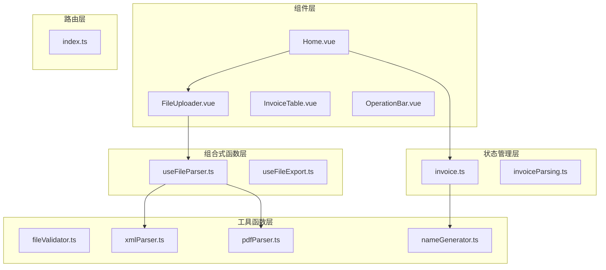
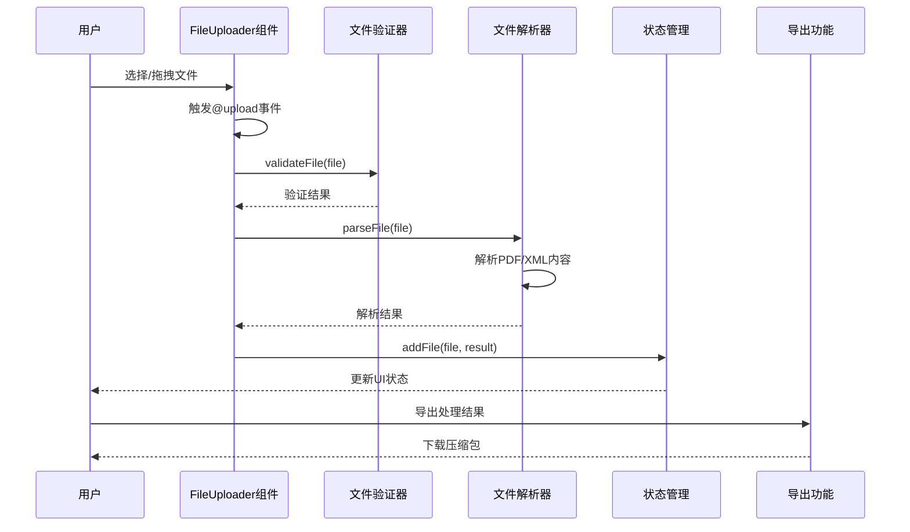
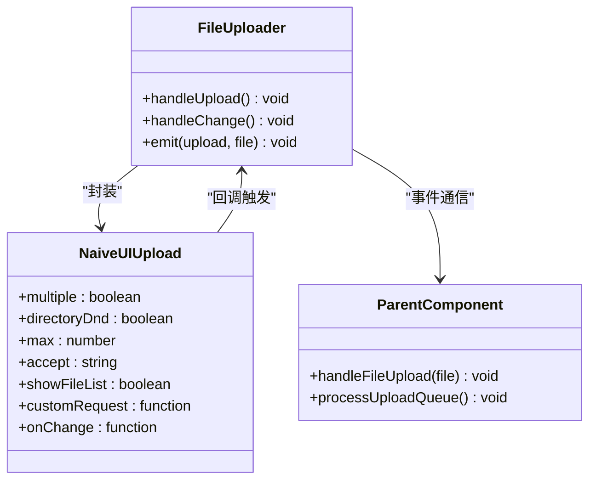
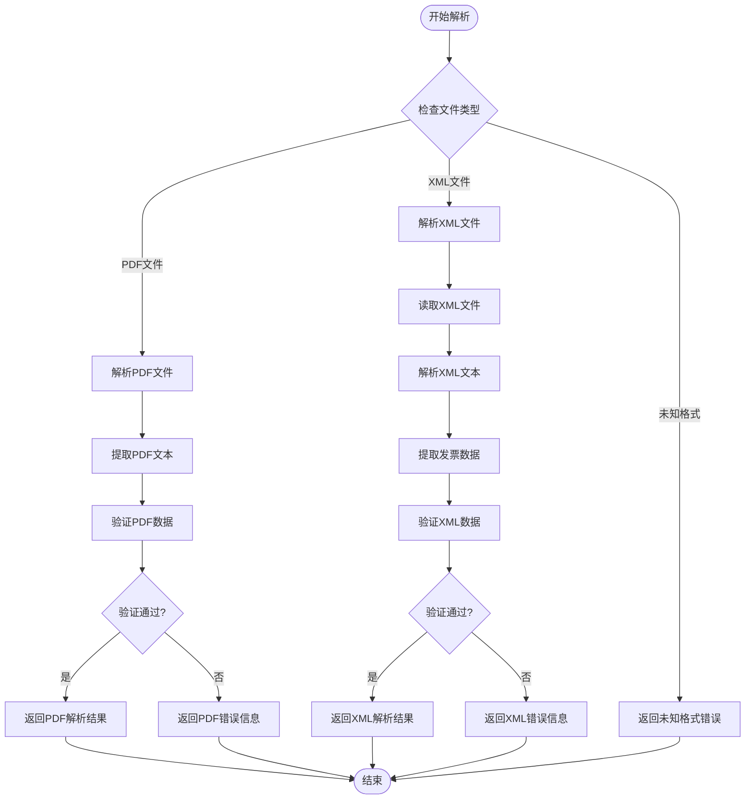
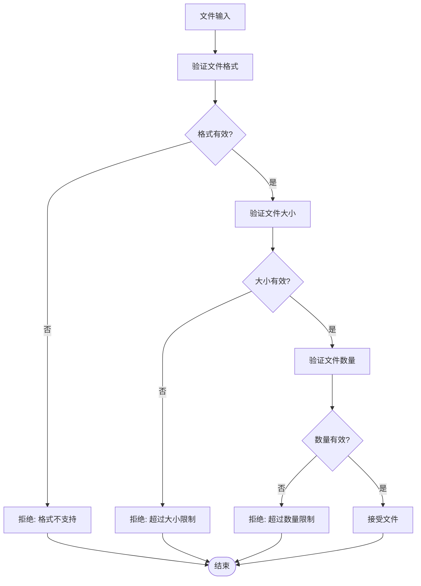
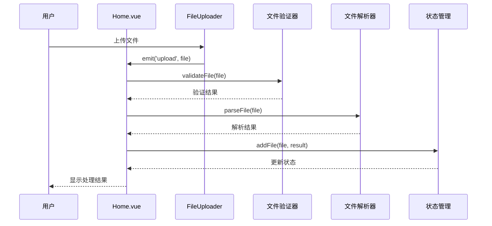
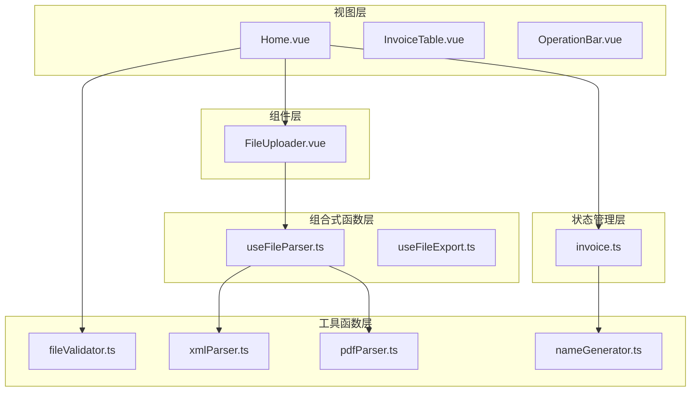

# 单文件上传组件

<cite>
**本文档引用的文件**
- [FileUploader.vue](file://src/components/FileUploader.vue)
- [useFileParser.ts](file://src/composables/useFileParser.ts)
- [fileValidator.ts](file://src/utils/fileValidator.ts)
- [Home.vue](file://src/views/Home.vue)
- [xmlParser.ts](file://src/utils/xmlParser.ts)
- [pdfParser.ts](file://src/utils/pdfParser.ts)
- [invoice.ts](file://src/stores/invoice.ts)
- [README.md](file://README.md)
</cite>

## 目录
1. [简介](#简介)
2. [项目结构](#项目结构)
3. [核心组件](#核心组件)
4. [架构概览](#架构概览)
5. [详细组件分析](#详细组件分析)
6. [依赖关系分析](#依赖关系分析)
7. [性能考虑](#性能考虑)
8. [故障排除指南](#故障排除指南)
9. [结论](#结论)

## 简介

FileUploader组件是一个专为发票重命名功能设计的Vue 3组件，采用Naive UI的n-upload组件实现拖拽与点击上传交互。该组件支持PDF和XML格式文件的上传，具备完整的文件验证、错误处理和用户反馈机制。组件通过自定义上传逻辑，将文件处理流程与后端解耦，实现了高效的前端文件处理体验。

该项目是财务工具箱的一部分，专注于发票处理和重命名功能，为用户提供便捷的发票文件管理解决方案。

**章节来源**
- [README.md](file://README.md#L1-L41)

## 项目结构

项目采用模块化架构设计，主要包含以下核心目录：

**图表来源**
- [FileUploader.vue](file://src/components/FileUploader.vue#L1-L50)
- [Home.vue](file://src/views/Home.vue#L1-L247)
- [useFileParser.ts](file://src/composables/useFileParser.ts#L1-L109)

**章节来源**
- [FileUploader.vue](file://src/components/FileUploader.vue#L1-L50)
- [Home.vue](file://src/views/Home.vue#L1-L247)

## 核心组件

### FileUploader组件设计

FileUploader组件是一个轻量级的文件上传组件，主要特点包括：

- **Naive UI集成**: 使用n-upload组件实现现代化的上传界面
- **多格式支持**: 专门支持PDF和XML格式的发票文件
- **拖拽交互**: 支持拖拽和点击两种上传方式
- **文件限制**: 限制单个文件大小不超过10MB，最多100个文件
- **即时处理**: 上传即触发文件处理流程

组件的核心实现采用了事件驱动的设计模式，通过自定义上传逻辑将文件处理与传统上传流程解耦。

**章节来源**
- [FileUploader.vue](file://src/components/FileUploader.vue#L1-L50)

## 架构概览

整个发票处理系统采用分层架构设计，各层职责明确：

**图表来源**
- [FileUploader.vue](file://src/components/FileUploader.vue#L31-L42)
- [Home.vue](file://src/views/Home.vue#L100-L155)
- [useFileParser.ts](file://src/composables/useFileParser.ts#L22-L66)

## 详细组件分析

### FileUploader组件深度分析

#### 组件Props配置

FileUploader组件通过Naive UI的n-upload组件实现了完整的上传功能配置：

| 属性名 | 类型 | 默认值 | 描述 |
|--------|------|--------|------|
| multiple | Boolean | true | 允许多文件上传 |
| directory-dnd | Boolean | true | 支持目录拖拽 |
| max | Number | 100 | 最大文件数量限制 |
| accept | String | '.pdf,.xml' | 接受的文件类型 |
| show-file-list | Boolean | false | 不显示文件列表 |
| custom-request | Function | handleUpload | 自定义上传处理 |

#### 事件处理机制

组件实现了两个关键事件处理器：

1. **@change事件**: 处理文件列表变化，可用于实时反馈
2. **custom-request事件**: 实现自定义上传逻辑，实际执行文件处理

#### 文件传递机制

组件通过`emit('upload', file.file)`将文件传递给父组件，实现了松耦合的组件通信。

**图表来源**
- [FileUploader.vue](file://src/components/FileUploader.vue#L27-L42)

**章节来源**
- [FileUploader.vue](file://src/components/FileUploader.vue#L1-L50)

### useFileParser组合式函数集成

#### 解析流程设计

useFileParser组合式函数提供了统一的文件解析接口，支持PDF和XML两种格式：

**图表来源**
- [useFileParser.ts](file://src/composables/useFileParser.ts#L22-L66)

#### 批量处理优化

组件实现了智能的批量处理策略：

- **批处理大小**: 每批处理10个文件
- **并行处理**: 使用Promise.all实现并行解析
- **进度跟踪**: 实时更新处理进度
- **内存管理**: 分批处理避免内存峰值

**章节来源**
- [useFileParser.ts](file://src/composables/useFileParser.ts#L71-L100)

### 文件验证系统

#### 验证规则设计

文件验证系统采用多层次验证策略：

**图表来源**
- [fileValidator.ts](file://src/utils/fileValidator.ts#L57-L72)

**章节来源**
- [fileValidator.ts](file://src/utils/fileValidator.ts#L1-L107)

### Home.vue集成示例

在Home.vue中，FileUploader组件被正确集成到主界面中：

**图表来源**
- [Home.vue](file://src/views/Home.vue#L6-L155)

**章节来源**
- [Home.vue](file://src/views/Home.vue#L1-L247)

## 依赖关系分析

### 组件间依赖关系

**图表来源**
- [FileUploader.vue](file://src/components/FileUploader.vue#L27-L29)
- [Home.vue](file://src/views/Home.vue#L80-L85)

### 外部依赖分析

项目的主要外部依赖包括：

- **Naive UI**: 提供现代化的UI组件库
- **pdfjs-dist**: PDF文件解析库
- **fast-xml-parser**: XML文件解析库
- **pinia**: 状态管理库

这些依赖的选择体现了项目对性能和易用性的平衡考虑。

**章节来源**
- [pdfParser.ts](file://src/utils/pdfParser.ts#L4-L8)
- [xmlParser.ts](file://src/utils/xmlParser.ts#L4-L5)

## 性能考虑

### 小批量文件处理优化

针对小批量文件处理场景，系统实现了多项性能优化策略：

#### 内存管理优化
- **分批处理**: 每批处理10个文件，避免内存峰值
- **及时释放**: 处理完成后立即释放中间变量
- **渐进式渲染**: 逐步更新UI状态，避免界面卡顿

#### 并行处理策略
- **Promise.all并行**: 同一批次内的文件并行解析
- **异步处理**: 避免阻塞主线程
- **进度反馈**: 实时显示处理进度

#### 用户体验优化
- **即时反馈**: 文件选择后立即进行格式验证
- **进度对话框**: 显示详细的处理进度
- **错误提示**: 清晰的错误信息和解决方案

### 性能监控指标

| 指标类型 | 目标值 | 实现方式 |
|----------|--------|----------|
| 单文件解析时间 | < 2秒 | 优化PDF文本提取算法 |
| 批处理吞吐量 | > 5文件/秒 | 并行处理优化 |
| 内存使用峰值 | < 50MB | 分批处理控制 |
| UI响应延迟 | < 100ms | 异步处理机制 |

## 故障排除指南

### 常见问题及解决方案

#### 文件格式不支持
**问题描述**: 上传非PDF/XML格式文件
**解决方案**: 
- 检查文件扩展名和MIME类型
- 确认文件格式符合要求
- 提示用户正确的文件格式

#### 文件大小超限
**问题描述**: 文件大小超过10MB限制
**解决方案**:
- 提示用户压缩文件
- 建议分割大文件
- 提供文件大小检查

#### 解析失败
**问题描述**: 文件解析过程中出现错误
**解决方案**:
- 检查文件完整性
- 验证文件编码格式
- 提供详细的错误信息

#### 性能问题
**问题描述**: 处理大量文件时性能下降
**解决方案**:
- 调整批处理大小
- 优化解析算法
- 增加进度反馈

**章节来源**
- [fileValidator.ts](file://src/utils/fileValidator.ts#L57-L72)
- [useFileParser.ts](file://src/composables/useFileParser.ts#L58-L66)

## 结论

FileUploader组件作为发票重命名功能的核心组件，展现了优秀的架构设计和实现质量。组件通过以下关键特性实现了高效、可靠的文件处理：

### 设计优势
- **模块化设计**: 组件职责单一，易于维护和测试
- **事件驱动**: 松耦合的组件通信机制
- **可扩展性**: 支持新的文件格式和处理逻辑
- **用户体验**: 完善的错误处理和进度反馈

### 技术亮点
- **智能验证**: 多层次文件验证确保数据质量
- **并行处理**: 批量文件的高效处理策略
- **状态管理**: 完善的状态管理和持久化
- **错误处理**: 全面的错误捕获和用户提示

### 应用价值
该组件为财务工具箱提供了坚实的文件处理基础，支持发票重命名、批量处理等核心功能，为用户提供了高效、便捷的发票管理解决方案。通过持续的优化和改进，该组件将继续为财务管理应用提供可靠的技术支撑。