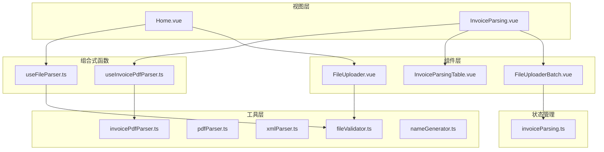
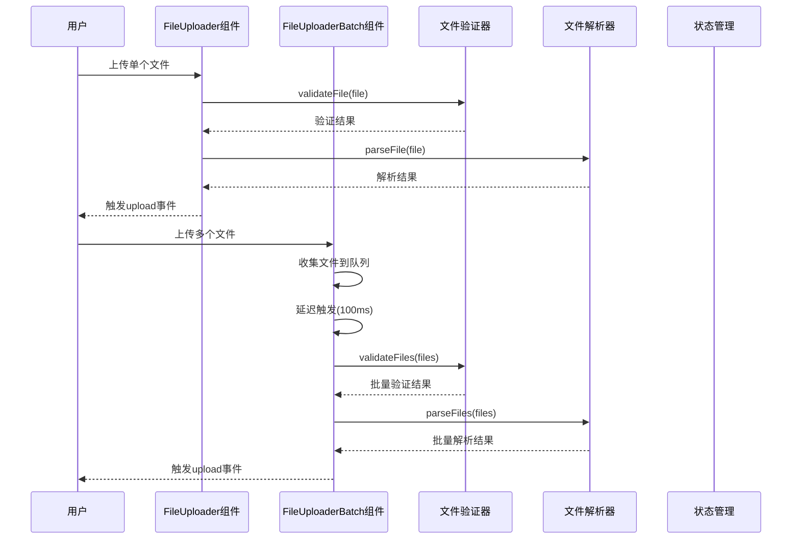
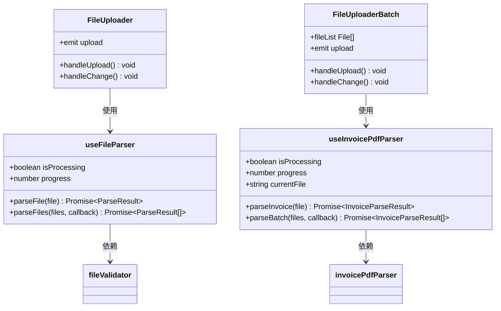
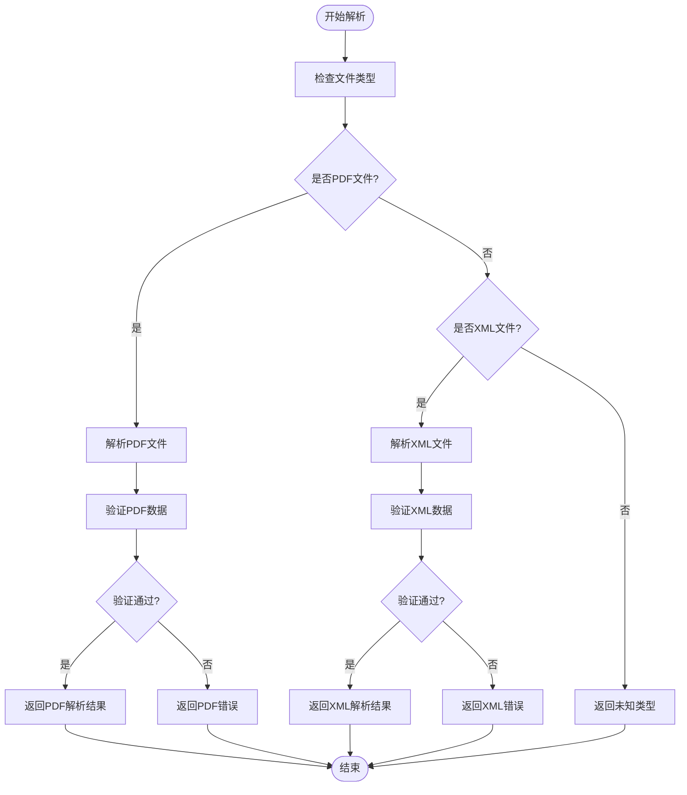
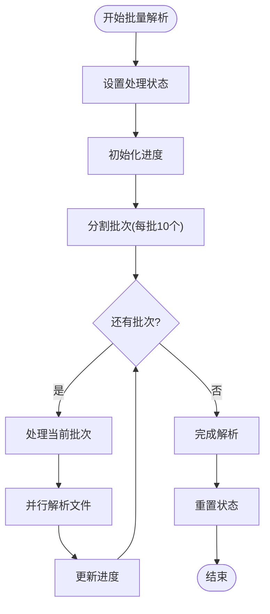
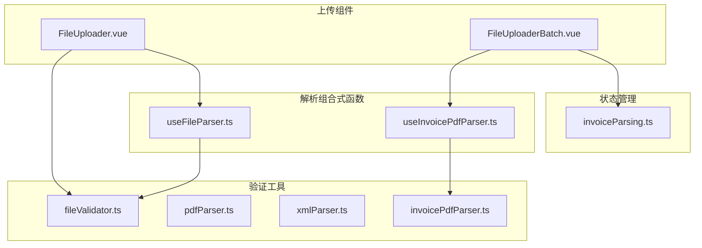
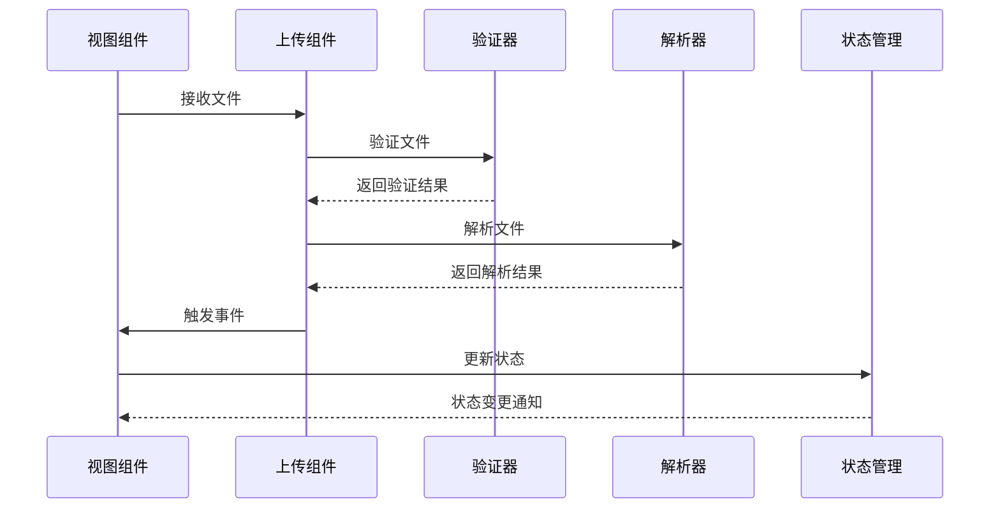

# 文件上传组件

<cite>
**本文档引用的文件**
- [FileUploader.vue](file://src/components/FileUploader.vue)
- [FileUploaderBatch.vue](file://src/components/FileUploaderBatch.vue)
- [useFileParser.ts](file://src/composables/useFileParser.ts)
- [useInvoicePdfParser.ts](file://src/composables/useInvoicePdfParser.ts)
- [fileValidator.ts](file://src/utils/fileValidator.ts)
- [pdfParser.ts](file://src/utils/pdfParser.ts)
- [xmlParser.ts](file://src/utils/xmlParser.ts)
- [invoicePdfParser.ts](file://src/utils/invoicePdfParser.ts)
- [InvoiceParsing.vue](file://src/views/InvoiceParsing.vue)
- [Home.vue](file://src/views/Home.vue)
- [InvoiceParsingTable.vue](file://src/components/InvoiceParsingTable.vue)
- [invoiceParsing.ts](file://src/stores/invoiceParsing.ts)
- [nameGenerator.ts](file://src/utils/nameGenerator.ts)
</cite>

## 目录
1. [简介](#简介)
2. [项目结构](#项目结构)
3. [核心组件](#核心组件)
4. [架构概览](#架构概览)
5. [详细组件分析](#详细组件分析)
6. [依赖关系分析](#依赖关系分析)
7. [性能考虑](#性能考虑)
8. [故障排除指南](#故障排除指南)
9. [结论](#结论)
10. [附录](#附录)

## 简介
本文档深入分析了FinanceTools项目中的两个文件上传组件：FileUploader与FileUploaderBatch。这两个组件服务于不同的业务场景，分别针对发票重命名场景下的单文件或少量文件上传，以及发票解析设计的大批量文件上传体验。

FileUploader组件专注于发票重命名场景，支持拖拽与点击上传，集成了文件验证逻辑（fileValidator）。而FileUploaderBatch组件专为发票解析设计，优化了大批量文件上传的用户体验，包含进度反馈与错误提示机制。

## 项目结构
FinanceTools项目采用Vue 3 + TypeScript + NaiveUI的技术栈，整体结构清晰，模块化程度高：

**图表来源**
- [Home.vue](file://src/views/Home.vue#L1-L247)
- [InvoiceParsing.vue](file://src/views/InvoiceParsing.vue#L1-L328)
- [FileUploader.vue](file://src/components/FileUploader.vue#L1-L50)
- [FileUploaderBatch.vue](file://src/components/FileUploaderBatch.vue#L1-L79)

**章节来源**
- [Home.vue](file://src/views/Home.vue#L1-L247)
- [InvoiceParsing.vue](file://src/views/InvoiceParsing.vue#L1-L328)

## 核心组件
本节将详细分析两个上传组件的设计差异、适用场景以及技术实现。

### FileUploader组件分析
FileUploader是一个轻量级的单文件上传组件，专门用于发票重命名场景：

**主要特性：**
- 支持PDF和XML格式发票文件
- 最大10MB文件大小限制
- 最多100个文件上传
- 拖拽与点击上传方式
- 集成文件验证逻辑

**技术实现要点：**
- 使用NaiveUI的NUpload组件作为基础
- 自定义上传处理逻辑，实际只触发文件处理而不真正上传
- 集成fileValidator进行文件格式和大小验证
- 支持目录拖拽功能

**章节来源**
- [FileUploader.vue](file://src/components/FileUploader.vue#L1-L50)
- [fileValidator.ts](file://src/utils/fileValidator.ts#L1-L107)

### FileUploaderBatch组件分析
FileUploaderBatch是一个专为发票解析设计的批量上传组件：

**主要特性：**
- 支持PDF格式发票文件
- 延迟触发机制，等待所有文件收集完毕
- 自动去抖处理，避免频繁触发
- 支持自定义接受的文件类型
- 提供描述性文本说明

**技术实现要点：**
- 使用ref管理文件列表状态
- 实现定时器机制延迟触发上传
- 支持props配置（accept、disabled、description）
- 统一触发上传事件，传递文件数组

**章节来源**
- [FileUploaderBatch.vue](file://src/components/FileUploaderBatch.vue#L1-L79)

## 架构概览
两个组件在系统中的位置和交互关系如下：

**图表来源**
- [FileUploader.vue](file://src/components/FileUploader.vue#L33-L42)
- [FileUploaderBatch.vue](file://src/components/FileUploaderBatch.vue#L49-L67)
- [useFileParser.ts](file://src/composables/useFileParser.ts#L15-L108)
- [fileValidator.ts](file://src/utils/fileValidator.ts#L77-L106)

## 详细组件分析

### 组件属性对比分析

| 特性 | FileUploader | FileUploaderBatch |
|------|-------------|-------------------|
| **文件类型** | PDF, XML | 可配置(PDF默认) |
| **文件大小限制** | 10MB | 10MB | 
| **文件数量限制** | 100个 | 100个 |
| **上传方式** | 单文件上传 | 批量文件上传 |
| **拖拽支持** | 目录拖拽 | 目录拖拽 |
| **验证机制** | 内置验证 | 外部验证 |
| **进度反馈** | 无 | 有进度条 |
| **错误提示** | 无 | 有错误提示 |

### 组件事件对比分析

**FileUploader事件：**
- `upload`：文件上传完成事件
- `change`：文件列表变化事件

**FileUploaderBatch事件：**
- `upload`：批量文件上传事件
- `change`：文件列表变化事件

### 状态管理集成对比

**FileUploader状态管理：**
- 集成Pinia状态管理
- 支持文件队列管理
- 实现进度显示
- 错误处理机制

**FileUploaderBatch状态管理：**
- 直接触发事件，由父组件处理
- 内部维护文件列表状态
- 实现去抖处理机制

### 组合式函数复用分析

两个组件都通过组合式函数实现了解析逻辑的复用：

**图表来源**
- [useFileParser.ts](file://src/composables/useFileParser.ts#L15-L108)
- [useInvoicePdfParser.ts](file://src/composables/useInvoicePdfParser.ts#L29-L173)
- [FileUploader.vue](file://src/components/FileUploader.vue#L33-L42)
- [FileUploaderBatch.vue](file://src/components/FileUploaderBatch.vue#L49-L67)

**章节来源**
- [useFileParser.ts](file://src/composables/useFileParser.ts#L1-L109)
- [useInvoicePdfParser.ts](file://src/composables/useInvoicePdfParser.ts#L1-L173)

### 文件解析流程分析

#### 单文件解析流程

**图表来源**
- [useFileParser.ts](file://src/composables/useFileParser.ts#L22-L66)
- [pdfParser.ts](file://src/utils/pdfParser.ts#L184-L192)
- [xmlParser.ts](file://src/utils/xmlParser.ts#L67-L85)

#### 批量解析流程

**图表来源**
- [useFileParser.ts](file://src/composables/useFileParser.ts#L71-L100)
- [useInvoicePdfParser.ts](file://src/composables/useInvoicePdfParser.ts#L96-L153)

**章节来源**
- [useFileParser.ts](file://src/composables/useFileParser.ts#L1-L109)
- [useInvoicePdfParser.ts](file://src/composables/useInvoicePdfParser.ts#L1-L173)

### 错误处理机制分析

两个组件都实现了完善的错误处理机制：

**FileUploader错误处理：**
- 文件格式验证失败时显示错误消息
- 文件大小超限的处理
- 解析过程中的异常捕获

**FileUploaderBatch错误处理：**
- 批量文件验证的错误聚合
- 进度条的错误状态显示
- 用户友好的错误提示

**章节来源**
- [fileValidator.ts](file://src/utils/fileValidator.ts#L57-L72)
- [InvoiceParsing.vue](file://src/views/InvoiceParsing.vue#L200-L232)

## 依赖关系分析

### 组件依赖关系

**图表来源**
- [FileUploader.vue](file://src/components/FileUploader.vue#L27-L42)
- [FileUploaderBatch.vue](file://src/components/FileUploaderBatch.vue#L27-L44)
- [useFileParser.ts](file://src/composables/useFileParser.ts#L4-L6)
- [useInvoicePdfParser.ts](file://src/composables/useInvoicePdfParser.ts#L5-L11)

### 数据流分析

**图表来源**
- [InvoiceParsing.vue](file://src/views/InvoiceParsing.vue#L188-L232)
- [Home.vue](file://src/views/Home.vue#L100-L155)

**章节来源**
- [InvoiceParsing.vue](file://src/views/InvoiceParsing.vue#L1-L328)
- [Home.vue](file://src/views/Home.vue#L1-L247)

## 性能考虑

### 批量处理优化
FileUploaderBatch组件通过以下机制优化大批量文件上传性能：

1. **延迟触发机制**：使用100ms延时等待所有文件收集完毕
2. **去抖处理**：清除之前的定时器，避免重复触发
3. **批量处理**：将文件分批处理，提高内存效率

### 并发控制
useFileParser和useInvoicePdfParser都实现了并发控制：

1. **批次大小控制**：每批处理10个文件
2. **并行解析**：批次内文件并行解析
3. **进度跟踪**：实时更新处理进度

### 内存管理
- 及时清理文件列表状态
- 合理的错误处理避免内存泄漏
- 及时重置处理状态

## 故障排除指南

### 常见问题及解决方案

**问题1：文件上传失败**
- 检查文件格式是否为PDF或XML
- 确认文件大小不超过10MB限制
- 验证网络连接状态

**问题2：批量上传无响应**
- 检查浏览器控制台是否有错误信息
- 确认文件数量是否超过限制
- 验证浏览器对拖拽功能的支持

**问题3：解析结果不准确**
- 检查发票文件的完整性
- 确认发票格式符合预期
- 验证解析算法的准确性

**章节来源**
- [fileValidator.ts](file://src/utils/fileValidator.ts#L77-L106)
- [InvoiceParsing.vue](file://src/views/InvoiceParsing.vue#L200-L232)

## 结论

FileUploader与FileUploaderBatch两个组件在FinanceTools项目中各司其职，服务于不同的业务场景：

**FileUploader适用于：**
- 发票重命名场景
- 单文件或少量文件上传
- 需要立即处理的场景
- 简洁的用户界面需求

**FileUploaderBatch适用于：**
- 发票解析的大批量上传
- 需要进度反馈的场景
- 复杂的错误处理需求
- 高效的批量处理场景

两个组件通过组合式函数实现了解析逻辑的复用，确保了代码的一致性和可维护性。开发者应根据具体的业务需求选择合适的组件，以获得最佳的用户体验和开发效率。

## 附录

### 使用示例代码路径

**FileUploader使用示例：**
- [Home.vue](file://src/views/Home.vue#L6-L155)

**FileUploaderBatch使用示例：**
- [InvoiceParsing.vue](file://src/views/InvoiceParsing.vue#L6-L232)

**组合式函数使用示例：**
- [useFileParser.ts](file://src/composables/useFileParser.ts#L15-L108)
- [useInvoicePdfParser.ts](file://src/composables/useInvoicePdfParser.ts#L29-L173)

### 配置参数说明

**FileUploaderBatch Props配置：**
- `accept`: 接受的文件类型，默认为PDF格式
- `disabled`: 是否禁用组件
- `description`: 描述性文本

**文件验证配置：**
- 支持格式：PDF、XML
- 文件大小限制：10MB
- 文件数量限制：100个