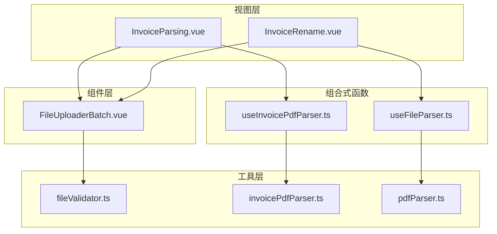
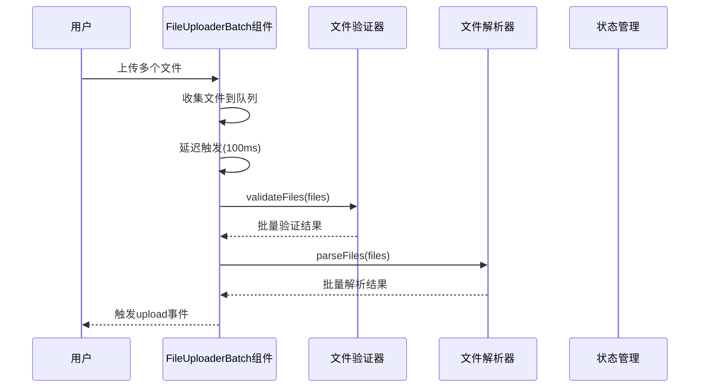
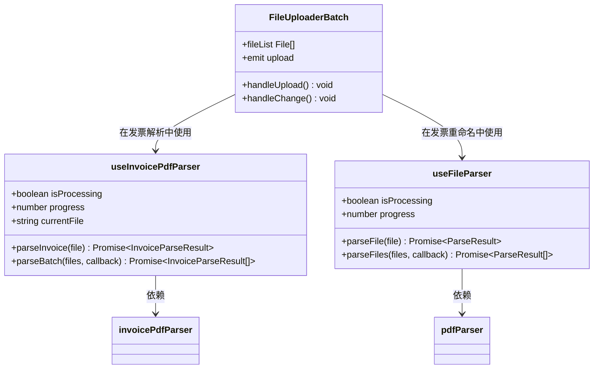
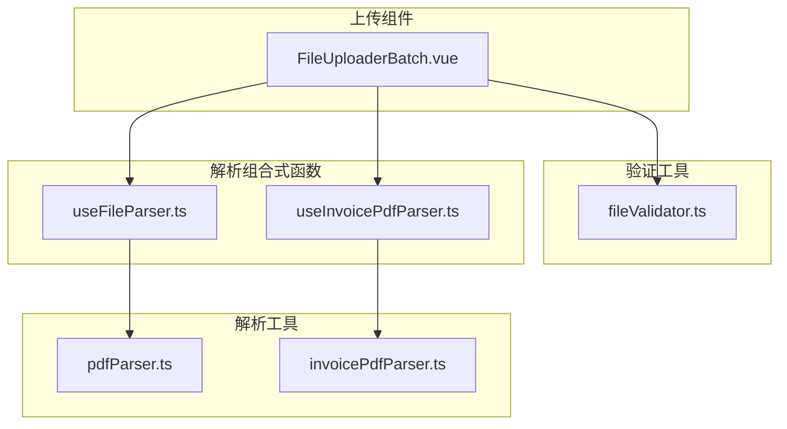
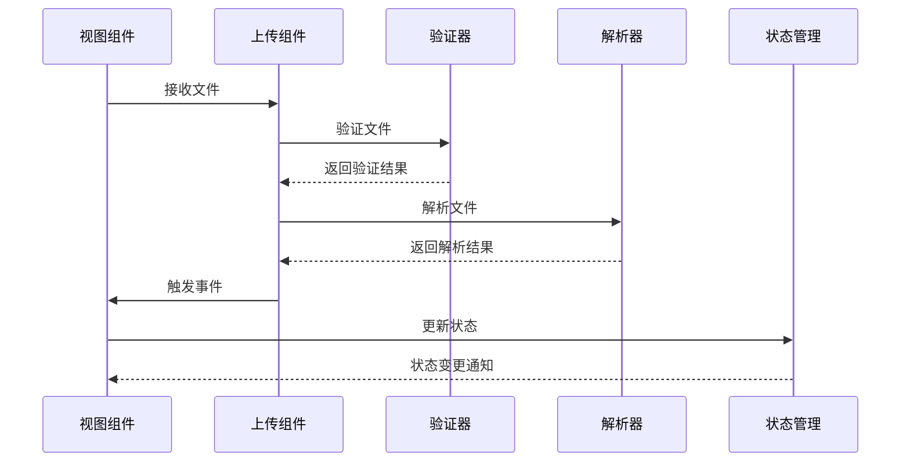

# 文件上传组件

<cite>
**本文档引用的文件**
- [FileUploaderBatch.vue](file://src/components/Upload/FileUploaderBatch.vue)
- [useInvoicePdfParser.ts](file://src/composables/useInvoicePdfParser.ts)
- [useFileParser.ts](file://src/composables/useFileParser.ts)
- [fileValidator.ts](file://src/utils/fileValidator.ts)
- [InvoiceParsing.vue](file://src/views/InvoiceParsing.vue)
- [InvoiceRename.vue](file://src/views/InvoiceRename.vue)
- [invoicePdfParser.ts](file://src/utils/invoicePdfParser.ts)
- [pdfParser.ts](file://src/utils/pdfParser.ts)
</cite>

## 更新摘要
**变更内容**
- 移除了关于已删除的单文件上传组件（FileUploader）的所有内容
- 更新了文档以反映当前仅保留批量上传功能的实际情况
- 重新组织了文档结构，聚焦于FileUploaderBatch组件的设计与使用
- 更新了架构概览和依赖关系分析以反映当前代码状态
- 删除了与单文件上传相关的对比分析内容

## 目录
1. [简介](#简介)
2. [项目结构](#项目结构)
3. [核心组件](#核心组件)
4. [架构概览](#架构概览)
5. [详细组件分析](#详细组件分析)
6. [依赖关系分析](#依赖关系分析)
7. [性能考虑](#性能考虑)
8. [故障排除指南](#故障排除指南)
9. [结论](#结论)
10. [附录](#附录)

## 简介
本文档深入分析了FinanceTools项目中的文件上传机制。随着系统演进，原有的单文件上传组件已被移除，目前系统仅保留并优化了批量文件上传功能，通过FileUploaderBatch组件为发票解析和重命名场景提供统一的批量上传体验。

FileUploaderBatch组件专为发票处理设计，优化了大批量文件上传的用户体验，包含进度反馈与错误提示机制。该组件支持拖拽与点击上传方式，集成文件验证逻辑，并通过组合式函数实现解析逻辑复用。

## 项目结构
FinanceTools项目采用Vue 3 + TypeScript + NaiveUI的技术栈，整体结构清晰，模块化程度高：

**图表来源**
- [InvoiceParsing.vue](file://src/views/InvoiceParsing.vue#L6-L11)
- [InvoiceRename.vue](file://src/views/InvoiceRename.vue#L6-L11)
- [FileUploaderBatch.vue](file://src/components/Upload/FileUploaderBatch.vue#L27-L47)

**章节来源**
- [InvoiceParsing.vue](file://src/views/InvoiceParsing.vue#L1-L315)
- [InvoiceRename.vue](file://src/views/InvoiceRename.vue#L1-L309)

## 核心组件
本节将详细分析当前系统中唯一的上传组件FileUploaderBatch的设计、适用场景以及技术实现。

### FileUploaderBatch组件分析
FileUploaderBatch是系统中唯一的文件上传组件，专为发票处理场景设计的批量上传组件：

**主要特性：**
- 支持PDF格式发票文件
- 最大10MB文件大小限制
- 最多100个文件上传
- 拖拽与点击上传方式
- 延迟触发机制，等待所有文件收集完毕
- 自动去抖处理，避免频繁触发
- 集成文件验证逻辑
- 支持目录拖拽功能

**技术实现要点：**
- 使用NaiveUI的NUpload组件作为基础
- 使用ref管理文件列表状态
- 实现定时器机制延迟触发上传
- 清除之前的定时器，避免重复触发
- 统一触发上传事件，传递文件数组
- 支持props配置（accept、disabled、description）

**章节来源**
- [FileUploaderBatch.vue](file://src/components/Upload/FileUploaderBatch.vue#L1-L79)

## 架构概览
FileUploaderBatch组件在系统中的位置和交互关系如下：

**图表来源**
- [FileUploaderBatch.vue](file://src/components/Upload/FileUploaderBatch.vue#L49-L67)
- [useInvoicePdfParser.ts](file://src/composables/useInvoicePdfParser.ts#L105-L154)
- [useFileParser.ts](file://src/composables/useFileParser.ts#L71-L99)
- [fileValidator.ts](file://src/utils/fileValidator.ts#L77-L106)

## 详细组件分析

### 组件属性分析

| 特性 | FileUploaderBatch |
|------|-------------------|
| **文件类型** | 可配置(PDF默认) |
| **文件大小限制** | 10MB | 
| **文件数量限制** | 100个 |
| **上传方式** | 批量文件上传 |
| **拖拽支持** | 目录拖拽 |
| **验证机制** | 外部验证 |
| **进度反馈** | 有进度条 |
| **错误提示** | 有错误提示 |

### 组件事件分析

**FileUploaderBatch事件：**
- `upload`：批量文件上传事件
- `change`：文件列表变化事件

### 状态管理集成分析

**FileUploaderBatch状态管理：**
- 内部维护文件列表状态
- 实现去抖处理机制
- 直接触发事件，由父组件处理

### 组合式函数复用分析

FileUploaderBatch组件通过不同的组合式函数在不同场景下实现了解析逻辑的复用：

**图表来源**
- [useFileParser.ts](file://src/composables/useFileParser.ts#L15-L108)
- [useInvoicePdfParser.ts](file://src/composables/useInvoicePdfParser.ts#L29-L173)
- [FileUploaderBatch.vue](file://src/components/Upload/FileUploaderBatch.vue#L49-L67)
- [InvoiceParsing.vue](file://src/views/InvoiceParsing.vue#L175-L219)
- [InvoiceRename.vue](file://src/views/InvoiceRename.vue#L137-L173)

**章节来源**
- [useFileParser.ts](file://src/composables/useFileParser.ts#L1-L109)
- [useInvoicePdfParser.ts](file://src/composables/useInvoicePdfParser.ts#L1-L182)

### 文件解析流程分析

#### 发票解析批量流程

**图表来源**
- [useInvoicePdfParser.ts](file://src/composables/useInvoicePdfParser.ts#L105-L154)

#### 发票重命名批量流程

**图表来源**
- [useFileParser.ts](file://src/composables/useFileParser.ts#L71-L99)

### 错误处理机制分析

FileUploaderBatch组件实现了完善的错误处理机制：

**批量错误处理：**
- 批量文件验证的错误聚合
- 进度条的错误状态显示
- 用户友好的错误提示
- 在父组件中处理验证错误并显示

**章节来源**
- [fileValidator.ts](file://src/utils/fileValidator.ts#L57-L72)
- [InvoiceParsing.vue](file://src/views/InvoiceParsing.vue#L180-L189)
- [InvoiceRename.vue](file://src/views/InvoiceRename.vue#L139-L164)

## 依赖关系分析

### 组件依赖关系

**图表来源**
- [FileUploaderBatch.vue](file://src/components/Upload/FileUploaderBatch.vue#L27-L47)
- [useFileParser.ts](file://src/composables/useFileParser.ts#L4-L6)
- [useInvoicePdfParser.ts](file://src/composables/useInvoicePdfParser.ts#L7-L13)

### 数据流分析

**图表来源**
- [InvoiceParsing.vue](file://src/views/InvoiceParsing.vue#L175-L219)
- [InvoiceRename.vue](file://src/views/InvoiceRename.vue#L137-L173)

**章节来源**
- [InvoiceParsing.vue](file://src/views/InvoiceParsing.vue#L1-L315)
- [InvoiceRename.vue](file://src/views/InvoiceRename.vue#L1-L309)

## 性能考虑

### 批量处理优化
FileUploaderBatch组件通过以下机制优化大批量文件上传性能：

1. **延迟触发机制**：使用100ms延时等待所有文件收集完毕
2. **去抖处理**：清除之前的定时器，避免重复触发
3. **批量处理**：将文件分批处理，提高内存效率

### 并发控制
useFileParser和useInvoicePdfParser都实现了并发控制：

1. **批次大小控制**：每批处理10个文件
2. **并行解析**：批次内文件并行解析
3. **进度跟踪**：实时更新处理进度

### 内存管理
- 及时清理文件列表状态
- 合理的错误处理避免内存泄漏
- 及时重置处理状态

## 故障排除指南

### 常见问题及解决方案

**问题1：文件上传失败**
- 检查文件格式是否为PDF
- 确认文件大小不超过10MB限制
- 验证网络连接状态

**问题2：批量上传无响应**
- 检查浏览器控制台是否有错误信息
- 确认文件数量是否超过限制
- 验证浏览器对拖拽功能的支持

**问题3：解析结果不准确**
- 检查发票文件的完整性
- 确认发票格式符合预期
- 验证解析算法的准确性

**章节来源**
- [fileValidator.ts](file://src/utils/fileValidator.ts#L77-L106)
- [InvoiceParsing.vue](file://src/views/InvoiceParsing.vue#L180-L189)
- [InvoiceRename.vue](file://src/views/InvoiceRename.vue#L139-L164)

## 结论

随着系统演进，FinanceTools项目中的文件上传机制已统一为批量上传模式，通过FileUploaderBatch组件为不同业务场景提供服务：

**FileUploaderBatch适用于：**
- 发票解析的大批量上传
- 发票重命名的批量处理
- 需要进度反馈的场景
- 复杂的错误处理需求
- 高效的批量处理场景

该组件通过与不同的组合式函数集成，在不同场景下实现了灵活的解析逻辑复用，确保了代码的一致性和可维护性。开发者应根据具体的业务需求使用该组件，以获得最佳的用户体验和开发效率。

## 附录

### 使用示例代码路径

**FileUploaderBatch使用示例：**
- [InvoiceParsing.vue](file://src/views/InvoiceParsing.vue#L6-L11)
- [InvoiceRename.vue](file://src/views/InvoiceRename.vue#L6-L11)

**组合式函数使用示例：**
- [useFileParser.ts](file://src/composables/useFileParser.ts#L15-L108)
- [useInvoicePdfParser.ts](file://src/composables/useInvoicePdfParser.ts#L29-L173)

### 配置参数说明

**FileUploaderBatch Props配置：**
- `accept`: 接受的文件类型，默认为PDF格式
- `disabled`: 是否禁用组件
- `description`: 描述性文本

**文件验证配置：**
- 支持格式：PDF
- 文件大小限制：10MB
- 文件数量限制：100个