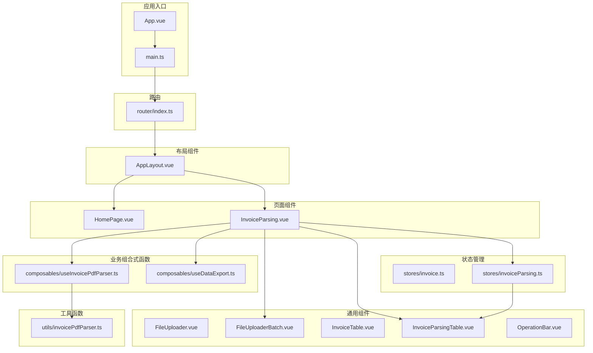
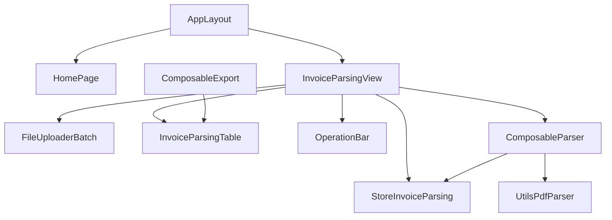
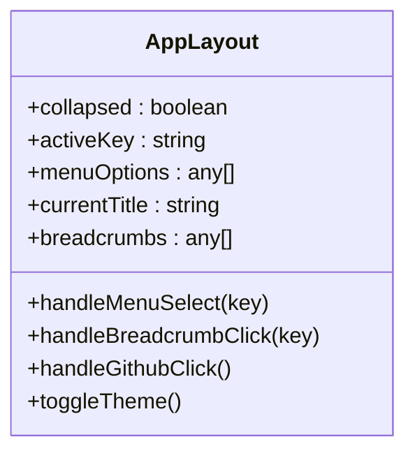
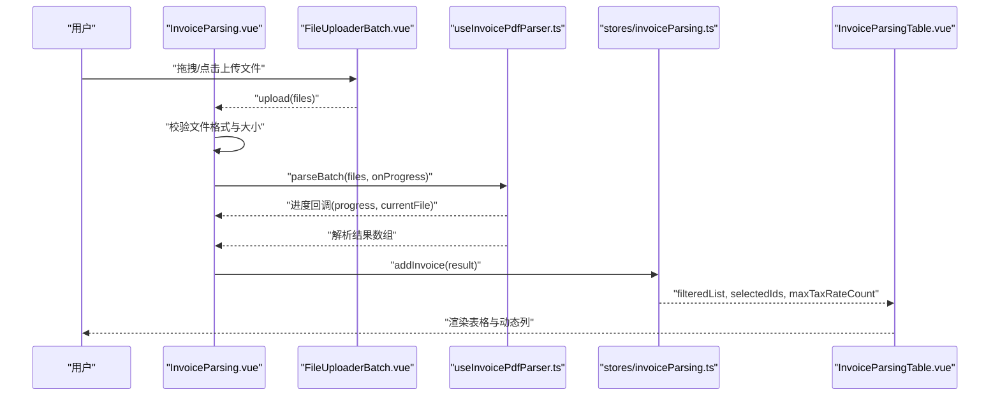
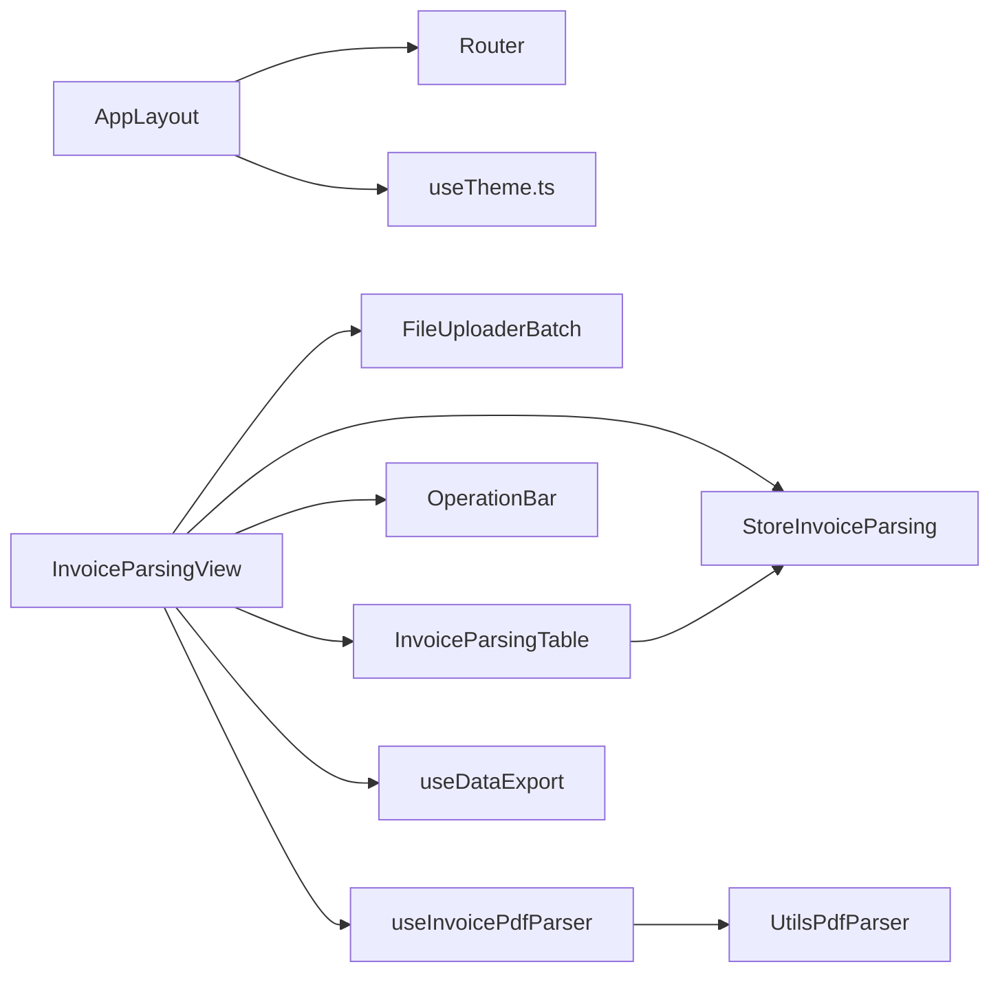
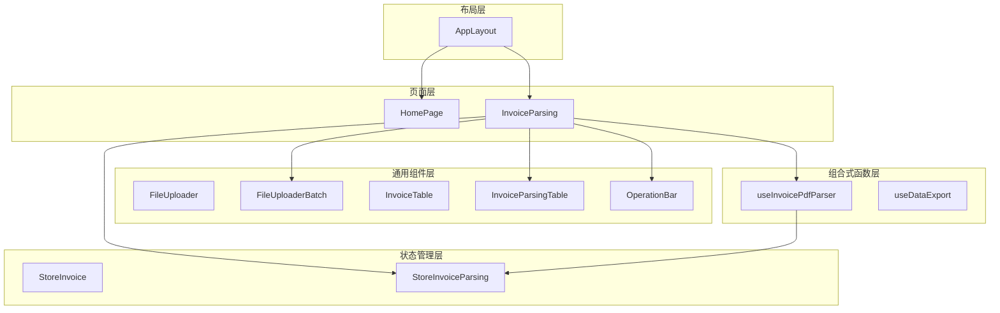

# 组件架构设计

<cite>
**本文档引用的文件**
- [AppLayout.vue](file://src/components/Common/AppLayout.vue)
- [FileUploader.vue](file://src/components/Upload/FileUploader.vue)
- [FileUploaderBatch.vue](file://src/components/Upload/FileUploaderBatch.vue)
- [InvoiceTable.vue](file://src/components/Invoice/InvoiceTable.vue)
- [InvoiceParsingTable.vue](file://src/components/Invoice/InvoiceParsingTable.vue)
- [OperationBar.vue](file://src/components/Common/OperationBar.vue)
- [HomePage.vue](file://src/views/HomePage.vue)
- [InvoiceParsing.vue](file://src/views/InvoiceParsing.vue)
- [invoice.ts](file://src/stores/invoice.ts)
- [invoiceParsing.ts](file://src/stores/invoiceParsing.ts)
- [useInvoicePdfParser.ts](file://src/composables/useInvoicePdfParser.ts)
- [useDataExport.ts](file://src/composables/useDataExport.ts)
- [invoicePdfParser.ts](file://src/utils/invoicePdfParser.ts)
- [router/index.ts](file://src/router/index.ts)
</cite>

## 更新摘要
**已做更改**
- 更新所有组件文件路径以反映新的目录结构（Common、Invoice、Upload子目录）
- 修正“项目结构”、“核心组件”、“架构总览”等章节中的组件路径引用
- 更新图表来源和章节来源中的文件路径
- 调整附录中的使用示例路径

## 目录
1. [简介](#简介)
2. [项目结构](#项目结构)
3. [核心组件](#核心组件)
4. [架构总览](#架构总览)
5. [详细组件分析](#详细组件分析)
6. [依赖关系分析](#依赖关系分析)
7. [性能考虑](#性能考虑)
8. [故障排查指南](#故障排查指南)
9. [结论](#结论)
10. [附录](#附录)

## 简介
本文件系统性梳理 FinanceTools 的组件架构，重点分析以下方面：
- AppLayout 作为根布局组件如何组织页面结构与导航
- FileUploader 与 FileUploaderBatch 在单文件与批量上传场景下的差异化设计
- InvoiceTable 与 InvoiceParsingTable 在数据展示上的复用与定制策略
- OperationBar 如何提供统一的操作控制入口
- Vue 组件通信机制（props/emits）与插槽使用
- 组件层次图与使用示例
- 可复用性设计原则与响应式布局实现
- 新组件开发设计规范指导

## 项目结构
FinanceTools 采用基于功能域的模块化组织方式，核心目录如下：
- src/components：通用 UI 组件库，按功能划分为 Common、Invoice 和 Upload 子目录
- src/views：页面级视图组件
- src/stores：Pinia 状态管理
- src/composables：可复用业务逻辑组合式函数
- src/utils：底层工具方法
- src/router：路由配置



**图表来源**
- [AppLayout.vue](file://src/components/Common/AppLayout.vue#L1-L340)
- [InvoiceParsing.vue](file://src/views/InvoiceParsing.vue#L1-L328)
- [FileUploaderBatch.vue](file://src/components/Upload/FileUploaderBatch.vue#L1-L79)
- [InvoiceParsingTable.vue](file://src/components/Invoice/InvoiceParsingTable.vue#L1-L157)
- [invoiceParsing.ts](file://src/stores/invoiceParsing.ts#L1-L241)
- [useInvoicePdfParser.ts](file://src/composables/useInvoicePdfParser.ts#L1-L173)
- [useDataExport.ts](file://src/composables/useDataExport.ts#L1-L308)
- [invoicePdfParser.ts](file://src/utils/invoicePdfParser.ts#L1-L349)
- [router/index.ts](file://src/router/index.ts#L1-L40)

**章节来源**
- [router/index.ts](file://src/router/index.ts#L1-L40)

## 核心组件
本节聚焦于六大核心组件：AppLayout、FileUploader、FileUploaderBatch、InvoiceTable、InvoiceParsingTable、OperationBar，并阐述它们在整体架构中的职责与协作。

- AppLayout：提供全局侧边栏导航、面包屑、标题、主题切换与页脚，作为所有页面的根布局容器。
- FileUploader：单文件上传组件，适用于简单场景或演示用途。
- FileUploaderBatch：批量上传组件，具备延迟触发与文件收集能力，适合真实业务场景。
- InvoiceTable：发票重命名场景的数据表格，支持编辑、删除、分页与选择。
- InvoiceParsingTable：发票解析场景的数据表格，支持动态税率列、加载态与选择同步。
- OperationBar：统一的操作控制栏，提供筛选、搜索、全选/清空、删除选中、导出等操作。

**章节来源**
- [AppLayout.vue](file://src/components/Common/AppLayout.vue#L1-L340)
- [FileUploader.vue](file://src/components/Upload/FileUploader.vue#L1-L50)
- [FileUploaderBatch.vue](file://src/components/Upload/FileUploaderBatch.vue#L1-L79)
- [InvoiceTable.vue](file://src/components/Invoice/InvoiceTable.vue#L1-L182)
- [InvoiceParsingTable.vue](file://src/components/Invoice/InvoiceParsingTable.vue#L1-L157)
- [OperationBar.vue](file://src/components/Common/OperationBar.vue#L1-L119)

## 架构总览
FinanceTools 采用“布局组件 + 页面组件 + 通用组件 + 状态管理 + 组合式函数”的分层架构：
- 布局层：AppLayout 统一承载导航、面包屑、主题与页脚
- 页面层：HomePage、InvoiceParsing 等页面组件负责业务编排
- 通用组件层：FileUploader、FileUploaderBatch、InvoiceTable、InvoiceParsingTable、OperationBar 提供可复用 UI 与交互
- 状态管理层：Pinia Store 管理数据状态与计算属性
- 组合式函数层：useInvoicePdfParser、useDataExport 封装业务逻辑与副作用



**图表来源**
- [AppLayout.vue](file://src/components/Common/AppLayout.vue#L1-L340)
- [InvoiceParsing.vue](file://src/views/InvoiceParsing.vue#L1-L328)
- [InvoiceParsingTable.vue](file://src/components/Invoice/InvoiceParsingTable.vue#L1-L157)
- [OperationBar.vue](file://src/components/Common/OperationBar.vue#L1-L119)
- [invoiceParsing.ts](file://src/stores/invoiceParsing.ts#L1-L241)
- [useInvoicePdfParser.ts](file://src/composables/useInvoicePdfParser.ts#L1-L173)
- [invoicePdfParser.ts](file://src/utils/invoicePdfParser.ts#L1-L349)

## 详细组件分析

### AppLayout：根布局与导航
AppLayout 作为全局布局容器，承担以下职责：
- 侧边栏菜单：根据路由动态高亮，支持折叠/展开
- 面包屑导航：根据当前路由构建层级路径
- 标题与副标题：根据当前菜单项动态显示
- 主题切换：集成 useTheme，支持暗黑/浅色模式
- 页脚：固定底部版权信息
- 内容区插槽：承载页面内容



**图表来源**
- [AppLayout.vue](file://src/components/Common/AppLayout.vue#L106-L250)

**章节来源**
- [AppLayout.vue](file://src/components/Common/AppLayout.vue#L1-L340)

### FileUploader 与 FileUploaderBatch：上传组件对比
两者均基于 Naive UI Upload 组件，但在行为与扩展性上存在显著差异：
- FileUploader
  - 单文件上传，直接触发自定义上传逻辑
  - 适合演示或简单场景
- FileUploaderBatch
  - 批量上传，具备延迟触发与文件收集
  - 通过定时器聚合文件，避免频繁触发
  - 支持 accept、disabled、description 等 props 定制

```mermaid
classDiagram
class FileUploader {
+props : {}
+emits : upload
+handleUpload()
+handleChange()
}
class FileUploaderBatch {
+props : { accept, disabled, description }
+emits : upload
+fileList : File[]
+handleUpload()
+handleChange()
}
FileUploaderBatch --> FileUploader : "行为对比"
```

**图表来源**
- [FileUploader.vue](file://src/components/Upload/FileUploader.vue#L27-L43)
- [FileUploaderBatch.vue](file://src/components/Upload/FileUploaderBatch.vue#L27-L72)

**章节来源**
- [FileUploader.vue](file://src/components/Upload/FileUploader.vue#L1-L50)
- [FileUploaderBatch.vue](file://src/components/Upload/FileUploaderBatch.vue#L1-L79)

### InvoiceTable 与 InvoiceParsingTable：数据表格复用与定制
两者均基于 Naive UI DataTable，但针对不同业务场景做了差异化设计：
- InvoiceTable（发票重命名）
  - 展示原始文件名、发票类型、购买方名称、金额、新文件名、状态、失败原因
  - 支持对购买方名称、金额、新文件名进行内联编辑
  - 提供删除与分页功能
- InvoiceParsingTable（发票解析）
  - 展示文件名、发票号码、发票类型、金额、税额、价税合计
  - 动态生成税率列（根据最大税率数量），支持加载态与选择同步
  - 提供删除与分页功能

```mermaid
classDiagram
class InvoiceTable {
+props : { data, selectedIds }
+emits : update : selectedIds, edit, delete
+columns : DataTableColumns
+pagination : PaginationProps
}
class InvoiceParsingTable {
+props : { data, selectedIds, loading, maxTaxRateCount }
+emits : update : selectedIds, delete
+baseColumns : DataTableColumns
+dynamicTaxRateColumns : DataTableColumns
+trailingColumns : DataTableColumns
+tableColumns : DataTableColumns
+scrollX : number
+pagination : PaginationProps
}
InvoiceParsingTable --> InvoiceTable : "复用与定制"
```

**图表来源**
- [InvoiceTable.vue](file://src/components/Invoice/InvoiceTable.vue#L12-L182)
- [InvoiceParsingTable.vue](file://src/components/Invoice/InvoiceParsingTable.vue#L14-L157)

**章节来源**
- [InvoiceTable.vue](file://src/components/Invoice/InvoiceTable.vue#L1-L182)
- [InvoiceParsingTable.vue](file://src/components/Invoice/InvoiceParsingTable.vue#L1-L157)

### OperationBar：统一操作控制入口
OperationBar 提供统一的操作栏，包含：
- 状态筛选：全部/成功/失败
- 关键词搜索：支持输入与清空
- 选择控制：全选、取消选择
- 删除选中：批量删除
- 导出：支持 Excel/JSON 两种格式

```mermaid
classDiagram
class OperationBar {
+props : { filterStatus, searchKeyword, totalCount, successCount, failedCount, selectedCount, isExporting }
+emits : update : filterStatus, update : searchKeyword, select-all, clear-selection, delete-selected, export
+localFilterStatus : string
+localSearchKeyword : string
}
```

**图表来源**
- [OperationBar.vue](file://src/components/Common/OperationBar.vue#L55-L119)

**章节来源**
- [OperationBar.vue](file://src/components/Common/OperationBar.vue#L1-L119)

### 页面与组件交互流程：发票解析页面
InvoiceParsing 页面展示了组件间典型交互流程：
- FileUploaderBatch 接收文件，触发上传事件
- 页面校验文件格式与大小
- 调用 useInvoicePdfParser 执行批量解析，实时更新进度
- 将解析结果写入 Pinia Store
- 通过 InvoiceParsingTable 展示结果，支持筛选、搜索、选择与导出



**图表来源**
- [InvoiceParsing.vue](file://src/views/InvoiceParsing.vue#L188-L232)
- [FileUploaderBatch.vue](file://src/components/Upload/FileUploaderBatch.vue#L49-L67)
- [useInvoicePdfParser.ts](file://src/composables/useInvoicePdfParser.ts#L96-L153)
- [invoiceParsing.ts](file://src/stores/invoiceParsing.ts#L122-L128)
- [InvoiceParsingTable.vue](file://src/components/Invoice/InvoiceParsingTable.vue#L136-L151)

**章节来源**
- [InvoiceParsing.vue](file://src/views/InvoiceParsing.vue#L1-L328)

## 依赖关系分析
- 组件依赖
  - AppLayout 依赖路由与主题组合式函数，提供全局导航与主题切换
  - InvoiceParsing 页面依赖 FileUploaderBatch、InvoiceParsingTable、OperationBar、useInvoicePdfParser、useDataExport、invoiceParsing Store
  - InvoiceParsingTable 依赖 invoiceParsing Store 的计算属性（过滤后列表、最大税率数、选中项）
- 状态管理
  - invoiceParsing Store 提供数据状态、计算属性与操作方法，支撑表格渲染与交互
  - invoice Store 提供发票重命名场景的状态与方法
- 组合式函数
  - useInvoicePdfParser 封装 PDF 解析、批量处理与进度反馈
  - useDataExport 封装 Excel/JSON 导出逻辑



**图表来源**
- [AppLayout.vue](file://src/components/Common/AppLayout.vue#L106-L133)
- [InvoiceParsing.vue](file://src/views/InvoiceParsing.vue#L140-L151)
- [InvoiceParsingTable.vue](file://src/components/Invoice/InvoiceParsingTable.vue#L18-L27)
- [useInvoicePdfParser.ts](file://src/composables/useInvoicePdfParser.ts#L29-L173)
- [invoicePdfParser.ts](file://src/utils/invoicePdfParser.ts#L1-L349)

**章节来源**
- [invoiceParsing.ts](file://src/stores/invoiceParsing.ts#L1-L241)
- [invoice.ts](file://src/stores/invoice.ts#L1-L256)

## 性能考虑
- 批量解析优化
  - 使用分批并发策略（批次间串行、批次内并发），提升吞吐与稳定性
  - 通过进度回调提供细粒度反馈，改善用户体验
- 表格性能
  - InvoiceParsingTable 动态列宽度随最大税率数调整，避免滚动条闪烁
  - 分页组件按需加载，减少 DOM 节点数量
- 导出性能
  - Excel 导出使用 xlsx 库，合理设置列宽与数据转换，避免内存峰值过高
  - JSON 导出采用字符串化，便于调试与兼容性

[本节为通用性能建议，无需特定文件来源]

## 故障排查指南
- 上传失败
  - 检查文件格式与大小限制（PDF，≤10MB）
  - 确认 FileUploaderBatch 的 accept 与 description 是否符合预期
- 解析异常
  - 查看解析进度与当前文件名，定位具体文件
  - 检查 invoicePdfParser 的正则匹配与验证规则
- 导出失败
  - 确认是否有可导出数据
  - 检查导出格式与目标模式（全部/成功/选中）

**章节来源**
- [InvoiceParsing.vue](file://src/views/InvoiceParsing.vue#L194-L203)
- [useInvoicePdfParser.ts](file://src/composables/useInvoicePdfParser.ts#L42-L49)
- [useDataExport.ts](file://src/composables/useDataExport.ts#L58-L60)

## 结论
FinanceTools 的组件架构以 AppLayout 为根布局，围绕页面组件（如 InvoiceParsing）组织通用组件（FileUploaderBatch、InvoiceParsingTable、OperationBar），并通过 Pinia Store 与组合式函数（useInvoicePdfParser、useDataExport）实现清晰的职责分离与良好的可复用性。该架构在上传、解析、展示与导出等关键流程中体现了响应式设计与性能优化，为后续扩展提供了坚实基础。

[本节为总结性内容，无需特定文件来源]

## 附录

### 组件层次图（概念性）


[本图为概念性示意，无需图表来源]

### 使用示例（路径指引）
- 在页面中引入并使用 FileUploaderBatch 与 InvoiceParsingTable
  - 示例路径：[InvoiceParsing.vue](file://src/views/InvoiceParsing.vue#L6-L85)
- 在组件间通过 props 传递数据，通过 emits 触发事件
  - 示例路径：[InvoiceParsingTable.vue](file://src/components/Invoice/InvoiceParsingTable.vue#L22-L32)
- 通过 Pinia Store 管理状态与计算属性
  - 示例路径：[invoiceParsing.ts](file://src/stores/invoiceParsing.ts#L71-L120)

[本节为使用示例路径指引，无需特定文件来源]

### 设计规范指导（新组件开发）
- Props 设计
  - 明确默认值与类型约束，使用 withDefaults 提供合理默认
  - 将可变状态尽量下沉至父组件或 Store，子组件保持纯展示
- Emits 设计
  - 以“事件语义化”命名，避免过多细粒度事件
  - 与父组件约定一致的事件载荷结构
- 插槽使用
  - 仅在必要时暴露插槽，避免过度抽象
  - 为默认插槽提供清晰的占位与样式
- 响应式布局
  - 使用媒体查询适配移动端，确保表格与卡片在窄屏下可用
  - 控制表格列宽与滚动策略，避免布局抖动
- 可复用性
  - 将通用逻辑抽取为组合式函数或工具函数
  - 通过 Store 抽象共享状态，避免组件间紧耦合
- 错误处理
  - 在上传与解析阶段提供明确的错误提示与回退策略
  - 在导出阶段检查数据有效性，避免空导出

[本节为通用设计规范，无需特定文件来源]