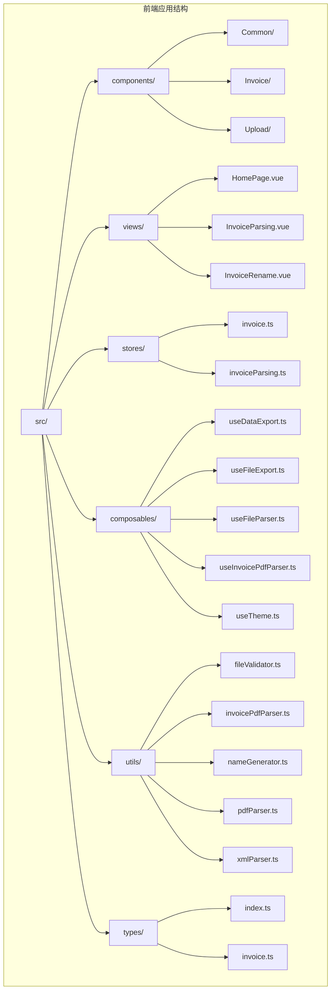
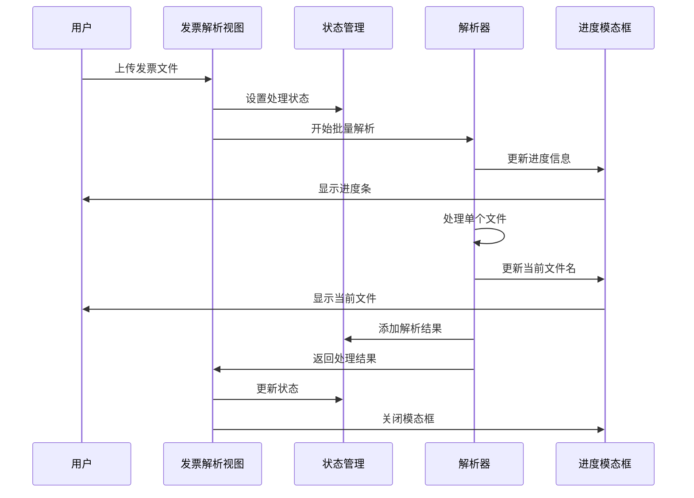
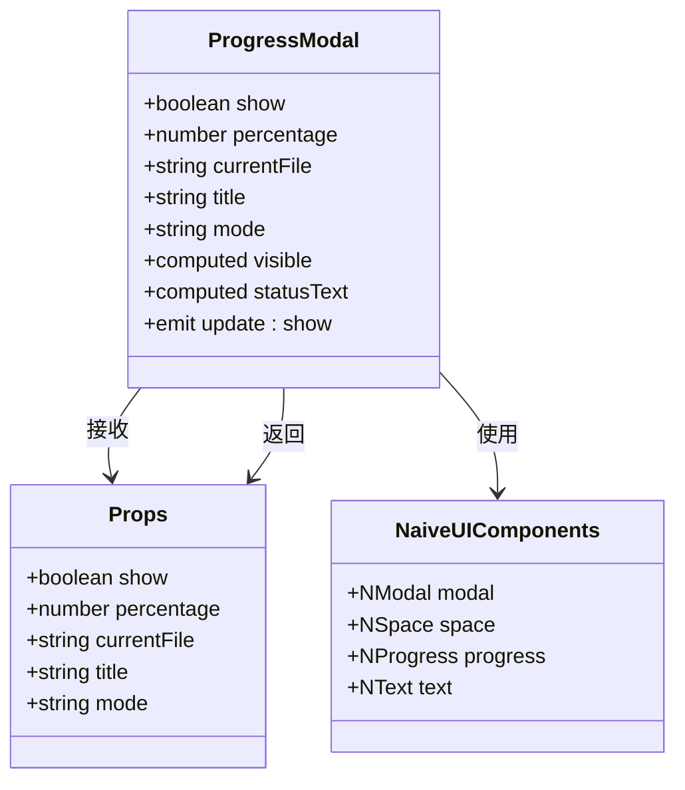
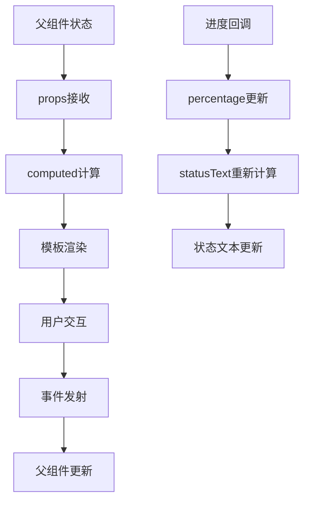
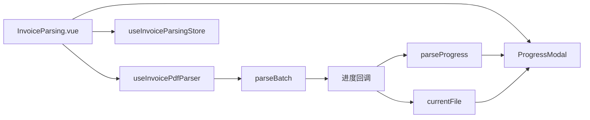
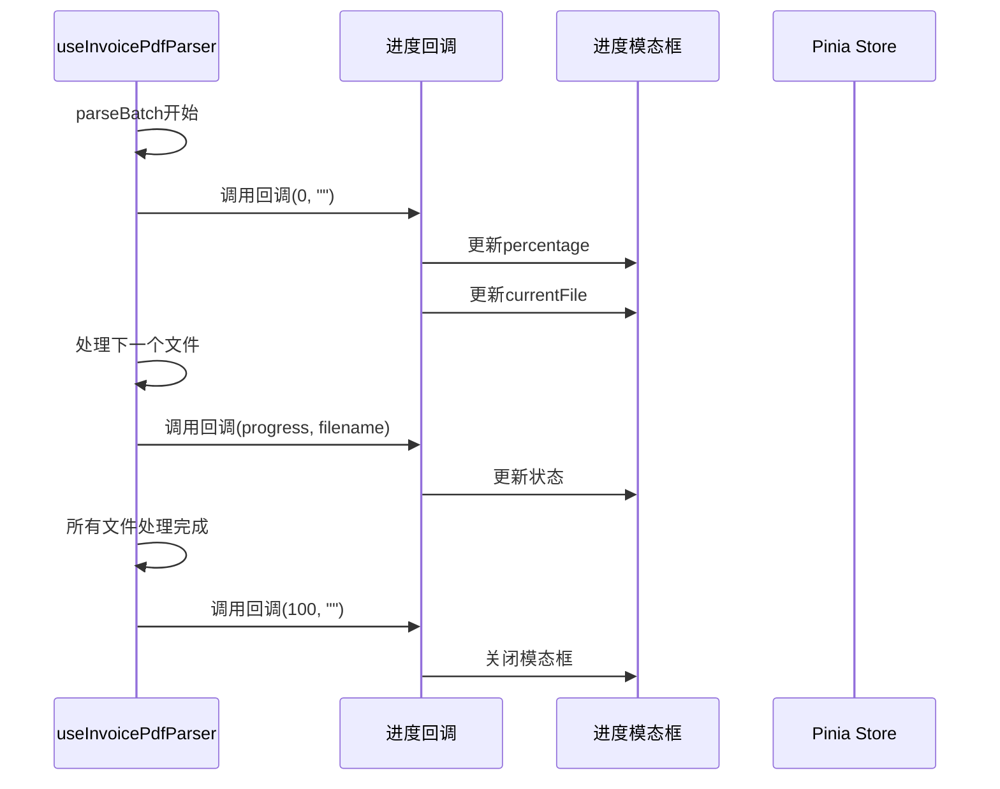
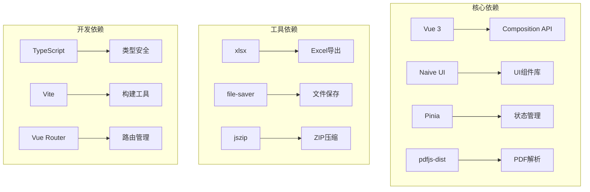
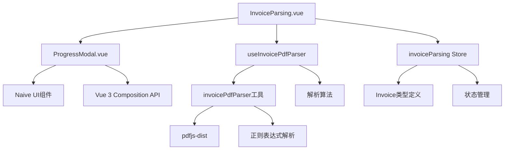

# 进度模态框

<cite>
**本文档引用的文件**
- [ProgressModal.vue](file://src/components/Common/ProgressModal.vue)
- [InvoiceParsing.vue](file://src/views/InvoiceParsing.vue)
- [invoiceParsing.ts](file://src/stores/invoiceParsing.ts)
- [useInvoicePdfParser.ts](file://src/composables/useInvoicePdfParser.ts)
- [invoicePdfParser.ts](file://src/utils/invoicePdfParser.ts)
- [invoice.ts](file://src/types/invoice.ts)
- [package.json](file://package.json)
</cite>

## 目录
1. [简介](#简介)
2. [项目结构](#项目结构)
3. [核心组件](#核心组件)
4. [架构概览](#架构概览)
5. [详细组件分析](#详细组件分析)
6. [依赖关系分析](#依赖关系分析)
7. [性能考虑](#性能考虑)
8. [故障排除指南](#故障排除指南)
9. [结论](#结论)

## 简介

进度模态框是财务工具箱项目中的一个关键用户界面组件，专门用于显示发票批量解析过程中的实时进度信息。该组件提供了直观的进度条显示、当前处理文件状态以及详细的处理统计信息，确保用户能够清楚地了解文件处理的实时状态。

该项目基于Vue 3构建，采用现代化的前端技术栈，包括Naive UI组件库、Pinia状态管理、TypeScript类型系统等。进度模态框作为通用组件，不仅服务于发票解析功能，还可以扩展应用到其他需要进度显示的场景中。

## 项目结构

财务工具箱项目采用模块化的组织方式，主要分为以下几个核心部分：

**图表来源**
- [ProgressModal.vue](file://src/components/Common/ProgressModal.vue#L1-L54)
- [InvoiceParsing.vue](file://src/views/InvoiceParsing.vue#L1-L315)

**章节来源**
- [package.json](file://package.json#L1-L33)
- [main.ts](file://src/main.ts#L1-L12)

## 核心组件

进度模态框组件是整个项目中最核心的UI组件之一，它实现了以下关键功能：

### 组件特性
- **实时进度显示**: 通过进度条直观展示文件处理进度
- **状态文本**: 动态显示当前处理状态和百分比
- **文件信息**: 显示当前正在处理的文件名
- **响应式设计**: 自适应不同屏幕尺寸
- **可配置性**: 支持不同的显示模式和标题设置

### 技术实现
组件基于Vue 3的Composition API构建，使用Naive UI的Modal、Progress等基础组件，实现了高度可复用的进度显示功能。

**章节来源**
- [ProgressModal.vue](file://src/components/Common/ProgressModal.vue#L1-L54)

## 架构概览

进度模态框在整个应用架构中扮演着重要的桥梁角色，连接了用户界面与后台处理逻辑：

**图表来源**
- [InvoiceParsing.vue](file://src/views/InvoiceParsing.vue#L175-L219)
- [useInvoicePdfParser.ts](file://src/composables/useInvoicePdfParser.ts#L105-L162)
- [ProgressModal.vue](file://src/components/Common/ProgressModal.vue#L23-L52)

## 详细组件分析

### 进度模态框组件

#### 组件结构分析

**图表来源**
- [ProgressModal.vue](file://src/components/Common/ProgressModal.vue#L23-L52)

#### 核心功能实现

进度模态框组件的核心功能通过以下方式实现：

1. **双向数据绑定**: 使用`v-model:show`实现与父组件的状态同步
2. **动态进度计算**: 通过`statusText`计算显示状态文本
3. **条件渲染**: 根据文件存在性显示当前文件信息
4. **模式切换**: 支持解析和处理两种模式

#### 数据流分析

**图表来源**
- [ProgressModal.vue](file://src/components/Common/ProgressModal.vue#L44-L52)

**章节来源**
- [ProgressModal.vue](file://src/components/Common/ProgressModal.vue#L1-L54)

### 发票解析流程集成

#### 视图组件集成

发票解析视图组件通过以下方式集成了进度模态框：

**图表来源**
- [InvoiceParsing.vue](file://src/views/InvoiceParsing.vue#L100-L107)
- [InvoiceParsing.vue](file://src/views/InvoiceParsing.vue#L195-L199)

#### 状态管理集成

进度模态框与状态管理系统的集成体现在：

1. **全局状态控制**: 通过`store.isProcessing`控制模态框显示
2. **进度状态同步**: 通过`parseProgress`和`currentFile`同步进度信息
3. **生命周期管理**: 在解析开始和结束时自动控制模态框状态

**章节来源**
- [InvoiceParsing.vue](file://src/views/InvoiceParsing.vue#L1-L315)

### 解析器集成

#### 批量解析集成

解析器通过回调函数机制与进度模态框进行集成：

**图表来源**
- [useInvoicePdfParser.ts](file://src/composables/useInvoicePdfParser.ts#L105-L162)
- [InvoiceParsing.vue](file://src/views/InvoiceParsing.vue#L195-L199)

**章节来源**
- [useInvoicePdfParser.ts](file://src/composables/useInvoicePdfParser.ts#L1-L182)

## 依赖关系分析

### 外部依赖

项目的主要外部依赖包括：

**图表来源**
- [package.json](file://package.json#L12-L23)

### 内部依赖关系

进度模态框与其他组件的依赖关系：

**图表来源**
- [ProgressModal.vue](file://src/components/Common/ProgressModal.vue#L23-L25)
- [InvoiceParsing.vue](file://src/views/InvoiceParsing.vue#L126-L131)

**章节来源**
- [package.json](file://package.json#L1-L33)

## 性能考虑

### 进度更新策略

1. **细粒度进度更新**: 每个文件处理完成后更新一次进度，确保用户体验流畅
2. **内存管理**: 及时清理进度状态，避免内存泄漏
3. **渲染优化**: 使用计算属性避免不必要的重新渲染

### 批量处理优化

1. **分批处理**: 默认每批处理10个文件，平衡性能和内存使用
2. **并发控制**: 批次间串行，批次内并发，确保稳定性
3. **错误恢复**: 单个文件失败不影响整体处理流程

### 用户体验优化

1. **即时反馈**: 解析开始立即显示进度模态框
2. **状态指示**: 清晰显示当前处理文件和进度百分比
3. **操作保护**: 处理期间禁用相关操作按钮

## 故障排除指南

### 常见问题及解决方案

#### 进度模态框不显示

**可能原因**:
- 父组件未正确传递`show`属性
- 状态管理状态未正确更新
- 组件挂载时机问题

**解决方案**:
1. 检查父组件中`v-model:show`的绑定
2. 确认状态管理中`isProcessing`的正确设置
3. 验证组件的生命周期钩子

#### 进度显示异常

**可能原因**:
- 百分比计算错误
- 进度回调未正确调用
- 状态更新时机问题

**解决方案**:
1. 检查进度计算逻辑
2. 验证回调函数的参数传递
3. 确认状态更新的同步性

#### 性能问题

**可能原因**:
- 进度更新过于频繁
- 大量DOM操作
- 内存泄漏

**解决方案**:
1. 优化进度更新频率
2. 减少不必要的DOM操作
3. 及时清理事件监听器

**章节来源**
- [ProgressModal.vue](file://src/components/Common/ProgressModal.vue#L44-L52)
- [InvoiceParsing.vue](file://src/views/InvoiceParsing.vue#L195-L219)

## 结论

进度模态框作为财务工具箱项目中的重要组件，展现了现代前端开发的最佳实践。通过合理的架构设计、清晰的组件职责划分和完善的错误处理机制，该组件为用户提供了优秀的进度可视化体验。

### 主要优势

1. **模块化设计**: 组件独立性强，易于复用和维护
2. **响应式更新**: 实时反映处理状态变化
3. **用户体验友好**: 提供清晰的进度反馈
4. **性能优化**: 合理的更新策略和资源管理

### 技术亮点

1. **TypeScript集成**: 提供完整的类型安全保障
2. **Composition API**: 利用Vue 3的新特性提升开发体验
3. **状态管理集成**: 与Pinia完美结合
4. **工具函数复用**: 解析算法的模块化设计

该进度模态框组件为整个发票处理系统提供了可靠的用户体验保障，是项目架构中不可或缺的重要组成部分。其设计理念和实现方式为类似应用场景提供了良好的参考模板。