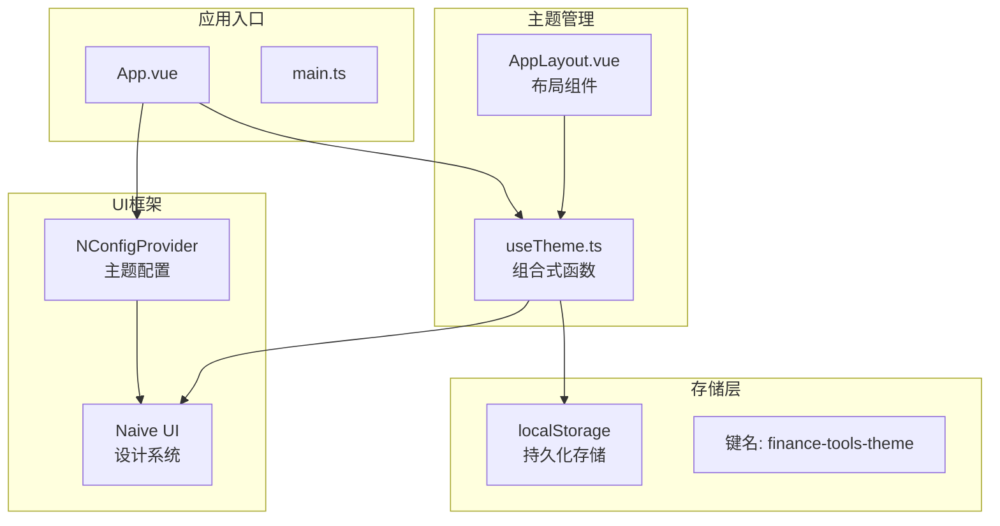
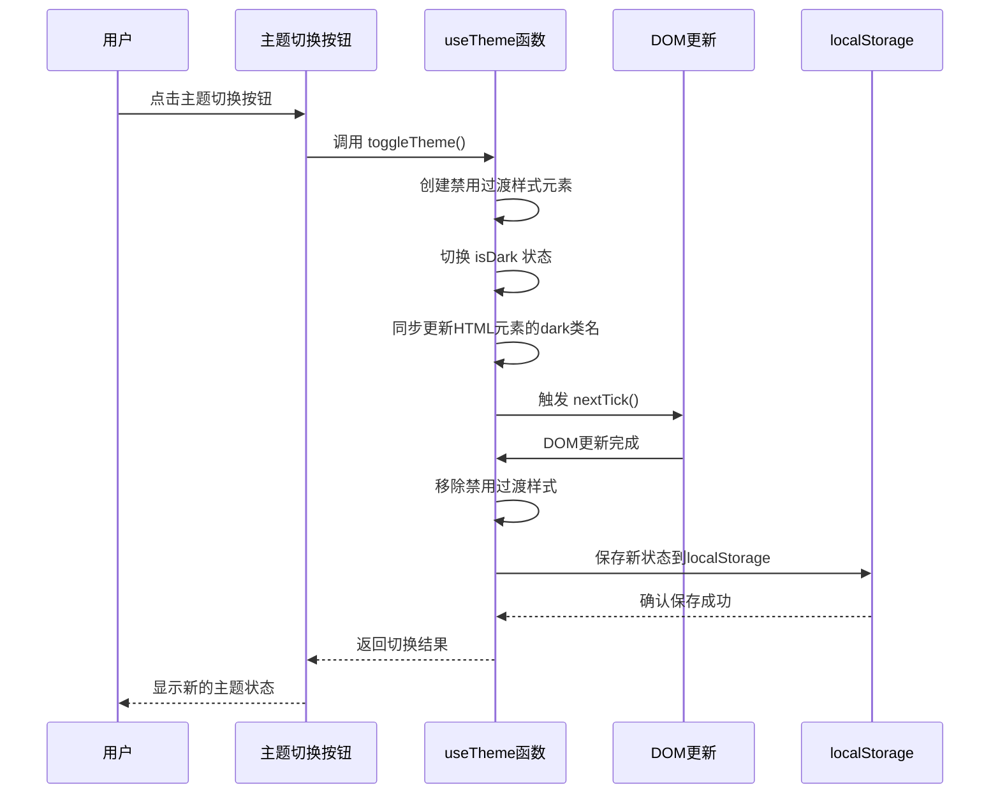
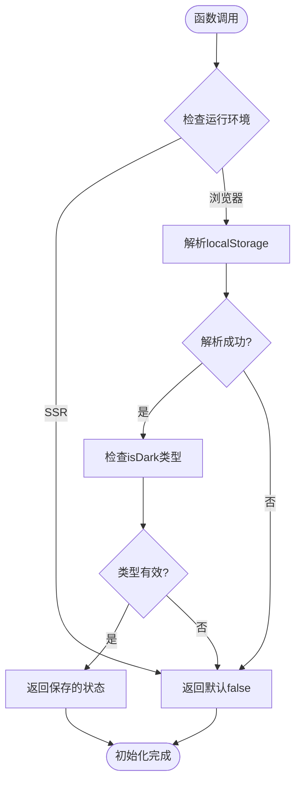
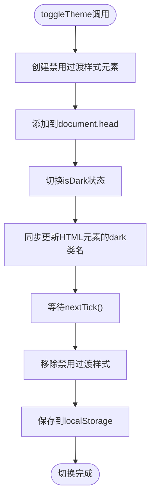
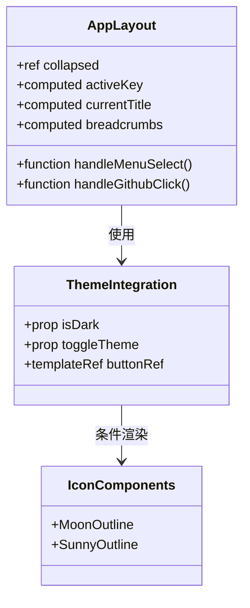
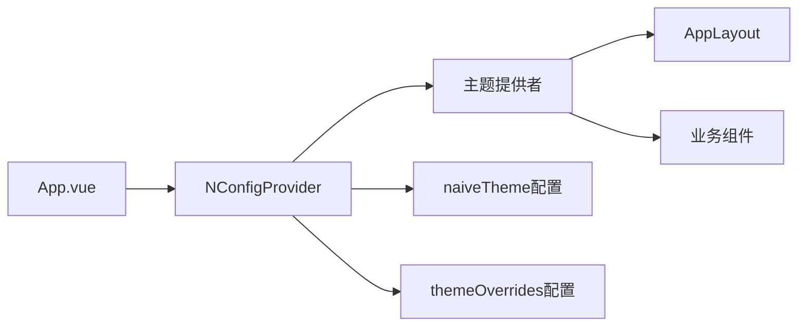
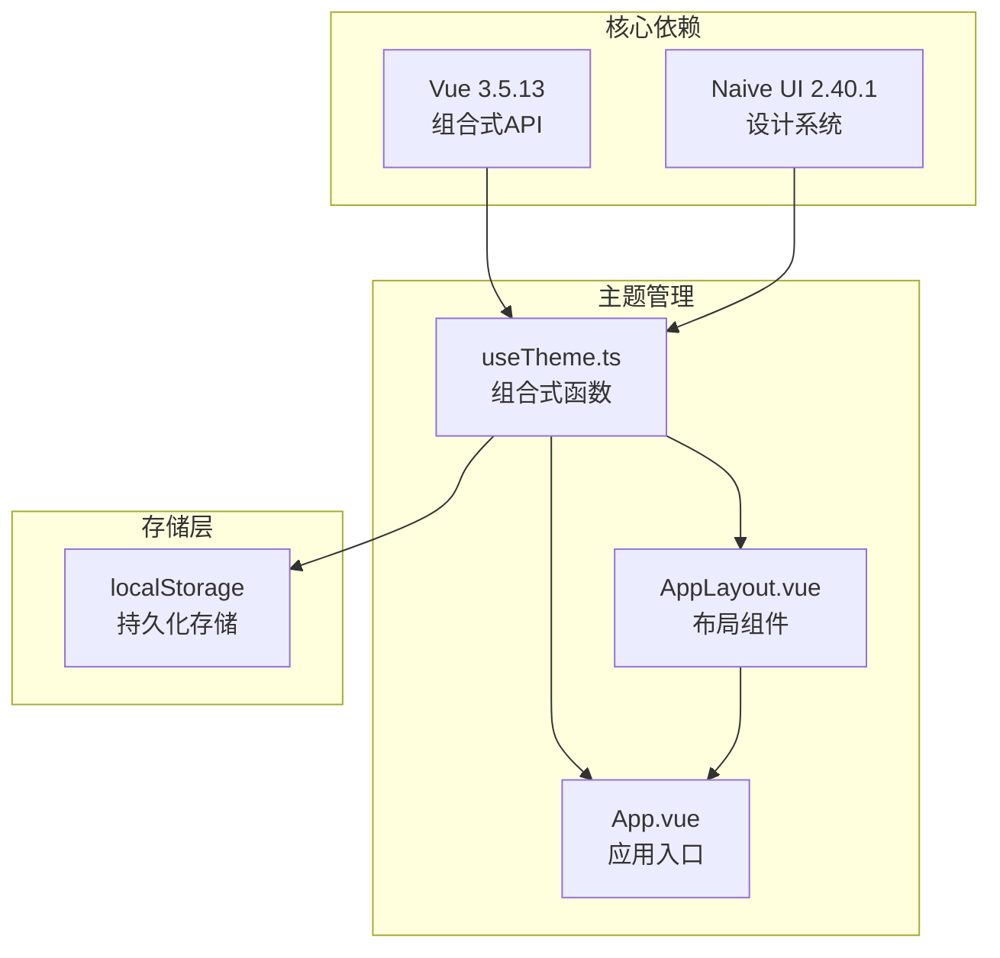

# 主题管理组合式函数

<cite>
**本文档引用的文件**
- [useTheme.ts](file://src/composables/useTheme.ts)
- [AppLayout.vue](file://src/components/Common/AppLayout.vue)
- [App.vue](file://src/App.vue)
- [package.json](file://package.json)
- [README.md](file://README.md)
</cite>

## 更新摘要
**变更内容**
- 更新了主题切换机制的文档，详细说明了通过显式操作document.documentElement的'dark'类名来增强主题同步的健壮性
- 在核心组件、架构概览和详细组件分析等章节中添加了关于HTML元素类名同步的说明
- 更新了相关图表以反映最新的主题切换流程

## 目录
1. [简介](#简介)
2. [项目结构](#项目结构)
3. [核心组件](#核心组件)
4. [架构概览](#架构概览)
5. [详细组件分析](#详细组件分析)
6. [依赖关系分析](#依赖关系分析)
7. [性能考虑](#性能考虑)
8. [故障排除指南](#故障排除指南)
9. [结论](#结论)

## 简介

本文档深入分析了 FinanceTools 项目中的主题管理组合式函数，该函数实现了应用的深色/浅色模式切换功能。该系统基于 Vue 3 组合式 API 和 Naive UI 设计系统，提供了完整的主题持久化、实时切换和视觉一致性保证机制。

FinanceTools 是一个基于 Vue 3 的财务工具集合应用，主要提供发票处理等实用工具。该应用采用现代化的前端技术栈，包括 Vue 3、TypeScript、Naive UI 和 Vite 构建工具。

## 项目结构

FinanceTools 项目的主题管理系统采用模块化架构设计，主要包含以下关键组件：

**图表来源**
- [App.vue](file://src/App.vue#L1-L44)
- [useTheme.ts](file://src/composables/useTheme.ts#L1-L87)
- [AppLayout.vue](file://src/components/AppLayout.vue#L1-L340)

**章节来源**
- [package.json](file://package.json#L1-L33)
- [README.md](file://README.md#L1-L41)

## 核心组件

主题管理系统的核心由四个主要组件构成，每个组件都承担着特定的功能职责：

### 1. 主题状态管理
- **isDark 响应式变量**：全局共享的主题状态，使用 ref 创建响应式数据
- **localStorage 持久化**：通过 finance-tools-theme 键名存储用户偏好设置
- **初始化逻辑**：从 localStorage 读取初始状态，支持服务端渲染环境
- **HTML类名同步**：通过document.documentElement.classList.add/remove方法确保HTML元素的class与应用主题状态完全同步

### 2. Naive UI 集成
- **naiveTheme 计算属性**：根据 isDark 状态返回 darkTheme 或 null
- **主题配置**：与 Naive UI 的 NConfigProvider 组件无缝集成
- **动态主题切换**：支持运行时主题状态的实时更新

### 3. 主题定制化
- **themeOverrides 计算属性**：定义全局设计变量和颜色系统
- **主色调配置**：自定义 primaryColor 及其交互状态颜色
- **动画禁用策略**：通过贝塞尔曲线参数禁用组件内部过渡动画

### 4. 交互控制
- **toggleTheme 方法**：实现主题切换的核心逻辑
- **动画同步机制**：通过全局样式临时禁用过渡动画
- **DOM 更新协调**：利用 nextTick 确保主题切换的视觉一致性
- **类名同步机制**：在切换主题状态后立即同步更新HTML元素的'dark'类名，确保CSS规则正确应用

**章节来源**
- [useTheme.ts](file://src/composables/useTheme.ts#L1-L87)

## 架构概览

主题管理系统的整体架构采用了分层设计模式，确保了良好的可维护性和扩展性：

**图表来源**
- [useTheme.ts](file://src/composables/useTheme.ts#L44-L68)
- [AppLayout.vue](file://src/components/AppLayout.vue#L52-L70)

该架构的关键优势在于：
- **状态一致性**：通过 nextTick 确保 DOM 更新的原子性
- **用户体验优化**：临时禁用过渡动画避免视觉闪烁
- **持久化支持**：自动保存用户偏好设置
- **框架集成**：与 Naive UI 的无缝集成
- **CSS规则保障**：通过显式操作HTML元素的'dark'类名，确保主题依赖的CSS规则正确应用

## 详细组件分析

### useTheme 组合式函数详解

#### 状态初始化机制

**图表来源**
- [useTheme.ts](file://src/composables/useTheme.ts#L8-L16)

#### 主题切换算法

toggleTheme 方法实现了复杂的动画同步机制，并新增了HTML类名同步功能：

**图表来源**
- [useTheme.ts](file://src/composables/useTheme.ts#L48-L68)

#### 主题配置系统

naiveTheme 和 themeOverrides 提供了完整的主题定制能力：

| 配置项 | 类型 | 默认值 | 描述 |
|--------|------|--------|------|
| isDark | ref<boolean> | false | 主题状态响应式变量 |
| naiveTheme | computed | darkTheme/null | Naive UI主题配置 |
| themeOverrides | computed | GlobalThemeOverrides | 设计变量覆盖 |
| toggleTheme | function | async | 主题切换方法 |

**章节来源**
- [useTheme.ts](file://src/composables/useTheme.ts#L19-L87)

### AppLayout.vue 中的主题集成

在应用布局组件中，主题系统通过以下方式被实际应用：

#### 头部主题切换按钮

**图表来源**
- [AppLayout.vue](file://src/components/AppLayout.vue#L52-L70)
- [AppLayout.vue](file://src/components/AppLayout.vue#L133)

#### 主题状态的条件渲染

应用根据 isDark 状态动态选择图标：
- 浅色模式：显示 MoonOutline 图标
- 深色模式：显示 SunnyOutline 图标
- Tooltip 文字：根据当前主题状态显示相应提示

**章节来源**
- [AppLayout.vue](file://src/components/AppLayout.vue#L52-L70)
- [AppLayout.vue](file://src/components/AppLayout.vue#L133)

### App.vue 中的主题配置

应用入口文件负责将主题配置注入到整个应用中：

**图表来源**
- [App.vue](file://src/App.vue#L1-L14)
- [App.vue](file://src/App.vue#L21-L23)

**章节来源**
- [App.vue](file://src/App.vue#L1-L44)

## 依赖关系分析

主题管理系统与外部依赖的关系如下：

**图表来源**
- [package.json](file://package.json#L12-L23)
- [useTheme.ts](file://src/composables/useTheme.ts#L1-L3)

### 关键依赖特性

| 依赖包 | 版本 | 功能描述 |
|--------|------|----------|
| vue | ^3.5.13 | 提供响应式系统和组合式 API |
| naive-ui | ^2.40.1 | 提供完整的 UI 组件库和主题系统 |
| @vicons/ionicons5 | ^0.13.0 | 提供图标组件支持 |

**章节来源**
- [package.json](file://package.json#L12-L23)

## 性能考虑

主题切换机制在性能方面采用了多项优化策略：

### 动画同步优化

通过临时禁用 CSS 过渡动画，确保整个页面的主题切换保持同步，避免了视觉上的闪烁和不一致现象。

### DOM 更新协调

使用 Vue 的 nextTick 机制确保在 DOM 完全更新后再移除禁用样式的临时元素，保证了主题切换的原子性。

### 存储优化

localStorage 的使用避免了频繁的网络请求，同时提供了快速的状态恢复能力。

### 类名同步优化

通过在状态变更后立即同步更新HTML元素的'dark'类名，确保了主题依赖的CSS规则能够立即正确应用，避免了样式不一致的问题。

## 故障排除指南

### 常见问题及解决方案

#### 主题状态无法持久化

**问题描述**：用户切换主题后刷新页面，主题状态恢复为默认值。

**可能原因**：
1. localStorage 访问权限受限
2. 浏览器隐私模式限制
3. 存储空间不足

**解决方案**：
- 检查浏览器的 localStorage 支持情况
- 确认存储空间是否充足
- 在 SSR 环境中提供降级方案

#### 主题切换动画异常

**问题描述**：主题切换时出现部分组件动画不同步的情况。

**可能原因**：
1. nextTick 时机不当
2. DOM 更新冲突
3. 样式优先级问题

**解决方案**：
- 确保在 nextTick 后再移除禁用样式
- 检查是否有其他样式覆盖
- 验证 CSS 选择器的优先级

#### SSR 环境兼容性

**问题描述**：在服务端渲染环境中出现主题初始化错误。

**解决方案**：
- 检查 window 对象的存在性
- 提供 SSR 环境下的默认状态
- 使用 try-catch 包装 localStorage 操作

**章节来源**
- [useTheme.ts](file://src/composables/useTheme.ts#L8-L16)
- [useTheme.ts](file://src/composables/useTheme.ts#L70-L78)

## 结论

FinanceTools 项目中的主题管理组合式函数展现了现代前端开发的最佳实践。该系统通过精心设计的状态管理、优雅的动画同步机制和完善的持久化策略，为用户提供了流畅一致的主题切换体验。

### 主要成就

1. **完整的生命周期管理**：从初始化到持久化的完整流程
2. **优秀的用户体验**：通过动画同步避免视觉闪烁
3. **良好的可维护性**：模块化设计便于扩展和修改
4. **完善的错误处理**：考虑了多种异常场景的处理
5. **增强的健壮性**：通过显式操作HTML元素的'dark'类名，确保主题状态与CSS规则完全同步

### 技术亮点

- **响应式状态管理**：利用 Vue 3 的响应式系统实现状态的自动更新
- **框架深度集成**：与 Naive UI 的无缝集成提供了丰富的主题定制能力
- **性能优化策略**：通过 nextTick 和临时样式禁用确保切换的原子性
- **持久化存储**：localStorage 的使用提供了良好的用户体验
- **CSS同步保障**：通过document.documentElement.classList.add/remove方法确保HTML元素的class与应用主题状态完全同步

该主题管理系统为类似的前端项目提供了优秀的参考模板，展示了如何在现代前端技术栈中实现高质量的主题管理功能。