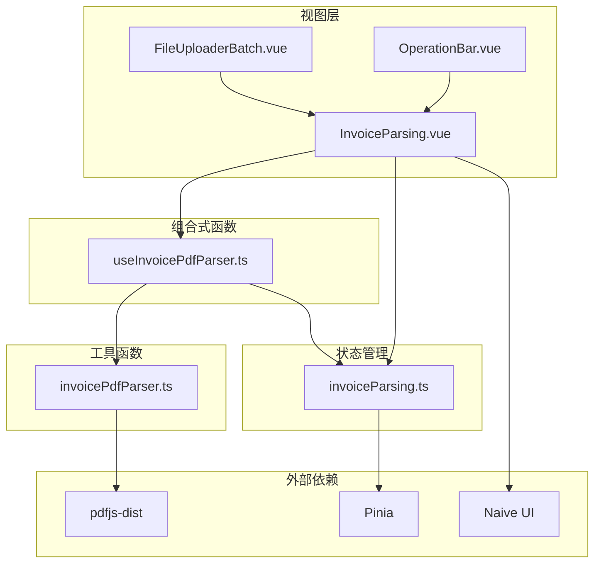
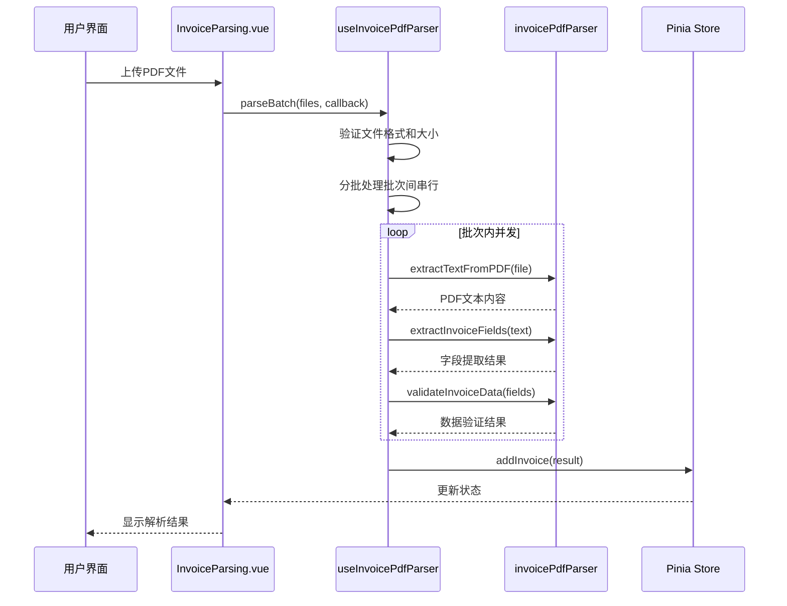
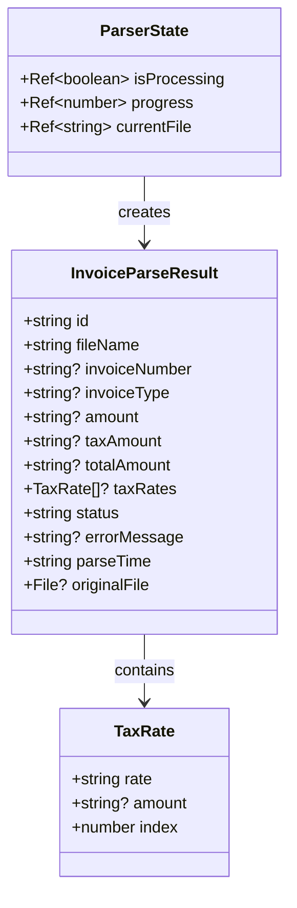
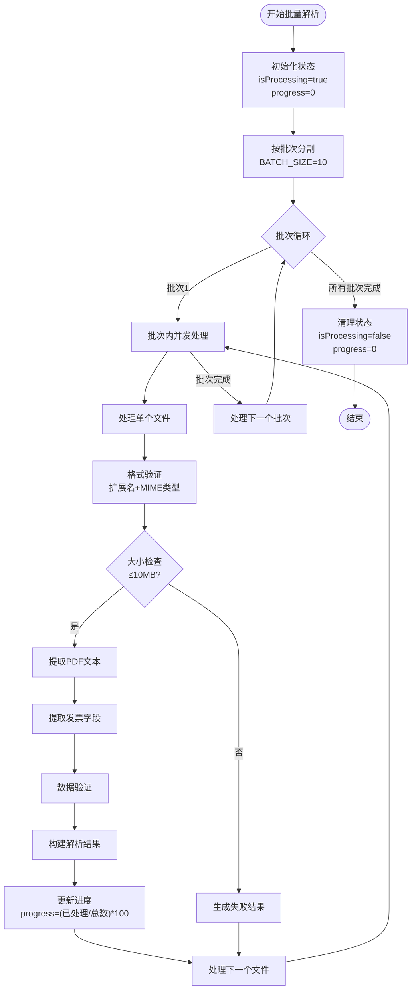
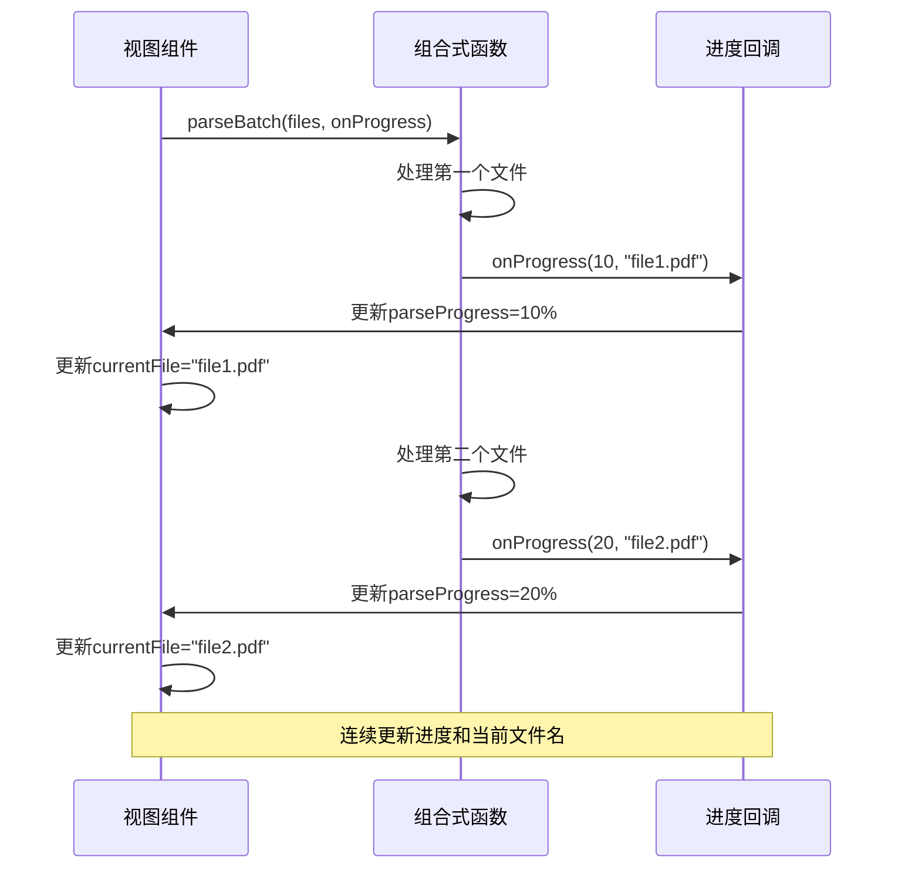
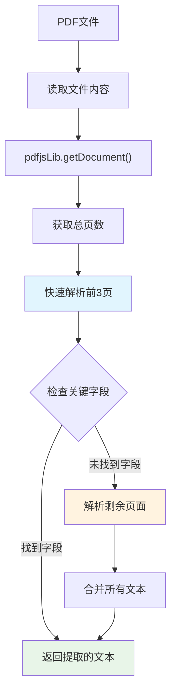
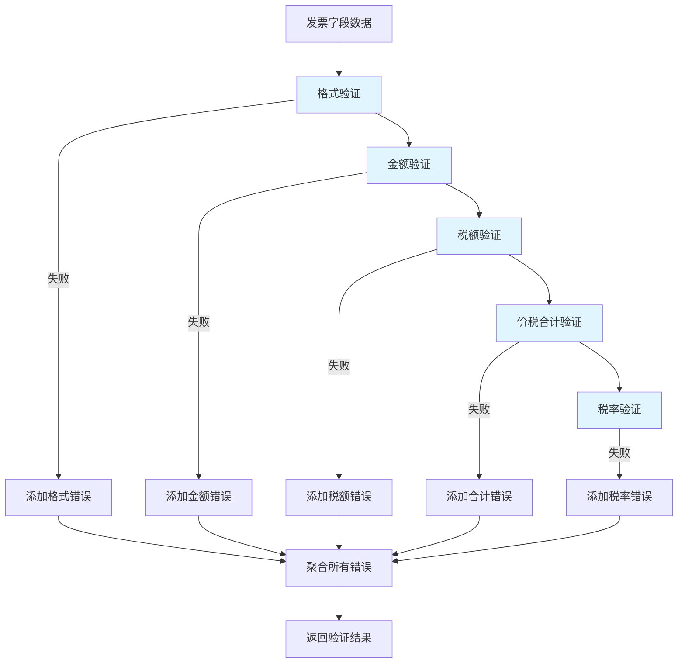
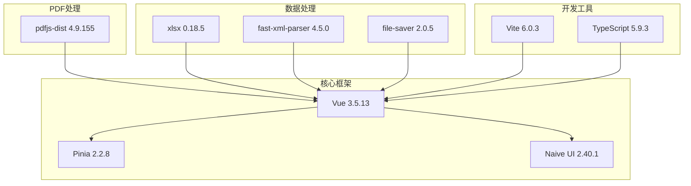
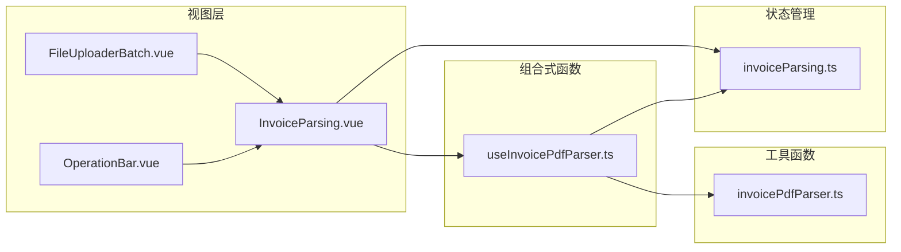

# 发票PDF解析组合式函数

<cite>
**本文档引用的文件**
- [useInvoicePdfParser.ts](file://src/composables/useInvoicePdfParser.ts)
- [invoicePdfParser.ts](file://src/utils/invoicePdfParser.ts)
- [InvoiceParsing.vue](file://src/views/InvoiceParsing.vue)
- [invoiceParsing.ts](file://src/stores/invoiceParsing.ts)
- [FileUploaderBatch.vue](file://src/components/FileUploaderBatch.vue)
- [OperationBar.vue](file://src/components/OperationBar.vue)
- [package.json](file://package.json)
</cite>

## 目录
1. [简介](#简介)
2. [项目结构](#项目结构)
3. [核心组件](#核心组件)
4. [架构概览](#架构概览)
5. [详细组件分析](#详细组件分析)
6. [依赖关系分析](#依赖关系分析)
7. [性能考虑](#性能考虑)
8. [故障排除指南](#故障排除指南)
9. [结论](#结论)

## 简介

发票PDF解析组合式函数是本项目的核心功能模块，专门设计用于高效解析发票PDF文件并提取关键业务字段信息。该系统采用现代化的Vue 3组合式API架构，提供了完整的批量解析能力、实时进度反馈和严格的数据验证机制。

系统的主要特点包括：
- **专为发票PDF优化**：针对发票特有的格式和字段进行专门设计
- **精细化进度反馈**：通过三个响应式状态提供实时用户体验
- **安全控制机制**：双重格式验证和大小限制保护
- **智能并发架构**：批次间串行、批次内并发的优化策略
- **完整的数据流**：从文件上传到结果展示的端到端解决方案

## 项目结构

该项目采用基于功能域的组织方式，将相关功能模块按职责进行分离：

**图表来源**
- [InvoiceParsing.vue](file://src/views/InvoiceParsing.vue#L1-L328)
- [useInvoicePdfParser.ts](file://src/composables/useInvoicePdfParser.ts#L1-L173)
- [invoicePdfParser.ts](file://src/utils/invoicePdfParser.ts#L1-L349)

**章节来源**
- [InvoiceParsing.vue](file://src/views/InvoiceParsing.vue#L1-L328)
- [useInvoicePdfParser.ts](file://src/composables/useInvoicePdfParser.ts#L1-L173)
- [invoicePdfParser.ts](file://src/utils/invoicePdfParser.ts#L1-L349)

## 核心组件

### 发票PDF解析组合式函数

`useInvoicePdfParser`是整个系统的核心，它封装了完整的发票解析逻辑，提供了以下关键功能：

#### 响应式状态管理
- **isProcessing**: 控制整体解析状态，用于禁用UI交互
- **progress**: 实时显示解析进度百分比
- **currentFile**: 显示当前正在处理的文件名

#### 主要方法
- **parseInvoice**: 单个文件解析，包含完整的验证和处理流程
- **parseBatch**: 批量解析，支持智能并发控制
- **generateId**: 生成唯一解析ID

#### 安全控制机制
- **格式验证**: 同时检查文件扩展名和MIME类型
- **大小限制**: 10MB文件大小上限
- **数据验证**: 解析后对提取的数据进行完整性检查

**章节来源**
- [useInvoicePdfParser.ts](file://src/composables/useInvoicePdfParser.ts#L19-L173)

### 发票PDF解析工具函数

`invoicePdfParser.ts`提供了底层的PDF处理能力：

#### 文本提取功能
- **extractTextFromPDF**: 使用pdf.js库提取PDF文本
- **智能页面解析**: 优先解析前3页，必要时再解析剩余页面
- **Worker集成**: 使用独立的Web Worker处理PDF解析

#### 字段提取算法
- **发票号码提取**: 支持多种格式的发票号码识别
- **金额字段提取**: 智能识别不含税金额、税额和价税合计
- **税率识别**: 支持多税率发票的复杂场景
- **发票类型判断**: 自动识别专票和普票

#### 数据验证机制
- **格式验证**: 确保提取的数据符合业务规则
- **范围检查**: 验证数值的有效性和合理性
- **一致性验证**: 检查各字段之间的逻辑关系

**章节来源**
- [invoicePdfParser.ts](file://src/utils/invoicePdfParser.ts#L1-L349)

## 架构概览

系统采用分层架构设计，确保关注点分离和代码的可维护性：

**图表来源**
- [InvoiceParsing.vue](file://src/views/InvoiceParsing.vue#L188-L232)
- [useInvoicePdfParser.ts](file://src/composables/useInvoicePdfParser.ts#L96-L153)
- [invoicePdfParser.ts](file://src/utils/invoicePdfParser.ts#L97-L152)

## 详细组件分析

### 组合式函数架构

#### 状态管理机制

**图表来源**
- [useInvoicePdfParser.ts](file://src/composables/useInvoicePdfParser.ts#L20-L31)
- [invoiceParsing.ts](file://src/stores/invoiceParsing.ts#L18-L31)

#### 批量解析并发架构

系统采用了智能的并发控制策略：

**图表来源**
- [useInvoicePdfParser.ts](file://src/composables/useInvoicePdfParser.ts#L96-L153)

#### 进度回调机制

ProgressCallback接口提供了灵活的进度通知机制：

**图表来源**
- [InvoiceParsing.vue](file://src/views/InvoiceParsing.vue#L209-L212)
- [useInvoicePdfParser.ts](file://src/composables/useInvoicePdfParser.ts#L131-L133)

### PDF解析算法详解

#### 文本提取优化策略

系统使用了智能的PDF文本提取策略：

**图表来源**
- [invoicePdfParser.ts](file://src/utils/invoicePdfParser.ts#L97-L129)

#### 字段提取正则表达式

系统使用精心设计的正则表达式来提取发票关键字段：

| 字段类型 | 关键字模式 | 数值提取模式 |
|---------|-----------|-------------|
| 发票号码 | `发票号码[：:]\s*(\d{20})` | `\d{20}` |
| 不含税金额 | `不含税金额[：:]\s*[￥$¥]?\s*([\d,]+\.?\d*)` | `[\d,]+\.?\d*` |
| 税额 | `税额[：:]\s*[￥$¥]?\s*([\d,]+\.?\d*)` | `[\d,]+\.?\d*` |
| 价税合计 | `(价税合计|合\s*计)[：:\s]*[￥$¥]?\s*([\d,]+\.?\d*)` | `[\d,]+\.?\d*` |
| 税率 | `税率[\s/征收率]*[:：]?\s*(\d+)%` | `\d+%` |

**章节来源**
- [invoicePdfParser.ts](file://src/utils/invoicePdfParser.ts#L22-L67)

### 数据验证机制

系统实现了多层次的数据验证来确保解析结果的准确性：

**图表来源**
- [invoicePdfParser.ts](file://src/utils/invoicePdfParser.ts#L294-L334)

**章节来源**
- [invoicePdfParser.ts](file://src/utils/invoicePdfParser.ts#L294-L334)

## 依赖关系分析

### 外部依赖管理

系统使用了现代化的前端技术栈：

**图表来源**
- [package.json](file://package.json#L12-L22)

### 内部模块依赖

**图表来源**
- [InvoiceParsing.vue](file://src/views/InvoiceParsing.vue#L142-L144)
- [useInvoicePdfParser.ts](file://src/composables/useInvoicePdfParser.ts#L5-L11)

**章节来源**
- [package.json](file://package.json#L1-L33)

## 性能考虑

### 并发控制策略

系统采用了智能的并发控制策略来平衡性能和资源消耗：

- **批次大小**: 每批10个文件，避免内存峰值过高
- **批次间串行**: 控制同时处理的文件数量
- **批次内并发**: 最大化利用CPU资源
- **渐进式解析**: 先解析前3页，必要时再解析剩余页面

### 内存优化

- **流式处理**: 使用FileReader异步读取文件
- **及时释放**: 解析完成后及时释放文件引用
- **增量更新**: 逐步更新UI状态，避免频繁重渲染

### 缓存策略

- **Worker缓存**: pdf.js Worker实例复用
- **结果缓存**: 已解析的结果在内存中缓存
- **配置缓存**: 正则表达式编译结果缓存

## 故障排除指南

### 常见问题及解决方案

#### PDF格式问题
- **症状**: 文件无法解析或解析失败
- **原因**: 非PDF格式或损坏的PDF文件
- **解决方案**: 检查文件扩展名和MIME类型，重新生成PDF文件

#### 内存不足问题
- **症状**: 页面卡顿或浏览器崩溃
- **原因**: 同时处理过多大文件
- **解决方案**: 减少单次处理的文件数量，优化文件大小

#### 解析精度问题
- **症状**: 字段提取不准确
- **原因**: 发票格式特殊或正则表达式不匹配
- **解决方案**: 扩展正则表达式模式，增加字段提取逻辑

#### 性能问题
- **症状**: 解析速度慢
- **原因**: PDF页面过多或内容复杂
- **解决方案**: 优化正则表达式，减少不必要的页面解析

**章节来源**
- [useInvoicePdfParser.ts](file://src/composables/useInvoicePdfParser.ts#L42-L49)
- [invoicePdfParser.ts](file://src/utils/invoicePdfParser.ts#L97-L129)

## 结论

发票PDF解析组合式函数是一个设计精良、功能完整的解决方案。它通过以下关键特性确保了系统的可靠性：

### 技术优势
- **模块化设计**: 清晰的关注点分离，便于维护和扩展
- **性能优化**: 智能并发控制和内存管理
- **用户体验**: 实时进度反馈和友好的错误处理
- **数据安全**: 多层次的验证机制确保数据质量

### 架构特色
- **响应式状态管理**: 三个核心状态协同提供精细化反馈
- **分层处理架构**: 从底层PDF处理到上层业务逻辑的清晰分层
- **可扩展性**: 模块化设计支持功能扩展和定制

### 应用价值
该系统为财务管理和发票处理提供了自动化解决方案，显著提高了工作效率，减少了人工错误，为企业数字化转型提供了有力支撑。

通过持续的优化和扩展，该系统有望成为发票处理领域的标准解决方案，为更多企业用户提供高质量的服务。