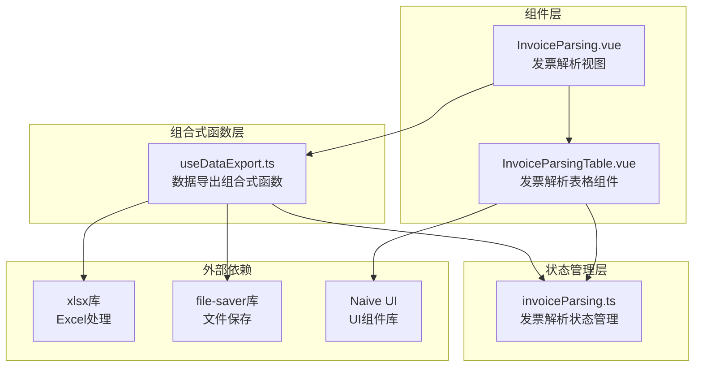
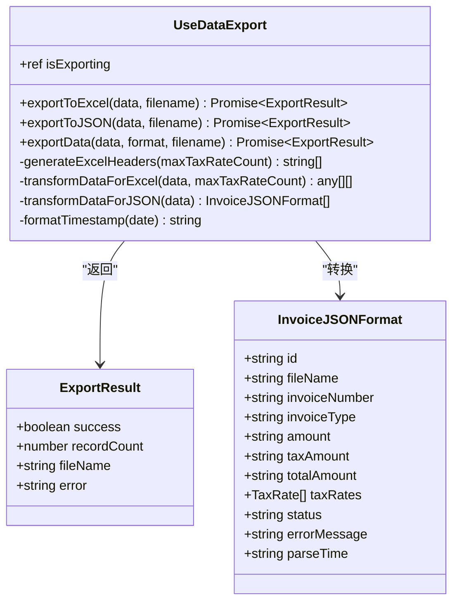
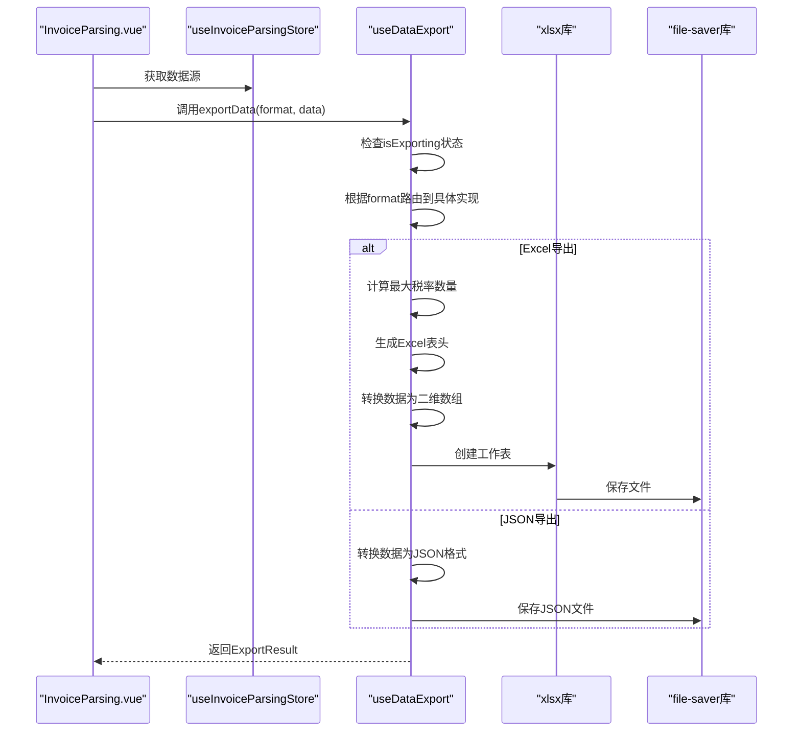
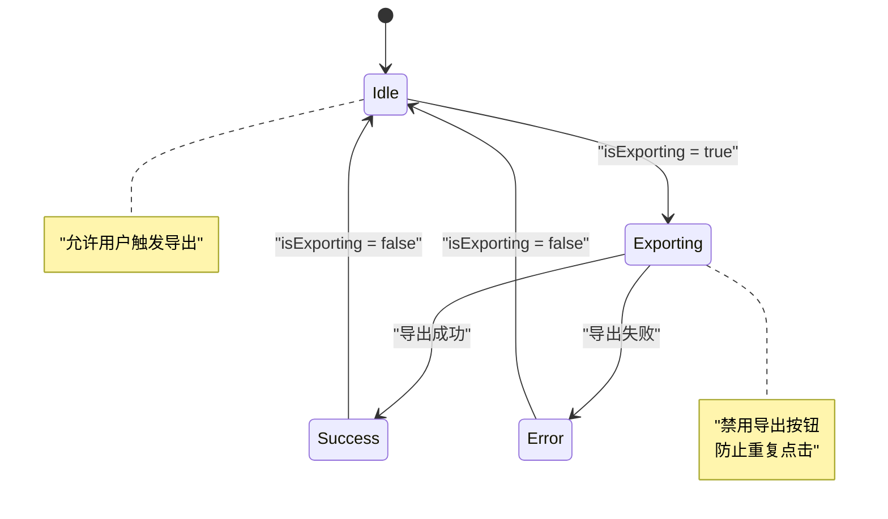
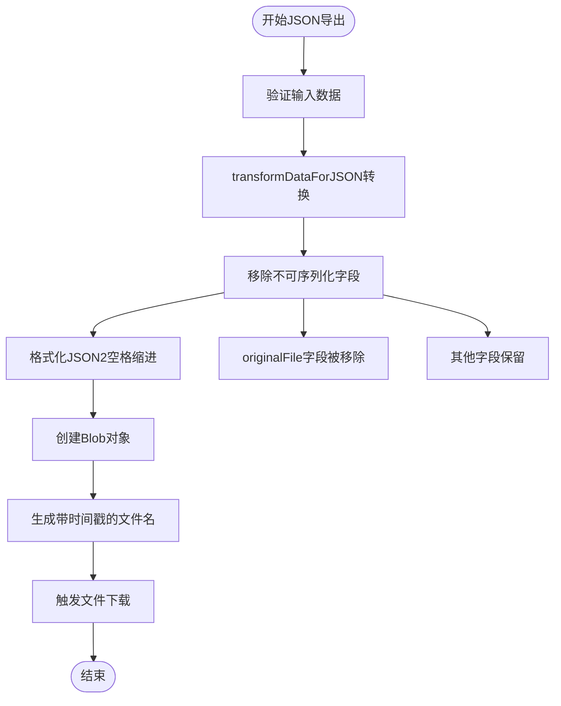
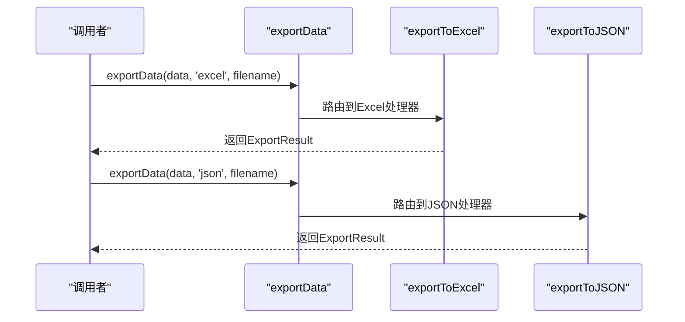
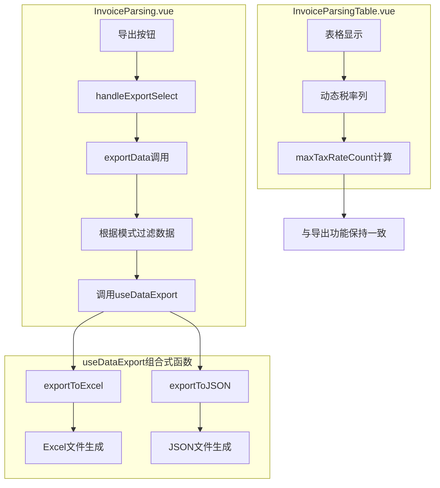
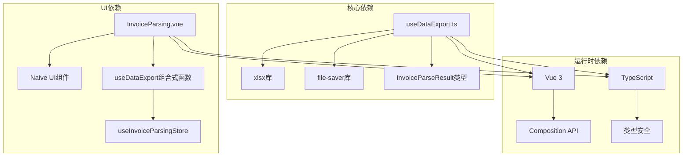
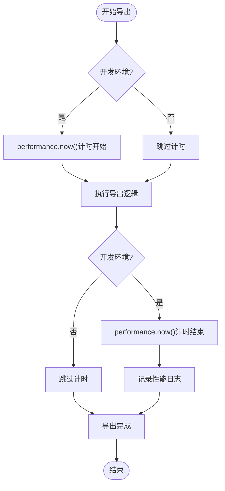

# 数据导出组合式函数

<cite>
**本文档引用的文件**
- [useDataExport.ts](file://src/composables/useDataExport.ts)
- [InvoiceParsingTable.vue](file://src/components/InvoiceParsingTable.vue)
- [invoiceParsing.ts](file://src/stores/invoiceParsing.ts)
- [InvoiceParsing.vue](file://src/views/InvoiceParsing.vue)
- [package.json](file://package.json)
</cite>

## 目录
1. [简介](#简介)
2. [项目结构](#项目结构)
3. [核心组件](#核心组件)
4. [架构概览](#架构概览)
5. [详细组件分析](#详细组件分析)
6. [依赖关系分析](#依赖关系分析)
7. [性能考虑](#性能考虑)
8. [故障排除指南](#故障排除指南)
9. [结论](#结论)

## 简介

本文档系统化地文档化了useDataExport组合式函数的数据导出能力，该函数提供了Excel和JSON两种格式的发票解析结果导出功能。该组合式函数采用Vue 3 Composition API设计，支持异步导出操作，具有完善的错误处理机制和性能监控功能。

## 项目结构

数据导出功能主要分布在以下文件中：



**图表来源**
- [useDataExport.ts](file://src/composables/useDataExport.ts#L1-L308)
- [InvoiceParsingTable.vue](file://src/components/InvoiceParsingTable.vue#L1-L157)
- [invoiceParsing.ts](file://src/stores/invoiceParsing.ts#L1-L241)

**章节来源**
- [useDataExport.ts](file://src/composables/useDataExport.ts#L1-L308)
- [package.json](file://package.json#L1-L33)

## 核心组件

useDataExport组合式函数是整个数据导出功能的核心，它提供了以下关键能力：

### 主要功能特性
- **双格式支持**：同时支持Excel和JSON格式导出
- **状态管理**：使用`isExporting`响应式状态防止重复导出
- **动态列处理**：智能处理可变数量的税率列
- **性能监控**：开发环境下自动性能统计
- **错误处理**：完善的异常捕获和错误反馈
- **文件命名**：自动生成带时间戳的文件名

### 导出接口设计



**图表来源**
- [useDataExport.ts](file://src/composables/useDataExport.ts#L14-L34)
- [useDataExport.ts](file://src/composables/useDataExport.ts#L39-L209)

**章节来源**
- [useDataExport.ts](file://src/composables/useDataExport.ts#L39-L209)

## 架构概览

数据导出系统的整体架构采用分层设计，确保了良好的模块化和可维护性：



**图表来源**
- [InvoiceParsing.vue](file://src/views/InvoiceParsing.vue#L273-L302)
- [useDataExport.ts](file://src/composables/useDataExport.ts#L191-L201)

## 详细组件分析

### isExporting状态管理机制

`isExporting`响应式状态是防止重复导出操作的关键机制：



**图表来源**
- [useDataExport.ts](file://src/composables/useDataExport.ts#L40-L126)
- [InvoiceParsing.vue](file://src/views/InvoiceParsing.vue#L66-L67)

该机制通过以下方式实现：
- 在导出开始时设置为`true`
- 在finally块中始终重置为`false`
- UI层绑定到`:loading="isExporting"`属性

**章节来源**
- [useDataExport.ts](file://src/composables/useDataExport.ts#L40-L126)
- [InvoiceParsing.vue](file://src/views/InvoiceParsing.vue#L66-L67)

### exportToExcel函数实现

Excel导出函数是系统的核心功能，具有以下特点：

#### 动态税率列处理

```mermaid
flowchart TD
Start([开始Excel导出]) --> CalcMax["计算最大税率数量"]
CalcMax --> GenHeaders["生成Excel表头"]
GenHeaders --> TransformData["转换数据为二维数组"]
TransformData --> CreateSheet["创建工作表"]
CreateSheet --> SetColWidth["设置列宽"]
SetColWidth --> CreateWorkbook["创建工作簿"]
CreateWorkbook --> WriteFile["写入Excel文件"]
WriteFile --> SaveFile["触发文件下载"]
SaveFile --> End([结束])
CalcMax --> MaxCalc{"maxTaxRateCount = Math.max(...data.map(item => item.taxRates.length))"
MaxCalc --> GenHeaders
```

**图表来源**
- [useDataExport.ts](file://src/composables/useDataExport.ts#L45-L127)
- [useDataExport.ts](file://src/composables/useDataExport.ts#L214-L233)

#### 列宽优化策略

Excel导出使用`worksheet['!cols']`属性进行列宽优化：

| 列类型 | 固定宽度 | 用途 |
|--------|----------|------|
| 序号 | 8字符 | 数字列，紧凑显示 |
| 文件名 | 30字符 | 包含完整文件路径 |
| 发票号码 | 22字符 | 发票唯一标识 |
| 发票类型 | 10字符 | 普票/专票标识 |
| 金额 | 15字符 | 货币金额显示 |
| 税额 | 15字符 | 税收金额 |
| 价税合计 | 15字符 | 总金额 |
| 税率列 | 12字符×N | 动态税率数量 |
| 状态 | 10字符 | 成功/失败/待处理 |
| 失败原因 | 30字符 | 错误信息显示 |

**章节来源**
- [useDataExport.ts](file://src/composables/useDataExport.ts#L45-L127)

### transformDataForExcel函数

该函数专门处理可变税率数量的复杂性，确保表格结构一致性：

#### 数据转换流程

```mermaid
flowchart LR
Input[InvoiceParseResult[]] --> Map[map遍历每个记录]
Map --> Row[创建基础行数据]
Row --> TaxLoop{循环税率数量}
TaxLoop --> |存在税率| AddTax[添加税率值]
TaxLoop --> |不存在| AddDash[添加占位符-]
AddTax --> Status[添加状态映射]
AddDash --> Status
Status --> Output[输出二维数组]
```

**图表来源**
- [useDataExport.ts](file://src/composables/useDataExport.ts#L238-L273)

#### 状态映射机制

| 状态值 | 显示文本 | 颜色含义 |
|--------|----------|----------|
| success | 成功 | 绿色 |
| failed | 失败 | 红色 |
| pending | 待处理 | 黄色 |

**章节来源**
- [useDataExport.ts](file://src/composables/useDataExport.ts#L238-L273)

### exportToJSON函数

JSON导出函数专注于数据的正确序列化：

#### 数据转换策略



**图表来源**
- [useDataExport.ts](file://src/composables/useDataExport.ts#L132-L186)
- [useDataExport.ts](file://src/composables/useDataExport.ts#L278-L293)

#### JSON格式化规范

JSON导出采用以下格式规范：
- 缩进：2个空格
- 编码：UTF-8
- 类型：application/json
- 文件扩展名：.json

**章节来源**
- [useDataExport.ts](file://src/composables/useDataExport.ts#L132-L186)

### exportData统一接口

统一导出接口提供了简洁的API设计：



**图表来源**
- [useDataExport.ts](file://src/composables/useDataExport.ts#L191-L201)

**章节来源**
- [useDataExport.ts](file://src/composables/useDataExport.ts#L191-L201)

### 在InvoiceParsingTable组件中的调用模式

InvoiceParsingTable组件展示了完整的调用模式：

#### 组件集成方式



**图表来源**
- [InvoiceParsing.vue](file://src/views/InvoiceParsing.vue#L273-L302)
- [InvoiceParsingTable.vue](file://src/components/InvoiceParsingTable.vue#L82-L98)

**章节来源**
- [InvoiceParsing.vue](file://src/views/InvoiceParsing.vue#L273-L302)
- [InvoiceParsingTable.vue](file://src/components/InvoiceParsingTable.vue#L82-L98)

## 依赖关系分析

数据导出功能的依赖关系清晰明确：



**图表来源**
- [useDataExport.ts](file://src/composables/useDataExport.ts#L5-L8)
- [package.json](file://package.json#L22-L15)

### 外部库依赖

| 依赖库 | 版本 | 用途 |
|--------|------|------|
| xlsx | ^0.18.5 | Excel文件处理 |
| file-saver | ^2.0.5 | 文件下载功能 |
| vue | ^3.5.13 | Vue框架 |
| naive-ui | ^2.40.1 | UI组件库 |

**章节来源**
- [package.json](file://package.json#L22-L22)
- [package.json](file://package.json#L15-L15)

## 性能考虑

### 开发环境性能监控

系统在开发环境下自动启用性能监控机制：

#### 性能指标收集



**图表来源**
- [useDataExport.ts](file://src/composables/useDataExport.ts#L49-L109)
- [useDataExport.ts](file://src/composables/useDataExport.ts#L136-L168)

#### 性能监控输出

开发环境下的性能监控会输出以下信息：
- 导出开始时间戳
- 导出记录数量
- 实际耗时（秒）
- 导出完成时间戳

### 文件名时间戳生成

时间戳生成函数提供了统一的文件命名规范：

#### 时间戳格式规范

| 组件 | 格式 | 示例 |
|------|------|------|
| 年份 | YYYY | 2024 |
| 月份 | MM | 01-12 |
| 日期 | DD | 01-31 |
| 小时 | HH | 00-23 |
| 分钟 | mm | 00-59 |
| 秒 | ss | 00-59 |

**章节来源**
- [useDataExport.ts](file://src/composables/useDataExport.ts#L298-L307)

## 故障排除指南

### 常见问题及解决方案

#### 导出按钮无法点击

**问题描述**：导出按钮一直处于禁用状态

**可能原因**：
- `isExporting`状态未正确重置
- 导出过程中发生异常

**解决方案**：
- 检查finally块中的状态重置逻辑
- 查看控制台错误日志

#### Excel文件打开异常

**问题描述**：Excel文件无法正常打开或显示乱码

**可能原因**：
- 列宽设置过大导致文件损坏
- 数据格式不兼容

**解决方案**：
- 检查列宽设置范围（建议不超过50字符）
- 验证数据格式的兼容性

#### JSON文件编码问题

**问题描述**：JSON文件出现编码错误

**可能原因**：
- 文件编码格式不正确
- 特殊字符处理不当

**解决方案**：
- 确保使用UTF-8编码
- 验证JSON格式的有效性

#### 性能监控无效

**问题描述**：开发环境下无性能日志输出

**可能原因**：
- `import.meta.env.DEV`判断条件不满足
- 浏览器不支持performance API

**解决方案**：
- 确认在开发环境中运行
- 检查浏览器兼容性

**章节来源**
- [useDataExport.ts](file://src/composables/useDataExport.ts#L119-L123)
- [useDataExport.ts](file://src/composables/useDataExport.ts#L178-L182)

## 结论

useDataExport组合式函数为发票解析系统提供了完整、可靠的数据导出解决方案。该函数具有以下优势：

### 技术优势
- **模块化设计**：清晰的职责分离和接口定义
- **类型安全**：完整的TypeScript类型定义
- **错误处理**：完善的异常捕获和错误反馈机制
- **性能监控**：开发环境下的自动性能统计

### 功能完整性
- **双格式支持**：Excel和JSON两种主流格式
- **动态适配**：智能处理可变数量的税率列
- **用户体验**：防止重复导出操作的状态管理
- **文件管理**：自动生成带时间戳的文件名

### 最佳实践建议
1. **状态管理**：始终检查`isExporting`状态避免重复操作
2. **错误处理**：妥善处理导出过程中的各种异常情况
3. **性能监控**：在开发环境中充分利用性能监控功能
4. **文件命名**：使用统一的时间戳格式确保文件唯一性

该组合式函数为后续的功能扩展和维护奠定了良好的基础，是一个设计良好、实现可靠的Vue 3应用组件。