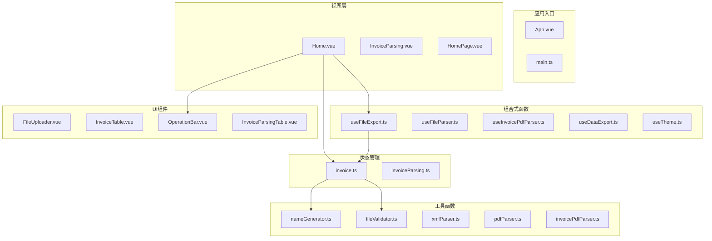
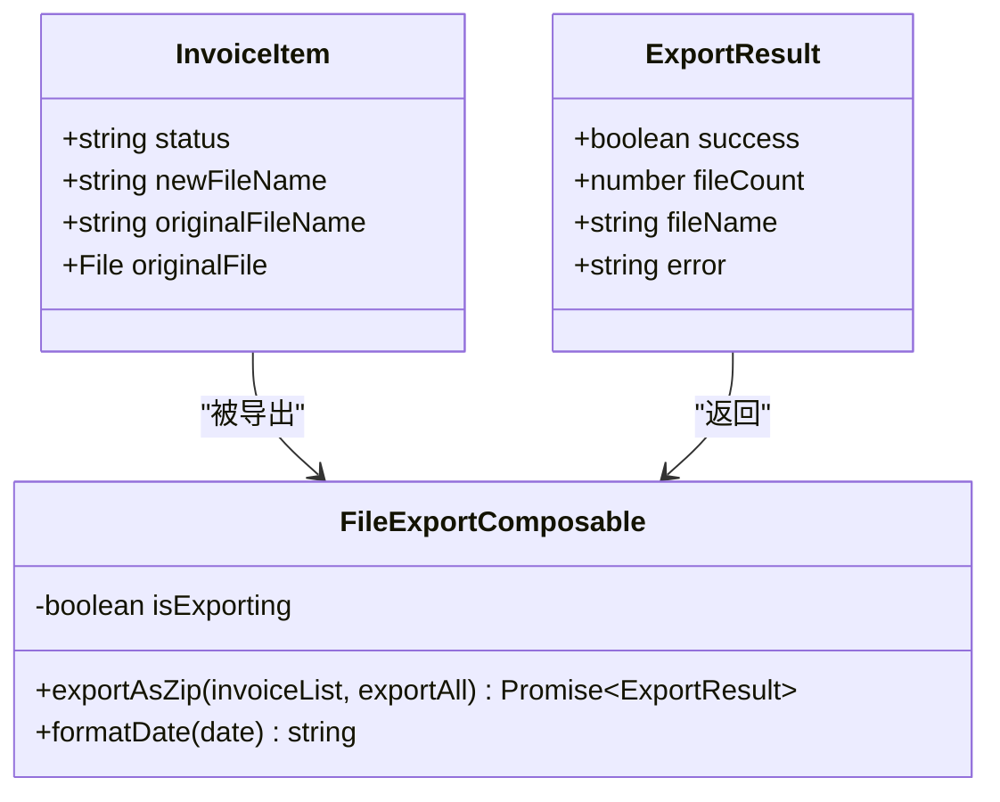
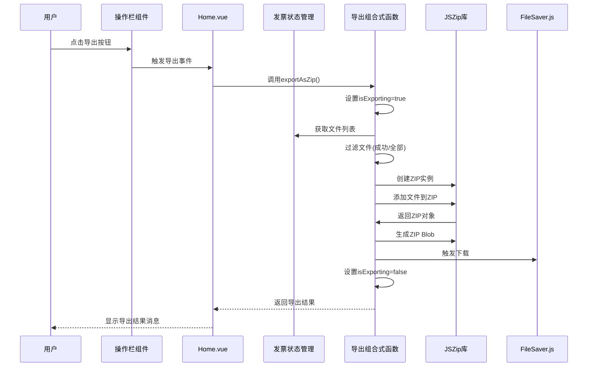
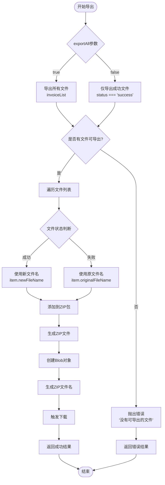
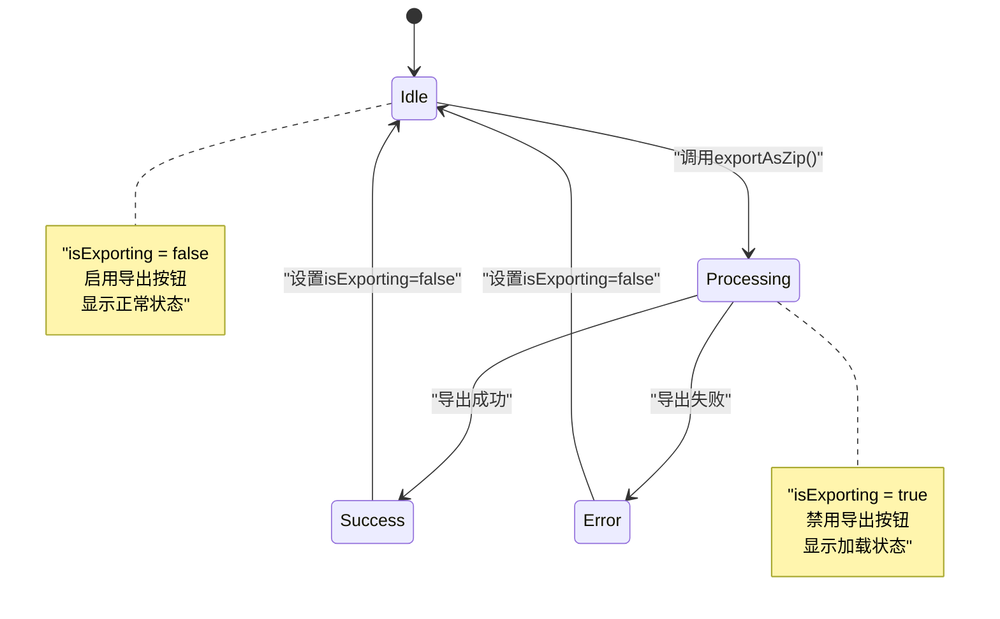
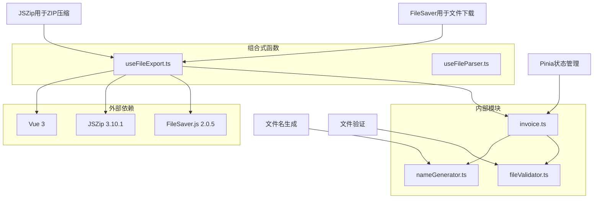

# 文件导出组合式函数

<cite>
**本文档引用的文件**
- [useFileExport.ts](file://src/composables/useFileExport.ts)
- [Home.vue](file://src/views/Home.vue)
- [invoice.ts](file://src/stores/invoice.ts)
- [OperationBar.vue](file://src/components/OperationBar.vue)
- [nameGenerator.ts](file://src/utils/nameGenerator.ts)
- [useFileParser.ts](file://src/composables/useFileParser.ts)
- [fileValidator.ts](file://src/utils/fileValidator.ts)
- [package.json](file://package.json)
</cite>

## 目录
1. [简介](#简介)
2. [项目结构](#项目结构)
3. [核心组件](#核心组件)
4. [架构概览](#架构概览)
5. [详细组件分析](#详细组件分析)
6. [依赖关系分析](#依赖关系分析)
7. [性能考虑](#性能考虑)
8. [故障排除指南](#故障排除指南)
9. [结论](#结论)

## 简介

本文档深入分析了FinanceTools项目中的`useFileExport`组合式函数，该函数实现了发票文件的ZIP压缩导出功能。该功能在发票重命名场景中发挥着关键作用，能够将成功解析的发票文件按照新的文件名进行重命名并打包导出，同时支持导出所有文件（包括失败的文件）的高级选项。

该组合式函数基于Vue 3的Composition API设计，利用JSZip库在浏览器端实现文件压缩，通过FileSaver.js触发浏览器下载功能。整个流程涵盖了状态管理、文件过滤、ZIP打包、异步生成和用户界面反馈等完整功能。

## 项目结构

FinanceTools项目采用模块化的架构设计，主要包含以下关键目录和文件：



**图表来源**
- [Home.vue](file://src/views/Home.vue#L1-L247)
- [useFileExport.ts](file://src/composables/useFileExport.ts#L1-L94)
- [invoice.ts](file://src/stores/invoice.ts#L1-L256)

**章节来源**
- [Home.vue](file://src/views/Home.vue#L1-L247)
- [useFileExport.ts](file://src/composables/useFileExport.ts#L1-L94)
- [package.json](file://package.json#L1-L33)

## 核心组件

`useFileExport`组合式函数是整个文件导出功能的核心，它提供了以下关键能力：

### 主要功能特性

1. **状态管理**: 通过`isExporting`响应式引用管理导出过程的加载状态
2. **条件导出**: 支持仅导出成功文件或导出所有文件的两种模式
3. **ZIP压缩**: 使用JSZip库在浏览器端创建ZIP文件包
4. **文件重命名**: 将成功文件按新文件名重命名，失败文件保持原文件名
5. **异步处理**: 完全异步的文件处理和下载流程
6. **错误处理**: 完善的异常捕获和错误信息返回机制

### 数据结构定义



**图表来源**
- [useFileExport.ts](file://src/composables/useFileExport.ts#L8-L20)
- [useFileExport.ts](file://src/composables/useFileExport.ts#L22-L93)

**章节来源**
- [useFileExport.ts](file://src/composables/useFileExport.ts#L1-L94)

## 架构概览

`useFileExport`函数在整个系统架构中扮演着重要的桥梁角色，连接了文件解析、状态管理和用户界面三个关键层面：



**图表来源**
- [Home.vue](file://src/views/Home.vue#L200-L215)
- [useFileExport.ts](file://src/composables/useFileExport.ts#L28-L73)

## 详细组件分析

### 导出函数实现

`exportAsZip`函数是整个导出功能的核心实现，具有以下关键逻辑：

#### 参数处理和状态管理

函数接受两个主要参数：
- `invoiceList`: 发票文件列表，每个元素包含文件状态、新文件名、原文件名和原始文件对象
- `exportAll`: 布尔值，控制是否导出所有文件（默认为false，仅导出成功文件）

函数内部通过`isExporting`响应式引用管理导出过程的状态，确保用户界面能够正确反映当前的加载状态。

#### 文件过滤逻辑



**图表来源**
- [useFileExport.ts](file://src/composables/useFileExport.ts#L28-L73)

#### ZIP文件打包过程

ZIP文件的创建和打包过程涉及多个关键步骤：

1. **ZIP实例创建**: 使用`new JSZip()`创建ZIP压缩包实例
2. **文件添加**: 通过`zip.file(fileName, file)`方法将文件添加到ZIP包中
3. **异步生成**: 调用`zip.generateAsync({ type: 'blob' })`异步生成二进制大对象
4. **文件命名**: 生成包含时间戳的ZIP文件名，格式为"发票重命名_YYYYMMDD_HHMMSS.zip"

#### 文件名生成逻辑

`formatDate`函数负责生成时间戳格式的文件名，采用以下格式：
- 年份: 4位数字 (YYYY)
- 月份: 2位数字 (MM)  
- 日期: 2位数字 (DD)
- 时间分隔符: 下划线 (_)
- 小时: 2位数字 (HH)
- 分钟: 2位数字 (MM)
- 秒钟: 2位数字 (SS)

最终生成的文件名格式为：`发票重命名_YYYYMMDD_HHMMSS.zip`

#### 浏览器下载机制

下载功能通过`saveAs`函数实现，该函数来自`file-saver`库：
- 接收两个参数：Blob对象和目标文件名
- 在浏览器端触发文件下载对话框
- 支持自动检测浏览器兼容性和文件类型

**章节来源**
- [useFileExport.ts](file://src/composables/useFileExport.ts#L22-L94)

### 状态管理机制

`isExporting`状态在导出过程中发挥着重要作用：



**图表来源**
- [useFileExport.ts](file://src/composables/useFileExport.ts#L23-L72)

**章节来源**
- [useFileExport.ts](file://src/composables/useFileExport.ts#L22-L94)

### Home.vue组件集成

在Home.vue组件中，`useFileExport`函数通过以下方式集成：

#### 组件导入和初始化

```javascript
const { isExporting, exportAsZip } = useFileExport()
```

#### 导出事件处理

```javascript
async function handleExport() {
  try {
    const result = await exportAsZip(store.fileList)
    
    if (result.success) {
      message.success(`成功导出 ${result.fileCount} 个文件: ${result.fileName}`)
    } else {
      message.error(`导出失败: ${result.error}`)
    }
  } catch (error) {
    message.error(`导出失败: ${(error as Error).message}`)
  }
}
```

#### 用户界面反馈

操作栏组件通过`isExporting`状态控制导出按钮的禁用状态和加载指示器，确保用户界面的响应性。

**章节来源**
- [Home.vue](file://src/views/Home.vue#L87-L215)
- [OperationBar.vue](file://src/components/OperationBar.vue#L43-L49)

## 依赖关系分析

`useFileExport`函数依赖于多个外部库和内部模块：



**图表来源**
- [package.json](file://package.json#L12-L22)
- [useFileExport.ts](file://src/composables/useFileExport.ts#L4-L6)
- [invoice.ts](file://src/stores/invoice.ts#L1-L256)

### 关键依赖说明

1. **JSZip (3.10.1)**: 提供浏览器端的ZIP文件创建和管理功能
2. **FileSaver.js (2.0.5)**: 实现浏览器端文件下载功能
3. **Vue 3**: 提供响应式状态管理和组合式函数支持
4. **Pinia**: 状态管理库，用于管理发票文件的状态

**章节来源**
- [package.json](file://package.json#L12-L22)
- [useFileExport.ts](file://src/composables/useFileExport.ts#L4-L6)

## 性能考虑

### 内存效率优化

1. **流式处理**: JSZip支持流式处理大量文件，避免一次性加载到内存
2. **异步生成**: 使用`generateAsync`方法异步生成ZIP文件，避免阻塞主线程
3. **Blob对象**: 通过Blob对象减少内存复制开销
4. **文件过滤**: 仅导出必要的文件，减少处理时间和内存占用

### 大文件处理策略

1. **分批处理**: 对于大量文件，建议分批处理以避免内存溢出
2. **进度监控**: 提供进度反馈，让用户了解处理状态
3. **错误恢复**: 完善的错误处理机制，单个文件失败不影响整体导出

### 浏览器兼容性

1. **现代浏览器支持**: JSZip和FileSaver.js都支持主流现代浏览器
2. **降级方案**: 对于不支持的浏览器，提供友好的错误提示
3. **文件大小限制**: 遵循浏览器对Blob对象大小的限制

## 故障排除指南

### 常见问题及解决方案

#### 无文件可导出

**问题**: 导出时出现"没有可导出的文件"错误
**原因**: 没有符合条件的文件（在仅导出成功文件模式下）
**解决方案**: 
- 检查是否有文件解析成功
- 尝试切换到"导出所有文件"模式
- 验证文件状态是否正确

#### ZIP文件生成失败

**问题**: ZIP文件生成过程中出现异常
**原因**: 文件过大、内存不足或文件损坏
**解决方案**:
- 减少同时导出的文件数量
- 清理浏览器缓存
- 检查文件完整性

#### 下载功能异常

**问题**: 文件无法下载或下载失败
**原因**: 浏览器安全设置、弹窗拦截或文件类型不支持
**解决方案**:
- 检查浏览器弹窗拦截设置
- 尝试右键点击保存
- 确认文件类型支持

### 调试技巧

1. **状态监控**: 通过`isExporting`状态监控导出过程
2. **错误日志**: 查看浏览器控制台的错误信息
3. **文件验证**: 确保文件格式和大小符合要求
4. **网络检查**: 验证网络连接稳定性

**章节来源**
- [useFileExport.ts](file://src/composables/useFileExport.ts#L65-L72)

## 结论

`useFileExport`组合式函数为FinanceTools项目提供了强大而灵活的文件导出功能。通过精心设计的架构和实现，该函数不仅满足了发票重命名场景下的ZIP文件打包需求，还提供了良好的用户体验和性能表现。

### 主要优势

1. **功能完整性**: 支持多种导出模式，满足不同用户需求
2. **用户体验**: 提供实时状态反馈和错误处理
3. **性能优化**: 采用异步处理和内存优化技术
4. **代码质量**: 清晰的架构设计和完善的错误处理

### 技术亮点

1. **浏览器端压缩**: 使用JSZip实现在浏览器中创建ZIP文件
2. **响应式状态管理**: 通过Vue 3的响应式系统管理导出状态
3. **异步处理**: 完全异步的文件处理流程，避免UI阻塞
4. **文件重命名**: 智能的文件命名策略，提升文件管理效率

该组合式函数为类似的企业级文件处理应用提供了优秀的参考实现，展示了如何在前端环境中高效地处理复杂的文件操作任务。