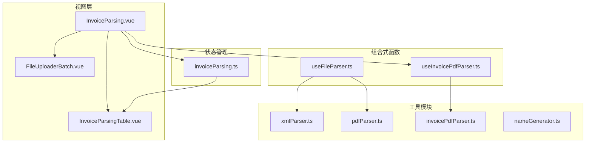
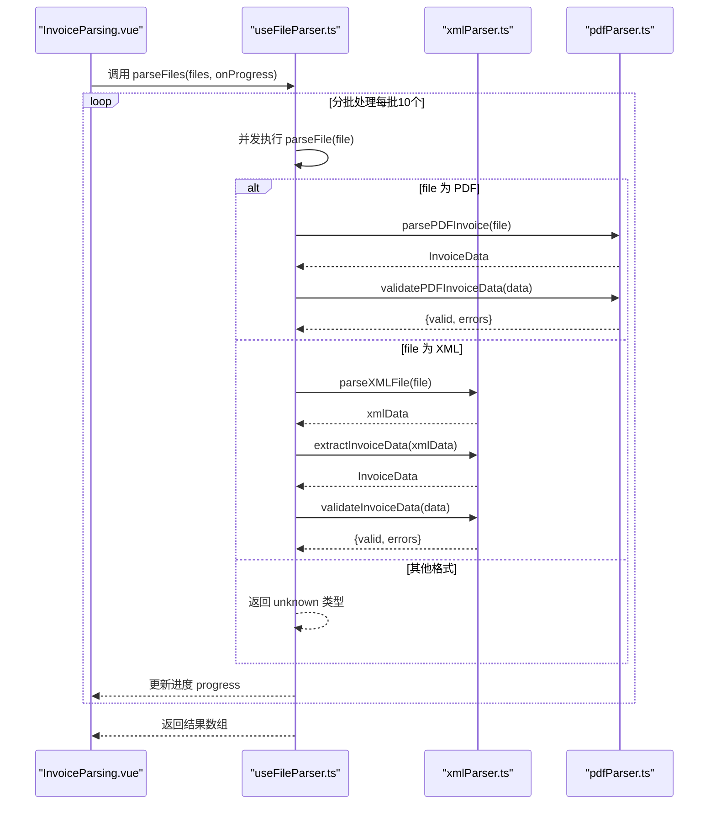
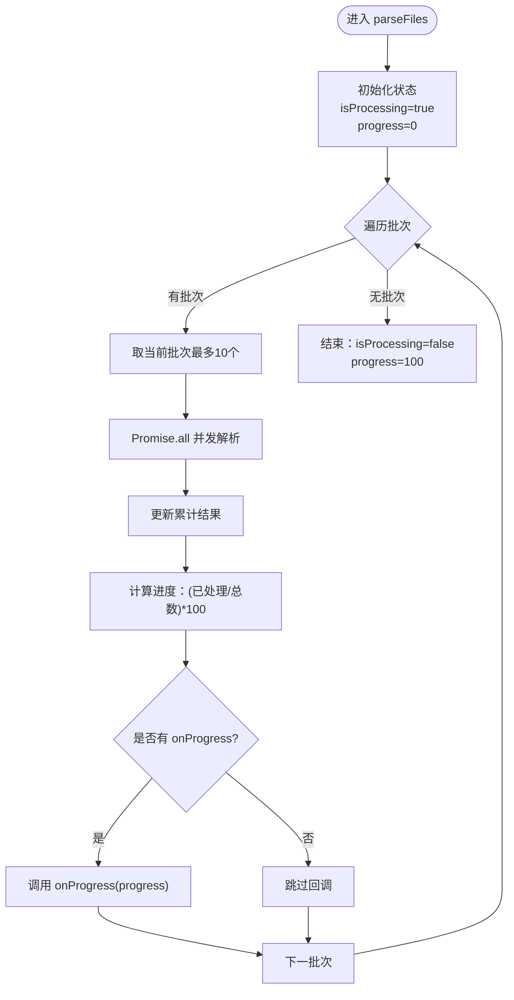
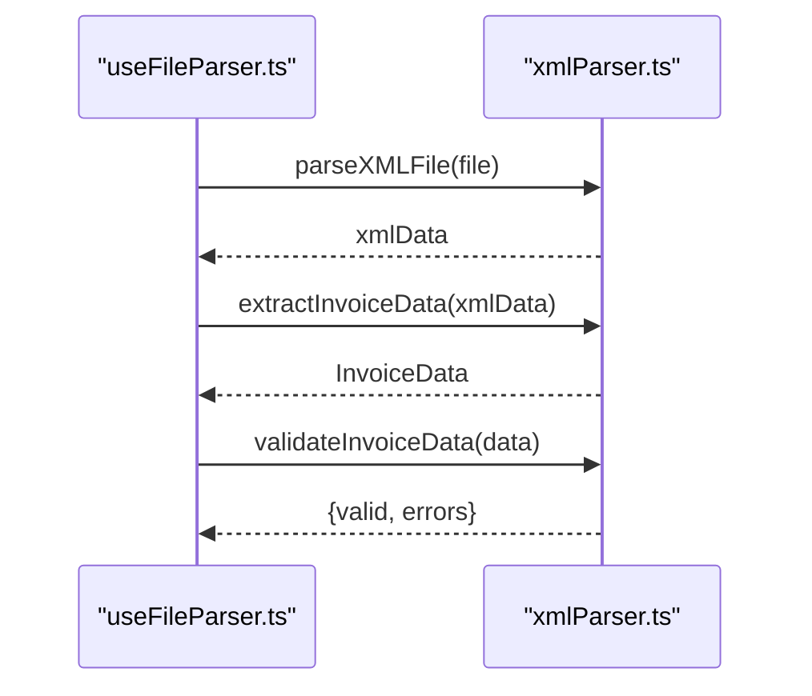
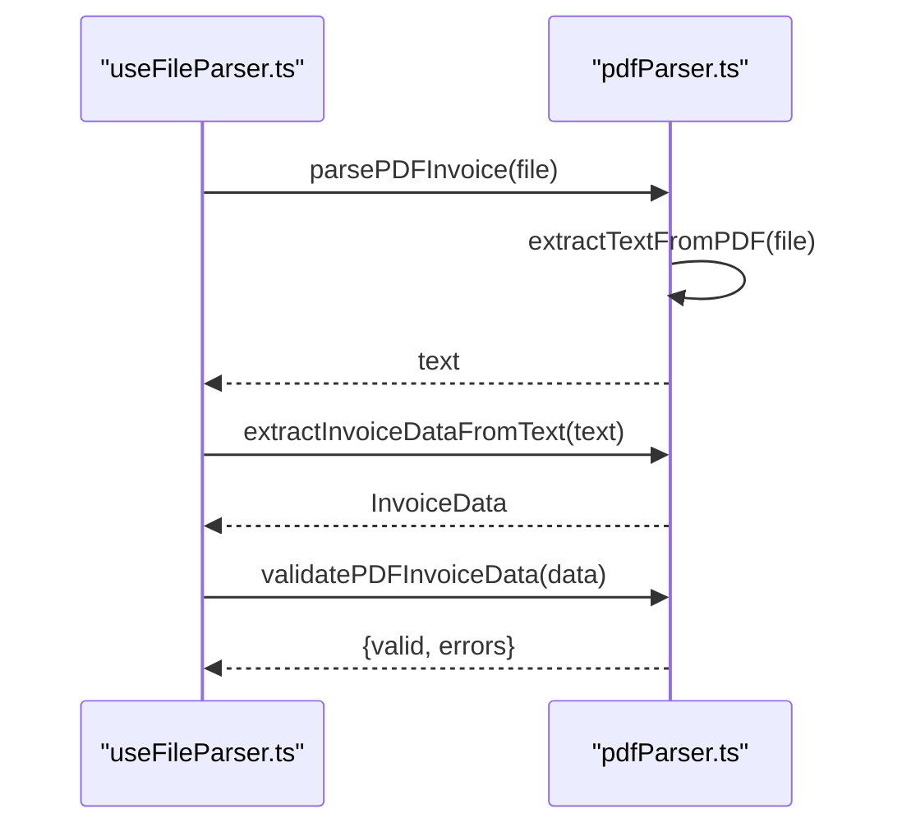
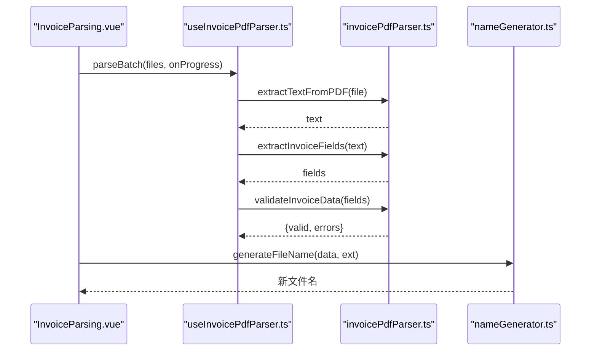
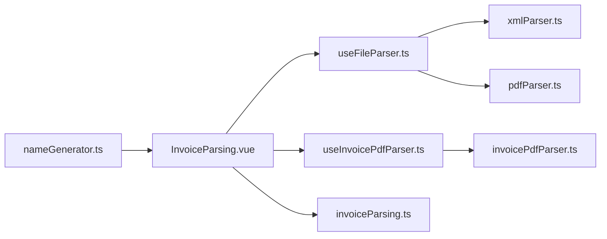

# 文件解析组合式函数

<cite>
**本文引用的文件**
- [useFileParser.ts](file://src/composables/useFileParser.ts)
- [xmlParser.ts](file://src/utils/xmlParser.ts)
- [pdfParser.ts](file://src/utils/pdfParser.ts)
- [invoicePdfParser.ts](file://src/utils/invoicePdfParser.ts)
- [InvoiceParsing.vue](file://src/views/InvoiceParsing.vue)
- [useInvoicePdfParser.ts](file://src/composables/useInvoicePdfParser.ts)
- [FileUploaderBatch.vue](file://src/components/FileUploaderBatch.vue)
- [InvoiceParsingTable.vue](file://src/components/InvoiceParsingTable.vue)
- [invoiceParsing.ts](file://src/stores/invoiceParsing.ts)
- [nameGenerator.ts](file://src/utils/nameGenerator.ts)
</cite>

## 目录
1. [简介](#简介)
2. [项目结构](#项目结构)
3. [核心组件](#核心组件)
4. [架构总览](#架构总览)
5. [详细组件分析](#详细组件分析)
6. [依赖关系分析](#依赖关系分析)
7. [性能考虑](#性能考虑)
8. [故障排查指南](#故障排查指南)
9. [结论](#结论)
10. [附录](#附录)

## 简介
本文档围绕 useFileParser 组合式函数进行系统化文档化，重点说明其作为统一文件解析入口的作用、响应式状态可视化（isProcessing 和 progress）、基于文件扩展名的自动路由到 PDF 或 XML 解析逻辑、错误捕获机制，以及批量处理 parseFiles 的分批并发策略与进度回调。同时结合发票重命名功能，给出与 xmlParser.ts、pdfParser.ts 工具函数的依赖关系说明，并讨论类型安全设计与大规模文件集的性能优化。

## 项目结构
本项目采用 Vue 3 + Vite + Naive UI 的前端架构，文件解析能力通过组合式函数与工具模块解耦，便于复用与测试。核心文件分布如下：
- 组合式函数：src/composables/useFileParser.ts、src/composables/useInvoicePdfParser.ts
- 工具模块：src/utils/xmlParser.ts、src/utils/pdfParser.ts、src/utils/invoicePdfParser.ts、src/utils/nameGenerator.ts
- 视图与组件：src/views/InvoiceParsing.vue、src/components/FileUploaderBatch.vue、src/components/InvoiceParsingTable.vue
- 状态管理：src/stores/invoiceParsing.ts

图表来源
- [InvoiceParsing.vue](file://src/views/InvoiceParsing.vue#L1-L328)
- [useFileParser.ts](file://src/composables/useFileParser.ts#L1-L109)
- [useInvoicePdfParser.ts](file://src/composables/useInvoicePdfParser.ts#L1-L173)
- [xmlParser.ts](file://src/utils/xmlParser.ts#L1-L141)
- [pdfParser.ts](file://src/utils/pdfParser.ts#L1-L243)
- [invoicePdfParser.ts](file://src/utils/invoicePdfParser.ts#L1-L349)
- [invoiceParsing.ts](file://src/stores/invoiceParsing.ts#L1-L241)

章节来源
- [InvoiceParsing.vue](file://src/views/InvoiceParsing.vue#L1-L328)
- [useFileParser.ts](file://src/composables/useFileParser.ts#L1-L109)

## 核心组件
- useFileParser：统一文件解析入口，负责单文件与批量文件解析，提供 isProcessing 与 progress 两个响应式状态，以及类型安全的 ParseResult 接口。
- xmlParser：XML 解析与发票数据提取、校验。
- pdfParser：PDF 发票解析（基础版），提供 PDF 文本提取、发票字段提取与校验。
- invoicePdfParser：更专业的发票字段提取与校验，支持多税率、快速/完整解析策略。
- useInvoicePdfParser：批量解析能力与进度反馈，面向发票重命名等场景。
- invoiceParsing Store：发票解析结果的状态管理，包含过滤、搜索、选择、导出等能力。
- nameGenerator：发票重命名工具，基于发票数据生成规范化的文件名。

章节来源
- [useFileParser.ts](file://src/composables/useFileParser.ts#L8-L13)
- [xmlParser.ts](file://src/utils/xmlParser.ts#L15-L27)
- [pdfParser.ts](file://src/utils/pdfParser.ts#L13-L26)
- [invoicePdfParser.ts](file://src/utils/invoicePdfParser.ts#L76-L88)
- [useInvoicePdfParser.ts](file://src/composables/useInvoicePdfParser.ts#L19-L24)
- [invoiceParsing.ts](file://src/stores/invoiceParsing.ts#L17-L31)
- [nameGenerator.ts](file://src/utils/nameGenerator.ts#L11-L26)

## 架构总览
useFileParser 作为统一入口，内部根据文件扩展名自动路由到不同解析器：
- PDF 文件：调用 pdfParser.ts 的 parsePDFInvoice 与 validatePDFInvoiceData
- XML 文件：调用 xmlParser.ts 的 parseXMLFile、extractInvoiceData、validateInvoiceData
- 其他格式：返回 unknown 类型的 ParseResult

批量解析 parseFiles 采用“分批并发”策略（每批 10 个文件），通过 Promise.all 并发处理，同时维护进度百分比并通过 onProgress 回调通知上层 UI。

图表来源
- [useFileParser.ts](file://src/composables/useFileParser.ts#L22-L100)
- [xmlParser.ts](file://src/utils/xmlParser.ts#L42-L141)
- [pdfParser.ts](file://src/utils/pdfParser.ts#L184-L243)

章节来源
- [useFileParser.ts](file://src/composables/useFileParser.ts#L15-L109)

## 详细组件分析

### useFileParser 组合式函数
- 响应式状态
  - isProcessing：布尔值，表示是否处于解析过程中，用于禁用交互与显示加载状态。
  - progress：数值（0-100），表示整体进度百分比，用于进度条反馈。
- 单文件解析 parseFile
  - 基于文件名后缀判断类型（.pdf 或 .xml），分别调用对应解析器。
  - 对 PDF：先解析为 InvoiceData，再进行 validatePDFInvoiceData 校验；对 XML：先 parseXMLFile，再 extractInvoiceData，最后 validateInvoiceData。
  - 异常捕获：统一返回 ParseResult，其中 success=false，errors 包含错误消息，type 根据已识别类型或 unknown。
- 批量解析 parseFiles
  - 初始化 isProcessing=true、progress=0。
  - 每批 10 个文件，使用 Promise.all 并发处理，累积结果。
  - 每批结束后计算进度：Math.round(((已处理数量) / 总数) * 100)，并通过 onProgress 回调传递给上层。
  - 完成后 isProcessing=false、progress=100。
- 类型安全
  - ParseResult 接口明确 success、data、errors、type 字段，确保调用方能稳定消费结果。

图表来源
- [useFileParser.ts](file://src/composables/useFileParser.ts#L71-L100)

章节来源
- [useFileParser.ts](file://src/composables/useFileParser.ts#L15-L109)

### XML 解析链路（xmlParser.ts）
- parseXMLFile：将 File 读取为文本，再交由 fast-xml-parser 解析为对象。
- extractInvoiceData：从解析后的对象中提取发票关键字段（发票类型、发票代码、购买方、销售方、金额、开票日期），并提供容错字段名映射。
- validateInvoiceData：对必填字段进行校验，返回 { valid, errors }。

图表来源
- [useFileParser.ts](file://src/composables/useFileParser.ts#L39-L49)
- [xmlParser.ts](file://src/utils/xmlParser.ts#L42-L141)

章节来源
- [xmlParser.ts](file://src/utils/xmlParser.ts#L1-L141)

### PDF 解析链路（pdfParser.ts）
- extractTextFromPDF：使用 pdfjs-lib 读取 PDF，逐页提取文本并拼接。
- extractInvoiceDataFromText：基于正则表达式从文本中提取发票类型、发票号码、购买方、销售方、金额、开票日期等字段。
- validatePDFInvoiceData：对关键字段进行校验，返回 { valid, errors }。

图表来源
- [useFileParser.ts](file://src/composables/useFileParser.ts#L27-L37)
- [pdfParser.ts](file://src/utils/pdfParser.ts#L184-L243)

章节来源
- [pdfParser.ts](file://src/utils/pdfParser.ts#L1-L243)

### 发票重命名功能集成
- 与 nameGenerator.ts 的关系：nameGenerator 提供 generateFileName 与 generateFileNames，用于根据发票数据生成规范化文件名，并处理冲突。
- 在 InvoiceParsing.vue 中，用户上传 PDF 后，通过 useInvoicePdfParser 的 parseBatch 获取解析结果，随后可结合 nameGenerator 生成新文件名并导出或重命名。

图表来源
- [InvoiceParsing.vue](file://src/views/InvoiceParsing.vue#L188-L232)
- [useInvoicePdfParser.ts](file://src/composables/useInvoicePdfParser.ts#L96-L153)
- [invoicePdfParser.ts](file://src/utils/invoicePdfParser.ts#L138-L152)
- [nameGenerator.ts](file://src/utils/nameGenerator.ts#L143-L170)

章节来源
- [InvoiceParsing.vue](file://src/views/InvoiceParsing.vue#L188-L232)
- [useInvoicePdfParser.ts](file://src/composables/useInvoicePdfParser.ts#L1-L173)
- [nameGenerator.ts](file://src/utils/nameGenerator.ts#L1-L250)

## 依赖关系分析
- useFileParser.ts 依赖 xmlParser.ts 与 pdfParser.ts，形成“统一入口 + 工具拆分”的清晰边界。
- useInvoicePdfParser.ts 依赖 invoicePdfParser.ts，提供更高阶的批量解析与进度反馈。
- InvoiceParsing.vue 作为视图层，协调上传组件、解析组合式函数与状态管理，实现完整的发票解析流程。
- nameGenerator.ts 与解析结果解耦，可在导出或重命名阶段单独使用。

图表来源
- [useFileParser.ts](file://src/composables/useFileParser.ts#L4-L6)
- [xmlParser.ts](file://src/utils/xmlParser.ts#L1-L141)
- [pdfParser.ts](file://src/utils/pdfParser.ts#L1-L243)
- [useInvoicePdfParser.ts](file://src/composables/useInvoicePdfParser.ts#L5-L11)
- [invoicePdfParser.ts](file://src/utils/invoicePdfParser.ts#L1-L349)
- [InvoiceParsing.vue](file://src/views/InvoiceParsing.vue#L1-L328)
- [invoiceParsing.ts](file://src/stores/invoiceParsing.ts#L1-L241)
- [nameGenerator.ts](file://src/utils/nameGenerator.ts#L1-L250)

章节来源
- [useFileParser.ts](file://src/composables/useFileParser.ts#L1-L109)
- [useInvoicePdfParser.ts](file://src/composables/useInvoicePdfParser.ts#L1-L173)

## 性能考虑
- 分批并发策略：parseFiles 每批 10 个文件，既能提升吞吐，又能避免浏览器主线程长时间阻塞。
- 并发控制：Promise.all 控制批次内并发，批次间串行，平衡资源占用与速度。
- 进度反馈：通过 onProgress 回调与 progress 响应式状态，UI 可及时更新，避免用户感知卡顿。
- PDF 解析优化：invoicePdfParser.ts 提供快速解析（仅解析前若干页）与完整解析（必要时再解析剩余页），减少大文件解析时间。
- 类型安全：ParseResult 与各工具模块的接口约束，降低运行期错误，提高稳定性。

章节来源
- [useFileParser.ts](file://src/composables/useFileParser.ts#L71-L100)
- [invoicePdfParser.ts](file://src/utils/invoicePdfParser.ts#L97-L129)

## 故障排查指南
- 常见错误来源
  - 文件格式不支持：返回 type='unknown'，errors 包含“不支持的文件格式”。
  - 文件读取失败：XML/ PDF 工具模块抛出“文件读取失败”类错误。
  - 解析失败：XML/ PDF 解析器抛出“解析失败/提取失败”类错误。
  - 校验失败：validate 函数返回 errors 数组，包含具体缺失字段或格式问题。
- 建议排查步骤
  - 检查文件扩展名与 MIME 类型是否符合预期。
  - 确认文件大小限制（PDF 最大 10MB）。
  - 查看 onProgress 回调是否正常触发，progress 是否递增。
  - 在开发模式下观察工具模块日志，定位具体失败环节。
- 错误捕获与返回
  - 所有异常均被捕获并封装为 ParseResult，保证调用方不会崩溃，且能获得明确的错误信息。

章节来源
- [useFileParser.ts](file://src/composables/useFileParser.ts#L58-L66)
- [xmlParser.ts](file://src/utils/xmlParser.ts#L43-L48)
- [pdfParser.ts](file://src/utils/pdfParser.ts#L31-L64)

## 结论
useFileParser 通过统一入口与类型安全设计，将 PDF 与 XML 解析能力整合，配合分批并发与进度反馈，实现了高效、稳定的批量文件解析体验。其与 xmlParser.ts、pdfParser.ts 的清晰依赖关系，使得功能模块化、可维护性强。结合 invoicePdfParser.ts 与 nameGenerator.ts，可进一步拓展到发票重命名与导出等高级场景。

## 附录
- 实际使用建议
  - 在 UI 层监听 onProgress，实时更新进度条与当前文件名。
  - 对于超大文件集，建议分批处理并结合分页表格展示结果。
  - 在导出或重命名阶段，使用 nameGenerator.ts 生成规范文件名，避免冲突。
- 相关文件路径
  - [useFileParser.ts](file://src/composables/useFileParser.ts#L1-L109)
  - [xmlParser.ts](file://src/utils/xmlParser.ts#L1-L141)
  - [pdfParser.ts](file://src/utils/pdfParser.ts#L1-L243)
  - [invoicePdfParser.ts](file://src/utils/invoicePdfParser.ts#L1-L349)
  - [InvoiceParsing.vue](file://src/views/InvoiceParsing.vue#L1-L328)
  - [useInvoicePdfParser.ts](file://src/composables/useInvoicePdfParser.ts#L1-L173)
  - [FileUploaderBatch.vue](file://src/components/FileUploaderBatch.vue#L1-L79)
  - [InvoiceParsingTable.vue](file://src/components/InvoiceParsingTable.vue#L1-L157)
  - [invoiceParsing.ts](file://src/stores/invoiceParsing.ts#L1-L241)
  - [nameGenerator.ts](file://src/utils/nameGenerator.ts#L1-L250)