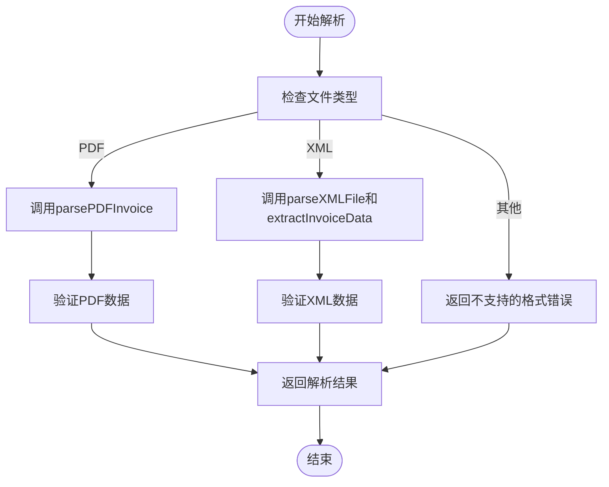
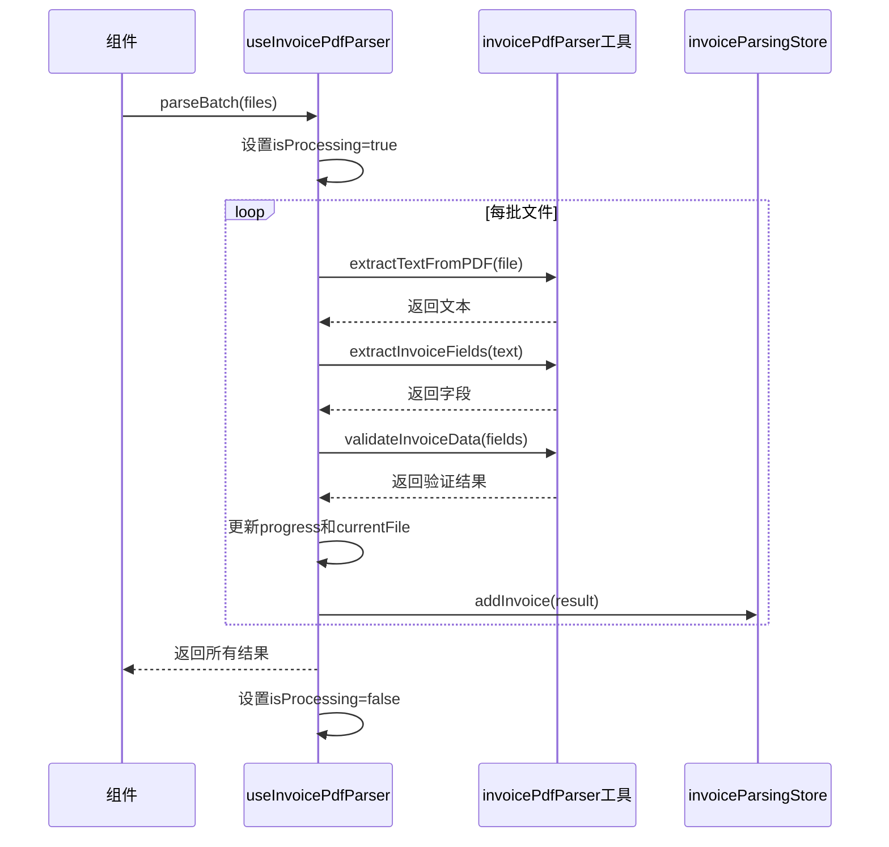
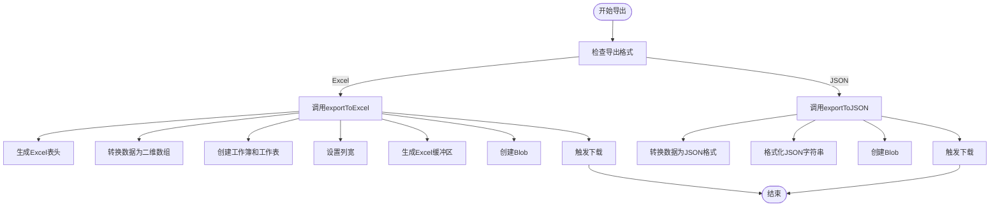
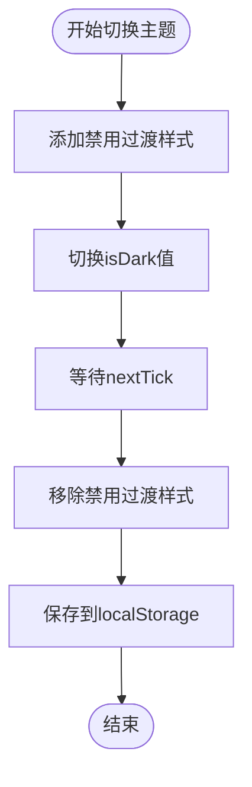

# 组合式函数

<cite>
**本文档引用的文件**
- [useFileParser.ts](file://src/composables/useFileParser.ts)
- [useInvoicePdfParser.ts](file://src/composables/useInvoicePdfParser.ts)
- [useDataExport.ts](file://src/composables/useDataExport.ts)
- [useFileExport.ts](file://src/composables/useFileExport.ts)
- [useTheme.ts](file://src/composables/useTheme.ts)
- [xmlParser.ts](file://src/utils/xmlParser.ts)
- [pdfParser.ts](file://src/utils/pdfParser.ts)
- [invoicePdfParser.ts](file://src/utils/invoicePdfParser.ts)
- [invoiceParsing.ts](file://src/stores/invoiceParsing.ts)
- [invoice.ts](file://src/stores/invoice.ts)
- [InvoiceParsing.vue](file://src/views/InvoiceParsing.vue)
- [App.vue](file://src/App.vue)
</cite>

## 目录
1. [简介](#简介)
2. [核心组合式函数分析](#核心组合式函数分析)
3. [useFileParser：统一文件解析](#usefileparser统一文件解析)
4. [useInvoicePdfParser：发票PDF专用解析](#useinvoicepdfparser发票pdf专用解析)
5. [useDataExport：数据导出功能](#usedataexport数据导出功能)
6. [useFileExport：文件导出功能](#usefileexport文件导出功能)
7. [useTheme：主题管理](#usetheme主题管理)
8. [组合式函数集成与使用模式](#组合式函数集成与使用模式)
9. [扩展性与测试友好性](#扩展性与测试友好性)
10. [结论](#结论)

## 简介
本项目中的组合式函数（Composables）是实现逻辑复用和代码组织的核心机制。这些函数封装了文件解析、数据导出和主题管理等关键业务逻辑，通过Vue 3的Composition API提供响应式状态和方法。`useFileParser`和`useInvoicePdfParser`分别处理通用文件解析和发票PDF的专用解析，而`useDataExport`和`useFileExport`则封装了不同类型的数据导出逻辑。`useTheme`负责管理应用的主题切换，确保用户体验的一致性。这些组合式函数通过暴露响应式变量、方法和生命周期钩子，实现了高内聚、低耦合的设计，便于在不同组件中复用。

## 核心组合式函数分析
本项目中的组合式函数设计遵循单一职责原则，每个函数专注于特定的业务领域。`useFileParser`和`useInvoicePdfParser`虽然都涉及PDF解析，但前者是通用解析器，后者是针对发票的专用解析器。`useDataExport`和`useFileExport`分别处理结构化数据和原始文件的导出。`useTheme`则独立管理应用的视觉主题。这些函数通过返回包含响应式状态和方法的对象，实现了逻辑的封装和复用。它们与Pinia状态管理store紧密结合，通过调用store的方法来更新应用状态，形成了清晰的数据流。

**Section sources**
- [useFileParser.ts](file://src/composables/useFileParser.ts)
- [useInvoicePdfParser.ts](file://src/composables/useInvoicePdfParser.ts)
- [useDataExport.ts](file://src/composables/useDataExport.ts)
- [useFileExport.ts](file://src/composables/useFileExport.ts)
- [useTheme.ts](file://src/composables/useTheme.ts)

## useFileParser：统一文件解析
`useFileParser`组合式函数提供了统一的文件解析接口，能够处理PDF和XML两种格式的发票文件。该函数通过`parseFile`和`parseFiles`两个主要方法，支持单个文件和批量文件的解析。函数内部使用`isProcessing`和`progress`两个响应式变量来跟踪解析状态和进度。对于PDF文件，它调用`pdfParser.ts`中的`parsePDFInvoice`函数进行解析；对于XML文件，则使用`xmlParser.ts`中的`parseXMLFile`和`extractInvoiceData`函数。解析结果包含成功状态、数据、错误信息和文件类型，便于上层组件进行处理。

**Diagram sources**
- [useFileParser.ts](file://src/composables/useFileParser.ts#L22-L108)
- [pdfParser.ts](file://src/utils/pdfParser.ts#L184-L189)
- [xmlParser.ts](file://src/utils/xmlParser.ts#L42-L45)

**Section sources**
- [useFileParser.ts](file://src/composables/useFileParser.ts#L15-L108)
- [pdfParser.ts](file://src/utils/pdfParser.ts#L184-L189)
- [xmlParser.ts](file://src/utils/xmlParser.ts#L42-L45)

## useInvoicePdfParser：发票PDF专用解析
`useInvoicePdfParser`组合式函数专门用于解析发票PDF文件，提供了比`useFileParser`更精细的控制和优化。该函数暴露了`isProcessing`、`progress`和`currentFile`三个响应式状态变量，以及`parseInvoice`和`parseBatch`两个核心方法。`parseBatch`方法实现了分批并发处理，每批处理10个文件，以平衡性能和用户体验。函数内部使用`extractTextFromPDF`从PDF中提取文本，然后通过`extractInvoiceFields`提取发票的关键字段，最后使用`validateInvoiceData`进行数据验证。该函数还实现了详细的错误处理和日志记录，便于调试和监控。

**Diagram sources**
- [useInvoicePdfParser.ts](file://src/composables/useInvoicePdfParser.ts#L96-L171)
- [invoicePdfParser.ts](file://src/utils/invoicePdfParser.ts#L97-L124)
- [invoiceParsing.ts](file://src/stores/invoiceParsing.ts#L122-L128)

**Section sources**
- [useInvoicePdfParser.ts](file://src/composables/useInvoicePdfParser.ts#L29-L171)
- [invoicePdfParser.ts](file://src/utils/invoicePdfParser.ts#L97-L124)
- [invoiceParsing.ts](file://src/stores/invoiceParsing.ts#L122-L128)

## useDataExport：数据导出功能
`useDataExport`组合式函数封装了将发票解析结果导出为Excel和JSON格式的逻辑。该函数通过`exportToExcel`、`exportToJSON`和统一的`exportData`接口，提供了灵活的导出选项。`isExporting`响应式变量用于跟踪导出状态，防止并发导出操作。对于Excel导出，函数使用`xlsx`库创建工作簿和工作表，并设置适当的列宽；对于JSON导出，则使用`JSON.stringify`进行格式化。导出的文件名包含时间戳，确保唯一性。该函数还实现了详细的错误处理和性能监控，特别是在开发环境中会记录导出耗时。

**Diagram sources**
- [useDataExport.ts](file://src/composables/useDataExport.ts#L45-L207)
- [invoiceParsing.ts](file://src/stores/invoiceParsing.ts#L18-L31)

**Section sources**
- [useDataExport.ts](file://src/composables/useDataExport.ts#L39-L207)
- [invoiceParsing.ts](file://src/stores/invoiceParsing.ts#L18-L31)

## useFileExport：文件导出功能
`useFileExport`组合式函数专注于将原始发票文件导出为ZIP压缩包。该函数通过`exportAsZip`方法，支持导出所有文件或仅导出解析成功的文件。`isExporting`响应式变量用于控制导出状态。函数内部使用`JSZip`库创建ZIP文件，并将每个文件添加到压缩包中。导出的ZIP文件名包含日期时间戳，确保唯一性。该函数还实现了文件过滤逻辑，根据`exportAll`参数决定导出哪些文件。错误处理机制确保在导出失败时能够正确清理状态。

**Section sources**
- [useFileExport.ts](file://src/composables/useFileExport.ts#L22-L92)
- [invoiceParsing.ts](file://src/stores/invoiceParsing.ts#L18-L31)

## useTheme：主题管理
`useTheme`组合式函数负责管理应用的主题切换，支持深色和浅色模式。该函数通过`isDark`响应式变量跟踪当前主题状态，并将状态持久化到`localStorage`中。`naiveTheme`计算属性根据`isDark`的值返回相应的Naive UI主题，`themeOverrides`计算属性则定义了应用的全局主题覆盖。`toggleTheme`方法实现了主题切换逻辑，通过临时禁用CSS过渡动画来确保页面元素同步切换，避免视觉上的闪烁。该函数还使用`watch`监听器将主题状态的变化保存到本地存储中。

**Diagram sources**
- [useTheme.ts](file://src/composables/useTheme.ts#L48-L68)
- [App.vue](file://src/App.vue#L1-L44)

**Section sources**
- [useTheme.ts](file://src/composables/useTheme.ts#L21-L85)
- [App.vue](file://src/App.vue#L1-L44)

## 组合式函数集成与使用模式
组合式函数在组件中的使用遵循标准模式。在`InvoiceParsing.vue`中，通过`import { useInvoicePdfParser } from '../composables/useInvoicePdfParser'`导入函数，然后在`setup`函数中调用`const { parseBatch, currentFile } = useInvoicePdfParser()`获取响应式状态和方法。这些状态和方法可以直接在模板中使用，或作为事件处理器的参数。与Pinia store的集成通过`useInvoiceParsingStore`实现，解析结果通过`store.addInvoice(result)`更新到全局状态。这种模式确保了逻辑的清晰分离和高效复用。

**Section sources**
- [InvoiceParsing.vue](file://src/views/InvoiceParsing.vue#L143-L151)
- [useInvoicePdfParser.ts](file://src/composables/useInvoicePdfParser.ts)
- [invoiceParsing.ts](file://src/stores/invoiceParsing.ts)

## 扩展性与测试友好性
组合式函数的设计具有良好的扩展性和测试友好性。每个函数的职责单一，接口清晰，便于单元测试。例如，`useFileParser`的`parseFile`方法可以独立测试不同文件格式的解析逻辑。函数的依赖通过模块导入，可以使用mock对象进行隔离测试。扩展新功能时，可以创建新的组合式函数或在现有函数中添加新方法，而不会影响现有代码。例如，要支持新的文件格式，可以在`useFileParser`中添加相应的解析逻辑，而无需修改调用方代码。

**Section sources**
- [useFileParser.ts](file://src/composables/useFileParser.ts)
- [useInvoicePdfParser.ts](file://src/composables/useInvoicePdfParser.ts)
- [useDataExport.ts](file://src/composables/useDataExport.ts)

## 结论
本项目中的组合式函数通过Vue 3的Composition API实现了逻辑的高效复用和代码的清晰组织。`useFileParser`和`useInvoicePdfParser`分别处理通用和专用的文件解析需求，`useDataExport`和`useFileExport`封装了不同类型的数据导出逻辑，`useTheme`则统一管理应用的视觉主题。这些函数通过暴露响应式变量和方法，与组件和状态管理store无缝集成，形成了清晰的数据流和职责划分。其设计具有良好的扩展性和测试友好性，为应用的长期维护和发展奠定了坚实的基础。