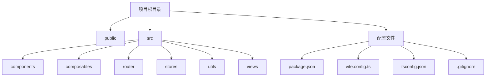
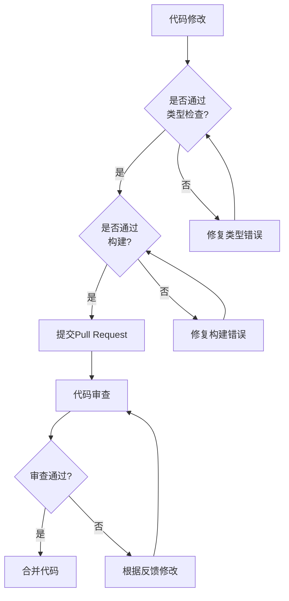
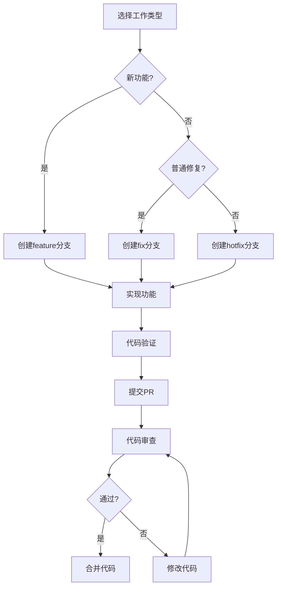

# 贡献指南

<cite>
**本文档引用的文件**  
- [package.json](file://package.json)
- [README.md](file://README.md)
- [vite.config.ts](file://vite.config.ts)
- [tsconfig.json](file://tsconfig.json)
- [tsconfig.node.json](file://tsconfig.node.json)
- [.gitignore](file://.gitignore)
- [src/main.ts](file://src/main.ts)
- [src/App.vue](file://src/App.vue)
- [src/router/index.ts](file://src/router/index.ts)
- [src/stores/invoice.ts](file://src/stores/invoice.ts)
- [src/composables/useInvoicePdfParser.ts](file://src/composables/useInvoicePdfParser.ts)
- [src/utils/invoicePdfParser.ts](file://src/utils/invoicePdfParser.ts)
- [src/utils/fileValidator.ts](file://src/utils/fileValidator.ts)
- [src/views/Home.vue](file://src/views/Home.vue)
- [src/views/InvoiceParsing.vue](file://src/views/InvoiceParsing.vue)
</cite>

## 目录
1. [简介](#简介)
2. [项目结构](#项目结构)
3. [代码风格规范](#代码风格规范)
4. [Git提交信息格式](#git提交信息格式)
5. [分支管理策略](#分支管理策略)
6. [Pull Request审查流程](#pull-request审查流程)
7. [测试与构建验证](#测试与构建验证)
8. [开发工作流](#开发工作流)
9. [文档更新要求](#文档更新要求)
10. [协作精神与代码质量](#协作精神与代码质量)

## 简介
本指南旨在为外部贡献者和团队成员提供参与FinanceTools项目开发的标准化流程。该项目是一个基于Vue 3的财务工具集合，主要功能包括发票重命名和发票解析。通过遵循本指南，贡献者可以确保代码质量、维护项目一致性，并促进高效的协作开发。

**Section sources**
- [README.md](file://README.md#L1-L41)

## 项目结构
FinanceTools项目采用标准的Vue 3 + Vite项目结构，结合TypeScript和Pinia进行状态管理。项目主要分为以下几个核心目录：

- `public/`：静态资源文件
- `src/`：源代码目录
  - `components/`：Vue组件
  - `composables/`：组合式API函数
  - `router/`：路由配置
  - `stores/`：Pinia状态管理
  - `utils/`：工具函数
  - `views/`：页面视图组件
- 根目录包含构建和依赖配置文件

项目入口为`src/main.ts`，通过Vite构建，使用Vue 3的组合式API和TypeScript进行开发。



**Diagram sources**
- [src/main.ts](file://src/main.ts#L1-L12)
- [src/App.vue](file://src/App.vue#L1-L44)
- [src/router/index.ts](file://src/router/index.ts#L1-L40)

**Section sources**
- [src/main.ts](file://src/main.ts#L1-L12)
- [src/App.vue](file://src/App.vue#L1-L44)
- [src/router/index.ts](file://src/router/index.ts#L1-L40)

## 代码风格规范
本项目采用TypeScript进行开发，遵循Vue 3的最佳实践。虽然项目中未显式配置ESLint和Prettier，但应遵循以下代码风格规范：

1. **TypeScript类型安全**：所有变量和函数参数都应有明确的类型定义
2. **Vue 3组合式API**：使用`<script setup>`语法糖和组合式API
3. **命名规范**：
   - 文件名采用PascalCase（如`InvoiceTable.vue`）
   - 变量和函数名采用camelCase
   - 组件名采用PascalCase
4. **代码组织**：
   - 组合式函数放在`composables/`目录
   - 状态管理使用Pinia，存放在`stores/`目录
   - 工具函数放在`utils/`目录
5. **导入别名**：使用`@`别名指向`src/`目录，如`import { useInvoiceStore } from '@/stores/invoice'`

项目通过`vue-tsc`进行类型检查，确保代码的类型安全性。

**Section sources**
- [tsconfig.json](file://tsconfig.json#L1-L32)
- [vite.config.ts](file://vite.config.ts#L1-L18)
- [package.json](file://package.json#L1-L33)

## Git提交信息格式
本项目采用简洁明了的提交信息格式，建议遵循以下规范：

1. **提交信息结构**：
   ```
   <类型>: <简短描述>
   
   <详细描述（可选）>
   ```

2. **类型建议**：
   - `feat`：新增功能
   - `fix`：修复bug
   - `docs`：文档更新
   - `style`：代码格式调整（不影响逻辑）
   - `refactor`：代码重构
   - `test`：测试相关
   - `chore`：构建过程或辅助工具的变动

3. **示例**：
   ```
   feat: 添加发票解析批量导出功能
   
   实现了发票解析结果的Excel和JSON格式导出功能
   支持导出全部、成功记录和选中记录
   ```

   ```
   fix: 修复发票PDF解析中的文本提取错误
   
   修正了多页PDF发票的文本提取逻辑
   确保关键字段在前3页未找到时继续解析后续页面
   ```

**Section sources**
- [.gitignore](file://.gitignore#L1-L35)

## 分支管理策略
本项目采用简化版的Git Flow分支策略，具体如下：

1. **主分支**：
   - `main`：主分支，代表生产环境的稳定代码
   - 所有生产版本都从此分支发布

2. **开发分支**：
   - `develop`：集成分支，用于日常开发
   - 所有功能分支都合并到此分支
   - 定期合并到`main`分支进行发布

3. **功能分支**：
   - 命名格式：`feature/<功能名称>`（如`feature/invoice-export`）
   - 从`develop`分支创建
   - 完成开发后通过Pull Request合并回`develop`

4. **修复分支**：
   - 命名格式：`hotfix/<问题描述>`（如`hotfix/pdf-parse-error`）
   - 用于紧急bug修复
   - 从`main`分支创建，修复后同时合并到`main`和`develop`

5. **发布分支**：
   - 命名格式：`release/<版本号>`（如`release/v1.1.0`）
   - 用于准备发布版本
   - 从`develop`分支创建，测试通过后合并到`main`和`develop`

**Section sources**
- [.gitignore](file://.gitignore#L1-L35)

## Pull Request审查流程
为了确保代码质量和项目稳定性，所有代码变更都必须通过Pull Request（PR）流程：

1. **PR创建要求**：
   - 明确的PR标题，描述变更目的
   - 详细的描述，包括变更内容、影响范围和相关issue
   - 关联相关的issue（使用`Closes #issue-number`格式）
   - 确保代码通过所有检查（类型检查、构建等）

2. **审查标准**：
   - 代码是否符合项目风格规范
   - 是否有足够的注释和文档
   - 是否包含必要的测试（如有）
   - 是否影响现有功能
   - 性能影响评估
   - 安全性考虑

3. **审查流程**：
   - 至少需要1位核心成员批准
   - 所有自动化检查必须通过
   - 讨论中的问题必须得到解决
   - 批准后方可合并

4. **合并策略**：
   - 使用"Create a merge commit"或"Squash and merge"
   - 确保提交历史清晰可读

**Section sources**
- [README.md](file://README.md#L1-L41)

## 测试与构建验证
本项目提供了完整的构建和类型检查流程，贡献者在提交代码前应确保以下验证通过：

1. **类型检查**：
   ```bash
   npm run type-check
   ```
   使用`vue-tsc`进行TypeScript类型检查，确保代码的类型安全性。

2. **开发模式运行**：
   ```bash
   npm run dev
   ```
   启动开发服务器，验证功能正常。

3. **生产构建**：
   ```bash
   npm run build
   ```
   执行完整构建流程，包括类型检查和Vite构建。

4. **预览生产版本**：
   ```bash
   npm run preview
   ```
   预览构建后的生产版本，确保功能正常。

项目通过`package.json`中的scripts定义了这些命令，确保开发环境的一致性。



**Diagram sources**
- [package.json](file://package.json#L6-L11)
- [vite.config.ts](file://vite.config.ts#L1-L18)
- [tsconfig.json](file://tsconfig.json#L1-L32)

**Section sources**
- [package.json](file://package.json#L6-L11)
- [vite.config.ts](file://vite.config.ts#L1-L18)
- [tsconfig.json](file://tsconfig.json#L1-L32)

## 开发工作流
### 新功能开发
1. 从`develop`分支创建功能分支：`git checkout -b feature/<功能名称>`
2. 实现功能代码，遵循代码风格规范
3. 添加必要的类型定义和注释
4. 确保通过类型检查和构建
5. 提交代码并推送：`git push origin feature/<功能名称>`
6. 创建Pull Request到`develop`分支
7. 参与代码审查，根据反馈修改
8. 审查通过后合并

### 缺陷修复
1. 从`develop`分支创建修复分支：`git checkout -b fix/<问题描述>`
2. 定位并修复问题
3. 确保修复不影响其他功能
4. 通过类型检查和构建
5. 提交代码并推送
6. 创建Pull Request到`develop`分支
7. 参与代码审查
8. 审查通过后合并

### 紧急修复
1. 从`main`分支创建hotfix分支：`git checkout -b hotfix/<问题描述>`
2. 快速修复问题
3. 通过所有检查
4. 创建Pull Request到`main`和`develop`分支
5. 快速审查和合并
6. 立即发布新版本



**Diagram sources**
- [src/stores/invoice.ts](file://src/stores/invoice.ts#L1-L256)
- [src/composables/useInvoicePdfParser.ts](file://src/composables/useInvoicePdfParser.ts#L1-L173)
- [src/utils/invoicePdfParser.ts](file://src/utils/invoicePdfParser.ts#L1-L349)

**Section sources**
- [src/stores/invoice.ts](file://src/stores/invoice.ts#L1-L256)
- [src/composables/useInvoicePdfParser.ts](file://src/composables/useInvoicePdfParser.ts#L1-L173)
- [src/utils/invoicePdfParser.ts](file://src/utils/invoicePdfParser.ts#L1-L349)

## 文档更新要求
任何代码变更都应伴随相应的文档更新，确保项目文档的准确性和完整性：

1. **README更新**：
   - 新增功能应在`README.md`的"工具列表"中添加说明
   - 重要变更应在"安装"或"运行"部分更新说明

2. **代码注释**：
   - 新增或修改的函数应有JSDoc注释
   - 复杂逻辑应有内联注释
   - 类型定义应有清晰的说明

3. **类型定义文档**：
   - 新的接口或类型应在相关文件中添加注释
   - 重要的数据结构变更应记录在文档中

4. **API变更**：
   - 公共API变更应在文档中明确说明
   - 不兼容的变更应提供迁移指南

文档更新应与代码变更同时提交，确保文档与代码的一致性。

**Section sources**
- [README.md](file://README.md#L1-L41)
- [src/utils/invoicePdfParser.ts](file://src/utils/invoicePdfParser.ts#L1-L349)

## 协作精神与代码质量
本项目倡导开放、包容的开源协作精神，强调代码质量和长期可维护性：

1. **代码质量原则**：
   - **可读性优先**：代码应易于理解和维护
   - **类型安全**：充分利用TypeScript的类型系统
   - **单一职责**：函数和组件应专注于单一功能
   - **可测试性**：代码结构应便于测试

2. **协作文化**：
   - 尊重他人代码和意见
   - 建设性地提出批评和建议
   - 积极参与代码审查
   - 乐于帮助新贡献者

3. **可持续贡献**：
   - 鼓励小而频繁的提交
   - 保持提交历史的清晰和有意义
   - 及时响应审查反馈
   - 主动维护自己贡献的代码

通过遵循这些原则，我们可以共同建立一个高质量、可持续发展的贡献生态，确保FinanceTools项目长期健康发展。

**Section sources**
- [README.md](file://README.md#L1-L41)
- [package.json](file://package.json#L1-L33)
- [tsconfig.json](file://tsconfig.json#L1-L32)