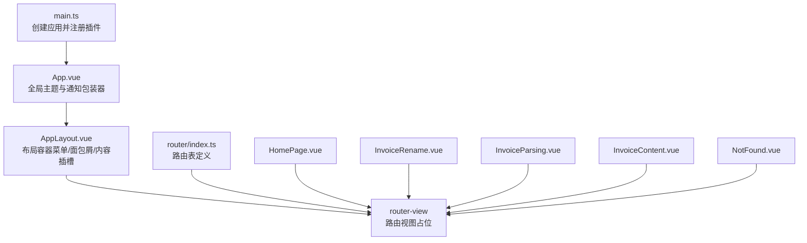
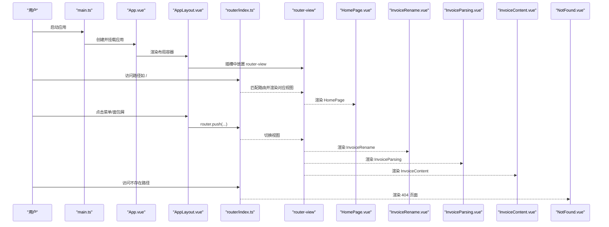
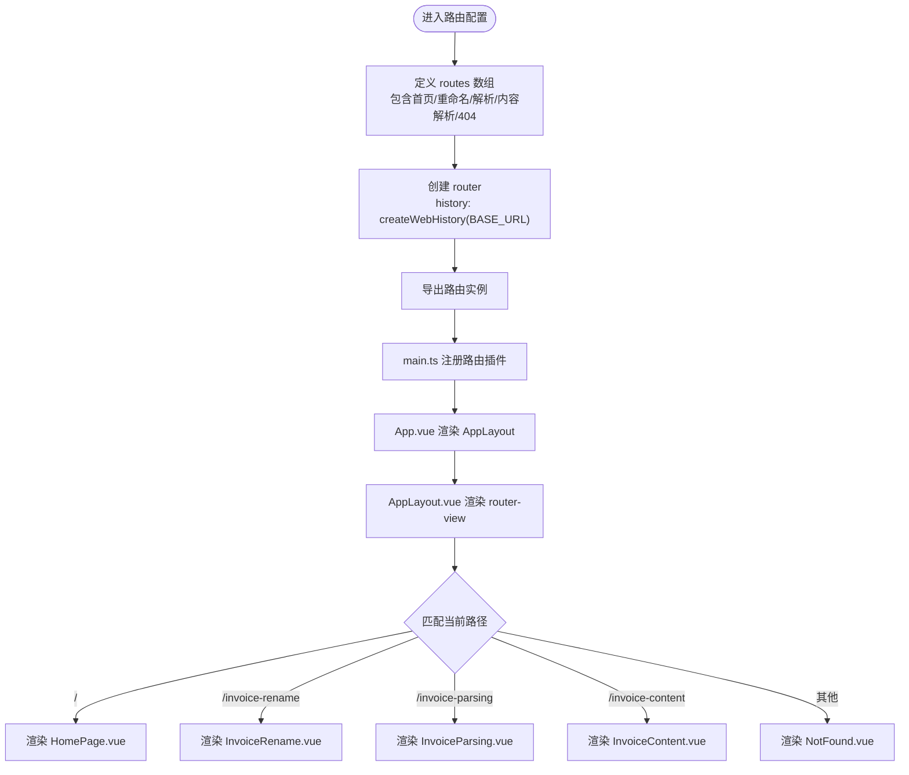
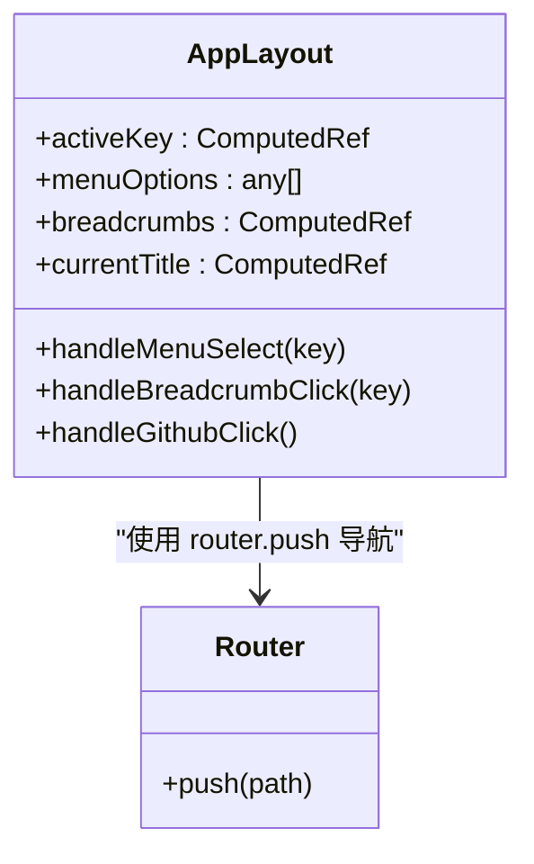
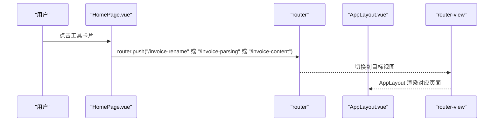
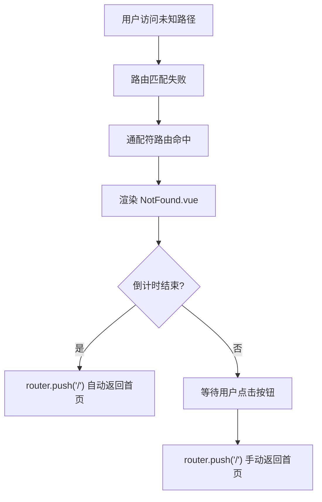
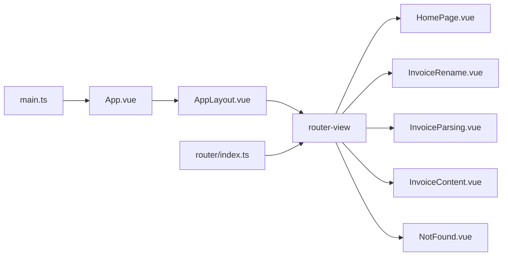

# 路由与导航

<cite>
**本文引用的文件列表**
- [src/router/index.ts](file://src/router/index.ts)
- [src/App.vue](file://src/App.vue)
- [src/main.ts](file://src/main.ts)
- [src/components/Common/AppLayout.vue](file://src/components/Common/AppLayout.vue)
- [src/views/HomePage.vue](file://src/views/HomePage.vue)
- [src/views/Home.vue](file://src/views/Home.vue)
- [src/views/InvoiceParsing.vue](file://src/views/InvoiceParsing.vue)
- [src/views/InvoiceContent.vue](file://src/views/InvoiceContent.vue)
- [src/views/InvoiceRename.vue](file://src/views/InvoiceRename.vue)
- [src/components/Common/NotFound.vue](file://src/components/Common/NotFound.vue)
</cite>

## 目录
1. [简介](#简介)
2. [项目结构](#项目结构)
3. [核心组件](#核心组件)
4. [架构总览](#架构总览)
5. [详细组件分析](#详细组件分析)
6. [依赖关系分析](#依赖关系分析)
7. [性能考量](#性能考量)
8. [故障排查指南](#故障排查指南)
9. [结论](#结论)
10. [附录：路由扩展指南](#附录路由扩展指南)

## 简介
本文件系统性阐述前端路由配置与导航机制的实现，围绕 router/index.ts 的路由表定义、AppLayout 布局容器的导航协调、404 页面兜底策略、编程式导航实践以及未来扩展建议展开。读者无需深入源码即可理解从入口到视图渲染、从菜单到面包屑、从首页到各功能页面的完整流程。

## 项目结构
本项目采用"按功能分层"的组织方式：
- 应用入口与全局注入：main.ts 注册 Pinia 和 Vue Router；App.vue 作为根组件，包裹主题与通知体系，并通过 AppLayout 统一布局。
- 路由层：router/index.ts 定义路由表，包含首页、发票重命名、发票解析、发票内容解析与 404。
- 视图层：views 下的 HomePage、InvoiceRename、InvoiceParsing、InvoiceContent 对应不同业务页面。
- 布局与通用组件：components/Common/AppLayout.vue 提供侧边菜单、面包屑、标题与内容区插槽；components/Common/NotFound.vue 提供 404 页面与倒计时返回首页。
- 工具与组合式函数：composables/useTheme.ts 等用于主题切换；stores/ 与 composables/ 内部模块负责状态与业务逻辑。

图表来源
- [src/main.ts](file://src/main.ts#L1-L12)
- [src/App.vue](file://src/App.vue#L1-L23)
- [src/components/Common/AppLayout.vue](file://src/components/Common/AppLayout.vue#L1-L104)
- [src/router/index.ts](file://src/router/index.ts#L1-L47)

章节来源
- [src/main.ts](file://src/main.ts#L1-L12)
- [src/App.vue](file://src/App.vue#L1-L23)

## 核心组件
- 路由表与历史模式：使用 createRouter 与 createWebHistory，routes 数组定义了四条静态路由与一条通配符 404 路由。
- 视图组件映射：每条路由绑定一个具体视图组件，meta 中设置标题，便于面包屑与页面标题联动。
- 布局容器：AppLayout.vue 作为全局布局，内部包含侧边菜单、面包屑、头部标题与内容区插槽，通过 router-view 渲染当前路由视图。
- 404 页面：NotFound.vue 提供统一的 404 展示与倒计时自动返回首页能力。

章节来源
- [src/router/index.ts](file://src/router/index.ts#L7-L39)
- [src/components/Common/AppLayout.vue](file://src/components/Common/AppLayout.vue#L1-L104)
- [src/components/Common/NotFound.vue](file://src/components/Common/NotFound.vue#L1-L20)

## 架构总览
下图展示从应用启动到路由渲染的关键交互链路，以及布局容器如何协调导航与内容。

图表来源
- [src/main.ts](file://src/main.ts#L1-L12)
- [src/App.vue](file://src/App.vue#L7-L13)
- [src/components/Common/AppLayout.vue](file://src/components/Common/AppLayout.vue#L135-L249)
- [src/router/index.ts](file://src/router/index.ts#L34-L39)
- [src/views/HomePage.vue](file://src/views/HomePage.vue#L80-L90)
- [src/views/InvoiceRename.vue](file://src/views/InvoiceRename.vue#L1-L309)
- [src/views/InvoiceParsing.vue](file://src/views/InvoiceParsing.vue#L1-L315)
- [src/views/InvoiceContent.vue](file://src/views/InvoiceContent.vue#L1-L311)
- [src/components/Common/NotFound.vue](file://src/components/Common/NotFound.vue#L31-L45)

## 详细组件分析

### 路由表与导航机制
- 路由表定义
  - 根路径 "/" 映射到 HomePage，meta.title 用于页面标题与面包屑标题联动。
  - "/invoice-rename" 映射到 InvoiceRename（发票重命名），meta.title 用于面包屑与标题。
  - "/invoice-parsing" 映射到 InvoiceParsing（发票解析），meta.title 用于面包屑与标题。
  - "/invoice-content" 映射到 InvoiceContent（发票内容解析），meta.title 用于面包屑与标题。
  - 通配符 "/:pathMatch(.*)*" 映射到 NotFound，meta.title 用于 404 页面标题。
- 历史模式与基础路径
  - 使用 createWebHistory 并传入 import.meta.env.BASE_URL，确保在不同部署环境下路径正确。
- 编程式导航
  - 在 HomePage.vue 中，通过 useRouter 获取 router 实例，使用 router.push 将用户引导至对应功能页面。
  - 在 AppLayout.vue 中，菜单与面包屑点击事件均调用 router.push 进行页面跳转。
- 导航守卫
  - 当前路由配置未显式声明导航守卫（beforeEach/afterEach 等）。若需鉴权或权限控制，可在 router/index.ts 中扩展相应钩子。

**更新** 新增了发票内容解析页面的路由配置，包括路径映射、菜单集成和面包屑支持。

图表来源
- [src/router/index.ts](file://src/router/index.ts#L7-L39)
- [src/main.ts](file://src/main.ts#L9-L11)
- [src/App.vue](file://src/App.vue#L7-L13)
- [src/components/Common/AppLayout.vue](file://src/components/Common/AppLayout.vue#L88-L92)
- [src/views/HomePage.vue](file://src/views/HomePage.vue#L80-L90)
- [src/views/InvoiceRename.vue](file://src/views/InvoiceRename.vue#L1-L309)
- [src/views/InvoiceParsing.vue](file://src/views/InvoiceParsing.vue#L1-L315)
- [src/views/InvoiceContent.vue](file://src/views/InvoiceContent.vue#L1-L311)
- [src/components/Common/NotFound.vue](file://src/components/Common/NotFound.vue#L1-L20)

章节来源
- [src/router/index.ts](file://src/router/index.ts#L7-L39)
- [src/views/HomePage.vue](file://src/views/HomePage.vue#L80-L90)
- [src/components/Common/AppLayout.vue](file://src/components/Common/AppLayout.vue#L229-L245)

### AppLayout 布局容器与导航协调
- 菜单与面包屑
  - menuOptions 定义两级菜单：首页与"发票工具"分组，分组内包含"发票重命名""发票解析""发票内容解析"三个子项。
  - breadcrumbs 基于当前激活 key 动态生成，除首页外均显示面包屑路径，首项为"🏠 首页"，第二项为"📄 发票工具"。
- 激活状态与标题
  - activeKey 基于当前路由路径计算，用于高亮菜单与设置头部标题。
  - currentTitle 通过遍历菜单选项树，根据 activeKey 获取当前标题。
- 编程式导航
  - handleMenuSelect 与 handleBreadcrumbClick 均通过 router.push 实现页面跳转。
- 内容区插槽
  - AppLayout 的内容区通过 <slot></slot> 接收 router-view，实现布局与视图解耦。

**更新** 菜单配置已更新，新增了"发票内容解析"菜单项，支持完整的导航功能。

图表来源
- [src/components/Common/AppLayout.vue](file://src/components/Common/AppLayout.vue#L135-L249)

章节来源
- [src/components/Common/AppLayout.vue](file://src/components/Common/AppLayout.vue#L140-L223)

### 视图组件与编程式导航
- HomePage.vue
  - 通过 useRouter 获取 router 实例，在工具卡片点击时调用 router.push 将用户引导至对应功能页面。
- InvoiceRename.vue、InvoiceParsing.vue、InvoiceContent.vue
  - 作为功能页面，承载各自业务逻辑与 UI，配合 store/composable 完成文件上传、解析、导出等操作。
- NotFound.vue
  - 提供 404 页面与倒计时自动返回首页的能力，用户也可手动点击"返回首页"。

**更新** 新增了 InvoiceContent.vue 组件，提供发票内容解析功能，支持PDF文件上传、项目明细提取和Excel导出。

图表来源
- [src/views/HomePage.vue](file://src/views/HomePage.vue#L80-L90)
- [src/components/Common/AppLayout.vue](file://src/components/Common/AppLayout.vue#L229-L245)

章节来源
- [src/views/HomePage.vue](file://src/views/HomePage.vue#L80-L90)
- [src/views/InvoiceRename.vue](file://src/views/InvoiceRename.vue#L1-L309)
- [src/views/InvoiceParsing.vue](file://src/views/InvoiceParsing.vue#L1-L315)
- [src/views/InvoiceContent.vue](file://src/views/InvoiceContent.vue#L1-L311)
- [src/components/Common/NotFound.vue](file://src/components/Common/NotFound.vue#L31-L45)

### 404 页面兜底策略
- 通配符路由
  - 使用 "/:pathMatch(.*)*" 匹配所有未命中路由，统一渲染 NotFound 组件。
- 用户体验
  - NotFound.vue 内置倒计时（默认 5 秒）自动返回首页，同时提供"返回首页"按钮以供手动操作。
  - 组件在卸载时清理定时器，避免内存泄漏。

图表来源
- [src/router/index.ts](file://src/router/index.ts#L26-L31)
- [src/components/Common/NotFound.vue](file://src/components/Common/NotFound.vue#L31-L55)

章节来源
- [src/router/index.ts](file://src/router/index.ts#L26-L31)
- [src/components/Common/NotFound.vue](file://src/components/Common/NotFound.vue#L31-L55)

## 依赖关系分析
- 应用启动依赖
  - main.ts 注册 Pinia 与 router，App.vue 作为根组件，AppLayout 作为布局容器，router-view 作为视图占位。
- 路由与视图
  - router/index.ts 定义路由与组件映射；AppLayout 通过插槽接收 router-view；HomePage/InvoiceRename/InvoiceParsing/InvoiceContent/NotFound 分别渲染对应页面。
- 导航协作
  - AppLayout 的菜单与面包屑通过 router.push 协同 HomePage 的点击事件，形成统一的导航体验。

**更新** 新增了 InvoiceContent.vue 组件的路由依赖关系。

图表来源
- [src/main.ts](file://src/main.ts#L1-L12)
- [src/App.vue](file://src/App.vue#L1-L23)
- [src/components/Common/AppLayout.vue](file://src/components/Common/AppLayout.vue#L1-L104)
- [src/router/index.ts](file://src/router/index.ts#L1-L47)

章节来源
- [src/main.ts](file://src/main.ts#L1-L12)
- [src/App.vue](file://src/App.vue#L1-L23)
- [src/components/Common/AppLayout.vue](file://src/components/Common/AppLayout.vue#L1-L104)
- [src/router/index.ts](file://src/router/index.ts#L1-L47)

## 性能考量
- 路由懒加载
  - 当前路由直接引入组件，未使用动态导入进行懒加载。对于大型项目，建议将视图组件改为动态导入以减少首屏包体与提升首屏速度。
- 路由历史模式
  - 使用 createWebHistory，需要服务器端配置支持 SPA 回退到 index.html。确保生产环境正确配置，避免刷新后 404。
- 布局与视图解耦
  - AppLayout 仅负责导航与布局，视图独立渲染，有利于缓存与复用。

## 故障排查指南
- 无法访问特定页面
  - 检查路由表是否包含对应路径与组件映射；确认 App.vue 中已正确挂载 AppLayout 与 router-view。
- 面包屑或菜单高亮异常
  - 检查 AppLayout.vue 中 activeKey 计算逻辑与菜单 key 是否一致；确认路由 meta.title 与面包屑标题联动。
- 404 页面未出现
  - 确认通配符路由存在且位于路由表末尾；检查服务器回退配置是否正确。
- 导航无响应
  - 检查 router.push 调用是否传入有效路径；确认 main.ts 已注册 router 插件。

**更新** 新增了发票内容解析页面相关的故障排查指导。

章节来源
- [src/router/index.ts](file://src/router/index.ts#L7-L39)
- [src/components/Common/AppLayout.vue](file://src/components/Common/AppLayout.vue#L140-L147)
- [src/App.vue](file://src/App.vue#L7-L13)
- [src/main.ts](file://src/main.ts#L9-L11)

## 结论
本项目采用简洁清晰的路由与布局设计：router/index.ts 定义四条业务路由与 404 兜底；AppLayout.vue 通过菜单与面包屑统一导航；HomePage 与功能页面通过编程式导航协同工作。整体结构易于维护与扩展，适合进一步引入权限校验、路由懒加载与国际化标题等特性。

**更新** 新增的发票内容解析功能完善了发票处理工具链，提供了从文件重命名、发票解析到内容提取的完整解决方案。

## 附录：路由扩展指南
- 新增功能页面步骤
  1) 在 views 目录新增页面组件（如 MyFeature.vue）。
  2) 在 router/index.ts 的 routes 数组中添加新路由项，指定 path、name、component 与 meta.title。
  3) 在 AppLayout.vue 的 menuOptions 中为该页面添加菜单项或子菜单项。
  4) 如需权限控制，可在 router/index.ts 中添加导航守卫（beforeEach/afterEach）。
  5) 如需优化首屏性能，将视图组件改为动态导入（import()）。
- 最佳实践
  - 路由命名与路径保持一致，便于调试与维护。
  - meta.title 与面包屑联动，确保页面标题一致性。
  - 404 页面提供明确提示与返回首页按钮，改善用户体验。
  - 服务器端配置 SPA 回退，避免刷新后 404。

**更新** 新增了发票内容解析页面的扩展指导。

章节来源
- [src/router/index.ts](file://src/router/index.ts#L7-L39)
- [src/components/Common/AppLayout.vue](file://src/components/Common/AppLayout.vue#L149-L170)
- [src/App.vue](file://src/App.vue#L7-L13)