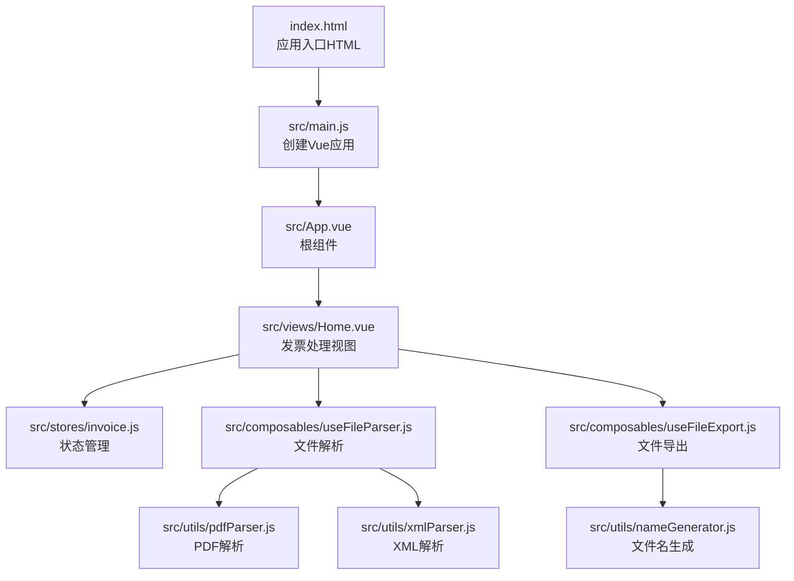
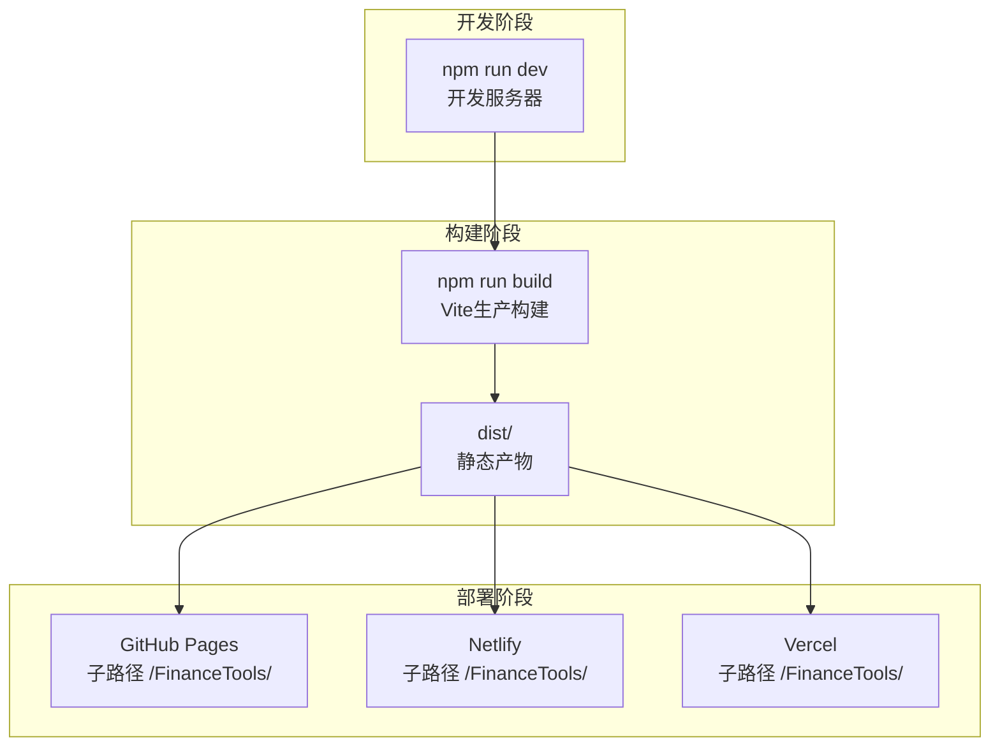
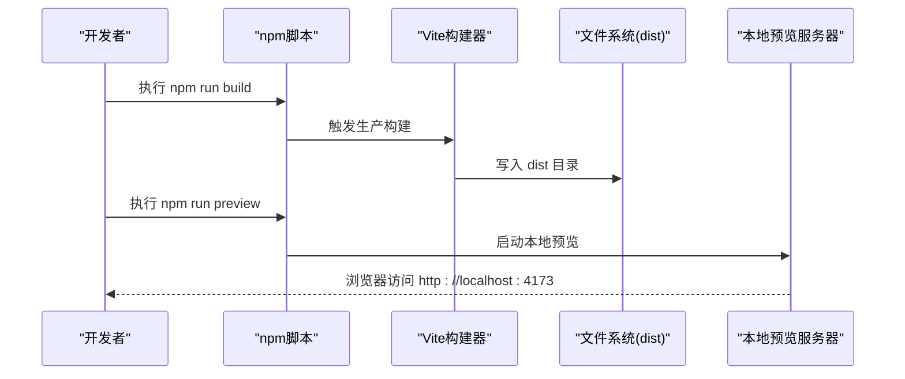
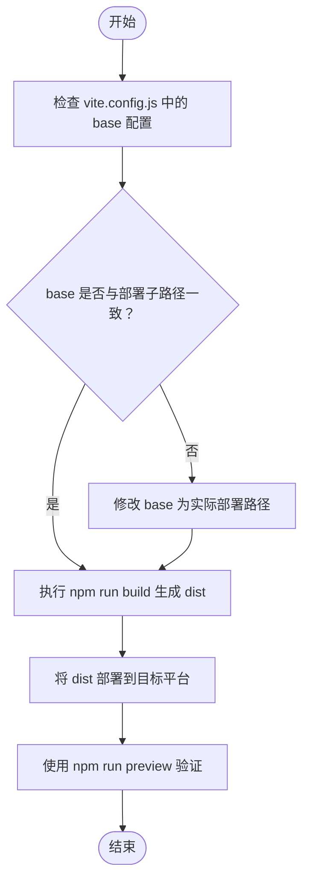
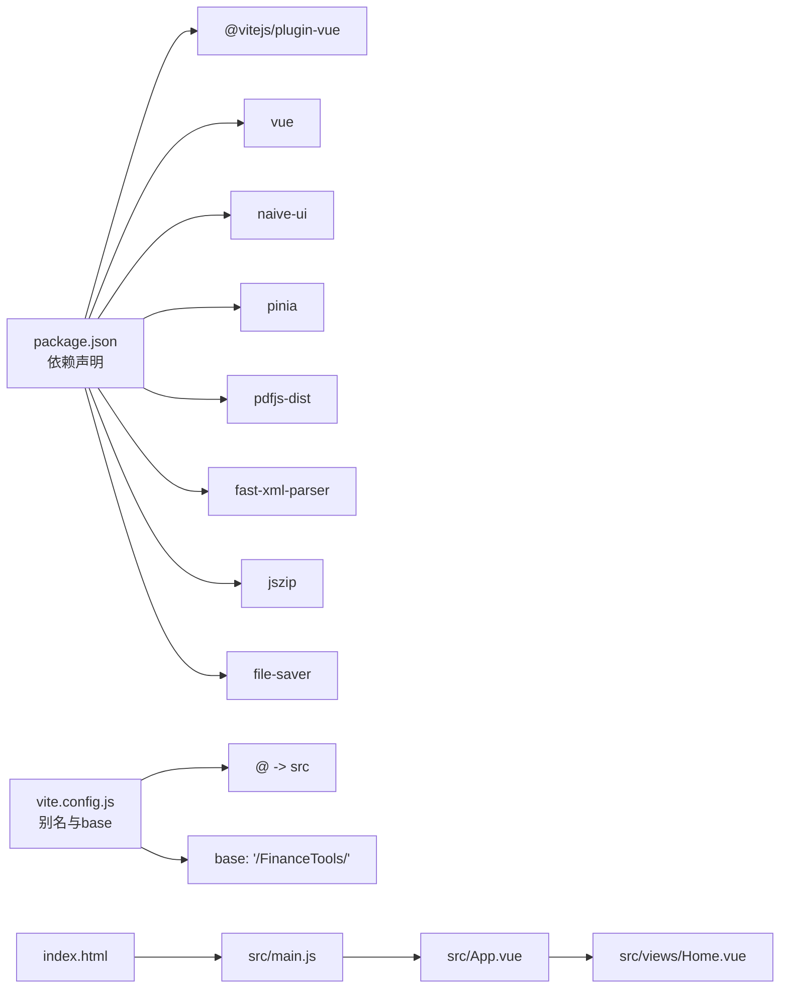

# 部署与构建

<cite>
**本文引用的文件**
- [package.json](file://package.json)
- [vite.config.js](file://vite.config.js)
- [index.html](file://index.html)
- [README.md](file://README.md)
- [src/main.js](file://src/main.js)
- [src/App.vue](file://src/App.vue)
- [src/views/Home.vue](file://src/views/Home.vue)
- [src/stores/invoice.js](file://src/stores/invoice.js)
- [src/composables/useFileParser.js](file://src/composables/useFileParser.js)
- [src/utils/pdfParser.js](file://src/utils/pdfParser.js)
- [src/utils/xmlParser.js](file://src/utils/xmlParser.js)
- [src/composables/useFileExport.js](file://src/composables/useFileExport.js)
- [src/utils/nameGenerator.js](file://src/utils/nameGenerator.js)
</cite>

## 目录
1. [简介](#简介)
2. [项目结构](#项目结构)
3. [核心组件](#核心组件)
4. [架构总览](#架构总览)
5. [详细组件分析](#详细组件分析)
6. [依赖关系分析](#依赖关系分析)
7. [性能考虑](#性能考虑)
8. [故障排查指南](#故障排查指南)
9. [结论](#结论)
10. [附录](#附录)

## 简介
本文件面向部署与构建场景，系统性说明 FinanceTools 项目如何使用 Vite 构建为生产级静态资源，并在子路径（例如 /FinanceTools/）下进行部署。内容涵盖：
- npm run build 如何生成 dist 目录下的静态产物
- vite.config.js 中 base 配置对子路径部署的影响
- 在 GitHub Pages、Netlify、Vercel 等静态站点托管平台的通用部署步骤
- npm run preview 的本地预览作用与验证要点

## 项目结构
FinanceTools 是一个基于 Vue 3 的前端应用，采用 Vite 作为构建工具。项目采用“按功能分层”的组织方式，核心入口与配置如下：
- 应用入口：index.html 引入模块入口 src/main.js
- 模块入口：src/main.js 创建 Vue 应用并挂载到 DOM
- 核心视图：src/App.vue 作为根组件，包含布局与主题配置
- 功能视图：src/views/Home.vue 提供发票处理界面
- 状态管理：src/stores/invoice.js 使用 Pinia 管理发票数据
- 组合式能力：src/composables/useFileParser.js、src/composables/useFileExport.js 提供解析与导出能力
- 工具函数：src/utils/pdfParser.js、src/utils/xmlParser.js、src/utils/nameGenerator.js 实现 PDF/XML 解析与文件名生成

图表来源
- [index.html](file://index.html#L1-L14)
- [src/main.js](file://src/main.js#L1-L10)
- [src/App.vue](file://src/App.vue#L1-L64)
- [src/views/Home.vue](file://src/views/Home.vue#L1-L236)
- [src/stores/invoice.js](file://src/stores/invoice.js#L1-L204)
- [src/composables/useFileParser.js](file://src/composables/useFileParser.js#L1-L102)
- [src/composables/useFileExport.js](file://src/composables/useFileExport.js#L1-L80)
- [src/utils/pdfParser.js](file://src/utils/pdfParser.js#L1-L227)
- [src/utils/xmlParser.js](file://src/utils/xmlParser.js#L1-L118)
- [src/utils/nameGenerator.js](file://src/utils/nameGenerator.js#L1-L225)

章节来源
- [index.html](file://index.html#L1-L14)
- [src/main.js](file://src/main.js#L1-L10)
- [src/App.vue](file://src/App.vue#L1-L64)
- [src/views/Home.vue](file://src/views/Home.vue#L1-L236)

## 核心组件
- 构建脚本与工具链
  - npm run build：调用 Vite 生产构建，输出至 dist 目录
  - npm run preview：启动本地静态服务器预览 dist 产物
  - npm run dev：开发模式运行（非本节重点）

- Vite 配置要点
  - base：设置应用的基础路径为 /FinanceTools/，用于子路径部署
  - plugins：启用 @vitejs/plugin-vue 支持 Vue 单文件组件
  - resolve.alias：将 @ 映射到 src 目录，便于模块导入
  - server.port/open：开发服务器端口与自动打开浏览器

- 入口与路由
  - index.html 通过 script 引入 /src/main.js
  - src/main.js 创建应用并挂载到 #app
  - src/App.vue 作为根组件，内部包含布局与视图切换

章节来源
- [package.json](file://package.json#L1-L26)
- [vite.config.js](file://vite.config.js#L1-L18)
- [index.html](file://index.html#L1-L14)
- [src/main.js](file://src/main.js#L1-L10)
- [src/App.vue](file://src/App.vue#L1-L64)

## 架构总览
下图展示从构建到部署的关键流程，以及 base 配置对静态资源路径的影响。

图表来源
- [package.json](file://package.json#L1-L26)
- [vite.config.js](file://vite.config.js#L1-L18)

## 详细组件分析

### 构建与预览流程
- npm run build
  - 作用：调用 Vite 的生产构建，生成 dist 目录下的静态资源（含 HTML、JS、CSS、媒体资源等）
  - 输出位置：dist 目录
  - 适用场景：CI/CD、静态托管平台部署

- npm run preview
  - 作用：在本地以生产模式启动静态服务器，预览 dist 产物
  - 用途：验证构建产物在真实环境中的表现，包括资源路径、缓存策略、网络请求等

图表来源
- [package.json](file://package.json#L1-L26)

章节来源
- [package.json](file://package.json#L1-L26)

### 子路径部署与 base 配置
- base 配置
  - vite.config.js 中的 base 设置为 "/FinanceTools/"，表示应用期望部署在子路径 /FinanceTools/ 下
  - 影响范围：构建后生成的静态资源路径（如 /FinanceTools/assets/xxx）、HTML 中的资源引用、动态导入等均会基于该 base 进行相对路径计算

- 部署注意事项
  - GitHub Pages：需确保 Pages 源指向 dist 目录；若仓库名为 finance-tools，访问路径通常为 https://<用户>.github.io/finance-tools/FinanceTools/
  - Netlify/Vercel：在构建产物目录选择 dist；平台会自动识别基础路径，但务必保证 base 与实际部署路径一致
  - 若 base 与实际路径不一致，会导致静态资源 404 或路由异常

图表来源
- [vite.config.js](file://vite.config.js#L1-L18)
- [package.json](file://package.json#L1-L26)

章节来源
- [vite.config.js](file://vite.config.js#L1-L18)
- [package.json](file://package.json#L1-L26)

### 预览与验证
- 本地预览
  - 使用 npm run preview 启动本地服务器，访问默认端口（由 Vite 决定），可模拟真实部署环境
  - 验证点：静态资源路径正确、路由跳转正常、第三方库加载无误、主题与样式生效

- 部署后验证
  - 在目标平台访问子路径（如 /FinanceTools/），确认首页可加载、交互正常
  - 检查控制台错误与网络面板，定位资源加载失败或跨域问题

章节来源
- [package.json](file://package.json#L1-L26)

## 依赖关系分析
- 构建与运行时依赖
  - Vue 3、Naive UI、Pinia、pdfjs-dist、fast-xml-parser、jszip、file-saver 等
  - Vite 与 @vitejs/plugin-vue 用于开发与构建

- 关键导入与别名
  - vite.config.js 中将 @ 映射到 src，便于在组件与工具中使用相对路径导入
  - index.html 通过 /src/main.js 引入应用入口

图表来源
- [package.json](file://package.json#L1-L26)
- [vite.config.js](file://vite.config.js#L1-L18)
- [index.html](file://index.html#L1-L14)
- [src/main.js](file://src/main.js#L1-L10)
- [src/App.vue](file://src/App.vue#L1-L64)
- [src/views/Home.vue](file://src/views/Home.vue#L1-L236)

章节来源
- [package.json](file://package.json#L1-L26)
- [vite.config.js](file://vite.config.js#L1-L18)
- [index.html](file://index.html#L1-L14)
- [src/main.js](file://src/main.js#L1-L10)
- [src/App.vue](file://src/App.vue#L1-L64)
- [src/views/Home.vue](file://src/views/Home.vue#L1-L236)

## 性能考虑
- 构建优化
  - 使用 Vite 的原生 ES 模块与按需打包，减少首屏体积
  - 对第三方库（如 pdfjs-dist、naive-ui）按需引入，避免全量打包
- 资源加载
  - base 配置应与实际部署路径一致，避免额外的重定向或 404
  - 静态资源尽量使用 CDN（若平台支持），提升加载速度
- 预览验证
  - 使用 npm run preview 模拟真实环境，提前发现资源路径与缓存问题

[本节为通用建议，无需特定文件来源]

## 故障排查指南
- 构建后资源 404
  - 检查 vite.config.js 的 base 是否与部署路径一致
  - 确认 dist 目录被正确部署到平台的构建产物目录
- 预览无法访问
  - 确认本地端口未被占用；必要时在本地服务器配置中指定端口
- 第三方库加载失败
  - 检查依赖安装是否完整（npm install）
  - 确保 index.html 中的入口脚本路径正确（/src/main.js）

章节来源
- [vite.config.js](file://vite.config.js#L1-L18)
- [package.json](file://package.json#L1-L26)
- [index.html](file://index.html#L1-L14)

## 结论
FinanceTools 项目通过 Vite 的生产构建生成 dist 静态资源，并借助 vite.config.js 的 base 配置实现子路径部署。部署到 GitHub Pages、Netlify、Vercel 等平台时，只需将 dist 作为构建产物目录，并确保 base 与实际部署路径一致。npm run preview 能有效帮助开发者在本地验证构建结果，降低线上风险。

[本节为总结，无需特定文件来源]

## 附录

### 通用部署步骤（GitHub Pages/Netlify/Vercel）
- 准备工作
  - 确保 vite.config.js 的 base 与目标子路径一致
  - 在项目根目录执行 npm run build，生成 dist 目录
- GitHub Pages
  - 选择仓库 Settings -> Pages，选择发布来源为“部署分支”或“自定义域名”，并将构建产物目录设为 dist
  - 若仓库名为 finance-tools，访问路径通常为 https://<用户>.github.io/finance-tools/FinanceTools/
- Netlify/Vercel
  - 在平台创建新站点，选择仓库并配置构建命令为 npm run build，构建产物目录为 dist
  - 平台会自动识别基础路径，但请再次核对 base 与实际路径一致

章节来源
- [vite.config.js](file://vite.config.js#L1-L18)
- [package.json](file://package.json#L1-L26)
- [README.md](file://README.md#L1-L38)