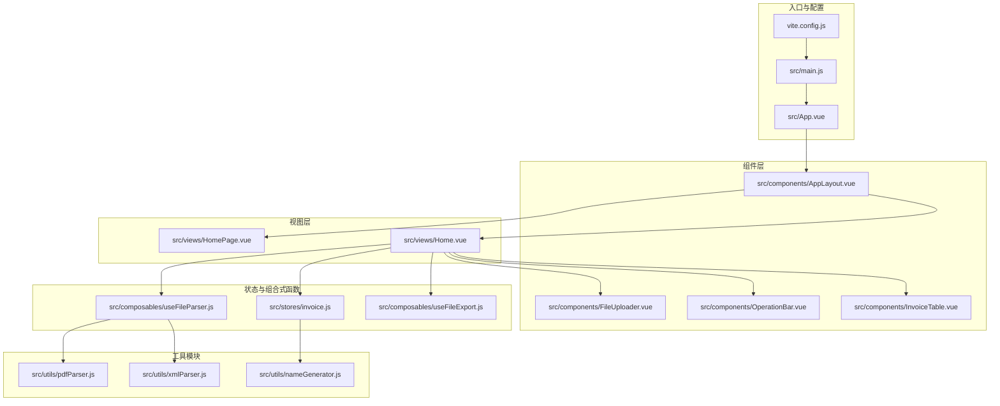
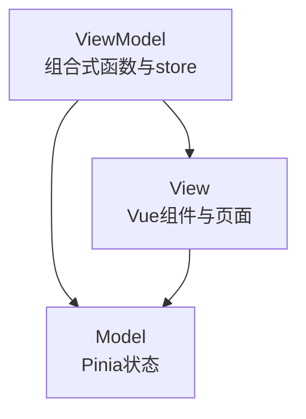
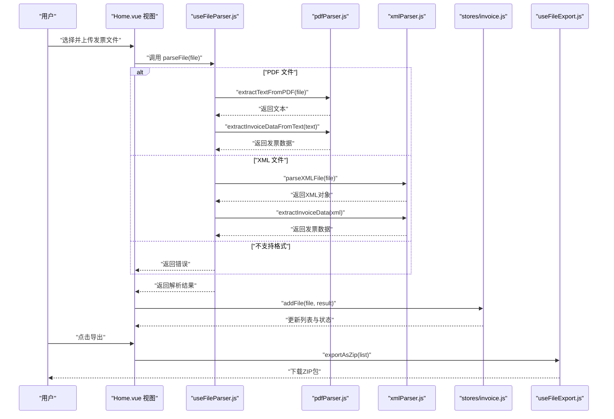
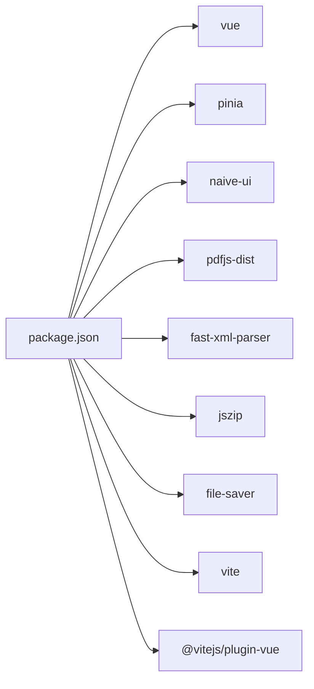

# 项目概述

<cite>
**本文引用的文件**
- [README.md](file://README.md)
- [package.json](file://package.json)
- [vite.config.js](file://vite.config.js)
- [src/main.js](file://src/main.js)
- [src/App.vue](file://src/App.vue)
- [src/views/HomePage.vue](file://src/views/HomePage.vue)
- [src/views/Home.vue](file://src/views/Home.vue)
- [src/stores/invoice.js](file://src/stores/invoice.js)
- [src/composables/useFileParser.js](file://src/composables/useFileParser.js)
- [src/composables/useFileExport.js](file://src/composables/useFileExport.js)
- [src/utils/pdfParser.js](file://src/utils/pdfParser.js)
- [src/utils/xmlParser.js](file://src/utils/xmlParser.js)
- [src/utils/nameGenerator.js](file://src/utils/nameGenerator.js)
</cite>

## 目录
1. [引言](#引言)
2. [项目结构](#项目结构)
3. [核心组件](#核心组件)
4. [架构总览](#架构总览)
5. [详细组件分析](#详细组件分析)
6. [依赖关系分析](#依赖关系分析)
7. [性能考虑](#性能考虑)
8. [故障排查指南](#故障排查指南)
9. [结论](#结论)
10. [附录](#附录)

## 引言
FinanceTools 是一个基于 Vue 3 的财务工具集合，专注于为财务人员提供高效、可靠的发票文件批量处理能力。项目以“发票重命名”为核心功能，支持对 PDF 和 XML 格式的发票进行智能解析、信息提取与自动重命名，并提供一键导出 ZIP 包的便捷体验。项目采用 MVVM 架构风格与前端单页应用（SPA）设计，完全在浏览器端运行，利用原生 File API 处理本地文件，无需后端参与，确保隐私与安全。

项目目标：
- 为财务人员提供发票文件批量处理的自动化工具；
- 支持 PDF 与 XML 发票的智能解析与信息提取；
- 自动生成规范化的文件名，便于归档与检索；
- 提供直观的用户界面与流畅的操作体验。

技术选型背景：
- 使用 Vite 作为构建工具，具备快速启动、热更新与现代化打包能力，适配现代前端开发工作流；
- 使用 Pinia 进行状态管理，与 Vue 3 组合式 API 协同良好；
- 使用 Naive UI 提供一致的组件库与主题系统；
- 使用 pdfjs-dist、fast-xml-parser、JSZip、file-saver 等成熟生态库，分别用于 PDF 文本提取、XML 解析、压缩与下载。

版权与维护者：
- 项目采用 MIT License；
- 维护者信息显示为 Sora。

**章节来源**
- [README.md](file://README.md#L1-L38)
- [package.json](file://package.json#L1-L26)

## 项目结构
项目采用按功能域划分的目录组织方式，核心目录与职责如下：
- src/components：可复用 UI 组件（布局、上传、表格、操作栏等）
- src/views：页面视图（首页与发票重命名页面）
- src/stores：状态管理（发票数据与筛选/选择状态）
- src/composables：组合式函数（文件解析、导出等）
- src/utils：工具模块（PDF/XML 解析、文件名生成等）
- 入口文件：main.js、App.vue、index.html、vite.config.js

**图表来源**
- [src/main.js](file://src/main.js#L1-L10)
- [src/App.vue](file://src/App.vue#L1-L64)
- [vite.config.js](file://vite.config.js#L1-L18)
- [src/views/HomePage.vue](file://src/views/HomePage.vue#L1-L100)
- [src/views/Home.vue](file://src/views/Home.vue#L1-L236)
- [src/stores/invoice.js](file://src/stores/invoice.js#L1-L204)
- [src/composables/useFileParser.js](file://src/composables/useFileParser.js#L1-L102)
- [src/composables/useFileExport.js](file://src/composables/useFileExport.js#L1-L80)
- [src/utils/pdfParser.js](file://src/utils/pdfParser.js#L1-L227)
- [src/utils/xmlParser.js](file://src/utils/xmlParser.js#L1-L118)
- [src/utils/nameGenerator.js](file://src/utils/nameGenerator.js#L1-L225)

**章节来源**
- [src/main.js](file://src/main.js#L1-L10)
- [src/App.vue](file://src/App.vue#L1-L64)
- [vite.config.js](file://vite.config.js#L1-L18)

## 核心组件
- 发票重命名页面（Home.vue）：负责文件上传、解析、展示与导出，是核心交互界面。
- 发票状态管理（stores/invoice.js）：集中管理发票列表、筛选、选择、状态与计算属性。
- 文件解析组合式函数（useFileParser.js）：统一处理 PDF/XML 解析流程与进度反馈。
- 导出组合式函数（useFileExport.js）：将成功重命名的发票打包为 ZIP 并下载。
- PDF 解析工具（pdfParser.js）：基于 pdfjs-dist 提取文本并提取发票关键字段。
- XML 解析工具（xmlParser.js）：基于 fast-xml-parser 解析 XML 并抽取发票字段。
- 文件名生成器（nameGenerator.js）：根据规则生成规范化文件名并处理冲突。

**章节来源**
- [src/views/Home.vue](file://src/views/Home.vue#L1-L236)
- [src/stores/invoice.js](file://src/stores/invoice.js#L1-L204)
- [src/composables/useFileParser.js](file://src/composables/useFileParser.js#L1-L102)
- [src/composables/useFileExport.js](file://src/composables/useFileExport.js#L1-L80)
- [src/utils/pdfParser.js](file://src/utils/pdfParser.js#L1-L227)
- [src/utils/xmlParser.js](file://src/utils/xmlParser.js#L1-L118)
- [src/utils/nameGenerator.js](file://src/utils/nameGenerator.js#L1-L225)

## 架构总览
项目采用 MVVM 架构风格：
- Model：Pinia 状态（发票列表、筛选条件、选择状态等）
- View：Vue 组件与页面视图（Home.vue、HomePage.vue 等）
- ViewModel：组合式函数与计算属性（useFileParser、useFileExport、store 计算属性）

前端 SPA 特性：
- 单页应用路由切换由 App.vue 中的视图变量控制，无后端路由参与；
- 使用 Naive UI 提供主题覆盖与全局消息/对话框服务；
- 通过 Vite 提供开发服务器与构建产物。

**图表来源**
- [src/App.vue](file://src/App.vue#L1-L64)
- [src/views/Home.vue](file://src/views/Home.vue#L1-L236)
- [src/stores/invoice.js](file://src/stores/invoice.js#L1-L204)
- [src/composables/useFileParser.js](file://src/composables/useFileParser.js#L1-L102)
- [src/composables/useFileExport.js](file://src/composables/useFileExport.js#L1-L80)

## 详细组件分析

### 发票重命名核心流程（序列图）
该流程展示了从文件上传到解析、生成新文件名、展示与导出的完整过程。

**图表来源**
- [src/views/Home.vue](file://src/views/Home.vue#L1-L236)
- [src/composables/useFileParser.js](file://src/composables/useFileParser.js#L1-L102)
- [src/utils/pdfParser.js](file://src/utils/pdfParser.js#L1-L227)
- [src/utils/xmlParser.js](file://src/utils/xmlParser.js#L1-L118)
- [src/stores/invoice.js](file://src/stores/invoice.js#L1-L204)
- [src/composables/useFileExport.js](file://src/composables/useFileExport.js#L1-L80)

### 发票重命名页面（Home.vue）分析
- 功能要点
  - 文件上传与校验：通过 File API 读取文件，使用校验器判断格式与大小；
  - 解析与进度：逐个处理队列中的文件，显示解析进度条；
  - 展示与筛选：支持按状态与关键词筛选，支持全选/清空/删除；
  - 编辑与更新：允许手动编辑购买方名称与金额，实时重新生成文件名；
  - 导出：将成功解析的发票打包为 ZIP 并下载。
- 关键交互
  - 上传队列与并发处理：避免阻塞 UI，提升吞吐；
  - 对话框与消息提示：增强用户体验与错误反馈；
  - 表格滚动容器：保证在窄屏设备上的可读性。

**章节来源**
- [src/views/Home.vue](file://src/views/Home.vue#L1-L236)

### 状态管理（stores/invoice.js）分析
- 状态与计算属性
  - fileList：存储发票项（原始文件、原始名、解析结果、新文件名、状态等）；
  - filterStatus/searchKeyword：筛选条件；
  - selectedIds：选中项；
  - filteredList/successCount/failedCount/totalCount：派生状态。
- 核心方法
  - addFile：根据解析结果生成新文件名，记录状态与错误信息；
  - updateFile：当购买方名称或金额变化时，重新生成文件名；
  - removeFile/removeFiles：删除单个或批量；
  - selectAll/clearSelection：选择控制；
  - setFilterStatus/setSearchKeyword：筛选设置。
- 设计亮点
  - 将“生成新文件名”的逻辑集中在 store，避免视图层重复计算；
  - 对状态变更进行细粒度控制，便于后续扩展。

**章节来源**
- [src/stores/invoice.js](file://src/stores/invoice.js#L1-L204)

### 文件解析组合式函数（useFileParser.js）分析
- 能力概览
  - 自动识别 PDF/XML 文件并调用对应解析器；
  - 统一返回结构：success、data、errors、type；
  - 支持批量解析：分批并行处理，提供进度回调。
- 性能与健壮性
  - 分批处理（每批 10 个），避免主线程长时间阻塞；
  - 对未知格式与异常进行兜底，保证流程稳定。

**章节来源**
- [src/composables/useFileParser.js](file://src/composables/useFileParser.js#L1-L102)

### PDF 解析工具（pdfParser.js）分析
- 流程
  - 读取文件为 ArrayBuffer；
  - 使用 pdfjs-dist 加载 PDF 并逐页提取文本；
  - 在文本中提取发票类型、发票号码、购买方名称、销售方名称、价税合计、开票日期等字段；
  - 校验必填字段（购买方名称、金额）。
- 设计细节
  - 使用正则表达式匹配多种格式，兼顾容错；
  - 开发模式下输出详细日志，便于调试；
  - 对异常进行包装，向上抛出明确错误信息。

**章节来源**
- [src/utils/pdfParser.js](file://src/utils/pdfParser.js#L1-L227)

### XML 解析工具（xmlParser.js）分析
- 流程
  - 读取文件为文本；
  - 使用 fast-xml-parser 解析为对象；
  - 从对象中提取发票类型、发票号码、购买方名称、销售方名称、价税合计、开票日期等字段；
  - 校验必填字段。
- 设计细节
  - 通过多字段名映射策略，兼容不同 XML 结构；
  - 对异常进行包装，便于上层统一处理。

**章节来源**
- [src/utils/xmlParser.js](file://src/utils/xmlParser.js#L1-L118)

### 文件名生成器（nameGenerator.js）分析
- 规则体系
  - 当前启用规则：购方名称_金额；
  - 预留规则：发票类型_购方名称_金额、购方名称_开票日期_金额、发票号码_购方名称；
  - 字段格式化器：对购方名称、发票类型、金额、开票日期、发票号码等进行清洗与格式化；
  - 冲突处理：检测已有文件名并追加序号，避免覆盖。
- 扩展性
  - 支持切换规则、查询可用规则，便于未来扩展命名策略。

**章节来源**
- [src/utils/nameGenerator.js](file://src/utils/nameGenerator.js#L1-L225)

### 导出组合式函数（useFileExport.js）分析
- 能力概览
  - 将成功解析的发票打包为 ZIP；
  - 支持导出全部或仅成功项；
  - 生成带时间戳的 ZIP 文件名并触发下载。
- 技术要点
  - 使用 JSZip 生成 Blob；
  - 使用 file-saver 下载；
  - 在 finally 中重置导出状态，避免 UI 锁定。

**章节来源**
- [src/composables/useFileExport.js](file://src/composables/useFileExport.js#L1-L80)

## 依赖关系分析
- 构建与运行
  - Vite 作为构建工具，提供开发服务器与生产构建；
  - Vue 3 与 @vitejs/plugin-vue 提供模板编译与热更新；
  - Pinia 提供状态管理；
  - Naive UI 提供 UI 组件与主题；
  - pdfjs-dist、fast-xml-parser、JSZip、file-saver 提供核心能力。
- 依赖关系图

**图表来源**
- [package.json](file://package.json#L1-L26)

**章节来源**
- [package.json](file://package.json#L1-L26)

## 性能考虑
- 解析性能
  - PDF 文本提取逐页读取，建议控制单文件页数与大小，避免超大文件导致内存压力；
  - XML 解析依赖 fast-xml-parser，建议保持 XML 结构简洁，减少嵌套层级。
- 并发与吞吐
  - useFileParser.js 采用分批并行处理，每批 10 个文件，平衡吞吐与主线程占用；
  - 导出阶段使用 JSZip 生成 Blob，注意大体积 ZIP 的内存占用。
- 用户体验
  - 进度条与消息提示及时反馈处理状态；
  - 表格滚动容器适配移动端，提升可读性。

[本节为通用指导，不直接分析具体文件，故无“章节来源”]

## 故障排查指南
- 常见问题与定位
  - 不支持的文件格式：解析器会返回错误，检查文件扩展名是否为 .pdf 或 .xml；
  - PDF 解析失败：查看 pdfParser.js 中的日志与错误包装信息，确认 PDF 是否加密或损坏；
  - XML 解析失败：检查 XML 结构与编码，确保可被 fast-xml-parser 正常解析；
  - 文件名生成失败：检查必填字段（购买方名称、金额）是否为空或格式不正确；
  - 导出失败：确认是否存在可导出的文件，检查 ZIP 生成与下载流程。
- 建议步骤
  - 开启开发模式查看详细日志；
  - 逐步缩小问题范围：先验证单个文件，再测试批量；
  - 检查浏览器控制台错误与网络状态（如需在线资源）。

**章节来源**
- [src/utils/pdfParser.js](file://src/utils/pdfParser.js#L1-L227)
- [src/utils/xmlParser.js](file://src/utils/xmlParser.js#L1-L118)
- [src/stores/invoice.js](file://src/stores/invoice.js#L1-L204)
- [src/composables/useFileExport.js](file://src/composables/useFileExport.js#L1-L80)

## 结论
FinanceTools 以“发票重命名”为核心，围绕 MVVM 与 SPA 设计，实现了 PDF 与 XML 发票的智能解析、信息提取与自动重命名，并提供一键导出 ZIP 的便捷体验。项目采用现代前端技术栈，强调纯前端实现与浏览器原生能力，适合财务人员快速上手与高效办公。对于贡献者而言，项目结构清晰、职责分离明确，易于扩展更多发票类型与命名规则。

[本节为总结性内容，不直接分析具体文件，故无“章节来源”]

## 附录
- 快速开始
  - 安装依赖：npm install
  - 开发模式：npm run dev
  - 生产构建：npm run build
  - 预览生产：npm run preview
- 版权与维护者
  - MIT License
  - Copyright © 2025 - present Sora

**章节来源**
- [README.md](file://README.md#L1-L38)
- [package.json](file://package.json#L1-L26)
- [vite.config.js](file://vite.config.js#L1-L18)